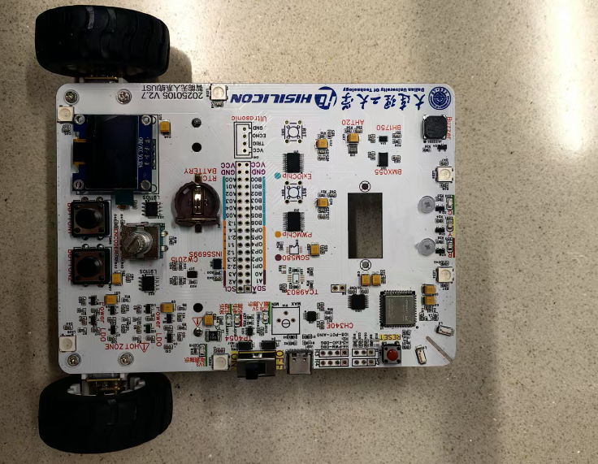

# fbb_ws63开发指南

## 代码仓介绍

  fbb_ws63代码仓为支持ws63和ws63e解决方案SDK，该SDK包从统一开发平台FBB（Family Big Box，统一开发框架，统一API）构建而来，在该平台上开发的应用很容易被移植到其他星闪解决方案上，有效降低开发者门槛，缩短开发周期，支持开发者快速开发星闪产品。

## 目录介绍

| 目录   | 介绍                                                         |
| ------ | ------------------------------------------------------------ |
| docs   | [存放软件资料手册、IO复用关系表、用户指南手册](docs/software/README.md)，帮助用户快速了解WS63系列 |
| src    | SDK源码目录，用户基于源码进行二次开发                        |
| tools  | [开发工具及环境搭建指南](tools/README.md)，帮助用户搭建开发环境 |
| vendor | 存放开发板产商案例代码、硬件原理图、指导手册                 |

## 软件资料介绍

|                          名称                          |                             介绍                             |
| :----------------------------------------------------: | :----------------------------------------------------------: |
|    [WS63系列用户指南.pdf](docs/software/README.md)     | 本文档主要介绍WS63系列的各项基本功能，为用户提供WS63系列的应用配置方法 |
| [WS63系列硬件用户指南_04.pdf](docs/software/README.md) | 本文档主要介绍 WS63系列的封装管脚信息、电气特性参数、原理图设计建议、PCB 设计建议、热设计建议、焊接工艺、潮敏参数、接口时序、注意事项等内容 |

## 购买渠道

|      序号      | 硬件资料                                                     | 介绍          |
| :------------: | ------------------------------------------------------------ | ------------- |
| 1  | [购买链接](https://www.ickey.cn/detail/1003001013187550/Q353333N1100.html) | ws63解决方案  |
| 2 | [购买链接](https://www.ickey.cn/detail/1003001013187551/Q353333N1100E.html) | ws63E解决方案 |
| 3 | [模组购买链接](https://gitee.com/link?target=https%3A%2F%2Fitem.taobao.com%2Fitem.htm%3Fid%3D821194904380) | 星闪WiFi6模组，邮票孔，无天线 |
| 4 | [模组购买链接](https://gitee.com/link?target=https%3A%2F%2Fitem.taobao.com%2Fitem.htm%3Fid%3D823544936579) | 星闪WiFi6模组，12：板载天线，12E：外置天线 |
| 5 | [模组购买链接](https://gitee.com/link?target=https%3A%2F%2Fitem.taobao.com%2Fitem.htm%3Fid%3D820900594332) | 星闪WiFi6模组，20：板载天线，20E：外置天线 |
| 6 | [烧录器购买链接](https://holdiot001.feishu.cn/docx/L60wdrG7Fo314pxYyrbczZqVnSb) | 烧录器：可烧录开发板、模组等 |

## 支持的开发板

|                          开发板名称                          |                          淘宝店购买                          |                          京东店购买                          |
| :----------------------------------------------------------: | :----------------------------------------------------------: | :----------------------------------------------------------: |
| HiHope_NearLink_DK3863E_V03   | [开发板淘宝店地址](https://main.m.taobao.com/security-h5-detail/home?id=808369265492&spm=a2141.7631565.tbshopmod-guess_your_like.808369265492&scm=1007.18373.317678.0&pvid=fdb854bd-99a3-4b65-955b-392bdf0c083e&fromNormal=true) | [开发板京东店地址](https://ic-item.jd.com/10150874487392.html) |
| BearPi-Pico_H3863  | [开发板淘宝店地址](https://main.m.taobao.com/security-h5-detail/home?id=808369265492&spm=a2141.7631565.tbshopmod-guess_your_like.808369265492&scm=1007.18373.317678.0&pvid=fdb854bd-99a3-4b65-955b-392bdf0c083e&fromNormal=true) |                           后续提供                           |
| 鸿蒙星闪开发板  | [开发板淘宝店地址](https://main.m.taobao.com/security-h5-detail/home?id=808369265492&spm=a2141.7631565.tbshopmod-guess_your_like.808369265492&scm=1007.18373.317678.0&pvid=fdb854bd-99a3-4b65-955b-392bdf0c083e&fromNormal=true) | [开发板京东店地址](https://ic-item.jd.com/10152445103343.html) |
| DyCloud_WF6301_DK  |                           后续提供                           | [开发板京东店地址](https://ic-item.jd.com/10151635371214.html) |
| DTU_Car  |                              无                              |                              无                              |

## 开发板资料

|         开发板名称          |                 环境搭建指南                 |                         案例开发指南                         | 硬件指南                                                     |
| :-------------------------: | :------------------------------------------: | :----------------------------------------------------------: | ------------------------------------------------------------ |
| HiHope_NearLink_DK3863E_V03 | [HiSparkStudio环境搭建指南](tools/README.md) | [星闪案例开发指南](vendor/HiHope_NearLink_DK_WS63E_V03/doc/星闪实验指导手册.md) | [开发板硬件原理图](vendor/HiHope_NearLink_DK_WS63E_V03/doc/hardware) |
|      BearPi-Pico_H3863      | [HiSparkStudio环境搭建指南](tools/README.md) |                           后续提供                           | [开发板硬件原理图](vendor/BearPi-Pico_H3863/doc/hardware)    |
|       鸿蒙星闪开发板        | [HiSparkStudio环境搭建指南](tools/README.md) | [星闪案例开发指南](vendor/Hqyj_Ws63/doc/ws63实验指导手册.md) | [开发板硬件原理图](vendor/Hqyj_Ws63/doc/hardware)            |
|      DyCloud_WF6301_DK      | [HiSparkStudio环境搭建指南](tools/README.md) |                           后续提供                           | <a href="vendor/DyCloud_WF6301_DK V1.0/doc/hardware">开发板硬件原理图</a> |
|           DTU_CAR           | [HiSparkStudio环境搭建指南](tools/README.md) | [星闪案例开发指南](vendor/DUT_Car/doc/dut_car实验指导手册.md) | [开发板硬件原理图](vendor/DUT_Car/doc/hardware)              |

## 开发板示例

HiHope_NearLink_DK3863E_V03提供了以下Demo供开发参考：

<table  width="990" border="0" cellpadding="0" cellspacing="0" style='border-collapse:collapse;table-layout:fixed;'>
 <tr height="18" style='height:13.50pt;'>
  <td width="140" x:str><strong>一级分类</strong></td>
  <td width="170" x:str><strong>子分类</strong></td>
  <td width="680" colspan="6" align="center" x:str><strong>应用示例</strong></td>
 </tr>
 <tr height="18" style='height:13.50pt;'>
  <td width="140" align="center" rowspan="5" style='height:27.00pt' x:str>
<strong>基础驱动</strong></td>
  <td x:str><strong>I2C</strong></td>
  <td width="170" x:str><a href="https://gitee.com/HiSpark/fbb_ws63/tree/master/src/application/samples/peripheral/i2c">I2C组件master端案例</a></td>
  <td width="170" x:str><a href="https://gitee.com/HiSpark/fbb_ws63/tree/master/src/application/samples/peripheral/i2c">I2C组件slave端案例</a></td>
  <td width="170" x:str><a href="https://gitee.com/HiSpark/fbb_ws63/tree/master/vendor/HiHope_NearLink_DK_WS63E_V03/demo/oled">SSD1306 OLED屏幕显示“Hello World”</a></td>
  <td width="170" x:str><a href="https://gitee.com/HiSpark/fbb_ws63/tree/master/vendor/HiHope_NearLink_DK_WS63E_V03/demo/environment">AHT20模块读取当前温湿度并显示在屏幕案例</a></td>
  <td width="170" x:str></td>
  <td width="170" x:str></td>
 </tr>
 <tr height="18" style='height:13.50pt;'>
  <td x:str><strong>SPI</strong></td>
  <td x:str><a href="https://gitee.com/HiSpark/fbb_ws63/tree/master/src/application/samples/peripheral/spi">SPI组件master端案例</a></td>
  <td x:str><a href="https://gitee.com/HiSpark/fbb_ws63/tree/master/src/application/samples/peripheral/spi">SPI组件slave端案例</a></td>
  <td x:str><a href="https://gitee.com/HiSpark/fbb_ws63/tree/master/vendor/HiHope_NearLink_DK_WS63E_V03/demo/gyro">LSM6DSM模块读取横滚角、俯仰角、偏航角</a></td>
  <td width="170" x:str></td>
  <td ></td>
  <td ></td>
 </tr>
 <tr height="18" style='height:13.50pt;'>
  <td x:str><strong>UART</strong></td>
  <td x:str><a href="https://gitee.com/HiSpark/fbb_ws63/tree/master/src/application/samples/peripheral/uart">UART轮询案例</a></td>
  <td x:str><a href="https://gitee.com/HiSpark/fbb_ws63/tree/master/src/application/samples/peripheral/uart">UART中断读取案例</a></td>
  <td x:str><a href="https://gitee.com/HiSpark/fbb_ws63/tree/master/vendor/HiHope_NearLink_DK_WS63E_V03/demo/uartdemo">开发板UART自发自收</a></td>
  <td width="170" x:str></td>
  <td ></td>
  <td ></td>
 </tr>
 <tr height="18" style='height:13.50pt;'>
  <td x:str><strong>PWM</strong></td>
  <td x:str><a href="https://gitee.com/HiSpark/fbb_ws63/tree/master/src/application/samples/peripheral/pwm">PWM案例</a></td>
  <td x:str><a href="https://gitee.com/HiSpark/fbb_ws63/tree/master/vendor/HiHope_NearLink_DK_WS63E_V03/demo/beep">蜂鸣器案例</a></td>
  <td width="170" x:str></td>
  <td width="170" x:str></td>
  <td ></td>
  <td ></td>
 </tr>
 <tr height="18" style='height:13.50pt;'>
  <td x:str><strong>GPIO</strong></td>
  <td x:str><a href="https://gitee.com/HiSpark/fbb_ws63/tree/master/vendor/HiHope_NearLink_DK_WS63E_V03/demo/buttondemo">按键案例</a></td>
  <td x:str><a href="https://gitee.com/HiSpark/fbb_ws63/tree/master/vendor/HiHope_NearLink_DK_WS63E_V03/demo/led">点亮LED灯案例</a></td>
  <td x:str><a href="https://gitee.com/HiSpark/fbb_ws63/tree/master/vendor/HiHope_NearLink_DK_WS63E_V03/demo/servo">实现SG92R舵机转动-90°、-45°、0°、45°、90°</a></td>
  <td x:str><a href="https://gitee.com/HiSpark/fbb_ws63/tree/master/vendor/HiHope_NearLink_DK_WS63E_V03/demo/tricolored">实现SK6812三色灯亮绿、红、蓝三种颜色</a></td>
  <td x:str><a href="https://gitee.com/HiSpark/fbb_ws63/tree/master/vendor/HiHope_NearLink_DK_WS63E_V03/demo/ultrasonic">超声波测距</a></td>
  <td x:str><a href="https://gitee.com/HiSpark/fbb_ws63/tree/master/vendor/HiHope_NearLink_DK_WS63E_V03/demo/trafficlight">交通灯案例</a></td>
 </tr>
  <tr height="18" style='height:13.50pt;'>
  <td width="140" align="center" rowspan="5" style='height:27.00pt' x:str>
<strong>操作系统</strong></td>
  <td x:str><strong>Thread</strong></td>
  <td width="170" x:str><a href="https://gitee.com/HiSpark/fbb_ws63/tree/master/vendor/HiHope_NearLink_DK_WS63E_V03/demo/thread">线程使用案例</a></td>
  <td width="170" x:str></td>
  <td width="170" x:str></td>
  <td ></td>
  <td ></td>
  <td ></td>
 </tr>
 <tr height="18" style='height:13.50pt;'>
  <td x:str><strong>semaphore</strong></td>
  <td x:str><a href="https://gitee.com/HiSpark/fbb_ws63/tree/master/vendor/HiHope_NearLink_DK_WS63E_V03/demo/semaphore">信号量使用案例</a></td>
  <td width="170" x:str></td>
  <td width="170" x:str></td>
  <td ></td>
  <td ></td>
  <td ></td>
 </tr>
  <tr height="18" style='height:13.50pt;'>
  <td x:str><strong>event</strong></td>
  <td x:str><a href="https://gitee.com/HiSpark/fbb_ws63/tree/master/vendor/HiHope_NearLink_DK_WS63E_V03/demo/event">事件使用案例</a></td>
  <td width="170" x:str></td>
  <td width="170" x:str></td>
  <td ></td>
  <td ></td>
  <td ></td>
 </tr>
  <tr height="18" style='height:13.50pt;'>
  <td x:str><strong>message</strong></td>
  <td x:str><a href="https://gitee.com/HiSpark/fbb_ws63/tree/master/vendor/HiHope_NearLink_DK_WS63E_V03/demo/message">消息队列使用案例</a></td>
  <td width="170" x:str></td>
  <td width="170" x:str></td>
  <td ></td>
  <td ></td>
  <td ></td>
 </tr>
  <tr height="18" style='height:13.50pt;'>
  <td x:str><strong>mutex</strong></td>
  <td x:str><a href="https://gitee.com/HiSpark/fbb_ws63/tree/master/vendor/HiHope_NearLink_DK_WS63E_V03/demo/mutex">互斥锁使用案例</a></td>
  <td width="170" x:str></td>
  <td width="170" x:str></td>
  <td ></td>
  <td ></td>
  <td ></td>
 </tr>
  <tr height="18" style='height:13.50pt;'>
  <td width="140" align="center" rowspan="1" style='height:27.00pt' x:str>
<strong>星闪</strong></td>
  <td x:str><strong>SLE</strong></td>
  <td width="170" x:str><a href="https://gitee.com/HiSpark/fbb_ws63/tree/master/vendor/HiHope_NearLink_DK_WS63E_V03/demo/sle_distribute_network">SLE配网</a></td>
  <td width="170" x:str><a href="https://gitee.com/HiSpark/fbb_ws63/tree/master/vendor/HiHope_NearLink_DK_WS63E_V03/demo/sle_led">通过SLE控制LED灯</a></td>
  <td width="170" x:str><a href="https://gitee.com/HiSpark/fbb_ws63/tree/master/vendor/HiHope_NearLink_DK_WS63E_V03/demo/sle_wifi_coexist">WiFi/SLE共存</a></td>
  <td width="170" x:str></td>
  <td width="170" x:str></td>
  <td width="170" x:str></td>
 </tr>
  <tr height="18" style='height:13.50pt;'>
  <td width="140" align="center" rowspan="1" style='height:27.00pt' x:str>
<strong>BLE</strong></td>
  <td x:str><strong>BLE</strong></td>
  <td width="170" x:str></td>
  <td width="170" x:str></td>
  <td width="170" x:str></td>
  <td width="170" x:str></td>
  <td width="170" x:str></td>
  <td width="170" x:str></td>
 </tr>
  <tr height="18" style='height:13.50pt;'>
  <td width="140" align="center" rowspan="1" style='height:27.00pt' x:str>
<strong>Wi-Fi</strong></td>
  <td x:str><strong>Wi-Fi</strong></td>
  <td width="170" x:str><a href="https://gitee.com/HiSpark/fbb_ws63/tree/master/vendor/HiHope_NearLink_DK_WS63E_V03/demo/wifista">Wi-Fi STA</a></td>
  <td width="170" x:str><a href="https://gitee.com/HiSpark/fbb_ws63/tree/master/vendor/HiHope_NearLink_DK_WS63E_V03/demo/wifiap">Wi-Fi AP</a></td>
  <td width="170" x:str><a href="https://gitee.com/HiSpark/fbb_ws63/tree/master/vendor/HiHope_NearLink_DK_WS63E_V03/demo/wifidemo">Wi-Fi TCP/UDP测速</a></td>
  <td width="170" x:str></td>
  <td width="170" x:str></td>
  <td width="170" x:str></td>
 </tr>
 <tr height="18" style='height:13.50pt;'>
  <td width="140" align="center" rowspan="1" style='height:27.00pt' x:str>
<strong>TIMER</strong></td>
  <td x:str><strong>定时器</strong></td>
  <td x:str><a href="https://gitee.com/HiSpark/fbb_ws63/tree/master/vendor/HiHope_NearLink_DK_WS63E_V03/demo/timer">定时器</a></td>
  <td width="170" x:str></td>
  <td width="170" x:str></td>
  <td ></td>
  <td ></td>
  <td ></td>
 </tr>
 <tr height="18" style='height:13.50pt;'>
  <td width="140" align="center" rowspan="1" style='height:27.00pt' x:str>
<strong>雷达</strong></td>
  <td x:str><strong>运动感知</strong></td>
  <td x:str><a href="https://gitee.com/HiSpark/fbb_ws63/tree/master/vendor/HiHope_NearLink_DK_WS63E_V03/demo/radar_led">运动感知1.0</a></td>
  <td width="170" x:str></td>
  <td width="170" x:str></td>
  <td ></td>
  <td ></td>
  <td ></td>
 </tr>
 <tr height="18" style='height:13.50pt;'>
  <td width="140" align="center" rowspan="1" style='height:27.00pt' x:str>
<strong>低功耗</strong></td>
  <td x:str><strong>低功耗</strong></td>
  <td width="170" x:str></td>
  <td x:str></td>
  <td width="170" x:str></td>
  <td ></td>
  <td ></td>
  <td ></td>
 </tr>
  <tr height="18" style='height:13.50pt;'>
  <td width="140" align="center" rowspan="1" style='height:27.00pt' x:str>
<strong>端云协同</strong></td>
  <td x:str><strong>MQTT</strong></td>
  <td x:str><a href="https://gitee.com/HiSpark/fbb_ws63/tree/master/vendor/HiHope_NearLink_DK_WS63E_V03/demo/mqtt">华为云与开发板通过MQTT实现订阅、发布</a></td>
  <td width="170" x:str></td>
  <td width="170" x:str></td>
  <td ></td>
  <td ></td>
  <td ></td>
 </tr>
 <tr height="18" style='height:13.50pt;'>
  <td width="140" align="center" rowspan="4" style='height:27.00pt' x:str>
<strong>行业解决方案</strong></td>
  <td x:str><strong>鼠标</strong></td>
  <td width="170" x:str></td>
  <td width="170" x:str></td>
  <td width="170" x:str></td>
  <td width="170" x:str></td>
  <td width="170" x:str></td>
  <td width="170" x:str></td>
 </tr>
 <tr height="18" style='height:13.50pt;'>
  <td x:str><strong>键盘</strong></td>
  <td x:str></td>
  <td width="170" x:str></td>
  <td width="170" x:str></td>
  <td ></td>
  <td ></td>
  <td ></td>
 </tr>
 <tr height="18" style='height:13.50pt;'>
  <td x:str><strong>车钥匙</strong></td>
  <td x:str></td>
  <td width="170" x:str></td>
  <td width="170" x:str></td>
  <td ></td>
  <td ></td>
  <td ></td>
 </tr>
 <tr height="18" style='height:13.50pt;'>
  <td x:str><strong>遥控器</strong></td>
  <td x:str></td>
  <td width="170" x:str></td>
  <td width="170" x:str></td>
  <td ></td>
  <td ></td>
  <td ></td>
 </tr>
 </tr>
 <tr>
<![if supportMisalignedColumns]>
   <tr height="18" style="display:none;">
   </tr>
  <![endif]>
</table>
BearPi-Pico H3863提供了以下Demo供开发参考：

<table  width="990" border="0" cellpadding="0" cellspacing="0" style='border-collapse:collapse;table-layout:fixed;'>
 <tr height="18" style='height:13.50pt;'>
  <td width="140" x:str><strong>一级分类</strong></td>
  <td width="170" x:str><strong>子分类</strong></td>
  <td width="680" colspan="6" align="center" x:str><strong>应用示例</strong></td>
 </tr>
 <tr height="18" style='height:13.50pt;'>
  <td width="140" align="center" rowspan="6" style='height:27.00pt' x:str>
<strong>基础驱动</strong></td>
  <td x:str><strong>I2C</strong></td>
  <td width="170" x:str><a href="https://www.bearpi.cn/core_board/bearpi/pico/h3863/software/study/6.I2C%20%E9%A9%B1%E5%8A%A8OLED%E5%B1%8F%E5%B9%95%E6%B5%8B%E8%AF%95.html">I2C驱动OLED屏幕案例</a></td> <td width="170" x:str></td>
  <td width="170" x:str></td>
  <td width="170" x:str></td>
  <td width="170" x:str></td>
  <td width="170" x:str></td>
 </tr>
 <tr height="18" style='height:13.50pt;'>
  <td x:str><strong>SPI</strong></td>
  <td x:str><a href="https://www.bearpi.cn/core_board/bearpi/pico/h3863/software/study/7.SPI%20%E9%A9%B1%E5%8A%A8OLED%E5%B1%8F%E5%B9%95%E6%B5%8B%E8%AF%95.html">SPI驱动OLED屏幕案例</a></td><td ></td>
  <td width="170" x:str></td>
  <td width="170" x:str></td>
  <td width="170" x:str></td>
  <td ></td>
 </tr>
 <tr height="18" style='height:13.50pt;'>
  <td x:str><strong>UART</strong></td>
  <td x:str><a href="https://www.bearpi.cn/core_board/bearpi/pico/h3863/software/study/5.UART%E6%95%B0%E6%8D%AE%E4%BC%A0%E8%BE%93%E6%B5%8B%E8%AF%95.html">开发板UART自发自收</a></td>
  <td width="170" x:str></td>
  <td width="170" x:str></td>
  <td width="170" x:str></td>
  <td ></td>
  <td ></td>
 </tr> <tr height="18" style='height:13.50pt;'>
  <td x:str><strong>ADC</strong></td>
  <td x:str><a href="https://www.bearpi.cn/core_board/bearpi/pico/h3863/software/study/4.ADC%E9%87%87%E6%A0%B7%E6%B5%8B%E8%AF%95.html">ADC案例</a></td>  <td ></td>
  <td width="170" x:str></td>
  <td width="170" x:str></td>
  <td width="170" x:str></td>
  <td ></td>
 </tr><tr height="18" style='height:13.50pt;'>
  <td x:str><strong>PWM</strong></td>
  <td x:str><a href="https://www.bearpi.cn/core_board/bearpi/pico/h3863/software/study/3.PWM%E8%BE%93%E5%87%BA%E6%B5%8B%E8%AF%95.html">PWM案例</a></td><td ></td>
  <td width="170" x:str></td>
  <td width="170" x:str></td>
  <td width="170" x:str></td>
  <td ></td>
 </tr><tr height="18" style='height:13.50pt;'>
  <td x:str><strong>GPIO</strong></td>
  <td x:str><a href="https://www.bearpi.cn/core_board/bearpi/pico/h3863/software/study/1.GPIO%E7%82%B9%E4%BA%AELED%E7%81%AF%E6%B5%8B%E8%AF%95.html">点亮LED灯案例</a></td>
  <td x:str><a href="https://www.bearpi.cn/core_board/bearpi/pico/h3863/software/study/2.GPIO%E6%8C%89%E9%94%AE%E4%B8%AD%E6%96%AD%E6%B5%8B%E8%AF%95.html">按键案例</a></td><td ></td>
  <td width="170" x:str></td>
  <td width="170" x:str></td>
  <td width="170" x:str></td>
 </tr> <tr height="18" style='height:13.50pt;'>
  <td width="140" align="center" rowspan="1" style='height:27.00pt' x:str>
<strong>星闪</strong></td>
  <td x:str><strong>SLE</strong></td>
  <td width="170" x:str><a href="https://www.bearpi.cn/core_board/bearpi/pico/h3863/software/SLE%E4%B8%B2%E5%8F%A3%E9%80%8F%E4%BC%A0%E6%B5%8B%E8%AF%95.html">SLE串口透传</a></td>
  <td width="170" x:str><a href="https://www.bearpi.cn/core_board/bearpi/pico/h3863/software/SLE%E7%BD%91%E5%85%B3%E9%80%8F%E4%BC%A0%E6%B5%8B%E8%AF%95.html">SLE网关透传</a></td>
  <td width="170" x:str></td>
  <td width="170" x:str></td>
  <td width="170" x:str></td>
  <td width="170" x:str></td> </tr>
  <tr height="18" style='height:13.50pt;'>
  <td width="140" align="center" rowspan="1" style='height:27.00pt' x:str>
<strong>BLE</strong></td>
  <td x:str><strong>BLE</strong></td>
    <td width="170" x:str><a href="https://www.bearpi.cn/core_board/bearpi/pico/h3863/software/BLE%E4%B8%B2%E5%8F%A3%E9%80%8F%E4%BC%A0%E6%B5%8B%E8%AF%95.html">BLE串口透传</a></td>
  <td width="170" x:str></td>
  <td width="170" x:str></td>
  <td width="170" x:str></td>
  <td width="170" x:str></td>
  <td width="170" x:str></td></tr>
  <tr height="18" style='height:13.50pt;'>
  <td width="140" align="center" rowspan="1" style='height:27.00pt' x:str>
<strong>Wi-Fi</strong></td>
  <td x:str><strong>Wi-Fi</strong></td>
  <td width="170" x:str><a href="https://www.bearpi.cn/core_board/bearpi/pico/h3863/software/Wi-Fi%20STA%20%E8%BF%9E%E6%8E%A5%E6%97%A0%E7%BA%BF%E7%83%AD%E7%82%B9%E6%B5%8B%E8%AF%95.html">Wi-Fi STA</a></td>
  <td width="170" x:str><a href="https://www.bearpi.cn/core_board/bearpi/pico/h3863/software/Wi-Fi%20SoftAP%20%E5%BC%80%E5%90%AF%E6%97%A0%E7%BA%BF%E7%83%AD%E7%82%B9%E6%B5%8B%E8%AF%95.html">Wi-Fi AP</a></td>
  <td width="170" x:str><a href="https://www.bearpi.cn/core_board/bearpi/pico/h3863/software/Wi-Fi%20UDP%E5%AE%A2%E6%88%B7%E7%AB%AF%E6%B5%8B%E8%AF%95.html">Wi-Fi UDP客户端</a></td> <td width="170" x:str></td>
  <td width="170" x:str></td>
  <td width="170" x:str></td></tr>
 </tr>
 <tr>
<![if supportMisalignedColumns]>
   <tr height="18" style="display:none;">
   </tr>
  <![endif]>
</table>
华清远见WS63鸿蒙星闪开发板提供了以下Demo供开发参考：

| 一级分类     | 子分类             | 应用示例                                                     |                                                              |                                                              |                                                              |
| :----------- | ------------------ | ------------------------------------------------------------ | ------------------------------------------------------------ | ------------------------------------------------------------ | ------------------------------------------------------------ |
| **基础驱动** | **GPIO**           | [点亮LED灯案例](https://gitee.com/HiSpark/fbb_ws63/tree/master/vendor/Hqyj_Ws63/Farsight/base_01_ledblink) |                                                              |                                                              |                                                              |
|              | **UART**           | [串口轮询、中断收发案例](https://gitee.com/HiSpark/fbb_ws63/tree/master/vendor/Hqyj_Ws63/Farsight/base_02_uart) |                                                              |                                                              |                                                              |
|              | **I2C**            | [0.96寸OLED屏幕驱动案例](https://gitee.com/HiSpark/fbb_ws63/tree/master/vendor/Hqyj_Ws63/Farsight/base_03_ssd1306) | [RGB灯珠驱动案例](https://gitee.com/HiSpark/fbb_ws63/tree/master/vendor/Hqyj_Ws63/Farsight/base_04_rgb) | [SHT20传感器温湿度读取](https://gitee.com/HiSpark/fbb_ws63/tree/master/vendor/Hqyj_Ws63/Farsight/base_05_sht20) | [AP3216读取光照、红外、人体接近数据](https://gitee.com/HiSpark/fbb_ws63/tree/master/vendor/Hqyj_Ws63/Farsight/base_06_ap3216) |
|              | **SPI**            | [2.8寸LCD屏驱动案例](https://gitee.com/HiSpark/fbb_ws63/tree/master/vendor/Hqyj_Ws63/Farsight/base_07_spi_lcd) |                                                              |                                                              |                                                              |
| **操作系统** | **Thread**         | [任务调度使用案例](https://gitee.com/HiSpark/fbb_ws63/tree/master/vendor/Hqyj_Ws63/Farsight/kernel_01_task) |                                                              |                                                              |                                                              |
|              | **Timer**          | [软件定时器使用案例](https://gitee.com/HiSpark/fbb_ws63/tree/master/vendor/Hqyj_Ws63/Farsight/kernel_02_timer) |                                                              |                                                              |                                                              |
|              | **Event**          | [事件使用案例](https://gitee.com/HiSpark/fbb_ws63/tree/master/vendor/Hqyj_Ws63/Farsight/kernel_03_event) |                                                              |                                                              |                                                              |
|              | **Mutex**          | [互斥锁使用案例](https://gitee.com/HiSpark/fbb_ws63/tree/master/vendor/Hqyj_Ws63/Farsight/kernel_04_mutex) |                                                              |                                                              |                                                              |
|              | **MutexSemaphore** | [互斥信号量使用案例](https://gitee.com/HiSpark/fbb_ws63/tree/master/vendor/Hqyj_Ws63/Farsight/kernel_05_mutex_Semaphore) |                                                              |                                                              |                                                              |
|              | **SyncSemaphore**  | [同步信号量使用案例](https://gitee.com/HiSpark/fbb_ws63/tree/master/vendor/Hqyj_Ws63/Farsight/kernel_06_sync_Semaphore) |                                                              |                                                              |                                                              |
|              | **CountSemaphore** | [计数型信号量使用案例](https://gitee.com/HiSpark/fbb_ws63/tree/master/vendor/Hqyj_Ws63/Farsight/kernel_07_count_Semaphore) |                                                              |                                                              |                                                              |
|              | **MessgeQueue**    | [消息队列使用案例](https://gitee.com/HiSpark/fbb_ws63/tree/master/vendor/Hqyj_Ws63/Farsight/kernel_08_message_queque) |                                                              |                                                              |                                                              |
| **WI-FI**    | **WI-FI**          | [WI-FI STA](https://gitee.com/HiSpark/fbb_ws63/tree/master/vendor/Hqyj_Ws63/Farsight/wifi_01_sta) | [WI-FI AP](https://gitee.com/HiSpark/fbb_ws63/tree/master/vendor/Hqyj_Ws63/Farsight/wifi_02_ap) | [WI-FI UDP通信](https://gitee.com/HiSpark/fbb_ws63/tree/master/vendor/Hqyj_Ws63/Farsight/wifi_03_udp) | [Wi-Fi TCP通信](https://gitee.com/HiSpark/fbb_ws63/tree/master/vendor/Hqyj_Ws63/Farsight/wifi_04_tcp) |
| **端云协同** | **MQTT**           | [MQTT本地回环测试](https://gitee.com/HiSpark/fbb_ws63/tree/master/vendor/Hqyj_Ws63/Farsight/wifi_05_mqtt) | [连接华为云实现控制板载资源](https://gitee.com/HiSpark/fbb_ws63/tree/master/vendor/Hqyj_Ws63/Farsight/wifi_06_huawei_iot) |                                                              |                                                              |
| **星闪**     | **SLE**            | [SLE串口透传](https://gitee.com/HiSpark/fbb_ws63/tree/master/vendor/Hqyj_Ws63/Farsight/sle_01_trans_server) |                                                              |                                                              |                                                              |
| **BLE**      | **BLE**            | [BLE串口透传](https://gitee.com/HiSpark/fbb_ws63/tree/master/vendor/Hqyj_Ws63/Farsight/ble_02_trans_server) |                                                              |                                                              |                                                              |

DyCloud_WF6301_DK开发板提供了以下Demo供开发参考：

| [at24c02案例](vendor/DyCloud_WF6301_DK V1.0/demo/at24c02) | [breathing_light](vendor/DyCloud_WF6301_DK V1.0/demo/breathing_light) | [cht20案例](vendor/DyCloud_WF6301_DK V1.0/demo/cht20)     |
| --------------------------------------------------------- | ------------------------------------------------------------ | --------------------------------------------------------- |
| [lcd案例](vendor/DyCloud_WF6301_DK V1.0/demo/lcd)         | [sc7a20案例](vendor/DyCloud_WF6301_DK V1.0/demo/sc7a20)      | [ws2812b案例](vendor/DyCloud_WF6301_DK V1.0/demo/ws2812b) |

## 参与贡献

- 参考[社区参与贡献指南](https://gitee.com/HiSpark/docs/blob/master/contribute/%E7%A4%BE%E5%8C%BA%E5%8F%82%E4%B8%8E%E8%B4%A1%E7%8C%AE%E6%8C%87%E5%8D%97.md)
