# 前言<a name="ZH-CN_TOPIC_0000001861402277"></a>

**概述<a name="section4537382116410"></a>**

本文档详细的描述了WS63V100相关特性的应用场景、实现原理及接口说明，方便读者了解并使用相关特性。

**读者对象<a name="section4378592816410"></a>**

本文档主要适用于以下工程师：

-   软件开发工程师
-   技术支持工程师
-   硬件开发工程师

**产品版本<a name="section12266191774710"></a>**

与本文档相对应的产品版本如下。

<a name="table2270181717471"></a>
<table><thead align="left"><tr id="row15364171712479"><th class="cellrowborder" valign="top" width="43.480000000000004%" id="mcps1.1.3.1.1"><p id="p123646174478"><a name="p123646174478"></a><a name="p123646174478"></a><strong id="b5942730175717"><a name="b5942730175717"></a><a name="b5942730175717"></a>产品名称</strong></p>
</th>
<th class="cellrowborder" valign="top" width="56.52%" id="mcps1.1.3.1.2"><p id="p1936401717470"><a name="p1936401717470"></a><a name="p1936401717470"></a><strong id="b1594613304577"><a name="b1594613304577"></a><a name="b1594613304577"></a>产品版本</strong></p>
</th>
</tr>
</thead>
<tbody><tr id="row997133615471"><td class="cellrowborder" valign="top" width="43.480000000000004%" headers="mcps1.1.3.1.1 "><p id="p1879110164152"><a name="p1879110164152"></a><a name="p1879110164152"></a>WS63</p>
</td>
<td class="cellrowborder" valign="top" width="56.52%" headers="mcps1.1.3.1.2 "><p id="p897253619477"><a name="p897253619477"></a><a name="p897253619477"></a>V100</p>
</td>
</tr>
</tbody>
</table>

**符号约定<a name="section133020216410"></a>**

在本文中可能出现下列标志，它们所代表的含义如下。

<a name="table2622507016410"></a>
<table><thead align="left"><tr id="row1530720816410"><th class="cellrowborder" valign="top" width="20.580000000000002%" id="mcps1.1.3.1.1"><p id="p6450074116410"><a name="p6450074116410"></a><a name="p6450074116410"></a><strong id="b2136615816410"><a name="b2136615816410"></a><a name="b2136615816410"></a>符号</strong></p>
</th>
<th class="cellrowborder" valign="top" width="79.42%" id="mcps1.1.3.1.2"><p id="p5435366816410"><a name="p5435366816410"></a><a name="p5435366816410"></a><strong id="b5941558116410"><a name="b5941558116410"></a><a name="b5941558116410"></a>说明</strong></p>
</th>
</tr>
</thead>
<tbody><tr id="row1372280416410"><td class="cellrowborder" valign="top" width="20.580000000000002%" headers="mcps1.1.3.1.1 "><p id="p3734547016410"><a name="p3734547016410"></a><a name="p3734547016410"></a><a name="image2670064316410"></a><a name="image2670064316410"></a><span></span></p>
</td>
<td class="cellrowborder" valign="top" width="79.42%" headers="mcps1.1.3.1.2 "><p id="p1757432116410"><a name="p1757432116410"></a><a name="p1757432116410"></a>表示如不避免则将会导致死亡或严重伤害的具有高等级风险的危害。</p>
</td>
</tr>
<tr id="row466863216410"><td class="cellrowborder" valign="top" width="20.580000000000002%" headers="mcps1.1.3.1.1 "><p id="p1432579516410"><a name="p1432579516410"></a><a name="p1432579516410"></a><a name="image4895582316410"></a><a name="image4895582316410"></a><span></span></p>
</td>
<td class="cellrowborder" valign="top" width="79.42%" headers="mcps1.1.3.1.2 "><p id="p959197916410"><a name="p959197916410"></a><a name="p959197916410"></a>表示如不避免则可能导致死亡或严重伤害的具有中等级风险的危害。</p>
</td>
</tr>
<tr id="row123863216410"><td class="cellrowborder" valign="top" width="20.580000000000002%" headers="mcps1.1.3.1.1 "><p id="p1232579516410"><a name="p1232579516410"></a><a name="p1232579516410"></a><a name="image1235582316410"></a><a name="image1235582316410"></a><span></span></p>
</td>
<td class="cellrowborder" valign="top" width="79.42%" headers="mcps1.1.3.1.2 "><p id="p123197916410"><a name="p123197916410"></a><a name="p123197916410"></a>表示如不避免则可能导致轻微或中度伤害的具有低等级风险的危害。</p>
</td>
</tr>
<tr id="row5786682116410"><td class="cellrowborder" valign="top" width="20.580000000000002%" headers="mcps1.1.3.1.1 "><p id="p2204984716410"><a name="p2204984716410"></a><a name="p2204984716410"></a><a name="image4504446716410"></a><a name="image4504446716410"></a><span></span></p>
</td>
<td class="cellrowborder" valign="top" width="79.42%" headers="mcps1.1.3.1.2 "><p id="p4388861916410"><a name="p4388861916410"></a><a name="p4388861916410"></a>用于传递设备或环境安全警示信息。如不避免则可能会导致设备损坏、数据丢失、设备性能降低或其它不可预知的结果。</p>
<p id="p1238861916410"><a name="p1238861916410"></a><a name="p1238861916410"></a>“须知”不涉及人身伤害。</p>
</td>
</tr>
<tr id="row2856923116410"><td class="cellrowborder" valign="top" width="20.580000000000002%" headers="mcps1.1.3.1.1 "><p id="p5555360116410"><a name="p5555360116410"></a><a name="p5555360116410"></a><a name="image799324016410"></a><a name="image799324016410"></a><span></span></p>
</td>
<td class="cellrowborder" valign="top" width="79.42%" headers="mcps1.1.3.1.2 "><p id="p4612588116410"><a name="p4612588116410"></a><a name="p4612588116410"></a>对正文中重点信息的补充说明。</p>
<p id="p1232588116410"><a name="p1232588116410"></a><a name="p1232588116410"></a>“说明”不是安全警示信息，不涉及人身、设备及环境伤害信息。</p>
</td>
</tr>
</tbody>
</table>

**修改记录<a name="section109451217111316"></a>**

<a name="table1557726816410"></a>
<table><thead align="left"><tr id="row2942532716410"><th class="cellrowborder" valign="top" width="20.72%" id="mcps1.1.4.1.1"><p id="p3778275416410"><a name="p3778275416410"></a><a name="p3778275416410"></a><strong id="b5687322716410"><a name="b5687322716410"></a><a name="b5687322716410"></a>文档版本</strong></p>
</th>
<th class="cellrowborder" valign="top" width="26.119999999999997%" id="mcps1.1.4.1.2"><p id="p5627845516410"><a name="p5627845516410"></a><a name="p5627845516410"></a><strong id="b5800814916410"><a name="b5800814916410"></a><a name="b5800814916410"></a>发布日期</strong></p>
</th>
<th class="cellrowborder" valign="top" width="53.16%" id="mcps1.1.4.1.3"><p id="p2382284816410"><a name="p2382284816410"></a><a name="p2382284816410"></a><strong id="b3316380216410"><a name="b3316380216410"></a><a name="b3316380216410"></a>修改说明</strong></p>
</th>
</tr>
</thead>
<tbody><tr id="row143541277582"><td class="cellrowborder" valign="top" width="20.72%" headers="mcps1.1.4.1.1 "><p id="p10355177580"><a name="p10355177580"></a><a name="p10355177580"></a>02</p>
</td>
<td class="cellrowborder" valign="top" width="26.119999999999997%" headers="mcps1.1.4.1.2 "><p id="p183557712587"><a name="p183557712587"></a><a name="p183557712587"></a>2024-06-27</p>
</td>
<td class="cellrowborder" valign="top" width="53.16%" headers="mcps1.1.4.1.3 "><a name="ul136751163586"></a><a name="ul136751163586"></a><ul id="ul136751163586"><li>更新<span id="ph66461621195013"><a name="ph66461621195013"></a><a name="ph66461621195013"></a>“</span><a href="雷达特性说明.md">雷达特性说明</a><span id="ph12169425135015"><a name="ph12169425135015"></a><a name="ph12169425135015"></a>”</span><span id="ph149981317155016"><a name="ph149981317155016"></a><a name="ph149981317155016"></a>的</span>“<a href="概述-14.md">概述</a>”、“<a href="开发流程.md">开发流程</a>”小节内容。</li><li>更新<span id="ph16179203113502"><a name="ph16179203113502"></a><a name="ph16179203113502"></a>“</span><a href="BLE配网特性说明.md">BLE配网特性说明</a><span id="ph1755862715506"><a name="ph1755862715506"></a><a name="ph1755862715506"></a>”</span><span id="ph877882819504"><a name="ph877882819504"></a><a name="ph877882819504"></a>的</span>“<a href="使用示例-19.md">使用示例</a>”小节内容。</li></ul>
</td>
</tr>
<tr id="row1314911120814"><td class="cellrowborder" valign="top" width="20.72%" headers="mcps1.1.4.1.1 "><p id="p111492119820"><a name="p111492119820"></a><a name="p111492119820"></a>01</p>
</td>
<td class="cellrowborder" valign="top" width="26.119999999999997%" headers="mcps1.1.4.1.2 "><p id="p31495111588"><a name="p31495111588"></a><a name="p31495111588"></a>2024-04-10</p>
</td>
<td class="cellrowborder" valign="top" width="53.16%" headers="mcps1.1.4.1.3 "><p id="p111491811980"><a name="p111491811980"></a><a name="p111491811980"></a>第一次正式版本发布。</p>
<p id="p14704204216812"><a name="p14704204216812"></a><a name="p14704204216812"></a>更新<span id="ph567984015011"><a name="ph567984015011"></a><a name="ph567984015011"></a>“</span><a href="FLASH在线解密特性说明.md">FLASH在线解密特性说明</a><span id="ph1167912400509"><a name="ph1167912400509"></a><a name="ph1167912400509"></a>”</span><span id="ph8679640175013"><a name="ph8679640175013"></a><a name="ph8679640175013"></a>的</span>“<a href="接口说明-31.md">接口说明</a>”小节内容。</p>
</td>
</tr>
<tr id="row34881323186"><td class="cellrowborder" valign="top" width="20.72%" headers="mcps1.1.4.1.1 "><p id="p1948813218188"><a name="p1948813218188"></a><a name="p1948813218188"></a>00B02</p>
</td>
<td class="cellrowborder" valign="top" width="26.119999999999997%" headers="mcps1.1.4.1.2 "><p id="p1248817217189"><a name="p1248817217189"></a><a name="p1248817217189"></a>2024-03-29</p>
</td>
<td class="cellrowborder" valign="top" width="53.16%" headers="mcps1.1.4.1.3 "><a name="ul920411111182"></a><a name="ul920411111182"></a><ul id="ul920411111182"><li>更新<span id="ph856934113506"><a name="ph856934113506"></a><a name="ph856934113506"></a>“</span><a href="动态国家码特性说明.md">动态国家码特性说明</a><span id="ph1456911410501"><a name="ph1456911410501"></a><a name="ph1456911410501"></a>”</span><span id="ph1056964165015"><a name="ph1056964165015"></a><a name="ph1056964165015"></a>的</span>“<a href="使用示例-4.md">使用示例</a>”小节内容。</li><li>更新<span id="ph0909204245010"><a name="ph0909204245010"></a><a name="ph0909204245010"></a>“</span><a href="BLE配网特性说明.md">BLE配网特性说明</a><span id="ph1590914295014"><a name="ph1590914295014"></a><a name="ph1590914295014"></a>”</span><span id="ph17909174220504"><a name="ph17909174220504"></a><a name="ph17909174220504"></a>的</span>“<a href="使用示例-19.md">使用示例</a>”小节内容。</li></ul>
</td>
</tr>
<tr id="row5947359616410"><td class="cellrowborder" valign="top" width="20.72%" headers="mcps1.1.4.1.1 "><p id="p2149706016410"><a name="p2149706016410"></a><a name="p2149706016410"></a>00B01</p>
</td>
<td class="cellrowborder" valign="top" width="26.119999999999997%" headers="mcps1.1.4.1.2 "><p id="p648803616410"><a name="p648803616410"></a><a name="p648803616410"></a>2024-03-15</p>
</td>
<td class="cellrowborder" valign="top" width="53.16%" headers="mcps1.1.4.1.3 "><p id="p1946537916410"><a name="p1946537916410"></a><a name="p1946537916410"></a>第一次临时版本发布</p>
</td>
</tr>
</tbody>
</table>

# 混杂模式特性说明<a name="ZH-CN_TOPIC_0000001861322461"></a>


## 概述<a name="ZH-CN_TOPIC_0000001861402265"></a>

混杂模式特性用于抓取所有经过本设备的管理帧/数据帧，并将抓取到的报文保存到文件中，可通过抓包软件例如：WireShark、OmniPeek打开并查看报文信息。

## 应用场景<a name="ZH-CN_TOPIC_0000001814482608"></a>

WiFi混杂模式开启后，会抓取周边AP和STA之间的单播/组播的管理帧/数据帧，典型应用场景之一是支持作为抓包网卡。如下图，WS63芯片作为抓包网卡，通过串口与PC连接，抓取PC周边报文。

**图 1**  混杂模式进行空口抓包<a name="fig826561411215"></a>  
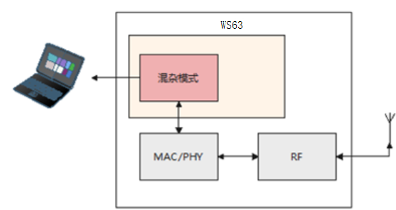

## 实现原理<a name="ZH-CN_TOPIC_0000001861402257"></a>

无线网络信号在传播过程中是以发射点为中心，像波纹一样往外辐射。理论上来讲，如果一个接收器处于无线信号经过的地方，它可以“听到”任何经过它的信号，只是它可能“听不懂”（无法解析报文内容）。

以下图为例，Phone与Smart Watch通信，Laptop完全有能力从空口监听他们的通信。空口抓包就是基于这个原理工作的。如果我们想要抓某个嵌入式设备的无线报文，只需在它附近运行一个具有监听功能的无线设备。

**图 1**  混杂模式<a name="fig981521318497"></a>  
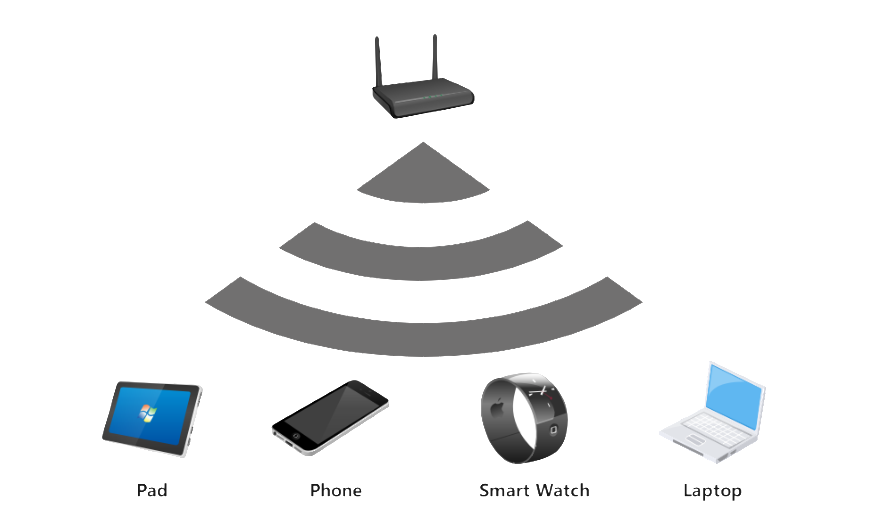

## 接口说明<a name="ZH-CN_TOPIC_0000001861402261"></a>


### 混杂接口声明<a name="ZH-CN_TOPIC_0000001869980537"></a>

```
/**
 * @if Eng
 * @brief  Type of WiFi interface.
 * @else
 * @brief  Type of WiFi interface。
 * @endif
 */
typedef enum {
    IFTYPE_STA,         /*!< @if Eng STAION.
                             @else STAION。 @endif */
    IFTYPE_AP,          /*!< @if Eng HOTSPOT.
                             @else HOTSPOT。 @endif */
    IFTYPE_P2P_CLIENT,  /*!< @if Eng P2P CLIENT.
                             @else P2P CLIENT。 @endif */
    IFTYPE_P2P_GO,      /*!< @if Eng P2P GO.
                             @else P2P GO。 @endif */
    IFTYPE_P2P_DEVICE,  /*!< @if Eng P2P DEVICE.
                             @else P2P DEVICE。 @endif */
    IFTYPES_BUTT
} wifi_if_type_enum;

/**
 * @if Eng
 * @brief  Struct of frame filter config in monitor mode.
 * @else
 * @brief  混杂模式报文接收过滤设置。
 * @endif
 */
typedef struct {
    int8_t mdata_en  : 1;   /*!< @if Eng get multi-cast data frame flag.
                                 @else 使能接收组播(广播)数据包。 @endif */
    int8_t udata_en  : 1;   /*!< @if Eng get single-cast data frame flag.
                                 @else 使能接收单播数据包。 @endif */
    int8_t mmngt_en  : 1;   /*!< @if Eng get multi-cast mgmt frame flag.
                                 @else 使能接收组播(广播)管理包。 @endif */
    int8_t umngt_en  : 1;   /*!< @if Eng get single-cast mgmt frame flag.
                                 @else 使能接收单播管理包。 @endif */
    int8_t custom_en : 1;   /*!< @if Eng get beacon/probe response flag.
                                 @else 使能接收beacon/probe request包。 @endif */
    int8_t resvd     : 3;   /*!< @if Eng reserved bits.
                                 @else 保留字段。 @endif */
} wifi_ptype_filter_stru;

/**
 * @if Eng
 * @brief  Set monitor mode.
 * @param  [in]  iftype Interface type.
 * @param  [in]  enable Enable(1) or disable(0).
 * @param  [in]  filter Filtered frame type enum.
 * @retval EXT_WIFI_OK        Execute successfully.
 * @retval EXT_WIFI_FAIL      Execute failed.
 * @else
 * @brief  设置混杂模式。
 * @param  [in]  iftype 接口类型。
 * @param  [in]  enable 开启/关闭。
 * @param  [in]  filter 过滤列表。
 * @retval EXT_WIFI_OK   成功。
 * @retval EXT_WIFI_FAIL 失败。
 * @endif
 */
errcode_t wifi_set_promis_mode(wifi_if_type_enum iftype, int32_t enable, const wifi_ptype_filter_stru *filter);
```

### 开启和关闭混杂<a name="ZH-CN_TOPIC_0000001823220754"></a>

命令格式：AT+CCPRIV=$vap,set\_monitor,$switch,$val1,$val2,$val3,$val4

参数说明：

-   $vap：表示需要维测的vap名字，通常为wlan0。
-   $switch：表示功能开、关、或者暂停，对应1、0、2。
-   $val1：表示广播/组播数据帧过滤开关，对应0、1，0表示过滤，1表示不过滤。
-   $val2：表示单播数据帧过滤开关，对应0、1，0表示过滤，1表示不过滤。
-   $val3：表示广播/组播管理帧过滤开关，对应0、1，0表示过滤，1表示不过滤。
-   $val4：表示单播管理帧过滤开关，对应0、1，0表示过滤，1表示不过滤。

命令示例：

-   开启所有帧上报：AT+CCPRIV=wlan0,set\_monitor,1,1,1,1,1
-   查看混杂收包统计：AT+CCPRIV=wlan0,set\_monitor,2 （PS：命令下发成功后，会在DebugKits工具中打印收包统计信息。）
-   关闭混杂：AT+CCPRIV=wlan0,set\_monitor,0

## 使用示例<a name="ZH-CN_TOPIC_0000001861402273"></a>

1.  执行[1.4 接口说明](接口说明.md)相关命令后，按需求开启对应帧过滤开关，例如所有帧上报：AT+CCPRIV=wlan0,set\_monitor,1,1,1,1,1
2.  若想查看开启混杂后的收包计数统计，可输入命令AT+CCPRIV=wlan0,set\_monitor,2后，在DebugKits工具中查看。

# 动态国家码特性说明<a name="ZH-CN_TOPIC_0000001814482628"></a>


## 概述<a name="ZH-CN_TOPIC_0000001861402269"></a>

动态国家码特性用于支持全球发货场景，根据设备预制的国家信息，自动调整发射功率表，以符合全球各地区对发射功率的法律规范。

## 应用场景<a name="ZH-CN_TOPIC_0000001861322477"></a>

在上网问题处理中，经常会碰到来自异国的设备出现扫描/连接/协商速率异常的情况，很多情况与802.11d协议（/国家码设置）相关。

国家码用来标识无线设备所在的国家，不同国家码规定了不同的无线设备射频特性，包括AP的发送功率、支持的信道等。配置国家码是为了使无线设备的射频特性符合不同国家或区域的法律法规要求。在第一次配置WLAN设备时，必须配置正确的国家码，以确保不违反当地的法律法规。

动态国家码提供一种配置方式，客户能够通过设置国家码，调整到国家对应大区（中国、亚太、北美、欧洲）的发射功率，从而符合法律规范

**图 1**  动态国家码应用场景<a name="fig9557113619505"></a>  
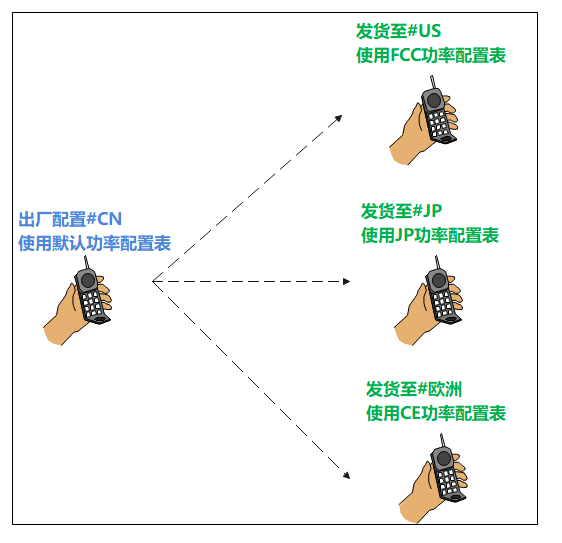

## 实现原理<a name="ZH-CN_TOPIC_0000001814482620"></a>

通过配置文件映射国家与大区的关系，每个国家码对应一个大区，每个大区对应一套功率表，国家码变动时，根据重新配置对应的功率表。

**图 1**  动态国家码设计原理图<a name="fig1792093211512"></a>  
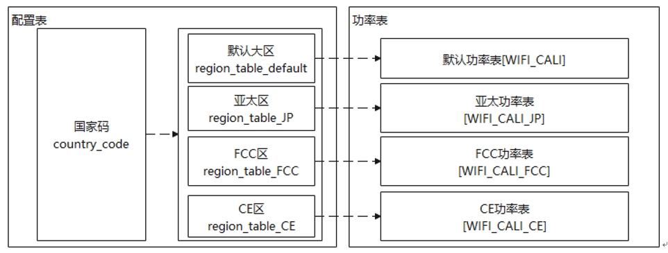

## 接口说明<a name="ZH-CN_TOPIC_0000001814482616"></a>


### 国家码接口声明<a name="ZH-CN_TOPIC_0000001869747065"></a>

```
/**
* @ingroup  soc_wifi_basic
* @brief  Set country code.CNcomment:设置国家码.CNend
*
* @par Description:
*           Set country code(two uppercases).CNcomment:设置国家码，由两个大写字符组成.CNend
*
* @attention  1.Before setting the country code, you must call uapi_wifi_init to complete the initialization.
*             CNcomment:设置国家码之前，必须调用uapi_wifi_init初始化完成.CNend\n
*             2.cc_len should be greater than or equal to 3.CNcomment:cc_len应大于等于3.CNend
* @param  cc               [IN]     Type  #const char *, country code.CNcomment:国家码.CNend
* @param  cc_len           [IN]     Type  #unsigned char, country code length.CNcomment:国家码长度.CNend
*
* @retval #EXT_WIFI_OK  Excute successfully
* @retval #Other           Error code
* @par Dependency:
*            @li soc_wifi_api.h: WiFi API
* @see  NULL
* @since
*/
td_s32 uapi_wifi_set_country(const td_char *cc, td_u8 cc_len);

/**
* @ingroup  soc_wifi_basic
* @brief  Get country code.CNcomment:获取国家码.CNend
*
* @par Description:
*           Get country code.CNcomment:获取国家码，由两个大写字符组成.CNend
*
* @attention  1.Before getting the country code, you must call uapi_wifi_init to complete the initialization.
*             CNcomment:获取国家码之前，必须调用uapi_wifi_init初始化完成.CNend
* @param  cc               [OUT]     Type  #char *, country code.CNcomment:国家码.CNend
* @param  len              [IN/OUT]  Type  #int *, country code length.CNcomment:国家码长度.CNend
*
* @retval #EXT_WIFI_OK  Excute successfully
* @retval #Other           Error code
* @par Dependency:
*            @li soc_wifi_api.h: WiFi API
* @see  NULL
* @since
*/
td_s32 uapi_wifi_get_country(td_char *cc, td_u8 *len);
```

### 设置和读取国家码<a name="ZH-CN_TOPIC_0000001823147282"></a>

```
AT+CC=&country
AT+CC?
```

> **说明：** 
>-   $COUNTRY：国家码，可配置范围：CN,JP,US,CA,KHRU,AU,MY,ID,TR,PL,FR,PT,IT,DE,ES,AR,ZA,MA,PH,TH,GB,CO,MX,EC,PE,CL,SA,EG,AE.

## 使用示例<a name="ZH-CN_TOPIC_0000001814642424"></a>

加载驱动时，根据nv配置文件配置大区功率，如[图1](#fig153673315174)所示。

**图 1**  nv国家码配置示例<a name="fig153673315174"></a>  
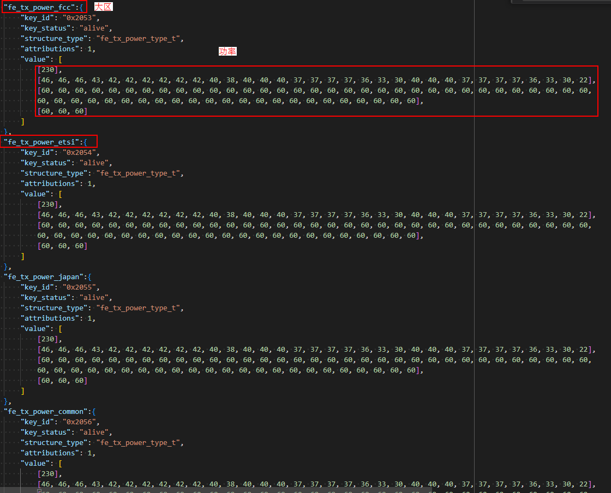

# 中继特性说明<a name="ZH-CN_TOPIC_0000001814482612"></a>


## 概述<a name="ZH-CN_TOPIC_0000001861322465"></a>

中继特性主要用于无线网络连接中，通过对报文的转发，实现远距离无线通信，达到扩大网络覆盖范围、降低网络部署成本的目的。

## 应用场景<a name="ZH-CN_TOPIC_0000001861322473"></a>

中继特性通过创建一个Repeater-STA端口与ROOT AP建立连接，创建一个Repeater-AP端口为其它STA提供服务，其工作原理为：Repeater-STA和Repeater-AP之间支持报文转发，从而进一步实现ROOT AP与STA的报文交互、完成网络业务的功能。Repeater-STA支持与一个ROOT AP接入，Repeater-AP支持最多5个设备同时接入。

**图 1**  中继场景<a name="fig144553675215"></a>  

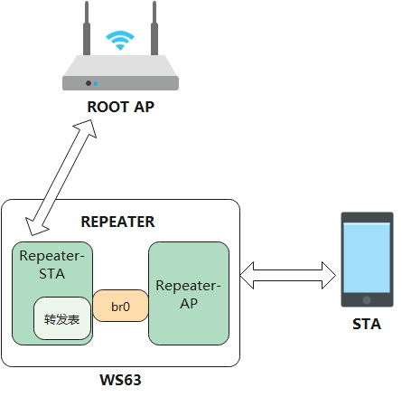

## 实现原理<a name="ZH-CN_TOPIC_0000001814482624"></a>

STA发给ROOT AP的报文经过Repeater时，报文中的源MAC地址与源IP地址的映射关系会被记录进入转发表，并且将报文中的源MAC修改为Repeater-STA的MAC发送给ROOT AP。

ROOT AP发送给STA的报文经过Repeater时， 会根据目的IP在转发表中查询，更改报文中的目的MAC地址，将报文转发到正确的STA中。

**图 1**  Repeater-STA 上行数据场景<a name="fig18461757175410"></a>  

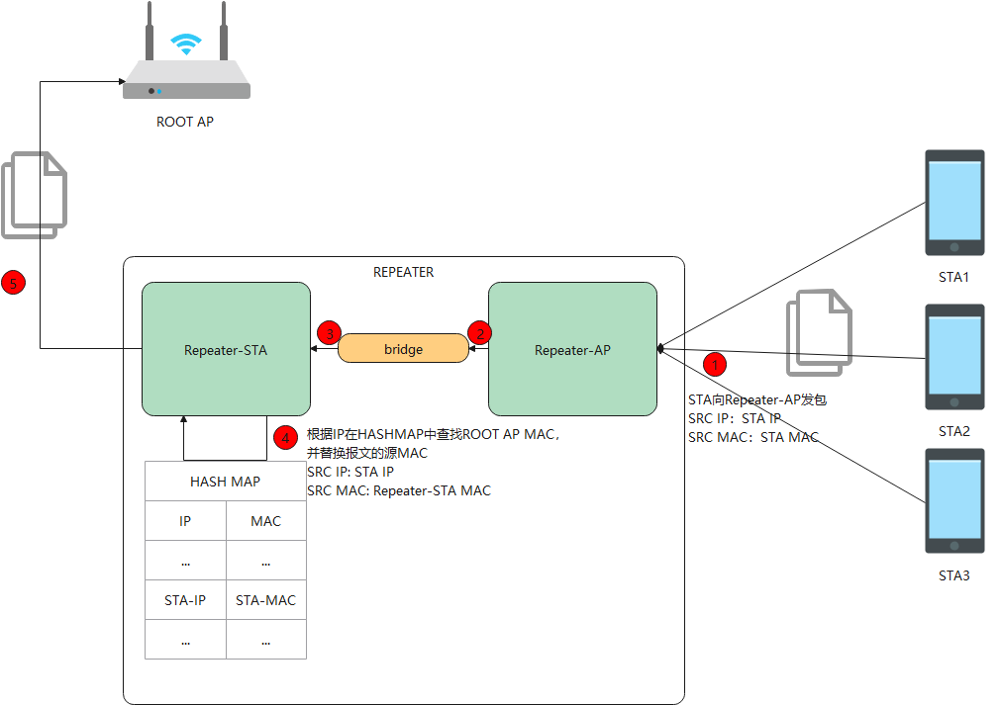

**图 2**  Repeater-STA下行数据场景<a name="fig55375019551"></a>  

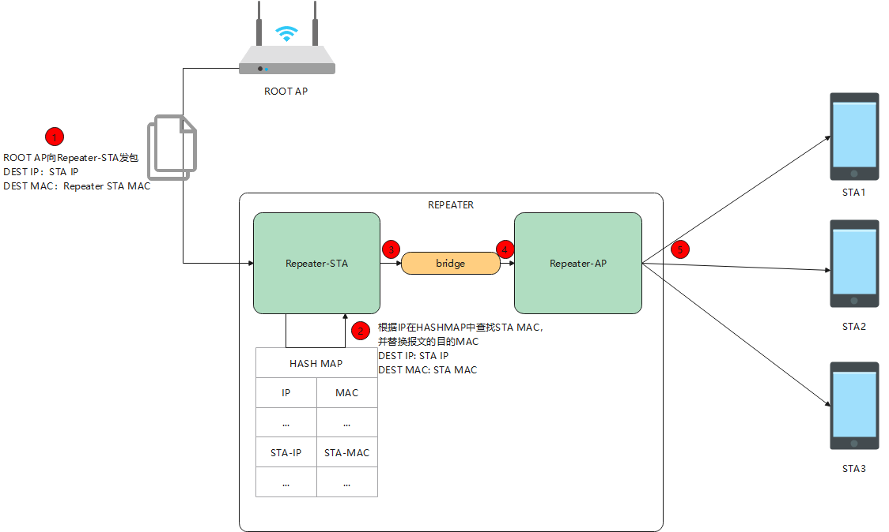

## 接口说明<a name="ZH-CN_TOPIC_0000001861322469"></a>

暂无

## 使用示例<a name="ZH-CN_TOPIC_0000001814642428"></a>

1.  创建ap0端口。

    ```
    AT+STARTAP="my_ap",13,2,"12345678"
    ```

2.  创建wlan0端口并关联上ROOT AP。

    ```
    AT+STARTSTA
    AT+SCAN
    AT+CONN="ROOTAP",,"12345678"
    ```

3.  使能repeater功能。

    ```
    AT+BRCTL=addbr
    ```

4.  将ap0端口、wlan0端口分别加入repeater，分别作为Repeater-AP和Repeater-STA。

    ```
    AT+BRCTL=addif,wlan0
    AT+BRCTL=addif,ap0
    ```

5.  陪测STA关联Repeater-AP并获取IP地址，进行ping测试、Iperf测试等。
6.  测试完成，将wlan0端口、ap0端口从repeater删除，并关闭repeater功能。

    ```
    AT+BRCTL=delif,wlan0
    AT+BRCTL=delif,ap0
    AT+BRCTL=delbr
    ```

# CSI特性说明<a name="ZH-CN_TOPIC_0000001814642436"></a>


## 概述<a name="ZH-CN_TOPIC_0000001814642440"></a>

CSI属于链路层数据，CSI在WiFi研究领域指Channel State Information，也就是通过接收到的WiFi信号来估计WiFi信号的传播信道的状况。

## 应用场景<a name="ZH-CN_TOPIC_0000001861322457"></a>

目前人们可以从CSI里提取到很多信息，比如室内人数，人的走动，（如上图），还可以扩大到分析人的心跳，敲击键盘，抽烟、喝水等动作，有研究机构甚至可以做到支持每个WiFi包的频偏，均衡星座图，时间标签等，继而做到从CSI到CSI”，指的是从Channel State Information到Chip State Information！

CSI能以更细粒度表征信号，通过对不同子信道信号传输情况分别进行分析，CSI可以尽可能避免多径效应与噪声的影响从而实现人体感知、精细的定位及细粒度动作的识别。

而在本文场景中，PHY层将L-LTF（non-HT）、HT-LTF、VHT-LTF或HE-LTF的符号的信道状态信息（CSI）通过MAC、HAL传递给HOST，HOST过滤后上报软件应用层用于定位功能。

CSI上报主要场景：由MAC获取CSI信息后，经过HAL、DMAC、HMAC不断抛事件最后到达WAL层，再经过WAL层上报数据进行解析分类最后传递到应用层，供应用层的算法（AoA定位算法等）使用；

## 实现原理<a name="ZH-CN_TOPIC_0000001814642444"></a>

CSI定位方法是根据接收端多天线间收到讯号的相位差计算出收到讯号的入射角与飞行时间来进行定位，利用讯号相位的差异值与波长的比例来计算出讯号由传送端发射到接收端的到达角度，利用讯号相位的差异值与频率差异值的比例来计算出讯号由传送端发射到接收端的飞行时间。

藉由多天线接收到的讯号相位差计算讯号到达角度，使用不同天线之间的相位差进行AoA的计算。无线讯号中不同子窄波之间的频率差为已知的信息，利用子窄波之间的相位差进行换算则可以计算讯号的飞行时间。CSI定位方法根据手机或Tag每个传送讯号来计算到达角度与飞行时间，利用讯号直接路径会有较小的讯号飞行时间的想法，筛选出直接路径的到达角度当作定位的依据，此外，根据WiFi Sniffer接收到手机或Tag的讯号强度来换算手机与基地台之间的距离，当WiFi Sniffer知道手机或Tag的相对角度与距离时，即可以进行定位。为了提升定位的准确率，CSI定位方法分别使用三台以上的WiFi Sniffer，根据每个WiFi Sniffer所计算的可能位置，导入权重分析的概念分别计算Likelihood值，利用三台以上的WiFi Sniffer所计算的可能位置进行校正，减少定位的误差而提升准确率。

## 接口说明<a name="ZH-CN_TOPIC_0000001814642432"></a>

1.  添加用户命令

    ```
    /**
     * @if Eng
     * @brief  Config CSI.
     * @param  [in]  ifname Interface which enable CSI, wlan0 or ap0.
     * @param  [in]  config CSI's configuration.
     * @retval ERRCODE_SUCC        Execute successfully.
     * @retval Other               Execute failed.
     * @else
     * @brief  配置CSI。
     * @param  [in]  ifname 使能CSI，wlan0，ap的接口。
     * @param  [in]  config CSI配置。
     * @retval ERRCODE_SUCC        成功。
     * @retval Other               失败。
     * @endif
     */
    errcode_t wifi_set_csi_config(const int8_t *ifname, const csi_config_stru *config);
     
    typedef struct {
        uint8_t user_index;             /*!< @if Eng user index.
                                             @else 用户ID,取值范围0~3，最多4个用户。 @endif */
        uint8_t enable;                 /*!< @if Eng enable.
                                             @else CSI白名单用户开关。 @endif */
        uint8_t match_ta_ra_select;     /*!< @if Eng match_ta_ra_select.
                                             @else CSI白名单地址过滤类型 0 RA 1 TA。 @endif */
        uint8_t resv;                   /*!< @if Eng resv.
                                             @else 保留1字节对齐。 @endif */
        uint8_t mac_addr[WIFI_MAC_LEN]; /*!< @if Eng Mac address.
                                             @else MAC地址。 @endif */
        uint8_t frame_filter_bitmap;    /*!< @if Eng frame_filter_bitmap.
                                             @else 帧类型过滤具体参数。 @endif */
        uint8_t sub_type_filter_enable; /*!< @if Eng subTypeFilterEnable.
                                             @else 帧子类型过滤开关。 @endif */
        uint8_t sub_type_filter;        /*!< @if Eng subTypeFilter.
                                             @else 帧子类型过滤具体参数。 @endif */
        uint8_t ppdu_filter_bitmap;     /*!< @if Eng ppduFilterBitmap.
                                             @else ppdu format过滤具体参数。 @endif */
        uint16_t period;                /*!< @if Eng period.
                                             @else CSI上报时间间隔。 @endif */
    } csi_config_stru;
    ```

    帧子类型过滤具体参数 4位二进制数对应的十进制结果（如 1100即为12）

    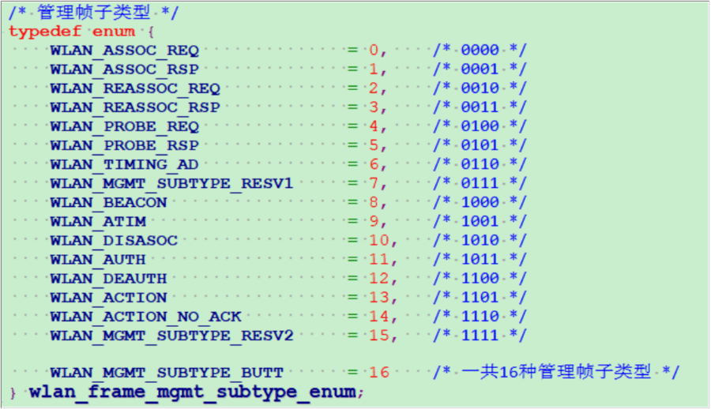

    

    ppdu format过滤具体参数取值范围0\~63

    bit\[0\]:non-HT

    bit\[1\]:HE\_\(ER\)SU

    bit\[2\]:HE\_MU\_MIMO

    bit\[3\]:HE\_MU\_OFDMA

    bit\[4\]:HT

    bit\[5\]:VHT

2.  CSI开关

    打开CSI

    ```
    /**
     * @if Eng
     * @brief  Start CSI report.
     * @retval ERRCODE_SUCC        Execute successfully.
     * @retval Other               Execute failed.
     * @else
     * @brief  开启CSI上报。
     * @retval ERRCODE_SUCC        成功。
     * @retval Other               失败。
     * @endif
     */
    errcode_t wifi_csi_start(void);
    ```

    关闭CSI

    ```
    /**
     * @if Eng
     * @brief  Close CSI report.
     * @retval ERRCODE_SUCC        Execute successfully.
     * @retval Other               Execute failed.
     * @else
     * @brief  关闭CSI上报。
     * @retval ERRCODE_SUCC        成功。
     * @retval Other               失败。
     * @endif
     */
    errcode_t wifi_csi_stop(void);
    ```

3.  CSI回调接口

    ```
    /**
     * @if Eng
     * @brief  Register report callback of CSI.
     * @param  [in]  data_cb Callback pointer.
     * @retval ERRCODE_SUCC        Execute successfully.
     * @retval Other               Error code.
     * @else
     * @brief  注册CSI数据上报回调函数。
     * @param  [in]  data_cb 回调函数。
     * @retval ERRCODE_SUCC        成功。
     * @retval Other               失败。
     * @endif
     */
    errcode_t wifi_register_csi_report_cb(wifi_csi_data_cb data_cb);
     
    /**
     * @if Eng
     * @brief  CSI data report callback.
     * @param  [in]  csi_data 4 bytes extend timestamp + 758 bytes 64bit big endian data.
     * @param  [in]  len data length.
     * @retval void
     * @else
     * @brief  用户注册的回调函数，用于处理CSI上报的数据。
     * @param  [in]  csi_data 4字节扩展时间戳+758字节64位小端存储格式的CSI数据.
     * @param  [in]  len 数据长度,固定为762字节。
     * @retval void
     * @endif
     */
    typedef void (*wifi_csi_data_cb)(uint8_t *csi_data, int32_t len);
    ```

# 雷达特性说明<a name="ZH-CN_TOPIC_0000001816981854"></a>


## 概述<a name="ZH-CN_TOPIC_0000001863701613"></a>

雷达特性为周期性地收发雷达信号以检测运动目标的功能特性，用户可以调用雷达 APIs接口使用该特性，详细内容请参见《WS63V100 雷达快速入门指南》。

## 开发流程<a name="ZH-CN_TOPIC_0000001817141618"></a>


### 数据结构<a name="ZH-CN_TOPIC_0000001863726881"></a>

雷达状态设置枚举定义：

```
typedef enum {
    RADAR_STATUS_STOP = 0,  /* 雷达状态配置停止 */
    RADAR_STATUS_START,     /* 雷达状态配置启动 */
    RADAR_STATUS_RESET,     /* 雷达状态配置复位 */
    RADAR_STATUS_RESUME,    /* 雷达状态配置状态恢复 */
} radar_set_sts_t;
```

雷达状态查询枚举定义：

```
typedef enum {
    RADAR_STATUS_IDLE = 0,  /* 雷达状态未工作 */
    RADAR_STATUS_RUNNING,   /* 雷达状态工作 */
} radar_get_sts_t;
```

雷达结果上报结构体定义：

```
typedef struct {
    uint32_t lower_boundary;    /* 雷达结果靠近检测下边界 */
    uint32_t upper_boundary;    /* 雷达结果靠近检测上边界 */
    uint8_t is_human_presence;  /* 雷达结果有无人体存在 */
    uint8_t reserved_0;
    uint8_t reserved_1;
    uint8_t reserved_2;
} radar_result_t;
```

结果回调函数数据结构定义：

typedef void \(\*radar\_result\_cb\_t\)\(radar\_result\_t \*result\);

### APIs<a name="ZH-CN_TOPIC_0000001817166882"></a>

雷达 APIs接口如下表所示。

<a name="table22371515403"></a>
<table><thead align="left"><tr id="row227219117405"><th class="cellrowborder" valign="top" width="15.310000000000002%" id="mcps1.1.5.1.1"><p id="p1927281174018"><a name="p1927281174018"></a><a name="p1927281174018"></a>接口名称</p>
</th>
<th class="cellrowborder" valign="top" width="29.32%" id="mcps1.1.5.1.2"><p id="p2272171144016"><a name="p2272171144016"></a><a name="p2272171144016"></a>描述</p>
</th>
<th class="cellrowborder" valign="top" width="28.02%" id="mcps1.1.5.1.3"><p id="p82723111408"><a name="p82723111408"></a><a name="p82723111408"></a>参数说明</p>
</th>
<th class="cellrowborder" valign="top" width="27.35%" id="mcps1.1.5.1.4"><p id="p14272181144015"><a name="p14272181144015"></a><a name="p14272181144015"></a>返回信息说明</p>
</th>
</tr>
</thead>
<tbody><tr id="row027210119403"><td class="cellrowborder" valign="top" width="15.310000000000002%" headers="mcps1.1.5.1.1 "><p id="p12764860585"><a name="p12764860585"></a><a name="p12764860585"></a>uapi_radar_set_status</p>
</td>
<td class="cellrowborder" valign="top" width="29.32%" headers="mcps1.1.5.1.2 "><p id="p169217338583"><a name="p169217338583"></a><a name="p169217338583"></a>设置雷达状态</p>
</td>
<td class="cellrowborder" valign="top" width="28.02%" headers="mcps1.1.5.1.3 "><p id="p1891165755816"><a name="p1891165755816"></a><a name="p1891165755816"></a><em id="i10911257105810"><a name="i10911257105810"></a><a name="i10911257105810"></a>sts</em>:: 雷达状态</p>
</td>
<td class="cellrowborder" valign="top" width="27.35%" headers="mcps1.1.5.1.4 "><p id="p02728115407"><a name="p02728115407"></a><a name="p02728115407"></a>接口返回值：错误码。</p>
</td>
</tr>
<tr id="row1616011618525"><td class="cellrowborder" valign="top" width="15.310000000000002%" headers="mcps1.1.5.1.1 "><p id="p759656646"><a name="p759656646"></a><a name="p759656646"></a>uapi_radar_get_status</p>
</td>
<td class="cellrowborder" valign="top" width="29.32%" headers="mcps1.1.5.1.2 "><p id="p946181118512"><a name="p946181118512"></a><a name="p946181118512"></a>获取雷达状态</p>
</td>
<td class="cellrowborder" valign="top" width="28.02%" headers="mcps1.1.5.1.3 "><p id="p4839131192411"><a name="p4839131192411"></a><a name="p4839131192411"></a>*sts: 雷达状态</p>
</td>
<td class="cellrowborder" valign="top" width="27.35%" headers="mcps1.1.5.1.4 "><p id="p416013619525"><a name="p416013619525"></a><a name="p416013619525"></a>接口返回值：错误码。</p>
</td>
</tr>
<tr id="row433461213529"><td class="cellrowborder" valign="top" width="15.310000000000002%" headers="mcps1.1.5.1.1 "><p id="p1521913368248"><a name="p1521913368248"></a><a name="p1521913368248"></a>uapi_radar_register_result_cb</p>
</td>
<td class="cellrowborder" valign="top" width="29.32%" headers="mcps1.1.5.1.2 "><p id="p2040044952415"><a name="p2040044952415"></a><a name="p2040044952415"></a>雷达结果回调注册函数</p>
</td>
<td class="cellrowborder" valign="top" width="28.02%" headers="mcps1.1.5.1.3 "><p id="p111717605817"><a name="p111717605817"></a><a name="p111717605817"></a><em id="i191719635817"><a name="i191719635817"></a><a name="i191719635817"></a>cb</em>: 回调函数</p>
</td>
<td class="cellrowborder" valign="top" width="27.35%" headers="mcps1.1.5.1.4 "><p id="p93341612145216"><a name="p93341612145216"></a><a name="p93341612145216"></a>接口返回值：错误码。</p>
</td>
</tr>
<tr id="row7455151520524"><td class="cellrowborder" valign="top" width="15.310000000000002%" headers="mcps1.1.5.1.1 "><p id="p237215226548"><a name="p237215226548"></a><a name="p237215226548"></a>uapi_radar_set_delay_time</p>
</td>
<td class="cellrowborder" valign="top" width="29.32%" headers="mcps1.1.5.1.2 "><p id="p20438555155717"><a name="p20438555155717"></a><a name="p20438555155717"></a>设置退出延迟时间</p>
</td>
<td class="cellrowborder" valign="top" width="28.02%" headers="mcps1.1.5.1.3 "><p id="p11781611508"><a name="p11781611508"></a><a name="p11781611508"></a><em id="i1517817119017"><a name="i1517817119017"></a><a name="i1517817119017"></a>time</em>: 退出延迟时间</p>
</td>
<td class="cellrowborder" valign="top" width="27.35%" headers="mcps1.1.5.1.4 "><p id="p945561535210"><a name="p945561535210"></a><a name="p945561535210"></a>接口返回值：错误码。</p>
</td>
</tr>
<tr id="row075421825219"><td class="cellrowborder" valign="top" width="15.310000000000002%" headers="mcps1.1.5.1.1 "><p id="p1095042819543"><a name="p1095042819543"></a><a name="p1095042819543"></a>uapi_radar_get_delay_time</p>
</td>
<td class="cellrowborder" valign="top" width="29.32%" headers="mcps1.1.5.1.2 "><p id="p380774614577"><a name="p380774614577"></a><a name="p380774614577"></a>获取退出延迟时间</p>
</td>
<td class="cellrowborder" valign="top" width="28.02%" headers="mcps1.1.5.1.3 "><p id="p186220181402"><a name="p186220181402"></a><a name="p186220181402"></a>*time: 退出延迟时间</p>
</td>
<td class="cellrowborder" valign="top" width="27.35%" headers="mcps1.1.5.1.4 "><p id="p13755111835210"><a name="p13755111835210"></a><a name="p13755111835210"></a>接口返回值：错误码。</p>
</td>
</tr>
<tr id="row3308174117548"><td class="cellrowborder" valign="top" width="15.310000000000002%" headers="mcps1.1.5.1.1 "><p id="p5203752105411"><a name="p5203752105411"></a><a name="p5203752105411"></a>uapi_radar_get_isolation</p>
</td>
<td class="cellrowborder" valign="top" width="29.32%" headers="mcps1.1.5.1.2 "><p id="p1153716360574"><a name="p1153716360574"></a><a name="p1153716360574"></a>获取天线隔离度信息</p>
</td>
<td class="cellrowborder" valign="top" width="28.02%" headers="mcps1.1.5.1.3 "><p id="p156716278014"><a name="p156716278014"></a><a name="p156716278014"></a>*iso: 天线隔离度信息</p>
</td>
<td class="cellrowborder" valign="top" width="27.35%" headers="mcps1.1.5.1.4 "><p id="p8308134112547"><a name="p8308134112547"></a><a name="p8308134112547"></a>接口返回值：错误码。</p>
</td>
</tr>
</tbody>
</table>

### 错误码<a name="ZH-CN_TOPIC_0000001863886685"></a>

<a name="table54639314269"></a>
<table><thead align="left"><tr id="row1950714310264"><th class="cellrowborder" valign="top" width="9.09090909090909%" id="mcps1.1.5.1.1"><p id="p1550810310267"><a name="p1550810310267"></a><a name="p1550810310267"></a>序号</p>
</th>
<th class="cellrowborder" valign="top" width="40.40404040404041%" id="mcps1.1.5.1.2"><p id="p9508237262"><a name="p9508237262"></a><a name="p9508237262"></a>定义</p>
</th>
<th class="cellrowborder" valign="top" width="14.14141414141414%" id="mcps1.1.5.1.3"><p id="p2508239265"><a name="p2508239265"></a><a name="p2508239265"></a>实际数值</p>
</th>
<th class="cellrowborder" valign="top" width="36.36363636363636%" id="mcps1.1.5.1.4"><p id="p11508138268"><a name="p11508138268"></a><a name="p11508138268"></a>描述</p>
</th>
</tr>
</thead>
<tbody><tr id="row15081315264"><td class="cellrowborder" valign="top" width="9.09090909090909%" headers="mcps1.1.5.1.1 "><p id="p19508193202616"><a name="p19508193202616"></a><a name="p19508193202616"></a>1</p>
</td>
<td class="cellrowborder" valign="top" width="40.40404040404041%" headers="mcps1.1.5.1.2 "><p id="p551413454113"><a name="p551413454113"></a><a name="p551413454113"></a>ERRCODE_SUCC</p>
</td>
<td class="cellrowborder" valign="top" width="14.14141414141414%" headers="mcps1.1.5.1.3 "><p id="p35083342610"><a name="p35083342610"></a><a name="p35083342610"></a>0</p>
</td>
<td class="cellrowborder" valign="top" width="36.36363636363636%" headers="mcps1.1.5.1.4 "><p id="p95081731266"><a name="p95081731266"></a><a name="p95081731266"></a>执行成功错误码。</p>
</td>
</tr>
<tr id="row35081335265"><td class="cellrowborder" valign="top" width="9.09090909090909%" headers="mcps1.1.5.1.1 "><p id="p25086318265"><a name="p25086318265"></a><a name="p25086318265"></a>2</p>
</td>
<td class="cellrowborder" valign="top" width="40.40404040404041%" headers="mcps1.1.5.1.2 "><p id="p151481351921"><a name="p151481351921"></a><a name="p151481351921"></a>ERRCODE_FAIL</p>
</td>
<td class="cellrowborder" valign="top" width="14.14141414141414%" headers="mcps1.1.5.1.3 "><p id="p118571415928"><a name="p118571415928"></a><a name="p118571415928"></a>0xFFFFFFFF</p>
</td>
<td class="cellrowborder" valign="top" width="36.36363636363636%" headers="mcps1.1.5.1.4 "><p id="p9508183172616"><a name="p9508183172616"></a><a name="p9508183172616"></a>执行失败错误码。</p>
</td>
</tr>
</tbody>
</table>

## 注意事项<a name="ZH-CN_TOPIC_0000001863861405"></a>

雷达特性需要在WiFi信道上进行工作，所以需注意打开雷达前，需要确保WiFi信道有配置，WiFi进入softAP或STA模式即可。

## 编程实例<a name="ZH-CN_TOPIC_0000001816981858"></a>

```
typedef void (*radar_result_cb_t)(radar_result_t *result);

#define WIFI_IFNAME_MAX_SIZE             16
#define WIFI_MAX_SSID_LEN                33
#define WIFI_SCAN_AP_LIMIT               64
#define WIFI_MAC_LEN                     6
#define WIFI_INIT_WAIT_TIME              500 // 5s
#define WIFI_START_STA_DELAY             100 // 1s

#define RADAR_STATUS_SET_START            1
#define RADAR_STATUS_QUERY_DELAY         1000 // 10s

// WiFi启动STA模式实现样例
td_s32 radar_start_sta(td_void)
{
    (void)osDelay(WIFI_INIT_WAIT_TIME); /* 500: 延时0.5s, 等待wifi初始化完毕 */
    PRINT("STA try enable.\r\n");
    /* 创建STA接口 */
    if (wifi_sta_enable() != 0) {
        PRINT("sta enbale fail !\r\n");
        return -1;
    }

    /* 连接成功 */
    PRINT("STA connect success.\r\n");
    return 0;
}

// 雷达结果回调函数实现样例
static void radar_print_res(radar_result_t *res)
{
    PRINT("[RADAR_SAMPLE] lb:%u, hb:%u, hm:%u\r\n", res->lower_boundary, res->upper_boundary, res->is_human_presence);
}

int radar_demo_init(void *param)
{
    PRINT("[RADAR_SAMPLE] radar_demo_init sta!\r\n");

    param = param;
    // WiFi启动STA模式
    radar_start_sta();

    // 注册雷达结果回调函数
    uapi_radar_register_result_cb(radar_print_res);

    // 启动雷达
    (void)osDelay(WIFI_START_STA_DELAY);
    uapi_radar_set_status(RADAR_STATUS_SET_START);

    // 雷达查询接口示例
    while(1) {
        (void)osDelay(RADAR_STATUS_QUERY_DELAY);
        uint8_t sts;
        uapi_radar_get_status(&sts);
        uint16_t time;
        uapi_radar_get_delay_time(&time);
        uint16_t iso;
        uapi_radar_get_isolation(&iso);
    }

    return 0;
}
```

# BLE配网特性说明<a name="ZH-CN_TOPIC_0000001820425798"></a>


## 概述<a name="ZH-CN_TOPIC_0000001867225469"></a>

BLE配网是指通过BLE辅助WIFI入网。

## 应用场景<a name="ZH-CN_TOPIC_0000001867185281"></a>

在 BLE 配网模式下，设备在无网模式下通过BLE发送配网广播，附近的手机扫描到该广播，可通过多种方式与用户交互：

1）手机应用主动弹框询问手机用户是否允许该设备加入家庭网络。

2）手机应用主动扫描后显示在可用设备列表，用户手动选择将该设备加入家庭网络。

如用户选择加入，手机与设备建立BLE连接，再将WIFI入网信息（SSID、密码等）传输给设备。与SoftAP 配网相比，用户无需切换WIFI AP与STA模式，可以大大提升终端用户体验。

## 实现原理<a name="ZH-CN_TOPIC_0000001820585606"></a>

BLE配网参考流程如下：

**图 1**  BLE配网流程<a name="fig07609154494"></a>  
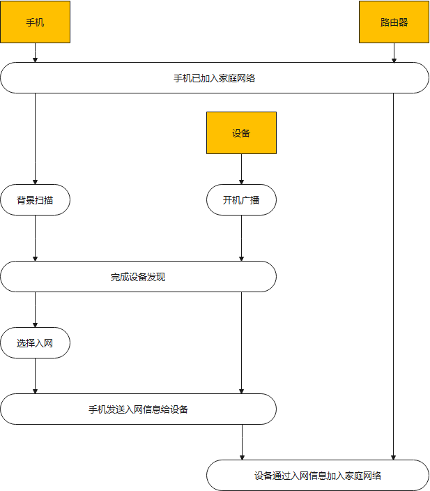

使用WS63芯片的设备，在无网模式下启动，自动发送配网广播，用户可以调整广播持续时间、间隔以及重新广播的触发条件。

## 接口说明<a name="ZH-CN_TOPIC_0000001820425802"></a>

参考《WS63V100 软件开发指南》BLE开发流程章节。

## 使用示例<a name="ZH-CN_TOPIC_0000001835660816"></a>

1.  在SDK根目录下执行命令“python3 build.py  ws63-liteos-app menuconfig”，并按下图配置对应编译选项进行配置。

    **图 1**  BLE Demo配置选项<a name="fig161841164188"></a>  
    

    

    

2.  完成配置后执行命令python3 build.py  ws63-liteos-app，将生成的镜像通过BurnTool烧录进单板中。
3.  在Android手机安装“EasyConnect”软件，点击“wifi configuration”，配置待连接的Wi-Fi参数；

    **图 2**  配置Wi-Fi参数<a name="fig950015862315"></a>  
    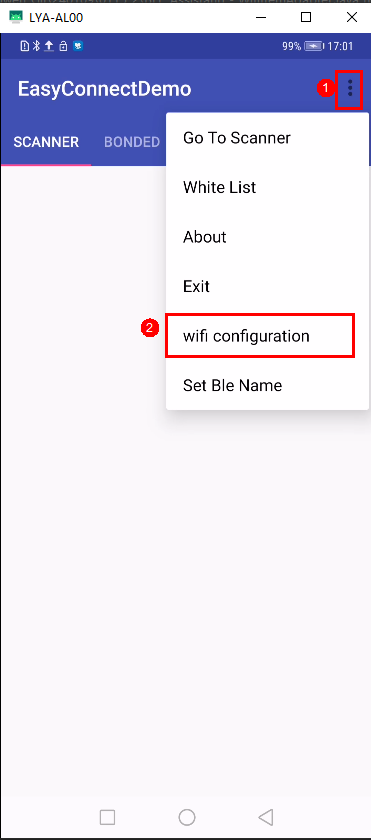

4.  点击“Set Ble Name”，默认配置为ble\_wifi\_config；

    **图 3**  配置蓝牙名称<a name="fig15386967248"></a>  
    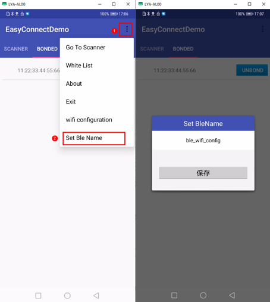

5.  配置完成后，点击“配网”，待Android手机和63模组连接成功后，会显示连接成功并播报。

    **图 4**  WS63模组配网成功<a name="fig143399108245"></a>  
    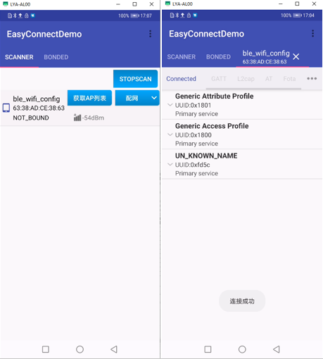

> **说明：** 
>配网软件“EasyConnect”可通过技术支持获取。

# BLE网关特性说明<a name="ZH-CN_TOPIC_0000001867225477"></a>


## 概述<a name="ZH-CN_TOPIC_0000001867185285"></a>

BLE网关做为中继，帮助无法直接与服务器通信的BLE设备上云。

## 应用场景<a name="ZH-CN_TOPIC_0000001820585610"></a>

BLE网关实现多个BLE子设备的认证、连接管理，以及路由转发功能。从云发送的命令通过网关下发到BLE设备；BLE设备的状态也可以通过网关上报给服务器。

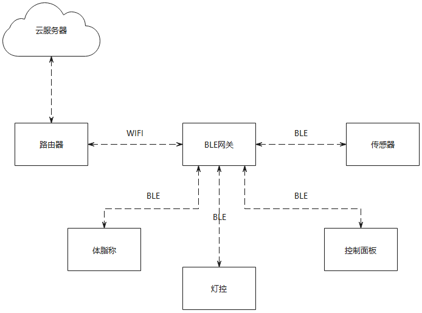

## 实现原理<a name="ZH-CN_TOPIC_0000001820425806"></a>

BLE网关的工作流程参考：

1.  网关开启背景扫描，BLE子设备发送广播，网关识别支持的服务ID主动建立BLE连接，完成认证和数据传输；
2.  网关服务程序将收到的BLE数据，通过WIFI路由器上传到服务器；
3.  服务器将BLE设备的信息在手机应用或者控制中枢显示屏显示，控制指令也可通过WIFI由服务器传给网关，再由网关通过BLE传输给设备。

## 接口说明<a name="ZH-CN_TOPIC_0000001867225485"></a>

参考《WS63V100 软件开发指南》BLE开发流程章节。

# 安全启动特性说明<a name="ZH-CN_TOPIC_0000001867185289"></a>


## 概述<a name="ZH-CN_TOPIC_0000001820585614"></a>

安全启动是指在系统启动时，使用efuse中预先写入的秘钥对镜像逐级校验的功能。

## 应用场景<a name="ZH-CN_TOPIC_0000001820425810"></a>

安全启动用于保证镜像的完整性和安全性，防止镜像被破解和篡改。

> **须知：** 
>安全启动功能在产测阶段通过烧录efuse打开，开启该功能后仅能使用efuse中对应的秘钥组对镜像签名才能正常启动。

## 实现原理<a name="ZH-CN_TOPIC_0000001867225489"></a>

预先在efuse中写入根公钥HASH值和安全启动使能位；

系统复位后从bootrom启动，

1.  在bootrom中计算镜像中的根公钥HASH值与efuse中的进行校验；
2.  根公钥校验通过后，使用根公钥验签ssb镜像；
3.  Ssb镜像校验通过后，使用ssb镜像中的二级公钥校验Flashboot镜像；
4.  Flashboot镜像校验通过后，使用flashboot中的三级公钥校验App镜像；
5.  App镜像校验通过后，跳转到app镜像启动完成。

[图7.1 安全启动镜像逐级校验流程](#fig475583715529)

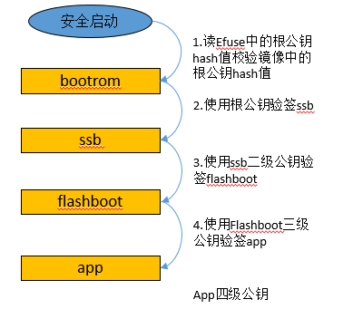

## 接口说明<a name="ZH-CN_TOPIC_0000001867185293"></a>

1.配置efuse安全启动使能位写1


2.配置根公钥HASH值烧写到efuse


> **说明：** 
>可参照《WS63V100 二次开发网络安全 注意事项》中安全启动配置章节进行配置

# FLASH在线解密特性说明<a name="ZH-CN_TOPIC_0000001820585618"></a>


## 概述<a name="ZH-CN_TOPIC_0000001820425814"></a>

FLASH在线解密是指CPU在访问FLASH上的加密镜像时在线解密后运行。

## 应用场景<a name="ZH-CN_TOPIC_0000001867225493"></a>

FLASH在线解密特性主要用于对加密存储在FLASH上的APP镜像进行解密运行。

> **须知：** 
>FLASH在线解密功能需要在编译前打开镜像加密，并将对应的秘钥派生参数写入efuse中。

## 实现原理<a name="ZH-CN_TOPIC_0000001867185297"></a>

开启FLASH在线解密功能后：

1.  在编译阶段签名后会对镜像加密。
2.  镜像烧写到flash上为加密存储状态。
3.  启动时会自动配置解密区域。
4.  cpu运行时通过配置由硬件自动解密。

**图 1**  FLASH在线解密示意图<a name="fig1414916695718"></a>  


## 接口说明<a name="ZH-CN_TOPIC_0000001820585622"></a>

1.  在配置文件hi3863/boards/HI3863/sdk/build/config/target\_config/ws63/sign\_config/liteos\_app\_bin\_ecc.cfg中将SignSuite配置为1，并配置秘钥派生参数对应的IV和PlainKey。
2.  将秘钥派生参数写入efuse对应位置


> **说明：** 
>可参照《WS63V100 二次开发网络安全 注意事项》中镜像加密配置章节进行配置

