# 前言<a name="ZH-CN_TOPIC_0000001779168177"></a>

**概述<a name="section4537382116410"></a>**

本文档主要介绍固件升级流程和接口的使用方法，指导用户应用及开发升级特性。

**产品版本<a name="section111371595118"></a>**

与本文档相对应的产品版本如下。

<a name="table22377277"></a>
<table><thead align="left"><tr id="row63051425"><th class="cellrowborder" valign="top" width="40.400000000000006%" id="mcps1.1.3.1.1"><p id="p6891761"><a name="p6891761"></a><a name="p6891761"></a><strong id="b87075663813"><a name="b87075663813"></a><a name="b87075663813"></a>产品名称</strong></p>
</th>
<th class="cellrowborder" valign="top" width="59.599999999999994%" id="mcps1.1.3.1.2"><p id="p21361741"><a name="p21361741"></a><a name="p21361741"></a><strong id="b1175145653811"><a name="b1175145653811"></a><a name="b1175145653811"></a>产品版本</strong></p>
</th>
</tr>
</thead>
<tbody><tr id="row52579486"><td class="cellrowborder" valign="top" width="40.400000000000006%" headers="mcps1.1.3.1.1 "><p id="p31080012"><a name="p31080012"></a><a name="p31080012"></a>WS63</p>
</td>
<td class="cellrowborder" valign="top" width="59.599999999999994%" headers="mcps1.1.3.1.2 "><p id="p34453054"><a name="p34453054"></a><a name="p34453054"></a>V100</p>
</td>
</tr>
</tbody>
</table>

**读者对象<a name="section4378592816410"></a>**

本文档主要适用于以下工程师：

-   技术支持工程师
-   软件开发工程师

**符号约定<a name="section133020216410"></a>**

在本文中可能出现下列标志，它们所代表的含义如下。

<a name="table2622507016410"></a>
<table><thead align="left"><tr id="row1530720816410"><th class="cellrowborder" valign="top" width="20.580000000000002%" id="mcps1.1.3.1.1"><p id="p6450074116410"><a name="p6450074116410"></a><a name="p6450074116410"></a><strong id="b2136615816410"><a name="b2136615816410"></a><a name="b2136615816410"></a>符号</strong></p>
</th>
<th class="cellrowborder" valign="top" width="79.42%" id="mcps1.1.3.1.2"><p id="p5435366816410"><a name="p5435366816410"></a><a name="p5435366816410"></a><strong id="b5941558116410"><a name="b5941558116410"></a><a name="b5941558116410"></a>说明</strong></p>
</th>
</tr>
</thead>
<tbody><tr id="row1372280416410"><td class="cellrowborder" valign="top" width="20.580000000000002%" headers="mcps1.1.3.1.1 "><p id="p3734547016410"><a name="p3734547016410"></a><a name="p3734547016410"></a><a name="image2670064316410"></a><a name="image2670064316410"></a><span></span></p>
</td>
<td class="cellrowborder" valign="top" width="79.42%" headers="mcps1.1.3.1.2 "><p id="p1757432116410"><a name="p1757432116410"></a><a name="p1757432116410"></a>表示如不避免则将会导致死亡或严重伤害的具有高等级风险的危害。</p>
</td>
</tr>
<tr id="row466863216410"><td class="cellrowborder" valign="top" width="20.580000000000002%" headers="mcps1.1.3.1.1 "><p id="p1432579516410"><a name="p1432579516410"></a><a name="p1432579516410"></a><a name="image4895582316410"></a><a name="image4895582316410"></a><span></span></p>
</td>
<td class="cellrowborder" valign="top" width="79.42%" headers="mcps1.1.3.1.2 "><p id="p959197916410"><a name="p959197916410"></a><a name="p959197916410"></a>表示如不避免则可能导致死亡或严重伤害的具有中等级风险的危害。</p>
</td>
</tr>
<tr id="row123863216410"><td class="cellrowborder" valign="top" width="20.580000000000002%" headers="mcps1.1.3.1.1 "><p id="p1232579516410"><a name="p1232579516410"></a><a name="p1232579516410"></a><a name="image1235582316410"></a><a name="image1235582316410"></a><span></span></p>
</td>
<td class="cellrowborder" valign="top" width="79.42%" headers="mcps1.1.3.1.2 "><p id="p123197916410"><a name="p123197916410"></a><a name="p123197916410"></a>表示如不避免则可能导致轻微或中度伤害的具有低等级风险的危害。</p>
</td>
</tr>
<tr id="row5786682116410"><td class="cellrowborder" valign="top" width="20.580000000000002%" headers="mcps1.1.3.1.1 "><p id="p2204984716410"><a name="p2204984716410"></a><a name="p2204984716410"></a><a name="image4504446716410"></a><a name="image4504446716410"></a><span></span></p>
</td>
<td class="cellrowborder" valign="top" width="79.42%" headers="mcps1.1.3.1.2 "><p id="p4388861916410"><a name="p4388861916410"></a><a name="p4388861916410"></a>用于传递设备或环境安全警示信息。如不避免则可能会导致设备损坏、数据丢失、设备性能降低或其它不可预知的结果。</p>
<p id="p1238861916410"><a name="p1238861916410"></a><a name="p1238861916410"></a>“须知”不涉及人身伤害。</p>
</td>
</tr>
<tr id="row2856923116410"><td class="cellrowborder" valign="top" width="20.580000000000002%" headers="mcps1.1.3.1.1 "><p id="p5555360116410"><a name="p5555360116410"></a><a name="p5555360116410"></a><a name="image799324016410"></a><a name="image799324016410"></a><span></span></p>
</td>
<td class="cellrowborder" valign="top" width="79.42%" headers="mcps1.1.3.1.2 "><p id="p4612588116410"><a name="p4612588116410"></a><a name="p4612588116410"></a>对正文中重点信息的补充说明。</p>
<p id="p1232588116410"><a name="p1232588116410"></a><a name="p1232588116410"></a>“说明”不是安全警示信息，不涉及人身、设备及环境伤害信息。</p>
</td>
</tr>
</tbody>
</table>

**修改记录<a name="section2467512116410"></a>**

<a name="table1557726816410"></a>
<table><thead align="left"><tr id="row2942532716410"><th class="cellrowborder" valign="top" width="17.31%" id="mcps1.1.4.1.1"><p id="p3778275416410"><a name="p3778275416410"></a><a name="p3778275416410"></a><strong id="b5687322716410"><a name="b5687322716410"></a><a name="b5687322716410"></a>文档版本</strong></p>
</th>
<th class="cellrowborder" valign="top" width="21.85%" id="mcps1.1.4.1.2"><p id="p5627845516410"><a name="p5627845516410"></a><a name="p5627845516410"></a><strong id="b5800814916410"><a name="b5800814916410"></a><a name="b5800814916410"></a>发布日期</strong></p>
</th>
<th class="cellrowborder" valign="top" width="60.84%" id="mcps1.1.4.1.3"><p id="p2382284816410"><a name="p2382284816410"></a><a name="p2382284816410"></a><strong id="b3316380216410"><a name="b3316380216410"></a><a name="b3316380216410"></a>修改说明</strong></p>
</th>
</tr>
</thead>
<tbody><tr id="row11061116535"><td class="cellrowborder" valign="top" width="17.31%" headers="mcps1.1.4.1.1 "><p id="p1110716164318"><a name="p1110716164318"></a><a name="p1110716164318"></a><span id="ph2039415171130"><a name="ph2039415171130"></a><a name="ph2039415171130"></a>07</span></p>
</td>
<td class="cellrowborder" valign="top" width="21.85%" headers="mcps1.1.4.1.2 "><p id="p12107161612313"><a name="p12107161612313"></a><a name="p12107161612313"></a><span id="ph861241812313"><a name="ph861241812313"></a><a name="ph861241812313"></a>2025-07-04</span></p>
</td>
<td class="cellrowborder" valign="top" width="60.84%" headers="mcps1.1.4.1.3 "><a name="ul7387458230"></a><a name="ul7387458230"></a><ul id="ul7387458230"><li>更新“<a href="功能描述.md">功能描述</a>”章节内容。</li><li>更新“<a href="升级包保存.md">升级包保存</a>”的“<a href="注意事项-1.md">注意事项</a>”章节内容。</li><li>新增“<a href="AB面升级.md">AB面升级</a>”章节内容。</li></ul>
<a name="ul1370414278410"></a><a name="ul1370414278410"></a><ul id="ul1370414278410"><li>新增“<a href="版本兼容性说明.md">版本兼容性说明</a>”章节内容。</li></ul>
</td>
</tr>
<tr id="row1989934082812"><td class="cellrowborder" valign="top" width="17.31%" headers="mcps1.1.4.1.1 "><p id="p889915406286"><a name="p889915406286"></a><a name="p889915406286"></a>06</p>
</td>
<td class="cellrowborder" valign="top" width="21.85%" headers="mcps1.1.4.1.2 "><p id="p689919403288"><a name="p689919403288"></a><a name="p689919403288"></a>2025-02-28</p>
</td>
<td class="cellrowborder" valign="top" width="60.84%" headers="mcps1.1.4.1.3 "><a name="ul450912772920"></a><a name="ul450912772920"></a><ul id="ul450912772920"><li>更新<span id="ph123291818123518"><a name="ph123291818123518"></a><a name="ph123291818123518"></a>“<a href="升级包制作.md">升级包制作</a>”</span><span id="ph1740622511358"><a name="ph1740622511358"></a><a name="ph1740622511358"></a>的</span>“<a href="开发实例.md">开发实例</a>”章节内容。</li><li>更新<span id="ph109742036183516"><a name="ph109742036183516"></a><a name="ph109742036183516"></a>“<a href="升级包本地升级.md">升级包本地升级</a>”的</span>“<a href="编程实例-4.md">编程实例</a>”章节内容。</li></ul>
</td>
</tr>
<tr id="row1182955572519"><td class="cellrowborder" valign="top" width="17.31%" headers="mcps1.1.4.1.1 "><p id="p15831755132518"><a name="p15831755132518"></a><a name="p15831755132518"></a>05</p>
</td>
<td class="cellrowborder" valign="top" width="21.85%" headers="mcps1.1.4.1.2 "><p id="p9831125572513"><a name="p9831125572513"></a><a name="p9831125572513"></a>2024-10-30</p>
</td>
<td class="cellrowborder" valign="top" width="60.84%" headers="mcps1.1.4.1.3 "><p id="p10747151318268"><a name="p10747151318268"></a><a name="p10747151318268"></a>更新<span id="ph1262811547346"><a name="ph1262811547346"></a><a name="ph1262811547346"></a>“</span><a href="升级包保存.md">升级包保存</a><span id="ph4628554183410"><a name="ph4628554183410"></a><a name="ph4628554183410"></a>”的</span>“<a href="注意事项-1.md">注意事项</a>”章节内容。</p>
</td>
</tr>
<tr id="row85925456417"><td class="cellrowborder" valign="top" width="17.31%" headers="mcps1.1.4.1.1 "><p id="p1259314458417"><a name="p1259314458417"></a><a name="p1259314458417"></a>04</p>
</td>
<td class="cellrowborder" valign="top" width="21.85%" headers="mcps1.1.4.1.2 "><p id="p18593104513420"><a name="p18593104513420"></a><a name="p18593104513420"></a>2024-08-28</p>
</td>
<td class="cellrowborder" valign="top" width="60.84%" headers="mcps1.1.4.1.3 "><a name="ul15678442615"></a><a name="ul15678442615"></a><ul id="ul15678442615"><li>更新“<a href="功能描述.md">功能描述</a>”、“<a href="固件升级流程.md">固件升级流程</a>”章节内容。</li><li>更新<span id="ph86827288355"><a name="ph86827288355"></a><a name="ph86827288355"></a>“<a href="升级包制作.md">升级包制作</a>”</span><span id="ph1868217283357"><a name="ph1868217283357"></a><a name="ph1868217283357"></a>的</span>“<a href="流程原理.md">流程原理</a>”、“<a href="开发流程.md">开发流程</a>”、“<a href="开发实例.md">开发实例</a>”章节内容。</li><li>更新<span id="ph1436655663415"><a name="ph1436655663415"></a><a name="ph1436655663415"></a>“</span><a href="升级包保存.md">升级包保存</a><span id="ph4366105616341"><a name="ph4366105616341"></a><a name="ph4366105616341"></a>”的</span>“<a href="注意事项-1.md">注意事项</a>”章节内容。</li><li>更新<span id="ph142581746153516"><a name="ph142581746153516"></a><a name="ph142581746153516"></a>“<a href="升级包本地升级.md">升级包本地升级</a>”的</span>“<a href="开发流程-2.md">开发流程</a>”章节内容。</li></ul>
</td>
</tr>
<tr id="row14368654191211"><td class="cellrowborder" valign="top" width="17.31%" headers="mcps1.1.4.1.1 "><p id="p73681054161210"><a name="p73681054161210"></a><a name="p73681054161210"></a>03</p>
</td>
<td class="cellrowborder" valign="top" width="21.85%" headers="mcps1.1.4.1.2 "><p id="p1236010261212"><a name="p1236010261212"></a><a name="p1236010261212"></a>2024-06-27</p>
</td>
<td class="cellrowborder" valign="top" width="60.84%" headers="mcps1.1.4.1.3 "><a name="ul365361116213"></a><a name="ul365361116213"></a><ul id="ul365361116213"><li>更新<span id="ph4205830173514"><a name="ph4205830173514"></a><a name="ph4205830173514"></a>“<a href="升级包制作.md">升级包制作</a>”</span><span id="ph620510308355"><a name="ph620510308355"></a><a name="ph620510308355"></a>的</span>“<a href="开发实例.md">开发实例</a>”、“<a href="注意事项.md">注意事项</a>”章节内容。</li><li>更新“<a href="升级包传输.md">升级包传输</a>”章节内容。</li><li>更新“<a href="升级包保存.md">升级包保存</a>”章节内容。</li></ul>
</td>
</tr>
<tr id="row984513247396"><td class="cellrowborder" valign="top" width="17.31%" headers="mcps1.1.4.1.1 "><p id="p6846152417395"><a name="p6846152417395"></a><a name="p6846152417395"></a>02</p>
</td>
<td class="cellrowborder" valign="top" width="21.85%" headers="mcps1.1.4.1.2 "><p id="p108461924183918"><a name="p108461924183918"></a><a name="p108461924183918"></a>2024-05-08</p>
</td>
<td class="cellrowborder" valign="top" width="60.84%" headers="mcps1.1.4.1.3 "><p id="p55861339193919"><a name="p55861339193919"></a><a name="p55861339193919"></a>更新<span id="ph1170216587342"><a name="ph1170216587342"></a><a name="ph1170216587342"></a>“</span><a href="升级包保存.md">升级包保存</a><span id="ph47021458113417"><a name="ph47021458113417"></a><a name="ph47021458113417"></a>”的</span>“<a href="注意事项-1.md">注意事项</a>”章节内容。</p>
</td>
</tr>
<tr id="row19385154414169"><td class="cellrowborder" valign="top" width="17.31%" headers="mcps1.1.4.1.1 "><p id="p1338611442167"><a name="p1338611442167"></a><a name="p1338611442167"></a>01</p>
</td>
<td class="cellrowborder" valign="top" width="21.85%" headers="mcps1.1.4.1.2 "><p id="p2038664415169"><a name="p2038664415169"></a><a name="p2038664415169"></a>2024-04-10</p>
</td>
<td class="cellrowborder" valign="top" width="60.84%" headers="mcps1.1.4.1.3 "><p id="p0386144151611"><a name="p0386144151611"></a><a name="p0386144151611"></a>第一次正式版本发布。</p>
<a name="ul9122100171712"></a><a name="ul9122100171712"></a><ul id="ul9122100171712"><li>新增“<a href="FAQ.md">FAQ</a>”章节内容。</li></ul>
</td>
</tr>
<tr id="row17111436173219"><td class="cellrowborder" valign="top" width="17.31%" headers="mcps1.1.4.1.1 "><p id="p1071173618326"><a name="p1071173618326"></a><a name="p1071173618326"></a>00B02</p>
</td>
<td class="cellrowborder" valign="top" width="21.85%" headers="mcps1.1.4.1.2 "><p id="p127113361324"><a name="p127113361324"></a><a name="p127113361324"></a>2024-03-29</p>
</td>
<td class="cellrowborder" valign="top" width="60.84%" headers="mcps1.1.4.1.3 "><a name="ul17501105017326"></a><a name="ul17501105017326"></a><ul id="ul17501105017326"><li>新增<span id="ph788510733618"><a name="ph788510733618"></a><a name="ph788510733618"></a>“<a href="升级包制作.md">升级包制作</a>”</span><span id="ph1188511715364"><a name="ph1188511715364"></a><a name="ph1188511715364"></a>的</span>“<a href="注意事项.md">注意事项</a>”章节内容。</li><li>更新<span id="ph1776114133616"><a name="ph1776114133616"></a><a name="ph1776114133616"></a>“</span><a href="升级包保存.md">升级包保存</a><span id="ph2776740361"><a name="ph2776740361"></a><a name="ph2776740361"></a>”的</span>“<a href="编程实例.md">编程实例</a>”章节内容。</li><li>更新<span id="ph134461412103615"><a name="ph134461412103615"></a><a name="ph134461412103615"></a>“<a href="升级包本地升级.md">升级包本地升级</a>”</span>“<a href="编程实例-4.md">编程实例</a>”章节内容。</li></ul>
</td>
</tr>
<tr id="row5947359616410"><td class="cellrowborder" valign="top" width="17.31%" headers="mcps1.1.4.1.1 "><p id="p2149706016410"><a name="p2149706016410"></a><a name="p2149706016410"></a>00B01</p>
</td>
<td class="cellrowborder" valign="top" width="21.85%" headers="mcps1.1.4.1.2 "><p id="p648803616410"><a name="p648803616410"></a><a name="p648803616410"></a>2023-12-18</p>
</td>
<td class="cellrowborder" valign="top" width="60.84%" headers="mcps1.1.4.1.3 "><p id="p1946537916410"><a name="p1946537916410"></a><a name="p1946537916410"></a>第一次临时版本发布。</p>
</td>
</tr>
</tbody>
</table>

# 概述<a name="ZH-CN_TOPIC_0000001732288170"></a>


## 功能描述<a name="ZH-CN_TOPIC_0000001732288158"></a>

固件升级功能可用于对设备芯片的固件进行更新。

WS63的固件包含多个固件镜像，不同镜像可能采用不同的升级方式，包括全镜像升级、压缩升级，用户可以根据情况选择合适的升级方式。

-   全镜像升级：新的固件镜像不做处理，直接打包到固件升级包（以下简称为“升级包”）中，在设备上直接将其更新至目标位置。这种方式一般适用于固件镜像较小的场景。
-   压缩升级：新的固件镜像经过压缩处理后，打包到升级包中，首先在设备上解压恢复，再更新至目标位置。这种方式一般适用于固件镜像较大的场景。
-   AB面升级：不制作升级包，直接将镜像传输到指定分区，然后切换使用的镜像分区，每次升级都在A面与B面之间切换，且互为备份，该方式一般适用于有一定安全性考虑的场景。该升级方式与前两种不兼容，使用方法请直接参考当前文档“[AB面升级](AB面升级.md)”章节，“[升级包制作](升级包制作.md)”\~“[升级包本地升级](升级包本地升级.md)”章节不适用于该升级方式。

## 固件升级流程<a name="ZH-CN_TOPIC_0000001779168185"></a>

从端到端来看，整个芯片固件的升级操作包括以下过程，如[图1](#fig1842615264920)所示。

-   升级包制作：固件开发完成后，根据实际情况，将要升级的固件镜像按照配置文件中对应的升级方式，生成固件升级包文件的过程。
-   升级包传输：将升级包传输到设备上。根据实际情况，可能有多种传输方式，如蓝牙、串口等。
-   升级包保存：将传输到设备的固件升级包保存至本地存储器，在WS63中，固件升级包存储在FLash中。
-   升级包本地校验：升级程序替换前，在设备上校验升级包的完整性和合法性。
-   升级包本地升级：APP程序中在设备上将新的固件更新至目标位置，重启进入flashboot继续执行升级，升级完成后重启。

**图 1**  固件升级流程图<a name="fig1842615264920"></a>  
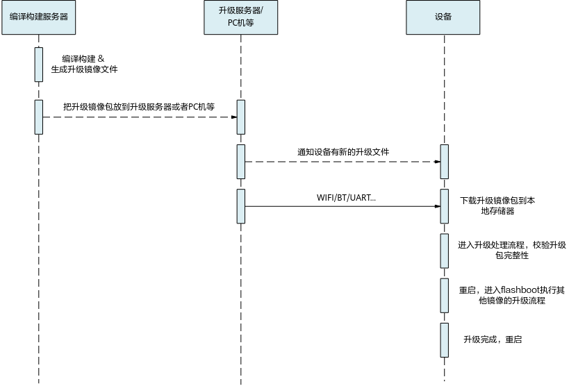

## 开发接口<a name="ZH-CN_TOPIC_0000001779048481"></a>

根据所在的程序的不同，升级接口可分为两部分。

-   升级包存储，由APP程序执行。
    -   初始化接口。
    -   升级包写入本地存储器和从本地存储器读取的接口。
    -   申请开始进行本地升级接口。

-   升级包本地升级，分两部分执行，执行流程是一致的，NV镜像的升级由APP程序完成，其他镜像的升级在flashboot程序中完成。
    -   初始化接口。
    -   升级包校验接口。
    -   升级进度通知函数注册接口。
    -   开始执行本地升级接口。
    -   获取升级结果接口。

升级模块提供的接口如[表1](#table1585372681620)和[表2](#table1660824542212)所示。参见头文件：include\\middleware\\utils\\upg.h。接口参数及返回值说明如[表3](#table543918111242)所示。

**表 1**  升级接口（升级包存储部分）描述

<a name="table1585372681620"></a>
<table><thead align="left"><tr id="row385412616166"><th class="cellrowborder" valign="top" width="37.74%" id="mcps1.2.3.1.1"><p id="p373695616166"><a name="p373695616166"></a><a name="p373695616166"></a>接口名称</p>
</th>
<th class="cellrowborder" valign="top" width="62.260000000000005%" id="mcps1.2.3.1.2"><p id="p15736756151620"><a name="p15736756151620"></a><a name="p15736756151620"></a>描述</p>
</th>
</tr>
</thead>
<tbody><tr id="row1486763081710"><td class="cellrowborder" valign="top" width="37.74%" headers="mcps1.2.3.1.1 "><p id="p18867133051718"><a name="p18867133051718"></a><a name="p18867133051718"></a>uapi_upg_init</p>
</td>
<td class="cellrowborder" valign="top" width="62.260000000000005%" headers="mcps1.2.3.1.2 "><p id="p1486713307174"><a name="p1486713307174"></a><a name="p1486713307174"></a>升级模块初始化。</p>
</td>
</tr>
<tr id="row11854122671616"><td class="cellrowborder" valign="top" width="37.74%" headers="mcps1.2.3.1.1 "><p id="p126138161710"><a name="p126138161710"></a><a name="p126138161710"></a>uapi_upg_prepare</p>
</td>
<td class="cellrowborder" valign="top" width="62.260000000000005%" headers="mcps1.2.3.1.2 "><p id="p19611380177"><a name="p19611380177"></a><a name="p19611380177"></a>保存升级包到本地存储器前的准备工作。</p>
</td>
</tr>
<tr id="row685452616161"><td class="cellrowborder" valign="top" width="37.74%" headers="mcps1.2.3.1.1 "><p id="p16616811719"><a name="p16616811719"></a><a name="p16616811719"></a>uapi_upg_write_package_async/uapi_upg_write_package_sync</p>
</td>
<td class="cellrowborder" valign="top" width="62.260000000000005%" headers="mcps1.2.3.1.2 "><p id="p3611486173"><a name="p3611486173"></a><a name="p3611486173"></a>将升级包数据写入本地存储器。（异步方式/同步方式）</p>
</td>
</tr>
<tr id="row98547262169"><td class="cellrowborder" valign="top" width="37.74%" headers="mcps1.2.3.1.1 "><p id="p259718589312"><a name="p259718589312"></a><a name="p259718589312"></a>uapi_upg_read_package</p>
</td>
<td class="cellrowborder" valign="top" width="62.260000000000005%" headers="mcps1.2.3.1.2 "><p id="p5615811714"><a name="p5615811714"></a><a name="p5615811714"></a>从本地存储器读取升级包数据。</p>
</td>
</tr>
<tr id="row177421859153715"><td class="cellrowborder" valign="top" width="37.74%" headers="mcps1.2.3.1.1 "><p id="p107431159183718"><a name="p107431159183718"></a><a name="p107431159183718"></a>uapi_upg_request_upgrade</p>
</td>
<td class="cellrowborder" valign="top" width="62.260000000000005%" headers="mcps1.2.3.1.2 "><p id="p57432059133712"><a name="p57432059133712"></a><a name="p57432059133712"></a>申请开始进行本地升级，所有升级包数据全部保存完成后，调用此接口。</p>
</td>
</tr>
<tr id="row3828154123820"><td class="cellrowborder" valign="top" width="37.74%" headers="mcps1.2.3.1.1 "><p id="p1066210362417"><a name="p1066210362417"></a><a name="p1066210362417"></a>uapi_upg_get_storage_size</p>
</td>
<td class="cellrowborder" valign="top" width="62.260000000000005%" headers="mcps1.2.3.1.2 "><p id="p1182824143810"><a name="p1182824143810"></a><a name="p1182824143810"></a>获取可存放升级包的空间大小。</p>
</td>
</tr>
</tbody>
</table>

**表 2**  升级接口（本地升级部分）描述

<a name="table1660824542212"></a>
<table><thead align="left"><tr id="row1860864518228"><th class="cellrowborder" valign="top" width="37.74%" id="mcps1.2.3.1.1"><p id="p1060916458228"><a name="p1060916458228"></a><a name="p1060916458228"></a>接口名称</p>
</th>
<th class="cellrowborder" valign="top" width="62.260000000000005%" id="mcps1.2.3.1.2"><p id="p13609184532213"><a name="p13609184532213"></a><a name="p13609184532213"></a>描述</p>
</th>
</tr>
</thead>
<tbody><tr id="row560934513229"><td class="cellrowborder" valign="top" width="37.74%" headers="mcps1.2.3.1.1 "><p id="p960934513228"><a name="p960934513228"></a><a name="p960934513228"></a>uapi_upg_init</p>
</td>
<td class="cellrowborder" valign="top" width="62.260000000000005%" headers="mcps1.2.3.1.2 "><p id="p176091045102215"><a name="p176091045102215"></a><a name="p176091045102215"></a>升级模块初始化。</p>
</td>
</tr>
<tr id="row35427913505"><td class="cellrowborder" valign="top" width="37.74%" headers="mcps1.2.3.1.1 "><p id="p5856111017502"><a name="p5856111017502"></a><a name="p5856111017502"></a>uapi_upg_register_progress_callback</p>
</td>
<td class="cellrowborder" valign="top" width="62.260000000000005%" headers="mcps1.2.3.1.2 "><p id="p7856161015507"><a name="p7856161015507"></a><a name="p7856161015507"></a>注册升级进度通知回调函数，注册后，在本地升级过程中会调用回调函数通知当前进度。</p>
</td>
</tr>
<tr id="row19609154562210"><td class="cellrowborder" valign="top" width="37.74%" headers="mcps1.2.3.1.1 "><p id="p5609745202212"><a name="p5609745202212"></a><a name="p5609745202212"></a>uapi_upg_start</p>
</td>
<td class="cellrowborder" valign="top" width="62.260000000000005%" headers="mcps1.2.3.1.2 "><p id="p20609245172211"><a name="p20609245172211"></a><a name="p20609245172211"></a>开始本地升级。</p>
</td>
</tr>
<tr id="row1612214129385"><td class="cellrowborder" valign="top" width="37.74%" headers="mcps1.2.3.1.1 "><p id="p9861102283820"><a name="p9861102283820"></a><a name="p9861102283820"></a>uapi_upg_get_result</p>
</td>
<td class="cellrowborder" valign="top" width="62.260000000000005%" headers="mcps1.2.3.1.2 "><p id="p386142213387"><a name="p386142213387"></a><a name="p386142213387"></a>获取升级结果。</p>
</td>
</tr>
<tr id="row1260944511226"><td class="cellrowborder" valign="top" width="37.74%" headers="mcps1.2.3.1.1 "><p id="p1821544917386"><a name="p1821544917386"></a><a name="p1821544917386"></a>uapi_upg_verify_file_head</p>
</td>
<td class="cellrowborder" valign="top" width="62.260000000000005%" headers="mcps1.2.3.1.2 "><p id="p122151749113812"><a name="p122151749113812"></a><a name="p122151749113812"></a>校验升级包头结构。</p>
</td>
</tr>
<tr id="row126175548388"><td class="cellrowborder" valign="top" width="37.74%" headers="mcps1.2.3.1.1 "><p id="p1355184103910"><a name="p1355184103910"></a><a name="p1355184103910"></a>uapi_upg_verify_file_image</p>
</td>
<td class="cellrowborder" valign="top" width="62.260000000000005%" headers="mcps1.2.3.1.2 "><p id="p1355154163918"><a name="p1355154163918"></a><a name="p1355154163918"></a>校验升级包中的升级镜像。</p>
</td>
</tr>
<tr id="row18734135723817"><td class="cellrowborder" valign="top" width="37.74%" headers="mcps1.2.3.1.1 "><p id="p18827963914"><a name="p18827963914"></a><a name="p18827963914"></a>uapi_upg_verify_file</p>
</td>
<td class="cellrowborder" valign="top" width="62.260000000000005%" headers="mcps1.2.3.1.2 "><p id="p10821694394"><a name="p10821694394"></a><a name="p10821694394"></a>校验整个升级包。</p>
</td>
</tr>
<tr id="row43871712163916"><td class="cellrowborder" valign="top" width="37.74%" headers="mcps1.2.3.1.1 "><p id="p9285101916398"><a name="p9285101916398"></a><a name="p9285101916398"></a>uapi_upg_register_user_defined_verify_func</p>
</td>
<td class="cellrowborder" valign="top" width="62.260000000000005%" headers="mcps1.2.3.1.2 "><p id="p152851419163917"><a name="p152851419163917"></a><a name="p152851419163917"></a>注册用户自定义字段的校验函数。</p>
<p id="p32851119103910"><a name="p32851119103910"></a><a name="p32851119103910"></a>升级包结构中预留了48Byte用于用户自定义数据的校验。注册自定义校验函数后，被注册的函数会在调用uapi_upg_verify_file_head和uapi_upg_verify_file函数时被调用到。如果自定义数据校验失败uapi_upg_verify_file_head和uapi_upg_verify_file会返回失败。</p>
</td>
</tr>
</tbody>
</table>

**表 3**  升级接口入参及返回值描述

<a name="table543918111242"></a>
<table><thead align="left"><tr id="row64392119417"><th class="cellrowborder" valign="top" width="50%" id="mcps1.2.3.1.1"><p id="p1343919111645"><a name="p1343919111645"></a><a name="p1343919111645"></a>接口原型</p>
</th>
<th class="cellrowborder" valign="top" width="50%" id="mcps1.2.3.1.2"><p id="p174391011448"><a name="p174391011448"></a><a name="p174391011448"></a>参数及返回值说明</p>
</th>
</tr>
</thead>
<tbody><tr id="row19439131110414"><td class="cellrowborder" valign="top" width="50%" headers="mcps1.2.3.1.1 "><p id="p1969441615612"><a name="p1969441615612"></a><a name="p1969441615612"></a>errcode_t uapi_upg_init(const upg_func_t *func_list)</p>
</td>
<td class="cellrowborder" valign="top" width="50%" headers="mcps1.2.3.1.2 "><a name="ul1384395376"></a><a name="ul1384395376"></a><ul id="ul1384395376"><li>入参说明：<p id="p743931115420"><a name="p743931115420"></a><a name="p743931115420"></a>func_list：注册回调列表，upg_func_t类型。</p>
</li></ul>
<a name="ul368214575374"></a><a name="ul368214575374"></a><ul id="ul368214575374"><li>返回值：<a name="ul13561878384"></a><a name="ul13561878384"></a><ul id="ul13561878384"><li>ERRCODE_SUCC：成功。</li><li>其他：失败。</li></ul>
</li></ul>
</td>
</tr>
<tr id="row174394111548"><td class="cellrowborder" valign="top" width="50%" headers="mcps1.2.3.1.1 "><p id="p172791358273"><a name="p172791358273"></a><a name="p172791358273"></a>errcode_t uapi_upg_start(void)</p>
</td>
<td class="cellrowborder" valign="top" width="50%" headers="mcps1.2.3.1.2 "><a name="ul1417191953814"></a><a name="ul1417191953814"></a><ul id="ul1417191953814"><li>入参说明：无。</li><li>返回值：<a name="ul4292432183815"></a><a name="ul4292432183815"></a><ul id="ul4292432183815"><li>ERRCODE_SUCC：成功。</li><li>其他：失败。</li></ul>
</li></ul>
</td>
</tr>
<tr id="row1943941111416"><td class="cellrowborder" valign="top" width="50%" headers="mcps1.2.3.1.1 "><p id="p7912209817"><a name="p7912209817"></a><a name="p7912209817"></a>errcode_t uapi_upg_register_progress_callback(uapi_upg_progress_cb func)</p>
</td>
<td class="cellrowborder" valign="top" width="50%" headers="mcps1.2.3.1.2 "><a name="ul18751138203816"></a><a name="ul18751138203816"></a><ul id="ul18751138203816"><li>入参说明：<p id="p874642615811"><a name="p874642615811"></a><a name="p874642615811"></a>func：回调函数，该函数需业务实现。</p>
</li><li>返回值：<a name="ul1534612502382"></a><a name="ul1534612502382"></a><ul id="ul1534612502382"><li>ERRCODE_SUCC：成功。</li><li>其他：失败。</li></ul>
</li></ul>
</td>
</tr>
<tr id="row443915117411"><td class="cellrowborder" valign="top" width="50%" headers="mcps1.2.3.1.1 "><p id="p413413720912"><a name="p413413720912"></a><a name="p413413720912"></a>errcode_t uapi_upg_get_result(upg_result_t *result, uint32_t *last_image_index)</p>
</td>
<td class="cellrowborder" valign="top" width="50%" headers="mcps1.2.3.1.2 "><a name="ul5512203183912"></a><a name="ul5512203183912"></a><ul id="ul5512203183912"><li>入参说明：<a name="ul1285514154399"></a><a name="ul1285514154399"></a><ul id="ul1285514154399"><li>result：出参，保存升级结果的内存地址，类型upg_result_t。</li><li>last_image_index：出参，保存最后一个处理的镜像的索引。</li></ul>
</li><li>返回值：<a name="ul93412817391"></a><a name="ul93412817391"></a><ul id="ul93412817391"><li>ERRCODE_SUCC：成功。</li><li>其他：失败。</li></ul>
</li></ul>
</td>
</tr>
<tr id="row17439131117411"><td class="cellrowborder" valign="top" width="50%" headers="mcps1.2.3.1.1 "><p id="p115282109111"><a name="p115282109111"></a><a name="p115282109111"></a>errcode_t uapi_upg_prepare(upg_prepare_info_t *prepare_info)</p>
</td>
<td class="cellrowborder" valign="top" width="50%" headers="mcps1.2.3.1.2 "><a name="ul28461128173912"></a><a name="ul28461128173912"></a><ul id="ul28461128173912"><li>入参说明：<p id="p182641143164"><a name="p182641143164"></a><a name="p182641143164"></a>prepare_info：入参，upg_prepare_info_t*类型，准备信息的指针。</p>
</li><li>返回值：<a name="ul101051345399"></a><a name="ul101051345399"></a><ul id="ul101051345399"><li>ERRCODE_SUCC：成功。</li><li>其他：失败。</li></ul>
</li></ul>
</td>
</tr>
<tr id="row1972014489105"><td class="cellrowborder" valign="top" width="50%" headers="mcps1.2.3.1.1 "><p id="p59591437498"><a name="p59591437498"></a><a name="p59591437498"></a>errcode_t uapi_upg_write_package_async(uint32_t offset, const uint8_t *buff, uint16_t len, uapi_upg_write_done_cb callback)</p>
</td>
<td class="cellrowborder" valign="top" width="50%" headers="mcps1.2.3.1.2 "><a name="ul13324126134011"></a><a name="ul13324126134011"></a><ul id="ul13324126134011"><li>入参说明：<a name="ul6565151412407"></a><a name="ul6565151412407"></a><ul id="ul6565151412407"><li>offset：入参，uint32_t类型，相对升级包开头的偏移。</li><li>buff：入参，const uint8_t *类型，存放升级包数据的buffer。</li><li>len：入参，uint16_t类型，升级包数据buffer的长度。</li><li>callback：入参，uapi_upg_write_done_cb类型，写入完成的回调函数。</li></ul>
</li><li>返回值：<a name="ul135574198410"></a><a name="ul135574198410"></a><ul id="ul135574198410"><li>ERRCODE_SUCC：成功。</li><li>其他：失败。</li></ul>
</li></ul>
</td>
</tr>
<tr id="row18571245918"><td class="cellrowborder" valign="top" width="50%" headers="mcps1.2.3.1.1 "><p id="p96711599112"><a name="p96711599112"></a><a name="p96711599112"></a>errcode_t uapi_upg_write_package_sync(uint32_t offset, const uint8_t *buff, uint16_t len)</p>
</td>
<td class="cellrowborder" valign="top" width="50%" headers="mcps1.2.3.1.2 "><a name="ul6730191311914"></a><a name="ul6730191311914"></a><ul id="ul6730191311914"><li>入参说明：<a name="ul1730513290"></a><a name="ul1730513290"></a><ul id="ul1730513290"><li>offset：入参，uint32_t类型，相对升级包开头的偏移。</li><li>buff：入参，const uint8_t *类型，存放升级包数据的buffer。</li><li>len：入参，uint16_t类型，升级包数据buffer的长度。</li></ul>
</li><li>返回值：<a name="ul13731513999"></a><a name="ul13731513999"></a><ul id="ul13731513999"><li>ERRCODE_SUCC：成功。</li><li>其他：失败。</li></ul>
</li></ul>
</td>
</tr>
<tr id="row16820205217100"><td class="cellrowborder" valign="top" width="50%" headers="mcps1.2.3.1.1 "><p id="p1415605316124"><a name="p1415605316124"></a><a name="p1415605316124"></a>errcode_t uapi_upg_read_package(uint32_t offset, uint8_t *buff, uint32_t len)</p>
</td>
<td class="cellrowborder" valign="top" width="50%" headers="mcps1.2.3.1.2 "><a name="ul942818368418"></a><a name="ul942818368418"></a><ul id="ul942818368418"><li>入参说明：<a name="ul540820427411"></a><a name="ul540820427411"></a><ul id="ul540820427411"><li>offset：入参，uint32_t类型，相对升级包开头的偏移。</li><li>buff：出参，uint8_t *类型，存放升级包数据的buffer。</li><li>len：入参，uint32_t类型，读取数据buffer的长度。</li></ul>
</li><li>返回值：<a name="ul92624479419"></a><a name="ul92624479419"></a><ul id="ul92624479419"><li>ERRCODE_SUCC：成功。</li><li>其他：失败。</li></ul>
</li></ul>
</td>
</tr>
<tr id="row9731115618106"><td class="cellrowborder" valign="top" width="50%" headers="mcps1.2.3.1.1 "><p id="p1642912184138"><a name="p1642912184138"></a><a name="p1642912184138"></a>uint32_t uapi_upg_get_storage_size(void)</p>
</td>
<td class="cellrowborder" valign="top" width="50%" headers="mcps1.2.3.1.2 "><a name="ul11468249184212"></a><a name="ul11468249184212"></a><ul id="ul11468249184212"><li>入参说明：无。</li><li>返回值：<a name="ul1471417015437"></a><a name="ul1471417015437"></a><ul id="ul1471417015437"><li>0：失败返回0。</li><li>其他：成功返回空间大小。</li></ul>
</li></ul>
</td>
</tr>
<tr id="row99221759121014"><td class="cellrowborder" valign="top" width="50%" headers="mcps1.2.3.1.1 "><p id="p17782242205"><a name="p17782242205"></a><a name="p17782242205"></a>errcode_t uapi_upg_request_upgrade(bool reset)</p>
</td>
<td class="cellrowborder" valign="top" width="50%" headers="mcps1.2.3.1.2 "><a name="ul93401214124320"></a><a name="ul93401214124320"></a><ul id="ul93401214124320"><li>入参说明：<p id="p12873129121711"><a name="p12873129121711"></a><a name="p12873129121711"></a>reset：入参，bool类型，申请流程结束后是否重启系统。</p>
</li><li>返回值：<a name="ul112601188436"></a><a name="ul112601188436"></a><ul id="ul112601188436"><li>ERRCODE_SUCC：成功。</li><li>其他：失败。</li></ul>
</li></ul>
</td>
</tr>
<tr id="row1168225117190"><td class="cellrowborder" valign="top" width="50%" headers="mcps1.2.3.1.1 "><p id="p17933151517497"><a name="p17933151517497"></a><a name="p17933151517497"></a>errcode_t uapi_upg_verify_file_head(const upg_package_header_t *pkg_header)</p>
</td>
<td class="cellrowborder" valign="top" width="50%" headers="mcps1.2.3.1.2 "><a name="ul172091039114315"></a><a name="ul172091039114315"></a><ul id="ul172091039114315"><li>入参说明：<p id="p577525916436"><a name="p577525916436"></a><a name="p577525916436"></a>pkg_header：入参，upg_package_header_t *类型，指向升级包头结构的指针。</p>
</li><li>返回值：<a name="ul106384575434"></a><a name="ul106384575434"></a><ul id="ul106384575434"><li>ERRCODE_SUCC：成功。</li><li>其他：失败。</li></ul>
</li></ul>
</td>
</tr>
<tr id="row16741055171920"><td class="cellrowborder" valign="top" width="50%" headers="mcps1.2.3.1.1 "><p id="p15451248507"><a name="p15451248507"></a><a name="p15451248507"></a>errcode_t uapi_upg_verify_file_image(const upg_image_header_t *img_header, const uint8_t *hash, uint32_t hash_len, bool verify_old)</p>
</td>
<td class="cellrowborder" valign="top" width="50%" headers="mcps1.2.3.1.2 "><a name="ul083121716446"></a><a name="ul083121716446"></a><ul id="ul083121716446"><li>入参说明：<a name="ul195551433164420"></a><a name="ul195551433164420"></a><ul id="ul195551433164420"><li>img_header：入参，upg_image_header_t*类型，指向升级包中升级镜像头结构的指针。</li><li>hash：入参，uint8_t*类型，升级镜像的HASH值。</li><li>hash_len：入参，uint32_t类型，HASH的长度（单位：Byte）。</li><li>verify_old：入参，bool类型，是否校验旧镜像。</li></ul>
</li><li>返回值：<a name="ul1095818223448"></a><a name="ul1095818223448"></a><ul id="ul1095818223448"><li>ERRCODE_SUCC：成功。</li><li>其他：失败。</li></ul>
</li></ul>
</td>
</tr>
<tr id="row1456615911192"><td class="cellrowborder" valign="top" width="50%" headers="mcps1.2.3.1.1 "><p id="p194291932165215"><a name="p194291932165215"></a><a name="p194291932165215"></a>errcode_t uapi_upg_verify_file(const upg_package_header_t *pkg_header)</p>
</td>
<td class="cellrowborder" valign="top" width="50%" headers="mcps1.2.3.1.2 "><a name="ul7532122417456"></a><a name="ul7532122417456"></a><ul id="ul7532122417456"><li>入参说明：<p id="p492743714514"><a name="p492743714514"></a><a name="p492743714514"></a>pkg_header：入参，upg_package_header_t *类型，指向升级包头结构的指针。</p>
</li><li>返回值：<a name="ul668363524515"></a><a name="ul668363524515"></a><ul id="ul668363524515"><li>ERRCODE_SUCC：成功。</li><li>其他：失败。</li></ul>
</li></ul>
</td>
</tr>
<tr id="row1521203202011"><td class="cellrowborder" valign="top" width="50%" headers="mcps1.2.3.1.1 "><p id="p44763015318"><a name="p44763015318"></a><a name="p44763015318"></a>void uapi_upg_register_user_defined_verify_func(uapi_upg_user_defined_check func, uintptr_t param)</p>
</td>
<td class="cellrowborder" valign="top" width="50%" headers="mcps1.2.3.1.2 "><a name="ul643116487459"></a><a name="ul643116487459"></a><ul id="ul643116487459"><li>入参说明：<a name="ul123651753194513"></a><a name="ul123651753194513"></a><ul id="ul123651753194513"><li>func：入参，upg_package_header_t *类型，用于校验用户自定义字段的校验函数。</li><li>param：入参，uintptr_t类型，注册参数。</li></ul>
</li><li>返回值：无。</li></ul>
</td>
</tr>
</tbody>
</table>

# 升级包制作<a name="ZH-CN_TOPIC_0000001779168189"></a>


## 流程原理<a name="ZH-CN_TOPIC_0000001732129026"></a>

**图 1**  升级包制作流程<a name="fig11220102921310"></a>  
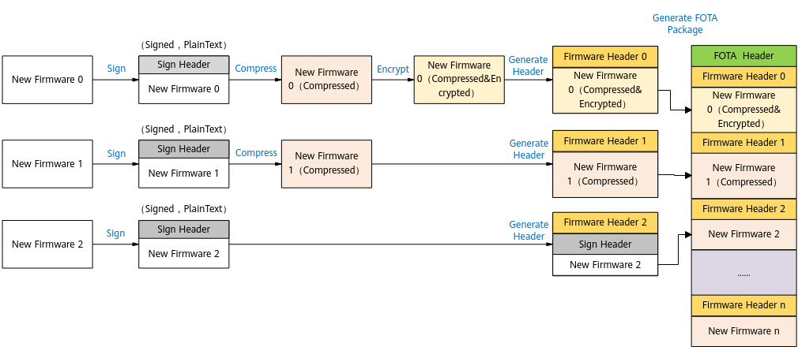

升级包的制作流程示意图如[图1](#fig11220102921310)所示，具体操作步骤如下：

1.  <a name="li8171529465"></a>编译生成带签名的明文新镜像。编译生成镜像请参考《WS63V100 SDK开发环境搭建》“编译SDK\(Cmake\)-编译方法”章节。
2.  <a name="li205945352468"></a>对新镜像进行处理。处理方式包含场景如下：
    -   将新镜像压缩并加密，生成加密的压缩新镜像。
    -   将新镜像压缩不加密，生成压缩的新镜像。
    -   新镜像不做处理。

3.  <a name="li25431424820"></a>对[步骤2](#li205945352468)中生成的镜像添加升级镜像头。
4.  对所有需要升级的镜像根据所选择的不同处理方式执行[步骤1](#li8171529465)～[步骤3](#li25431424820)。
5.  将生成的所有带升级镜像头的升级镜像文件合并到最终升级包中，并对整包添加升级包头，进行数字签名。

> **说明：** 
>[2](#li205945352468)中的场景，需根据实际情况做选择。如WS63不支持镜像加密，所有需要加密的场景则不能选择。

## 开发流程<a name="ZH-CN_TOPIC_0000001779048485"></a>

提供基于Windows/Linux系统下的Python入口编译能力，升级包可以在所有镜像编译完成后，通过执行“build/config/target\_config/ws63/build\_ws63\_update.py”来制作，脚本及配置文件说明如下：

-   在“build\_ws63\_update.py”文件中配置各个镜像的路径以及其他脚本所需的参数，并调用升级包制作脚本“build\_upg\_pkg.py”，如下所示。“build\_ws63\_update.py”中配置的各个路径可以根据实际路径修改。

    “build\_ws63\_update.py”调用“build\_upg\_pkg.py”代码示例如下：

    ```
    import os
    import sys
    import argparse
    file_dir = os.path.dirname(os.path.realpath(__file__))
    g_root = os.path.realpath(os.path.join(file_dir, "..", "..", "..", ".."))
    sys.path.append(os.path.join(g_root, 'build', 'script'))
    from build_upg_pkg import begin
    class upg_base_info:
        def __init__(self):
            self.root_path = g_root
            # 升级包结构配置文件
            self.fota_format_path = os.path.join(self.root_path, "build", "config", "target_config", "ws63", "fota")
            # 产品升级配置文件
            self.fota_cfg = os.path.join(self.root_path, "build", "config", "target_config", "ws63", "fota", "fota.cfg")
            # 产品镜像输出路径
            self.output = os.path.join(self.root_path, "output", "ws63")
            # 产品升级镜像包输出路径
            self.upg_output = os.path.join(self.output, "upgrade")
            # 产品升级制作临时文件输出路径
            self.temp_dir = os.path.join(self.upg_output, "temp_dir")
            # 产品镜像路径
            self.flashboot = os.path.join(self.output, "acore", "ws63-flashboot", "flashboot_sign.bin")
            self.app_bin = os.path.join(self.output, "acore", "ws63-liteos-app", "ws63-liteos-app-sign.bin")
            self.nv_bin = os.path.join(self.output, "acore", "nv_bin", "ws63_all_nv.bin")
    
            self.flashboot_old_bin = os.path.join(self.output, "acore", "old_version", "flashboot_sign.bin")
            self.app_old_bin = os.path.join(self.output, "acore", "old_version", "ws63-liteos-app-sign.bin")
            self.nv_old_bin = os.path.join(self.output, "acore", "old_version", "ws63_all_nv.bin")
    def get_new_image(input,info):
        image_list = []
        if 'app' in input:
            image_list.append("=".join([info.app_bin, "application"]))
            print(1)
        if 'boot' in input:
            image_list.append("=".join([info.flashboot, "flashboot"]))
            print(2)
        if 'nv' in input:
            image_list.append("=".join([info.nv_bin, "nv"]))
            print(3)
        new_image = "|".join(image_list)
        return new_image
    def get_old_image(input,info):
        image_list = []
        if 'app' in input:
            image_list.append("=".join([info.app_old_bin, "application"]))
            print(11)
        if 'boot' in input:
            image_list.append("=".join([info.flashboot_old_bin, "flashboot"]))
            print(22)
        if 'nv' in input:
            image_list.append("=".join([info.nv_old_bin, "nv"]))
            print(33)
        old_image = "|".join(image_list)
        return old_image
    def get_parameters():
        parser = argparse.ArgumentParser()
        parser.add_argument('--pkt', type=str, default = 'app',
                            help='需要生成的镜像,包括: app,boot,nv')
        config = parser.parse_args()
        return config
    if __name__ == '__main__':
        info = upg_base_info()
        conf = get_parameters()
        input = conf.pkt.split(",")
        conf.app_name        = "update"
        conf.upg_format_path = info.fota_format_path
        conf.base            = info.fota_cfg
        conf.temp_dir        = info.temp_dir
        conf.new_images      = get_new_image(input,info)
        conf.old_images      = get_old_image(input,info)
        conf.output_dir      = info.upg_output
        conf.type            = 0
        begin(conf)
    ```

-   升级包制作脚本为：build/script/build\_upg\_pkg.py。
-   配置文件为：build/config/target\_config/ws63/fota/fota.cfg，配置文件的各个字段说明如[表1](#table4436131111208)所示。
-   配置文件“fota.cfg”中涉及到镜像ID，请参考[表2](#table269616496176)，表中的ID均为特殊的魔术字。
-   配置文件“fota.cfg”中可配置升级校验方式，。
-   安全校验使用ECC256\_SHA256密钥算法，密钥文件使用openssl工具（[https://www.openssl.org](https://www.openssl.org)）进行生成，执行命令为：openssl ecparam -genkey -name brainpoolP256r1 -out "ec\_bp256\_key.pem"

**表 1**  fota.cfg主要内容说明

<a name="table4436131111208"></a>
<table><thead align="left"><tr id="row94334119200"><th class="cellrowborder" valign="top" width="23.352335233523352%" id="mcps1.2.4.1.1"><p id="p443331110204"><a name="p443331110204"></a><a name="p443331110204"></a>标签</p>
</th>
<th class="cellrowborder" valign="top" width="25.16251625162516%" id="mcps1.2.4.1.2"><p id="p174331411162013"><a name="p174331411162013"></a><a name="p174331411162013"></a>属性</p>
</th>
<th class="cellrowborder" valign="top" width="51.48514851485149%" id="mcps1.2.4.1.3"><p id="p943314117205"><a name="p943314117205"></a><a name="p943314117205"></a>说明</p>
</th>
</tr>
</thead>
<tbody><tr id="row34331511142017"><td class="cellrowborder" rowspan="6" valign="top" width="23.352335233523352%" headers="mcps1.2.4.1.1 "><p id="p1433111117204"><a name="p1433111117204"></a><a name="p1433111117204"></a>[SIGN_CFG]</p>
</td>
<td class="cellrowborder" valign="top" width="25.16251625162516%" headers="mcps1.2.4.1.2 "><p id="p1843331112202"><a name="p1843331112202"></a><a name="p1843331112202"></a>-</p>
</td>
<td class="cellrowborder" valign="top" width="51.48514851485149%" headers="mcps1.2.4.1.3 "><p id="p643321111203"><a name="p643321111203"></a><a name="p643321111203"></a>签名相关属性。</p>
</td>
</tr>
<tr id="row134341115204"><td class="cellrowborder" valign="top" headers="mcps1.2.4.1.1 "><p id="p2433811102017"><a name="p2433811102017"></a><a name="p2433811102017"></a>SignSuite</p>
</td>
<td class="cellrowborder" valign="top" headers="mcps1.2.4.1.2 "><p id="p043361152015"><a name="p043361152015"></a><a name="p043361152015"></a>签名密钥类型。</p>
<a name="ul1072114011138"></a><a name="ul1072114011138"></a><ul id="ul1072114011138"><li>1：SHA256(RSA_4096)</li></ul>
</td>
</tr>
<tr id="row1843412110201"><td class="cellrowborder" valign="top" headers="mcps1.2.4.1.1 "><p id="p1394516578212"><a name="p1394516578212"></a><a name="p1394516578212"></a>UpgImagePath</p>
</td>
<td class="cellrowborder" valign="top" headers="mcps1.2.4.1.2 "><p id="p19434181117209"><a name="p19434181117209"></a><a name="p19434181117209"></a>升级包文件路径和名称。</p>
</td>
</tr>
<tr id="row843491119204"><td class="cellrowborder" valign="top" headers="mcps1.2.4.1.1 "><p id="p1255613792220"><a name="p1255613792220"></a><a name="p1255613792220"></a>UpgSignedImagePath</p>
</td>
<td class="cellrowborder" valign="top" headers="mcps1.2.4.1.2 "><p id="p5434141192011"><a name="p5434141192011"></a><a name="p5434141192011"></a>升级包签名后的路径和名称。</p>
</td>
</tr>
<tr id="row17434181132012"><td class="cellrowborder" valign="top" headers="mcps1.2.4.1.1 "><p id="p15434121192020"><a name="p15434121192020"></a><a name="p15434121192020"></a>RootKeyFile</p>
</td>
<td class="cellrowborder" valign="top" headers="mcps1.2.4.1.2 "><p id="p1843415116207"><a name="p1843415116207"></a><a name="p1843415116207"></a>根密钥文件路径。</p>
</td>
</tr>
<tr id="row6434611112013"><td class="cellrowborder" valign="top" headers="mcps1.2.4.1.1 "><p id="p843415117201"><a name="p843415117201"></a><a name="p843415117201"></a>SubKeyFile</p>
</td>
<td class="cellrowborder" valign="top" headers="mcps1.2.4.1.2 "><p id="p9434151152019"><a name="p9434151152019"></a><a name="p9434151152019"></a>二级秘钥文件路径。</p>
</td>
</tr>
<tr id="row134343117207"><td class="cellrowborder" rowspan="3" valign="top" width="23.352335233523352%" headers="mcps1.2.4.1.1 "><p id="p2434311202014"><a name="p2434311202014"></a><a name="p2434311202014"></a>[TOOLS]</p>
</td>
<td class="cellrowborder" valign="top" width="25.16251625162516%" headers="mcps1.2.4.1.2 "><p id="p164344110200"><a name="p164344110200"></a><a name="p164344110200"></a>-</p>
</td>
<td class="cellrowborder" valign="top" width="51.48514851485149%" headers="mcps1.2.4.1.3 "><p id="p1543471111209"><a name="p1543471111209"></a><a name="p1543471111209"></a>制作工具配置属性。</p>
</td>
</tr>
<tr id="row12434191172013"><td class="cellrowborder" valign="top" headers="mcps1.2.4.1.1 "><p id="p34341911162015"><a name="p34341911162015"></a><a name="p34341911162015"></a>UpgToolPath</p>
</td>
<td class="cellrowborder" valign="top" headers="mcps1.2.4.1.2 "><p id="p4434411132010"><a name="p4434411132010"></a><a name="p4434411132010"></a>升级工具路径和名称（升级工具可用作制作签名文件）。</p>
</td>
</tr>
<tr id="row14344111208"><td class="cellrowborder" valign="top" headers="mcps1.2.4.1.1 "><p id="p343411116201"><a name="p343411116201"></a><a name="p343411116201"></a>LzmaToolPath</p>
</td>
<td class="cellrowborder" valign="top" headers="mcps1.2.4.1.2 "><p id="p343419115205"><a name="p343419115205"></a><a name="p343419115205"></a>压缩工具路径和名称。</p>
</td>
</tr>
<tr id="row243451115201"><td class="cellrowborder" rowspan="7" valign="top" width="23.352335233523352%" headers="mcps1.2.4.1.1 "><p id="p1843451112018"><a name="p1843451112018"></a><a name="p1843451112018"></a>[FOTA_KEY_AREA]</p>
</td>
<td class="cellrowborder" valign="top" width="25.16251625162516%" headers="mcps1.2.4.1.2 "><p id="p1643471110203"><a name="p1643471110203"></a><a name="p1643471110203"></a>-</p>
</td>
<td class="cellrowborder" valign="top" width="51.48514851485149%" headers="mcps1.2.4.1.3 "><p id="p13434911142016"><a name="p13434911142016"></a><a name="p13434911142016"></a>升级包Key区属性。</p>
</td>
</tr>
<tr id="row2434171172018"><td class="cellrowborder" valign="top" headers="mcps1.2.4.1.1 "><p id="p9434201152020"><a name="p9434201152020"></a><a name="p9434201152020"></a>ImageId</p>
</td>
<td class="cellrowborder" valign="top" headers="mcps1.2.4.1.2 "><p id="p114349117208"><a name="p114349117208"></a><a name="p114349117208"></a>升级包Key区镜像ID，固定为0xCB8D154E。</p>
</td>
</tr>
<tr id="row114351411182013"><td class="cellrowborder" valign="top" headers="mcps1.2.4.1.1 "><p id="p124343115208"><a name="p124343115208"></a><a name="p124343115208"></a>KeyAlg</p>
</td>
<td class="cellrowborder" valign="top" headers="mcps1.2.4.1.2 "><p id="p3434511142018"><a name="p3434511142018"></a><a name="p3434511142018"></a>升级包Key区域密钥算法类型。</p>
<a name="ul114351711202019"></a><a name="ul114351711202019"></a><ul id="ul114351711202019"><li>0x2A13C812：ECC256_SHA256</li><li>其他值：非法。</li></ul>
</td>
</tr>
<tr id="row164358115205"><td class="cellrowborder" valign="top" headers="mcps1.2.4.1.1 "><p id="p15435161110203"><a name="p15435161110203"></a><a name="p15435161110203"></a>KeyVersion</p>
</td>
<td class="cellrowborder" valign="top" headers="mcps1.2.4.1.2 "><p id="p164352115201"><a name="p164352115201"></a><a name="p164352115201"></a>升级包Key区版本号。</p>
</td>
</tr>
<tr id="row7435411102015"><td class="cellrowborder" valign="top" headers="mcps1.2.4.1.1 "><p id="p1543511112206"><a name="p1543511112206"></a><a name="p1543511112206"></a>KeyVersionMask</p>
</td>
<td class="cellrowborder" valign="top" headers="mcps1.2.4.1.2 "><p id="p643517110206"><a name="p643517110206"></a><a name="p643517110206"></a>升级包Key区版本号掩码。</p>
</td>
</tr>
<tr id="row14308115819439"><td class="cellrowborder" valign="top" headers="mcps1.2.4.1.1 "><p id="p9308195819435"><a name="p9308195819435"></a><a name="p9308195819435"></a>Msid</p>
</td>
<td class="cellrowborder" valign="top" headers="mcps1.2.4.1.2 "><p id="p230855884314"><a name="p230855884314"></a><a name="p230855884314"></a>市场区域ID。</p>
</td>
</tr>
<tr id="row16820174184419"><td class="cellrowborder" valign="top" headers="mcps1.2.4.1.1 "><p id="p128208404411"><a name="p128208404411"></a><a name="p128208404411"></a>MsidMask</p>
</td>
<td class="cellrowborder" valign="top" headers="mcps1.2.4.1.2 "><p id="p1782017464415"><a name="p1782017464415"></a><a name="p1782017464415"></a>市场区域ID掩码。</p>
</td>
</tr>
<tr id="row243581132019"><td class="cellrowborder" rowspan="5" valign="top" width="23.352335233523352%" headers="mcps1.2.4.1.1 "><p id="p16435131152015"><a name="p16435131152015"></a><a name="p16435131152015"></a>[FOTA_INFO_AREA]</p>
</td>
<td class="cellrowborder" valign="top" width="25.16251625162516%" headers="mcps1.2.4.1.2 "><p id="p13435201152011"><a name="p13435201152011"></a><a name="p13435201152011"></a>-</p>
</td>
<td class="cellrowborder" valign="top" width="51.48514851485149%" headers="mcps1.2.4.1.3 "><p id="p14351113205"><a name="p14351113205"></a><a name="p14351113205"></a>升级包INFO区属性。</p>
</td>
</tr>
<tr id="row14351011192019"><td class="cellrowborder" valign="top" headers="mcps1.2.4.1.1 "><p id="p543561112012"><a name="p543561112012"></a><a name="p543561112012"></a>ImageId</p>
</td>
<td class="cellrowborder" valign="top" headers="mcps1.2.4.1.2 "><p id="p943515113207"><a name="p943515113207"></a><a name="p943515113207"></a>升级包INFO区镜像ID，固定为0xCB8D154E。</p>
</td>
</tr>
<tr id="row184351711192013"><td class="cellrowborder" valign="top" headers="mcps1.2.4.1.1 "><p id="p1443561113205"><a name="p1443561113205"></a><a name="p1443561113205"></a>HardwareID</p>
</td>
<td class="cellrowborder" valign="top" headers="mcps1.2.4.1.2 "><p id="p2435121110206"><a name="p2435121110206"></a><a name="p2435121110206"></a>硬件版本号。</p>
</td>
</tr>
<tr id="row2043515114201"><td class="cellrowborder" valign="top" headers="mcps1.2.4.1.1 "><p id="p104350112209"><a name="p104350112209"></a><a name="p104350112209"></a>Msid</p>
</td>
<td class="cellrowborder" valign="top" headers="mcps1.2.4.1.2 "><p id="p443517114208"><a name="p443517114208"></a><a name="p443517114208"></a>市场区域ID。</p>
</td>
</tr>
<tr id="row184351911192010"><td class="cellrowborder" valign="top" headers="mcps1.2.4.1.1 "><p id="p443571102015"><a name="p443571102015"></a><a name="p443571102015"></a>MsidMask</p>
</td>
<td class="cellrowborder" valign="top" headers="mcps1.2.4.1.2 "><p id="p16435191182017"><a name="p16435191182017"></a><a name="p16435191182017"></a>市场区域ID掩码。</p>
</td>
</tr>
<tr id="row14351411112018"><td class="cellrowborder" rowspan="5" valign="top" width="23.352335233523352%" headers="mcps1.2.4.1.1 "><p id="p144351411172010"><a name="p144351411172010"></a><a name="p144351411172010"></a>[FlashBoot/nv/application]</p>
</td>
<td class="cellrowborder" valign="top" width="25.16251625162516%" headers="mcps1.2.4.1.2 "><p id="p144351119206"><a name="p144351119206"></a><a name="p144351119206"></a>-</p>
</td>
<td class="cellrowborder" valign="top" width="51.48514851485149%" headers="mcps1.2.4.1.3 "><p id="p114351411142020"><a name="p114351411142020"></a><a name="p114351411142020"></a>镜像类型名称。</p>
</td>
</tr>
<tr id="row0435101162016"><td class="cellrowborder" valign="top" headers="mcps1.2.4.1.1 "><p id="p54351211122019"><a name="p54351211122019"></a><a name="p54351211122019"></a>HeaderMagic</p>
</td>
<td class="cellrowborder" valign="top" headers="mcps1.2.4.1.2 "><p id="p743581172016"><a name="p743581172016"></a><a name="p743581172016"></a>头结构魔术字，固定为0x464F5451。</p>
</td>
</tr>
<tr id="row943571182018"><td class="cellrowborder" valign="top" headers="mcps1.2.4.1.1 "><p id="p04351011112012"><a name="p04351011112012"></a><a name="p04351011112012"></a>ImageId</p>
</td>
<td class="cellrowborder" valign="top" headers="mcps1.2.4.1.2 "><p id="p1043517113206"><a name="p1043517113206"></a><a name="p1043517113206"></a>升级镜像ID，与原始镜像的ImageId相同，镜像ID请参考<a href="#table269616496176">表2</a>。</p>
</td>
</tr>
<tr id="row164364117208"><td class="cellrowborder" valign="top" headers="mcps1.2.4.1.1 "><p id="p144351911172015"><a name="p144351911172015"></a><a name="p144351911172015"></a>DecompressFlag</p>
</td>
<td class="cellrowborder" valign="top" headers="mcps1.2.4.1.2 "><p id="p12435151117203"><a name="p12435151117203"></a><a name="p12435151117203"></a>升级镜像模式标记。nv不支持压缩，仅支持全量升级</p>
<a name="ul1436711112015"></a><a name="ul1436711112015"></a><ul id="ul1436711112015"><li>0x3C7896E1：压缩。</li><li>其他：原始镜像不处理。</li></ul>
</td>
</tr>
<tr id="row843651132015"><td class="cellrowborder" valign="top" headers="mcps1.2.4.1.1 "><p id="p1743661119202"><a name="p1743661119202"></a><a name="p1743661119202"></a>ReRncFlag</p>
</td>
<td class="cellrowborder" valign="top" headers="mcps1.2.4.1.2 "><p id="p194361114207"><a name="p194361114207"></a><a name="p194361114207"></a>升级镜像加密标记。仅app镜像支持加密升级</p>
<a name="ul1743611111208"></a><a name="ul1743611111208"></a><ul id="ul1743611111208"><li>0x3C7896E1：加密。</li><li>其他：不加密。</li></ul>
</td>
</tr>
</tbody>
</table>

**表 2**  镜像ID列表

<a name="table269616496176"></a>
<table><thead align="left"><tr id="row68251494179"><th class="cellrowborder" valign="top" width="42.120000000000005%" id="mcps1.2.3.1.1"><p id="p5825849151716"><a name="p5825849151716"></a><a name="p5825849151716"></a>镜像</p>
</th>
<th class="cellrowborder" valign="top" width="57.879999999999995%" id="mcps1.2.3.1.2"><p id="p1382518491175"><a name="p1382518491175"></a><a name="p1382518491175"></a>镜像ID</p>
</th>
</tr>
</thead>
<tbody><tr id="row1382654913178"><td class="cellrowborder" valign="top" width="42.120000000000005%" headers="mcps1.2.3.1.1 "><p id="p3826154912171"><a name="p3826154912171"></a><a name="p3826154912171"></a>FLASHBOOT IMAGE ID</p>
</td>
<td class="cellrowborder" valign="top" width="57.879999999999995%" headers="mcps1.2.3.1.2 "><p id="p3826149121718"><a name="p3826149121718"></a><a name="p3826149121718"></a>0x4B1E3C2D</p>
</td>
</tr>
<tr id="row148265499177"><td class="cellrowborder" valign="top" width="42.120000000000005%" headers="mcps1.2.3.1.1 "><p id="p16826194919172"><a name="p16826194919172"></a><a name="p16826194919172"></a>APPLICATION IMAGE ID</p>
</td>
<td class="cellrowborder" valign="top" width="57.879999999999995%" headers="mcps1.2.3.1.2 "><p id="p8826249171711"><a name="p8826249171711"></a><a name="p8826249171711"></a>0x4B0F2D2D</p>
</td>
</tr>
<tr id="row18522036434"><td class="cellrowborder" valign="top" width="42.120000000000005%" headers="mcps1.2.3.1.1 "><p id="p128526313434"><a name="p128526313434"></a><a name="p128526313434"></a>NV IMAGE ID</p>
</td>
<td class="cellrowborder" valign="top" width="57.879999999999995%" headers="mcps1.2.3.1.2 "><p id="p5852153194310"><a name="p5852153194310"></a><a name="p5852153194310"></a>0xCB9E063C</p>
</td>
</tr>
</tbody>
</table>

## 开发实例<a name="ZH-CN_TOPIC_0000001779168173"></a>

以下提供制作升级包的一个实例，一切操作都是在SDK包中的默认配置上进行修改。

1.  修改配置文件“build/config/target\_config/ws63/fota/fota.cfg”（可选）。
    -   升级方式

        配置选项\[FOTA\_INFO\_AREA\]之后的每一项\[xxx\]都是对应镜像、镜像签名的配置项，根据升级方式选择修改 DecompressFlag参数。

        如：

        -   flashboot的镜像以全量（原镜像不作处理）升级的方式，则\[flashboot\]的DecompressFlag设置为0。
        -   app的镜像签名以压缩升级的方式，则\[application\]的DecompressFlag设置为0x3C7896E1。
        -   nv的镜像的升级方式由NV特性自己完成，对配置方式不感知。
        -   app镜像可以开启加密升级，在开启flash在线解密功能的前提下，配置\[application\]的\[ReRncFlag\]为0x3C7896E1

    -   防回滚号

        若此次升级不希望用户进行回退版本，则可以在升级包中修改对应镜像、镜像签名配置项中的防回滚版本号version\_ext。

        -   防回滚版本号可以单独对某镜像进行设置。
        -   防回滚版本号按照二进制向高位逐个置一的规则进行增加；如：0x0\(0000\) -\> 0x1\(0001\) -\> 0x3\(0011\) -\>0x7\(0111\) -\> 0xF\(1111\) -\>0x1F\(0001 1111\)。

2.  核对并修改升级包生成脚本“build/config/target\_config/ws63/build\_ws63\_update.py”。
    -   核对产品镜像路径。确保要升级的产品镜像路径是正确的，路径不限于脚本中默认填写的路径，可根据实际情况进行修改。

3.  生成升级包文件。

    运行脚本“build/config/target\_config/ws63/build\_ws63\_update.py”生成升级包，本脚本支持在Linux或Windows上运行，请在运行环境安装python3.7级以上版本Python；根据需要，可添加入参 --pkt=<image1\>,<image2\>，不添加入参时，默认入参为app。可添加--ver=<ota\_version\>版本号参数，不添加参数时，默认入参为空\(全0\)。

    -   Windows环境请在cmd窗口SDK根目录下执行以下指令：

        ```
        python build\config\target_config\ws63\build_ws63_update.py
        ```

    -   Linux环境请在SDK根目录下执行以下指令：

        ```
        python3 build/config/target_config/ws63/build_ws63_update.py
        ```

    执行完成后，在默认路径“output/ws63/upgrade”生成升级包“update.fwpkg”。

## 注意事项<a name="ZH-CN_TOPIC_0000001828777804"></a>

若开启flash在线解密功能，编译出来的镜像为密文，则OTA镜像配置也需要配置为加密；

若烧写镜像为非密，则OTA镜像配置也需要配置为非密。sdk默认配置为非密，以压缩升级为例：

**非密配置编译步骤**：

1.  <a name="li48511403819"></a>烧写镜像非密配置编译。
    1.  “build/config/target\_config/ws63/sign\_config/liteos\_app\_bin\_ecc.cfg”配置文件中配置“SignSuite=0”。
    2.  将“Iv=FF000000000000000000000000000000”注释或删除掉。
    3.  执行“./build.py -c ws63-liteos-app”，此时编译APP镜像为非密。将该镜像烧录单单板中。

2.  OTA镜像非密配置打包。
    1.  “build/config/target\_config/ws63/fota/fota.cfg”配置文件中配置\[application\]中的“ReRncFlag=0x0”。
    2.  此时执行“./build\_ws63\_update.py”，将[1](#li48511403819)中编译生成的app镜像打包成OTA升级包为非密升级包。

**加密配置编译步骤：**

1.  烧写镜像加密配置编译。
    1.  “build/config/target\_config/ws63/sign\_config/liteos\_app\_bin\_ecc.cfg”配置文件中配置“SignSuite=1”。
    2.  将Iv值配置为“Iv=FF000000000000000000000000000000”。
    3.  执行“./build.py -c ws63-liteos-app”，此时编译APP镜像为加密镜像；将该加密镜像烧录到单板中。

2.  OTA镜像非密配置打包
    1.  将“build/config/target\_config/ws63/sign\_config/liteos\_app\_bin\_ecc.cfg”配置文件中配置“SignSuite=0”。
    2.  <a name="li13728146399"></a>执行“./build.py -c ws63-liteos-app”编译出带加密Iv、但未加密的APP镜像（由于镜像加密后无法压缩，故此处需要先编译出带Iv但不加密的原始镜像，该镜像仅能用于OTA打包，不支持直接烧录，仅压缩升级需要该配置编译）。
    3.  配置“build/config/target\_config/ws63/fota/fota.cfg”文件中配置\[application\]中的“ReRncFlag=0x3C7896E1”。
    4.  此时执行“./build\_ws63\_update.py 将[步骤2 2.](#li13728146399)中编译生成的app镜像打包成压缩加密OTA升级包。

> **说明：** 
>开启镜像加密功能时，推荐使用数字签名服务器对OTA镜像签名加密，可参考《WS63V100 二次开发网络安全 注意事项》中数字签名服务器章节打包ota镜像

# 升级包传输<a name="ZH-CN_TOPIC_0000001732288166"></a>

升级包的传输，由应用程序实现，可以有多种方式，本文中不做详细描述。

> **说明：** 
>升级包的存放位置可能会需要根据实际情况有所差异，以实际的Flash分区表中FOTA分区的地址为准。

# 升级包保存<a name="ZH-CN_TOPIC_0000001732129022"></a>


## 开发流程<a name="ZH-CN_TOPIC_0000001732129014"></a>

在WS63中，使用文件系统保存升级包，因此升级包是以二进制数据保存在flash中。

保存升级包文件有以下两种典型场景，可以根据升级包传输的实现来选择合适的开发场景。

**传输流程中，传输升级包数据到内存中<a name="section1665212308510"></a>**

1.  调用uapi\_upg\_init初始化升级模块。
2.  调用uapi\_upg\_prepare函数，执行本地存储器的准备工作，包括初始化升级标记等。
3.  应用程序开始接收升级包，调用uapi\_upg\_write\_package\_sync函数，将内存中的分包数据写到flash对应位置。
4.  继续接收下一个分包数据，再次调用uapi\_upg\_write\_package\_sync函数，写入到对应位置。直到所有数据全部写入完成。如果该接口返回错误，则停止升级流程。
5.  调用uapi\_upg\_request\_upgrade，传入重启参数后可以开始升级流程。
6.  第5步中传入参数不包含重启时，需要进行手动重启，进入flashboot自动开始升级流程。

## 注意事项<a name="ZH-CN_TOPIC_0000001779048469"></a>

-   升级包的分包数据必须按照顺序传输和保存，已经保存的分包不能再次传输。例如：第一次传输并保存了0～1023的数据，下一次必须从1024开始，否则uapi\_upg\_write\_package\_sync接口会报错。
-   升级包文件的路径和文件名是固定的，不允许改变。
-   在传输过程中是否有数据的分段校验，由传输过程保证。如果传输过程中数据出现错误而没有校验和重传机制，则只能等到全部保存完成后，在本地升级启动过程中调用uapi\_upg\_verify\_file校验时会失败，导致升级失败。
-   需要在flash上配置对应的分区分别给运行程序和升级包数据，在适配压缩升级时，推荐运行程序的flash分区大小与升级包数据存放区的flash分区大小比例为1：0.7，该比例数据来源于压缩升级中的压缩比
-   当前WS63上flash分区如下图

    <a name="table9544499195"></a>
    <table><thead align="left"><tr id="row8155349111918"><th class="cellrowborder" valign="top" width="6.12%" id="mcps1.1.7.1.1"><p id="p151551249171915"><a name="p151551249171915"></a><a name="p151551249171915"></a>序号</p>
    </th>
    <th class="cellrowborder" valign="top" width="11.86%" id="mcps1.1.7.1.2"><p id="p2155154951914"><a name="p2155154951914"></a><a name="p2155154951914"></a>分区编号</p>
    </th>
    <th class="cellrowborder" valign="top" width="20.49%" id="mcps1.1.7.1.3"><p id="p1215554931919"><a name="p1215554931919"></a><a name="p1215554931919"></a>分区名称</p>
    </th>
    <th class="cellrowborder" valign="top" width="13.05%" id="mcps1.1.7.1.4"><p id="p91552049151915"><a name="p91552049151915"></a><a name="p91552049151915"></a>大小</p>
    </th>
    <th class="cellrowborder" valign="top" width="19.91%" id="mcps1.1.7.1.5"><p id="p1215515495197"><a name="p1215515495197"></a><a name="p1215515495197"></a>地址空间</p>
    </th>
    <th class="cellrowborder" valign="top" width="28.57%" id="mcps1.1.7.1.6"><p id="p14155134910193"><a name="p14155134910193"></a><a name="p14155134910193"></a>备注</p>
    </th>
    </tr>
    </thead>
    <tbody><tr id="row346341217201"><td class="cellrowborder" valign="top" width="6.12%" headers="mcps1.1.7.1.1 "><p id="p22019286205"><a name="p22019286205"></a><a name="p22019286205"></a>1</p>
    </td>
    <td class="cellrowborder" valign="top" width="11.86%" headers="mcps1.1.7.1.2 "><p id="p102019287205"><a name="p102019287205"></a><a name="p102019287205"></a>0x00</p>
    </td>
    <td class="cellrowborder" valign="top" width="20.49%" headers="mcps1.1.7.1.3 "><p id="p152082862013"><a name="p152082862013"></a><a name="p152082862013"></a>ssb</p>
    </td>
    <td class="cellrowborder" valign="top" width="13.05%" headers="mcps1.1.7.1.4 "><p id="p142032842017"><a name="p142032842017"></a><a name="p142032842017"></a>24KB</p>
    </td>
    <td class="cellrowborder" valign="top" width="19.91%" headers="mcps1.1.7.1.5 "><p id="p62082818202"><a name="p62082818202"></a><a name="p62082818202"></a>0x0_2000~0x0_7FFF</p>
    </td>
    <td class="cellrowborder" valign="top" width="28.57%" headers="mcps1.1.7.1.6 "><p id="p02082814204"><a name="p02082814204"></a><a name="p02082814204"></a>安全boot</p>
    </td>
    </tr>
    <tr id="row446131710206"><td class="cellrowborder" valign="top" width="6.12%" headers="mcps1.1.7.1.1 "><p id="p63571543192015"><a name="p63571543192015"></a><a name="p63571543192015"></a>2</p>
    </td>
    <td class="cellrowborder" valign="top" width="11.86%" headers="mcps1.1.7.1.2 "><p id="p19357843102010"><a name="p19357843102010"></a><a name="p19357843102010"></a>0x01</p>
    </td>
    <td class="cellrowborder" valign="top" width="20.49%" headers="mcps1.1.7.1.3 "><p id="p18639163802018"><a name="p18639163802018"></a><a name="p18639163802018"></a>FLASH Boot</p>
    </td>
    <td class="cellrowborder" valign="top" width="13.05%" headers="mcps1.1.7.1.4 "><p id="p463953810209"><a name="p463953810209"></a><a name="p463953810209"></a>64KB</p>
    </td>
    <td class="cellrowborder" valign="top" width="19.91%" headers="mcps1.1.7.1.5 "><p id="p36392387207"><a name="p36392387207"></a><a name="p36392387207"></a>0x2_0000~0x2_FFFF</p>
    </td>
    <td class="cellrowborder" valign="top" width="28.57%" headers="mcps1.1.7.1.6 "><p id="p56393389208"><a name="p56393389208"></a><a name="p56393389208"></a>FlashBoot区，flash烧录需求，起始地址需要4K对齐</p>
    </td>
    </tr>
    <tr id="row1949615209206"><td class="cellrowborder" valign="top" width="6.12%" headers="mcps1.1.7.1.1 "><p id="p53572437204"><a name="p53572437204"></a><a name="p53572437204"></a>3</p>
    </td>
    <td class="cellrowborder" valign="top" width="11.86%" headers="mcps1.1.7.1.2 "><p id="p13357184382015"><a name="p13357184382015"></a><a name="p13357184382015"></a>0x02</p>
    </td>
    <td class="cellrowborder" valign="top" width="20.49%" headers="mcps1.1.7.1.3 "><p id="p46391138182018"><a name="p46391138182018"></a><a name="p46391138182018"></a>FLASH Boot_Backup</p>
    </td>
    <td class="cellrowborder" valign="top" width="13.05%" headers="mcps1.1.7.1.4 "><p id="p863903815208"><a name="p863903815208"></a><a name="p863903815208"></a>64KB</p>
    </td>
    <td class="cellrowborder" valign="top" width="19.91%" headers="mcps1.1.7.1.5 "><p id="p7639838182014"><a name="p7639838182014"></a><a name="p7639838182014"></a>0x1_0000~0x1_FFFF</p>
    </td>
    <td class="cellrowborder" valign="top" width="28.57%" headers="mcps1.1.7.1.6 "><p id="p6639173892018"><a name="p6639173892018"></a><a name="p6639173892018"></a>FlashBoot备份区</p>
    </td>
    </tr>
    <tr id="row81556492196"><td class="cellrowborder" valign="top" width="6.12%" headers="mcps1.1.7.1.1 "><p id="p133572433207"><a name="p133572433207"></a><a name="p133572433207"></a>4</p>
    </td>
    <td class="cellrowborder" valign="top" width="11.86%" headers="mcps1.1.7.1.2 "><p id="p19357943122014"><a name="p19357943122014"></a><a name="p19357943122014"></a>0x03</p>
    </td>
    <td class="cellrowborder" valign="top" width="20.49%" headers="mcps1.1.7.1.3 "><p id="p2015554921911"><a name="p2015554921911"></a><a name="p2015554921911"></a>Root public key</p>
    </td>
    <td class="cellrowborder" valign="top" width="13.05%" headers="mcps1.1.7.1.4 "><p id="p11156144911194"><a name="p11156144911194"></a><a name="p11156144911194"></a>2KB</p>
    </td>
    <td class="cellrowborder" valign="top" width="19.91%" headers="mcps1.1.7.1.5 "><p id="p151562498196"><a name="p151562498196"></a><a name="p151562498196"></a>0x0_0000~0x0_07FF</p>
    </td>
    <td class="cellrowborder" valign="top" width="28.57%" headers="mcps1.1.7.1.6 "><p id="p10156184916199"><a name="p10156184916199"></a><a name="p10156184916199"></a>根公钥，与分区表打包为一个文件，空间需要连续</p>
    </td>
    </tr>
    <tr id="row2156144941913"><td class="cellrowborder" valign="top" width="6.12%" headers="mcps1.1.7.1.1 "><p id="p0358134332010"><a name="p0358134332010"></a><a name="p0358134332010"></a>5</p>
    </td>
    <td class="cellrowborder" valign="top" width="11.86%" headers="mcps1.1.7.1.2 "><p id="p835894352017"><a name="p835894352017"></a><a name="p835894352017"></a>0x08</p>
    </td>
    <td class="cellrowborder" valign="top" width="20.49%" headers="mcps1.1.7.1.3 "><p id="p915694917198"><a name="p915694917198"></a><a name="p915694917198"></a>Customer factory</p>
    </td>
    <td class="cellrowborder" valign="top" width="13.05%" headers="mcps1.1.7.1.4 "><p id="p111561849131911"><a name="p111561849131911"></a><a name="p111561849131911"></a>16KB</p>
    </td>
    <td class="cellrowborder" valign="top" width="19.91%" headers="mcps1.1.7.1.5 "><p id="p315654912199"><a name="p315654912199"></a><a name="p315654912199"></a>0x0_8000~0x0_BFFF</p>
    </td>
    <td class="cellrowborder" valign="top" width="28.57%" headers="mcps1.1.7.1.6 "><p id="p6156164912197"><a name="p6156164912197"></a><a name="p6156164912197"></a>用户工厂区，本分区设计产测时写入，产测结束后，后续app只读，可以用于存放客户规划的比较重要的数据，该分区内容，完全又客户自行管理规划</p>
    </td>
    </tr>
    <tr id="row11561449201918"><td class="cellrowborder" valign="top" width="6.12%" headers="mcps1.1.7.1.1 "><p id="p163581643112011"><a name="p163581643112011"></a><a name="p163581643112011"></a>6</p>
    </td>
    <td class="cellrowborder" valign="top" width="11.86%" headers="mcps1.1.7.1.2 "><p id="p435804311201"><a name="p435804311201"></a><a name="p435804311201"></a>0x09</p>
    </td>
    <td class="cellrowborder" valign="top" width="20.49%" headers="mcps1.1.7.1.3 "><p id="p3156049101917"><a name="p3156049101917"></a><a name="p3156049101917"></a>NV backup</p>
    </td>
    <td class="cellrowborder" valign="top" width="13.05%" headers="mcps1.1.7.1.4 "><p id="p7156749121910"><a name="p7156749121910"></a><a name="p7156749121910"></a>16KB</p>
    </td>
    <td class="cellrowborder" valign="top" width="19.91%" headers="mcps1.1.7.1.5 "><p id="p3156114915198"><a name="p3156114915198"></a><a name="p3156114915198"></a>0x0_C000~0x0_FFFF</p>
    </td>
    <td class="cellrowborder" valign="top" width="28.57%" headers="mcps1.1.7.1.6 "><p id="p171566490197"><a name="p171566490197"></a><a name="p171566490197"></a>NV工厂区，本分区在退出产测模式时被写入，之后在app运行过程中不可写入。不建议改动此分区的地址和长度。</p>
    </td>
    </tr>
    <tr id="row415744901918"><td class="cellrowborder" valign="top" width="6.12%" headers="mcps1.1.7.1.1 "><p id="p1157154910197"><a name="p1157154910197"></a><a name="p1157154910197"></a>7</p>
    </td>
    <td class="cellrowborder" valign="top" width="11.86%" headers="mcps1.1.7.1.2 "><p id="p311925642013"><a name="p311925642013"></a><a name="p311925642013"></a>0x10</p>
    </td>
    <td class="cellrowborder" valign="top" width="20.49%" headers="mcps1.1.7.1.3 "><p id="p5157104916198"><a name="p5157104916198"></a><a name="p5157104916198"></a>NV DATA</p>
    </td>
    <td class="cellrowborder" valign="top" width="13.05%" headers="mcps1.1.7.1.4 "><p id="p1415714494194"><a name="p1415714494194"></a><a name="p1415714494194"></a>16KB</p>
    </td>
    <td class="cellrowborder" valign="top" width="19.91%" headers="mcps1.1.7.1.5 "><p id="p2015713498199"><a name="p2015713498199"></a><a name="p2015713498199"></a>0x3F_C000~0x3F_FFFF</p>
    </td>
    <td class="cellrowborder" valign="top" width="28.57%" headers="mcps1.1.7.1.6 "><p id="p12157549101912"><a name="p12157549101912"></a><a name="p12157549101912"></a>NV工作区</p>
    </td>
    </tr>
    <tr id="row91578491195"><td class="cellrowborder" valign="top" width="6.12%" headers="mcps1.1.7.1.1 "><p id="p01571449121918"><a name="p01571449121918"></a><a name="p01571449121918"></a>8</p>
    </td>
    <td class="cellrowborder" valign="top" width="11.86%" headers="mcps1.1.7.1.2 "><p id="p826785742013"><a name="p826785742013"></a><a name="p826785742013"></a>0x11</p>
    </td>
    <td class="cellrowborder" valign="top" width="20.49%" headers="mcps1.1.7.1.3 "><p id="p181571549131917"><a name="p181571549131917"></a><a name="p181571549131917"></a>crash info</p>
    </td>
    <td class="cellrowborder" valign="top" width="13.05%" headers="mcps1.1.7.1.4 "><p id="p13157194911198"><a name="p13157194911198"></a><a name="p13157194911198"></a>4KB</p>
    </td>
    <td class="cellrowborder" valign="top" width="19.91%" headers="mcps1.1.7.1.5 "><p id="p51571249111919"><a name="p51571249111919"></a><a name="p51571249111919"></a>0x3F_B000~0x3F_BFFF</p>
    </td>
    <td class="cellrowborder" valign="top" width="28.57%" headers="mcps1.1.7.1.6 "><p id="p12157104911918"><a name="p12157104911918"></a><a name="p12157104911918"></a>panic信息离线保存区</p>
    </td>
    </tr>
    <tr id="row171585491197"><td class="cellrowborder" colspan="6" valign="top" headers="mcps1.1.7.1.1 mcps1.1.7.1.2 mcps1.1.7.1.3 mcps1.1.7.1.4 mcps1.1.7.1.5 mcps1.1.7.1.6 "><p id="p41581749191919"><a name="p41581749191919"></a><a name="p41581749191919"></a>AB面升级方案</p>
    </td>
    </tr>
    <tr id="row12158174951915"><td class="cellrowborder" valign="top" width="6.12%" headers="mcps1.1.7.1.1 "><p id="p7158164920190"><a name="p7158164920190"></a><a name="p7158164920190"></a>9</p>
    </td>
    <td class="cellrowborder" valign="top" width="11.86%" headers="mcps1.1.7.1.2 "><p id="p71586491198"><a name="p71586491198"></a><a name="p71586491198"></a>0x20</p>
    </td>
    <td class="cellrowborder" valign="top" width="20.49%" headers="mcps1.1.7.1.3 "><p id="p141791821143516"><a name="p141791821143516"></a><a name="p141791821143516"></a>imageA</p>
    </td>
    <td class="cellrowborder" valign="top" width="13.05%" headers="mcps1.1.7.1.4 "><p id="p91586491193"><a name="p91586491193"></a><a name="p91586491193"></a>1924 KB</p>
    </td>
    <td class="cellrowborder" valign="top" width="19.91%" headers="mcps1.1.7.1.5 "><p id="p12158149121914"><a name="p12158149121914"></a><a name="p12158149121914"></a>0x3_0000～0x21_0FFF</p>
    </td>
    <td class="cellrowborder" valign="top" width="28.57%" headers="mcps1.1.7.1.6 "><p id="p11714948123517"><a name="p11714948123517"></a><a name="p11714948123517"></a>app image文件</p>
    </td>
    </tr>
    <tr id="row715817498194"><td class="cellrowborder" valign="top" width="6.12%" headers="mcps1.1.7.1.1 "><p id="p5158949181918"><a name="p5158949181918"></a><a name="p5158949181918"></a>10</p>
    </td>
    <td class="cellrowborder" valign="top" width="11.86%" headers="mcps1.1.7.1.2 "><p id="p1015874911918"><a name="p1015874911918"></a><a name="p1015874911918"></a>0x21</p>
    </td>
    <td class="cellrowborder" valign="top" width="20.49%" headers="mcps1.1.7.1.3 "><p id="p10158134917199"><a name="p10158134917199"></a><a name="p10158134917199"></a>imageB</p>
    </td>
    <td class="cellrowborder" valign="top" width="13.05%" headers="mcps1.1.7.1.4 "><p id="p14158249191911"><a name="p14158249191911"></a><a name="p14158249191911"></a>1928 KB</p>
    </td>
    <td class="cellrowborder" valign="top" width="19.91%" headers="mcps1.1.7.1.5 "><p id="p13159194941917"><a name="p13159194941917"></a><a name="p13159194941917"></a>0x21_1000～0x3F_2FFF</p>
    </td>
    <td class="cellrowborder" valign="top" width="28.57%" headers="mcps1.1.7.1.6 "><p id="p134741859133520"><a name="p134741859133520"></a><a name="p134741859133520"></a>app image文件，最后一个4Kpage会用来存放ab面相关配置参数</p>
    </td>
    </tr>
    <tr id="row1715954916196"><td class="cellrowborder" colspan="6" valign="top" headers="mcps1.1.7.1.1 mcps1.1.7.1.2 mcps1.1.7.1.3 mcps1.1.7.1.4 mcps1.1.7.1.5 mcps1.1.7.1.6 "><p id="p41597490195"><a name="p41597490195"></a><a name="p41597490195"></a>压缩升级方案</p>
    </td>
    </tr>
    <tr id="row4159204915197"><td class="cellrowborder" valign="top" width="6.12%" headers="mcps1.1.7.1.1 "><p id="p21597491198"><a name="p21597491198"></a><a name="p21597491198"></a>9</p>
    </td>
    <td class="cellrowborder" valign="top" width="11.86%" headers="mcps1.1.7.1.2 "><p id="p16159154919191"><a name="p16159154919191"></a><a name="p16159154919191"></a>0x20</p>
    </td>
    <td class="cellrowborder" valign="top" width="20.49%" headers="mcps1.1.7.1.3 "><p id="p7159249101918"><a name="p7159249101918"></a><a name="p7159249101918"></a>imageA</p>
    </td>
    <td class="cellrowborder" valign="top" width="13.05%" headers="mcps1.1.7.1.4 "><p id="p4159194991910"><a name="p4159194991910"></a><a name="p4159194991910"></a>2304 KB</p>
    </td>
    <td class="cellrowborder" valign="top" width="19.91%" headers="mcps1.1.7.1.5 "><p id="p20598111253115"><a name="p20598111253115"></a><a name="p20598111253115"></a>0x3_0000～0x26_FFFF</p>
    </td>
    <td class="cellrowborder" valign="top" width="28.57%" headers="mcps1.1.7.1.6 "><p id="p1417715403610"><a name="p1417715403610"></a><a name="p1417715403610"></a>app image文件</p>
    </td>
    </tr>
    <tr id="row3159104941911"><td class="cellrowborder" valign="top" width="6.12%" headers="mcps1.1.7.1.1 "><p id="p61591949101912"><a name="p61591949101912"></a><a name="p61591949101912"></a>10</p>
    </td>
    <td class="cellrowborder" valign="top" width="11.86%" headers="mcps1.1.7.1.2 "><p id="p11159849191912"><a name="p11159849191912"></a><a name="p11159849191912"></a>0x21</p>
    </td>
    <td class="cellrowborder" valign="top" width="20.49%" headers="mcps1.1.7.1.3 "><p id="p151601749111916"><a name="p151601749111916"></a><a name="p151601749111916"></a>fota data</p>
    </td>
    <td class="cellrowborder" valign="top" width="13.05%" headers="mcps1.1.7.1.4 "><p id="p7160194921910"><a name="p7160194921910"></a><a name="p7160194921910"></a>1548 KB</p>
    </td>
    <td class="cellrowborder" valign="top" width="19.91%" headers="mcps1.1.7.1.5 "><p id="p145109169312"><a name="p145109169312"></a><a name="p145109169312"></a>0x27_0000～0x3F_2FFF</p>
    </td>
    <td class="cellrowborder" valign="top" width="28.57%" headers="mcps1.1.7.1.6 "><p id="p1916014941920"><a name="p1916014941920"></a><a name="p1916014941920"></a>压缩升级包，压缩比为0.7左右</p>
    </td>
    </tr>
    <tr id="row134262382419"><td class="cellrowborder" colspan="6" valign="top" headers="mcps1.1.7.1.1 mcps1.1.7.1.2 mcps1.1.7.1.3 mcps1.1.7.1.4 mcps1.1.7.1.5 mcps1.1.7.1.6 "><p id="p129361448102411"><a name="p129361448102411"></a><a name="p129361448102411"></a>剩余flash空间</p>
    </td>
    </tr>
    <tr id="row103503421241"><td class="cellrowborder" valign="top" width="6.12%" headers="mcps1.1.7.1.1 "><p id="p33501542102413"><a name="p33501542102413"></a><a name="p33501542102413"></a>11</p>
    </td>
    <td class="cellrowborder" valign="top" width="11.86%" headers="mcps1.1.7.1.2 "><p id="p5350174213249"><a name="p5350174213249"></a><a name="p5350174213249"></a>0x30</p>
    </td>
    <td class="cellrowborder" valign="top" width="20.49%" headers="mcps1.1.7.1.3 "><p id="p4350154282416"><a name="p4350154282416"></a><a name="p4350154282416"></a>reserve</p>
    </td>
    <td class="cellrowborder" valign="top" width="13.05%" headers="mcps1.1.7.1.4 "><p id="p835084211249"><a name="p835084211249"></a><a name="p835084211249"></a>32 KB</p>
    </td>
    <td class="cellrowborder" valign="top" width="19.91%" headers="mcps1.1.7.1.5 "><p id="p183507423249"><a name="p183507423249"></a><a name="p183507423249"></a>0x3F_3000～0x3F_AFFF</p>
    </td>
    <td class="cellrowborder" valign="top" width="28.57%" headers="mcps1.1.7.1.6 "><p id="p14350184214240"><a name="p14350184214240"></a><a name="p14350184214240"></a>预留区</p>
    </td>
    </tr>
    </tbody>
    </table>

-   分区ID从0x00开始到0x09，共计6个分区，设计为在产测阶段写入，在后续app运行过程中处于被写保护状态，只读。
-   分区ID最大规格支持16个，从0x30开始的分区ID，可以定制开发，无特殊要求，不建议删除分区ID，如果预留区空间过小，希望增加预留区空间，可以从imageA/imageB/fota data分区切割部分空间，调整方法可以参考《WS63V100 SDK开发环境搭建 用户指南》文档中'2.2.5 Flash分区表配置'章节。

## 编程实例<a name="ZH-CN_TOPIC_0000001732288154"></a>

```
static void upg_serial_putc(const char c)
{
    printf("%c", c);
}
void test_update(void)
{
    uint32_t file_size = 0x2000;  /*  升级文件大小（实际大小由APP获取）  */
    uint32_t max_len;
    uint32_t read_len;
    uint32_t write_len = 0;
    errcode_t ret;
    /* 依赖分区模块 */
    ret = uapi_partition_init(); /* 该接口可以重复调用 */
    if (ret != ERRCODE_SUCC){
        printf("uapi_partition_init error. ret = 0x%08x\r\n", ret);
    }
    /* 1. 初始化update模块 */
    /*  2. 获取APP升级文件大小上限.  */
    max_len = uapi_upg_get_storage_size();
    if (file_size > max_len) {
        return ERRCODE_FAIL;
    }
    upg_prepare_info_t prepare_info;
    /* 3. 将升级文件的大小，传给uapi_upg_prepare函数，执行升级准备工作 */
    prepare_info.package_len = file_size;
    ret = uapi_upg_prepare(&prepare_info);
    if (ret != ERRCODE_SUCC) {
        printf("uapi_upg_prepare error = 0x%x\r\n", ret);
    }
    /* 4. 用户自行实现：通过串口或网络下载升级文件，调用uapi_upg_write_package_sync函数存储（场景一），
       或直接保存至文件系统中（场景二） */
    char *buf = (char *)malloc(0x1000 * sizeof(char)); /* 单次读取分包的长度可以自行调整 */
    memset_s(buf, 0x1000 * sizeof(char), 0, 0x1000 * sizeof(char));
    while (write_len < file_size) {
        通过网络或者其他方式获取升级包(&read_len, buf);
        if (write_len + read_len > max_len) {
            free(buf);
            return;
        }
        ret = uapi_upg_write_package_sync(write_len,(uint8_t *)buf, read_len);
        if (ret != ERRCODE_SUCC) {
            free(buf);
            return;
        }
        write_len += write_len;
        memset_s(buf, 0x1000 * sizeof(char), 0, 0x1000 * sizeof(char));
    }
    /* 5. 升级文件下载完成后，申请开始本地升级 */
    ret = uapi_upg_request_upgrade(false);
    if (ret != ERRCODE_SUCC) {
        printf("uapi_upg_request_upgrade error = 0x%x\r\n", ret);
    }


    /* 6. 升级准备工作完成后，复位开始本地升级 */
    upg_reboot();
    return;
}
```

# 升级包本地升级<a name="ZH-CN_TOPIC_0000001732288162"></a>


## 开发流程<a name="ZH-CN_TOPIC_0000001779048477"></a>

在WS63中，本地升级程序在被称为flashboot的程序中运行。

1.  调用uapi\_upg\_init初始化升级模块。
2.  调用uapi\_upg\_register\_progress\_callback函数注册进度通知回调函数。
3.  如果用户有自定义的校验数据，调用uapi\_upg\_register\_user\_defined\_verify\_func注册自定义数据校验函数。
4.  调用uapi\_upg\_start开始本地升级。
5.  复位重启。

## 注意事项<a name="ZH-CN_TOPIC_0000001732129018"></a>

-   flashboot中调用的uapi\_upg\_init与[升级包保存](升级包保存.md)中的uapi\_upg\_init虽然是同一个函数，但是运行在不同的程序，互相不受影响，均需要调用。
-   虽然升级模块提供了数据校验的接口，但由于调用uapi\_upg\_start开始本地升级后，内部会首先调用校验的接口校验升级包，因此若无特殊需求（例如只做校验不做本地升级），正常情况下不必单独调用校验接口。
-   如果注册了进度通知回调函数，在升级过程中会调用回调函数，并传入当前进度值。在回调函数中减少执行耗时较长的操作，否则会影响升级流程的时间。
-   本地升级过程中不要断电，升级开始后不支持停止升级。
-   uapi\_upg\_start函数如果返回成功，则说明所有镜像都成功更新。更新成功后会重启重新进入flashboot，随后正常模式启动。
-   uapi\_upg\_start函数如果返回失败，则有两种情况：
    -   如果是更新镜像之前的校验失败，则说明升级包传输出错，或者收到的是不适合本设备的升级包，则直接退出升级流程，不会再进入flashboot，正常模式启动。
    -   如果是更新镜像已经开始后出现错误导致失败，则重启后仍然会进入flashboot进行重试，最多重试三次。恢复正常成功升级或者三次均失败后，不再重启进入flashboot，正常模式启动。

-   app和flashboot的升级在flashboot中完成，NV在app程序中升级。

## 编程实例<a name="ZH-CN_TOPIC_0000001732129010"></a>

```
static void upg_serial_putc(const char c)
{
    printf("%c", c);
}
static void upg_progress_callback(uint32_t percent)
{
    printf("%d%% ", percent);
}
void app_init(void)
{
    uint32_t file_size = 0x2000;  /*  升级文件大小（实际大小由APP获取）  */
    uint32_t max_len;
    /* 文件系统相关的初始化 */
    /* 依赖flash */
    /* 依赖分区模块 */
    ret = uapi_partition_init(); /* 该接口可以重复初始化 */
    if(ret != ERRCODE_SUCC){
        printf("uapi_partition_init error. ret = 0x%08x\r\n", ret);
    }
    /* 注册进度通知函数 */
    (td_void)uapi_upg_register_progress_callback(upg_progress_callback); /* 此处回调函数需业务实现 */
    /* 开始本地升级 */
    ret = uapi_upg_start();
    if (!(ret == ERRCODE_UPG_NOT_NEED_TO_UPDATE || ret == ERRCODE_UPG_NOT_INIT ||  ret == ERRCODE_SUCC)) {
        printf("uapi_upg_start error = 0x%x\r\n", ret);
    }
    /* 复位 */
    upg_reboot();
    return;
}

OTA版本号配置/获取实例：
1）编译APP镜像：./build.py -c ws63-liteos-app
2）打OTA包：build/config/target_config/ws63/build_ws63_update.py --ver=hellword_654321
3）获取OTA版本号：
#include "upg_common.h"
void show_ota_ver(void)
{
    upg_package_header_t     *pkg_header = NULL;
    char ota_ver[0xF] = {0};
    errcode_t ret = upg_get_package_header(&pkg_header);
    if (ret != ERRCODE_SUCC || pkg_header == NULL) {
        PRINT("upg_get_package_header err = 0x%x \n", ret);
        return;
    }
    memcpy_s(ota_ver, 0xF, pkg_header->info_area.user_defined, 0xF);
    PRINT("show_ota_ver: %s \n", ota_ver);
}
```

# AB面升级<a name="ZH-CN_TOPIC_0000002223059430"></a>


## 接口说明<a name="ZH-CN_TOPIC_0000002222899614"></a>

**表 1**  AB面升级接口入参及返回值描述

<a name="table543918111242"></a>
<table><thead align="left"><tr id="row64392119417"><th class="cellrowborder" valign="top" width="50%" id="mcps1.2.3.1.1"><p id="p1343919111645"><a name="p1343919111645"></a><a name="p1343919111645"></a>接口原型</p>
</th>
<th class="cellrowborder" valign="top" width="50%" id="mcps1.2.3.1.2"><p id="p174391011448"><a name="p174391011448"></a><a name="p174391011448"></a>参数及返回值说明</p>
</th>
</tr>
</thead>
<tbody><tr id="row19439131110414"><td class="cellrowborder" valign="top" width="50%" headers="mcps1.2.3.1.1 "><p id="p61414256138"><a name="p61414256138"></a><a name="p61414256138"></a>upg_region_index upg_get_run_region(void)</p>
</td>
<td class="cellrowborder" valign="top" width="50%" headers="mcps1.2.3.1.2 "><a name="ul1384395376"></a><a name="ul1384395376"></a><ul id="ul1384395376"><li>接口说明：获取当前运行分区</li><li>入参说明：无。</li></ul>
<a name="ul368214575374"></a><a name="ul368214575374"></a><ul id="ul368214575374"><li>返回值：<a name="ul13561878384"></a><a name="ul13561878384"></a><ul id="ul13561878384"><li>UPG_REGION_A：A面分区。</li><li>UPG_REGION_A：B面分区。</li></ul>
</li></ul>
</td>
</tr>
<tr id="row174394111548"><td class="cellrowborder" valign="top" width="50%" headers="mcps1.2.3.1.1 "><p id="p172791358273"><a name="p172791358273"></a><a name="p172791358273"></a>upg_region_index upg_get_upg_region(void)</p>
</td>
<td class="cellrowborder" valign="top" width="50%" headers="mcps1.2.3.1.2 "><a name="ul1417191953814"></a><a name="ul1417191953814"></a><ul id="ul1417191953814"><li>接口说明：获取升级分区</li><li>入参说明：无。</li><li>返回值：<a name="ul198041422203617"></a><a name="ul198041422203617"></a><ul id="ul198041422203617"><li>UPG_REGION_A：A面分区。</li><li>UPG_REGION_A：B面分区。</li></ul>
</li></ul>
</td>
</tr>
<tr id="row1943941111416"><td class="cellrowborder" valign="top" width="50%" headers="mcps1.2.3.1.1 "><p id="p74421865266"><a name="p74421865266"></a><a name="p74421865266"></a>uint32_t upg_ab_image_read(upg_region_index upg_region, uint32_t offset, uint8_t *buf, size_t len)</p>
</td>
<td class="cellrowborder" valign="top" width="50%" headers="mcps1.2.3.1.2 "><a name="ul18751138203816"></a><a name="ul18751138203816"></a><ul id="ul18751138203816"><li>接口说明：读取镜像</li><li>入参说明：<p id="p874642615811"><a name="p874642615811"></a><a name="p874642615811"></a>upg_region：需要读取的分区。</p>
<p id="p14767051144811"><a name="p14767051144811"></a><a name="p14767051144811"></a>offset：读取偏移</p>
<p id="p573511024912"><a name="p573511024912"></a><a name="p573511024912"></a>buf：读取的数据的缓存区</p>
<p id="p667772113494"><a name="p667772113494"></a><a name="p667772113494"></a>len：读取数据的长度</p>
</li><li>返回值：<a name="ul1534612502382"></a><a name="ul1534612502382"></a><ul id="ul1534612502382"><li>ERRCODE_SUCC：成功。</li><li>其他：失败。</li></ul>
</li></ul>
</td>
</tr>
<tr id="row17463855164717"><td class="cellrowborder" valign="top" width="50%" headers="mcps1.2.3.1.1 "><p id="p16677141218489"><a name="p16677141218489"></a><a name="p16677141218489"></a>uint32_t upg_ab_image_write(upg_region_index upg_region, uint32_t offset, uint8_t *buf, size_t len)</p>
</td>
<td class="cellrowborder" valign="top" width="50%" headers="mcps1.2.3.1.2 "><a name="ul991282244819"></a><a name="ul991282244819"></a><ul id="ul991282244819"><li>接口说明：写入镜像</li><li>入参说明：<p id="p118991919135112"><a name="p118991919135112"></a><a name="p118991919135112"></a>upg_region：需要写入的分区。</p>
<p id="p19899171965115"><a name="p19899171965115"></a><a name="p19899171965115"></a>offset：写入偏移</p>
<p id="p16899141985115"><a name="p16899141985115"></a><a name="p16899141985115"></a>buf：写入的数据</p>
<p id="p0899719125116"><a name="p0899719125116"></a><a name="p0899719125116"></a>len：写入数据的长度</p>
</li><li>返回值：<a name="ul119129222484"></a><a name="ul119129222484"></a><ul id="ul119129222484"><li>ERRCODE_SUCC：成功。</li><li>其他：失败。</li></ul>
</li></ul>
</td>
</tr>
<tr id="row1079612355531"><td class="cellrowborder" valign="top" width="50%" headers="mcps1.2.3.1.1 "><p id="p57967352539"><a name="p57967352539"></a><a name="p57967352539"></a>errcode_t upg_set_run_region(upg_region_index upg_region)</p>
</td>
<td class="cellrowborder" valign="top" width="50%" headers="mcps1.2.3.1.2 "><a name="ul1530164645314"></a><a name="ul1530164645314"></a><ul id="ul1530164645314"><li>接口说明：设置下次启动的镜像区域</li><li>入参说明：<p id="p18301746125315"><a name="p18301746125315"></a><a name="p18301746125315"></a>upg_region：下次启动的分区</p>
</li><li>返回值：<a name="ul183012462536"></a><a name="ul183012462536"></a><ul id="ul183012462536"><li>ERRCODE_SUCC：成功。</li><li>其他：失败</li></ul>
</li></ul>
</td>
</tr>
<tr id="row873164125310"><td class="cellrowborder" valign="top" width="50%" headers="mcps1.2.3.1.1 "><p id="p1774114114531"><a name="p1774114114531"></a><a name="p1774114114531"></a>errcode_t upg_ab_start(upg_region_index upg_region)</p>
</td>
<td class="cellrowborder" valign="top" width="50%" headers="mcps1.2.3.1.2 "><a name="ul174181450165418"></a><a name="ul174181450165418"></a><ul id="ul174181450165418"><li>接口说明：开始升级接口，擦除对应分区</li><li>入参说明：<p id="p19419135035410"><a name="p19419135035410"></a><a name="p19419135035410"></a>upg_region：需要升级的分区</p>
</li><li>返回值：<a name="ul104199509547"></a><a name="ul104199509547"></a><ul id="ul104199509547"><li>ERRCODE_SUCC：成功。</li><li>其他：失败</li></ul>
</li></ul>
</td>
</tr>
</tbody>
</table>

## 开发实例<a name="ZH-CN_TOPIC_0000002258019101"></a>

```
void app_init(void)
{
    upg_region_index upg_region = upg_get_upg_region();  /*  获取要升级的分区  */
    errcode_t ret = upg_ab_start(upg_region); /* 该接口会擦除对应分区 */
    if(ret != ERRCODE_SUCC){
        printf("upg_ab_start error. ret = 0x%08x\r\n", ret);
    }
    /* 写入镜像数据 */
    uint32_t offset;
    uint32_t max_size = 0;
    uint32_t buf_size = 0;
    uint8_t upg_buf[0x1000];
    net_get_upg_package_size(&max_size);/* 此处需要通过云端获取镜像大小，需要自行实现 */
    for (offset = 0; offset < max_size;) {
        buf_size = ((max_size - offset) < 0x1000) ? (max_size - offset) : 0x1000;
        net_get_upg_package_buf(offset, upg_buf, buf_size); /* 此处需要通过云端获取镜像数据，需要自行实现 */
        ret = upg_ab_image_write(upg_region, offset, upg_buf, buf_size);
        if (ret != ERRCODE_SUCC){
            printf("upg_ab_image_write error. ret = 0x%08x\r\n", ret); 
        }
        offset += buf_size;
    }
    /* 写入完成后切换启动分区 */
    ret = upg_set_run_region(upg_region);
    if (ret != ERRCODE_SUCC) {
        printf("upg_set_run_region error = 0x%x\r\n", ret);
    }
    /* 复位 */
    upg_reboot();
    return;
}
```

使用AB面升级方式的方法：

1.  SDK下执行 ./build.py ws63-flashboot menuconfig 命令配置flashboot的menuconfig，Middleware -\> Chips -\> Chip Configurations for ws63 -\> 选中 FOTA for AB；然后保存即可
2.  同步骤1方式，执行 ./build.py ws63\_liteos\_app menuconfig 命令配置flashboot的menuconfig，Middleware -\> Chips -\> Chip Configurations for ws63 -\> 选中 FOTA for AB；然后保存即可
3.  参考上述示例代码，编写AB面升级流程代码
4.  配置完成后重新编译flashboot以及ws63\_liteos\_app即可

## 注意事项<a name="ZH-CN_TOPIC_0000002257939209"></a>

-   写入新镜像前，需要确认镜像大小没有超过对应分区大小。
-   写入镜像时，需要确认镜像数据正常，无错传漏传。
-   写入镜像与实际烧录镜像一致，不需要封装镜像，增加包头等。
-   AB面升级方式对flash的利用率较低，且当前已有足够的措施保证压缩升级过程的安全性以及后续运行阶段的稳定性，更推荐使用压缩升级方式。
-   可根据自身需求选择AB面升级或者压缩升级，但选定并完成过一次相应的升级之后，不建议再切换到另外一种升级方式。

# 版本兼容性说明<a name="ZH-CN_TOPIC_0000002275633497"></a>

对OTA升级镜像包校验方式更新后，SDK版本使用OTA方式更新存在如下限制：使用1.10.101及之前的SDK版本无法直接OTA升级到1.10.105及之后的SDK版本。

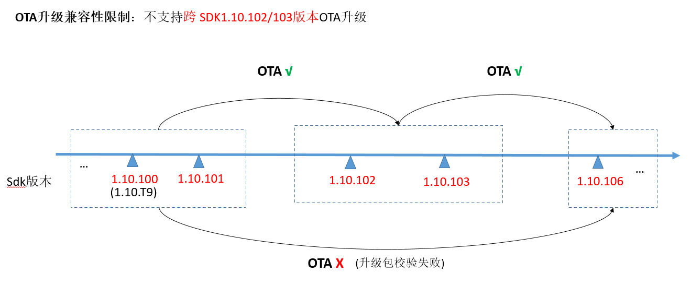

-   解决方案1：

先OTA升级到1.10.102或1.10.103版本，再OTA升级到1.10.106及之后的版本

-   解决方案2：按如下配置OTA升级后，可兼容后续SDK版本

1.  修改新SDK版本中配置文件sdk\\build\\config\\target\_config\\ws63\\fota\\fota.cfg中对应字段值为SignSuite=1和KeyAlg=0x2A13C812
2.  将旧SDK版本中sdk\\build\\config\\target\_config\\ws63\\sign\_config目录下的ec\_bp256\_app\_private\_key.pem和ec\_bp256\_oem\_root\_private\_key.pem文件拷贝到新SDK版本中对应目录sdk\\build\\config\\target\_config\\ws63\\sign\_config
3.  新SDK版本打包OTA升级包时增加boot选项：python build/config/target\_config/ws63/build\_ws63\_update.py --pkt=app,boot  （不带参数默认打包app）

# FAQ<a name="ZH-CN_TOPIC_0000001779048473"></a>

1.  uapi\_upg\_prepare返回错误码：ERRCODE\_PARTITION\_CONFIG\_NOT\_FOUND。

    请检查是否烧写分区表。

2.  新增了bin文件需要通过OTA进行升级，怎么扩展：
    1.  upg\_common\_porting.c文件中 g\_img\_partition\_map 中增加新配置，格式为 \{新增镜像ID， 新增镜像分区表ID\}。

        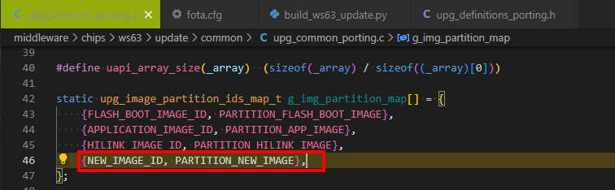

        镜像ID 在upg\_definitions\_porting.h文件中进行定义。

        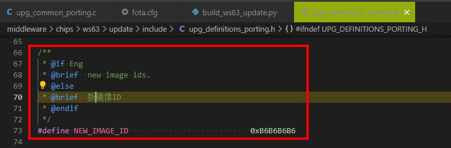

    2.  UPDATE\_IMAGE\_SET 宏定义后增加新镜像ID，对应UPDATE\_IMAGE\_SET\_CNT 需要修正。

        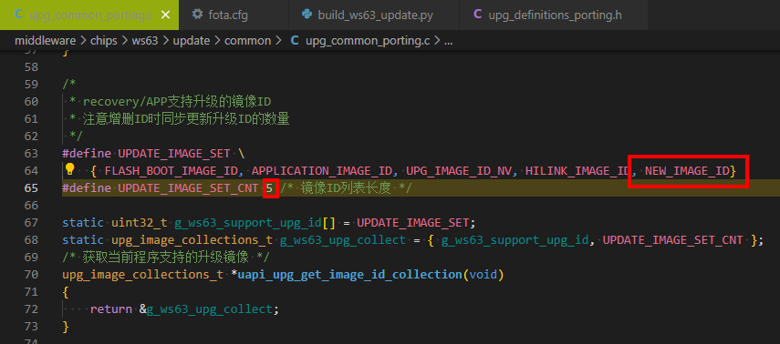

    3.  fota.cfg 可参考 \[hilink\]新增配置。

        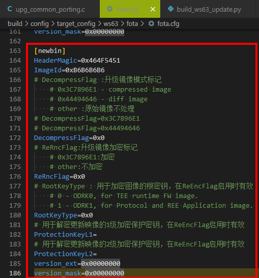

    4.  build\_ws63\_update.py修改升级包生成脚本。

        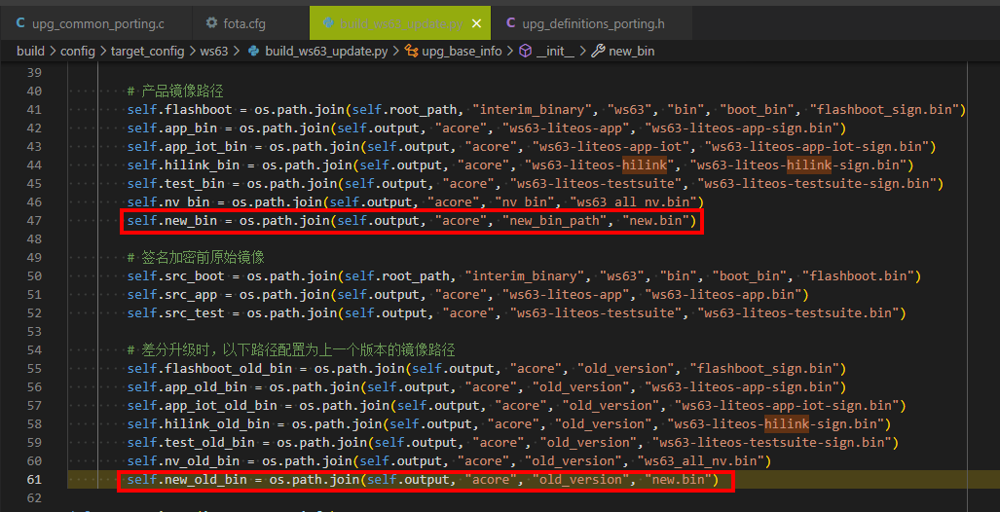

    5.  newbin的字段与fota.cfg中配置的需要对齐，否则打包会报错。

        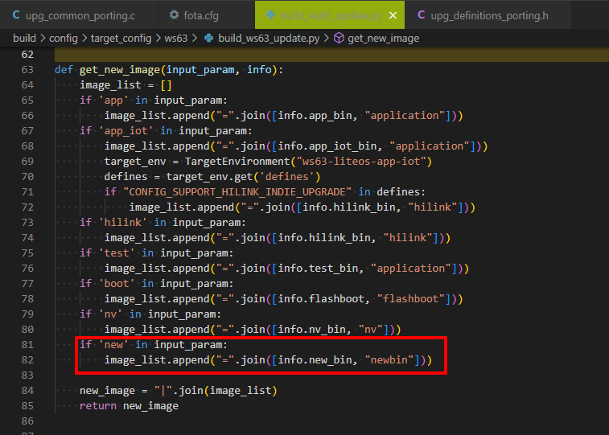

        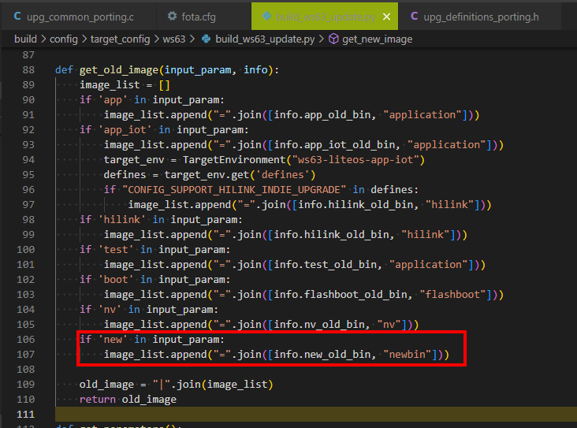

        可以调整不输入入参时，脚本默认打包的内容。

        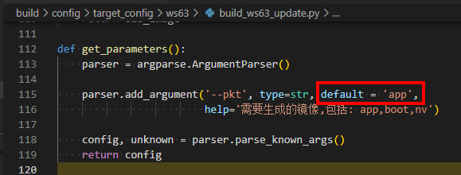

