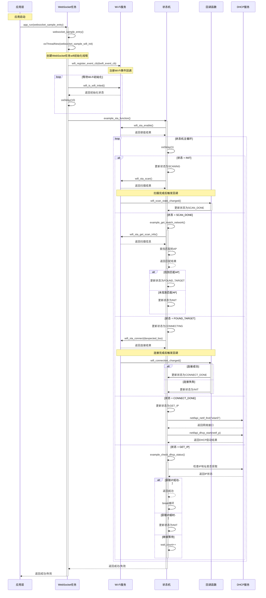

# Wi-Fi STA模式连接时序图分析

## 时序图

## 时序流程说明

1. **应用启动流程**：
   - 通过`app_run(websocket_sample_entry)`启动应用
   - 创建`websocket_sample_task`线程执行`websocket_sample_init`函数

2. **WiFi初始化阶段**：
   - 注册WiFi事件回调函数
   - 等待WiFi初始化完成
   - 调用`example_sta_function()`开始STA连接流程

3. **WiFi状态机流程**：
   - **初始状态**：使能STA接口并开始扫描
   - **扫描状态**：扫描完成后触发`wifi_scan_state_changed`回调
   - **查找AP**：从扫描结果中匹配目标SSID
   - **连接阶段**：连接目标AP，完成后触发`wifi_connection_changed`回调
   - **获取IP**：启动DHCP获取IP地址
   - **完成连接**：成功获取IP后完成整个流程

4. **回调处理机制**：
   - 扫描完成回调更新状态为`SCAN_DONE`
   - 连接结果回调更新状态为`CONNECT_DONE`或失败时重置为`INIT`

5. **错误处理机制**：
   - 各阶段失败时回到初始状态重新开始
   - DHCP超时后重新从扫描开始

