# HiSpark Studio开发环境搭建

**备注：仅LiteOS 系统版本支持，Openharmony系统版本不支持windows环境搭建**

## 安装HiSpark Stuido插件版

1.下载安装[vscode](https://code.visualstudio.com/Download) ，根据推荐一步一步安装。

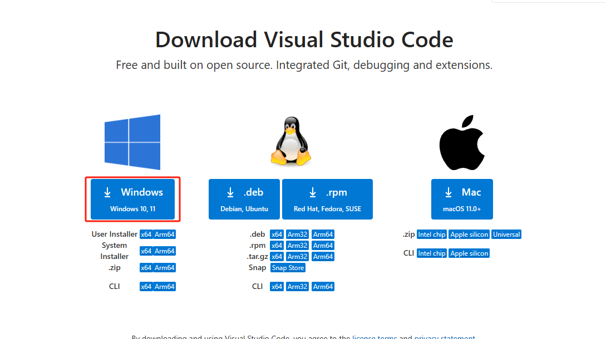

2.在Vscode扩展里面搜索“HiSpark Studio”，点击安装即可。

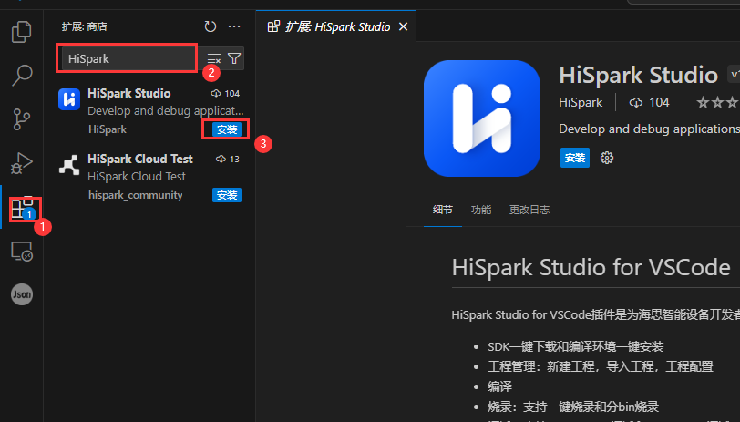

3.安装完成后，在侧边栏出现“HiSpark Stuido”图标。

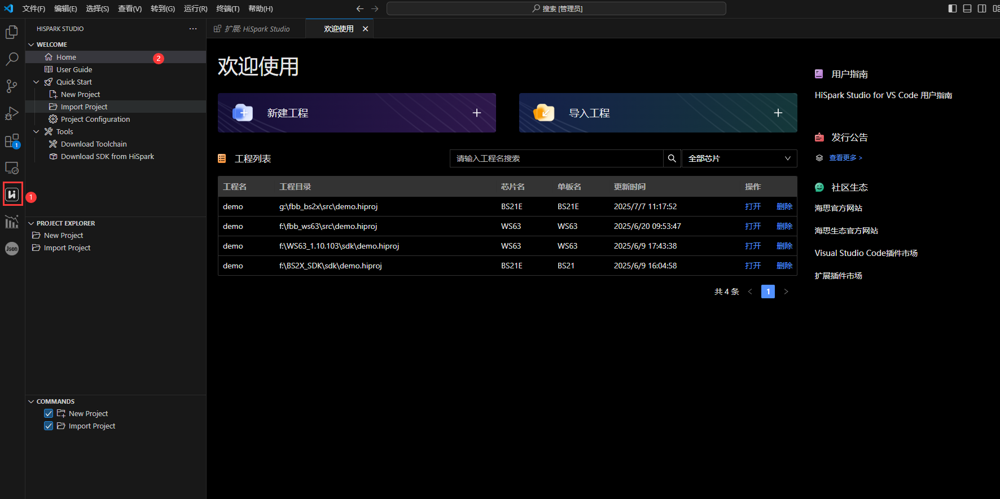

4.点击“Download Toolchain”安装工具及插件，弹出安装python对话框，点击“安装”。

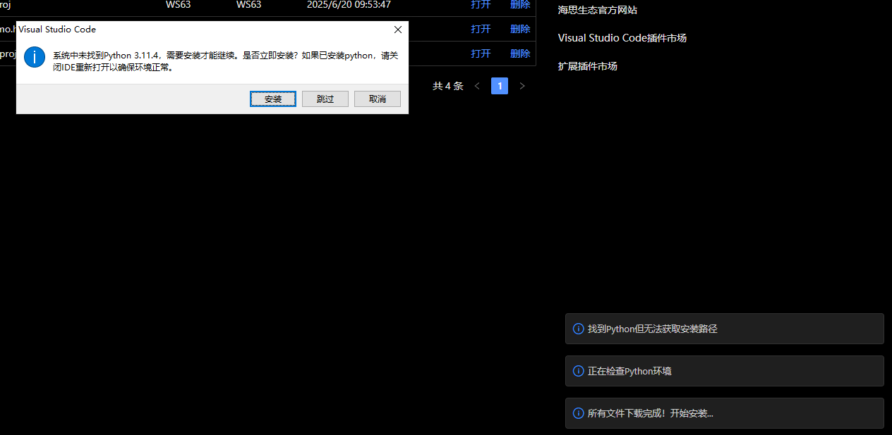

5.出现”环境准备完成“等字样，代表环境安装完成。

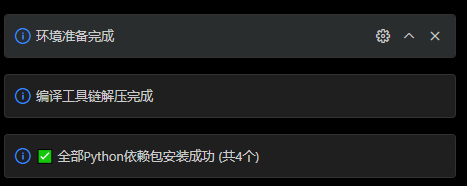

6.根据需要下载对应SDK包，选择想下载到的目录，这里以”WS63 SDK，下载保存路径为E盘“为例。

7.点击“新建工程”，根据提示填写对应信息，点击“完成”，参考下图即可

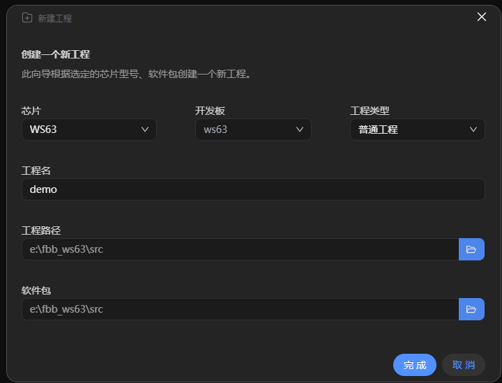

8.新建成功后，点击“build”进行编译

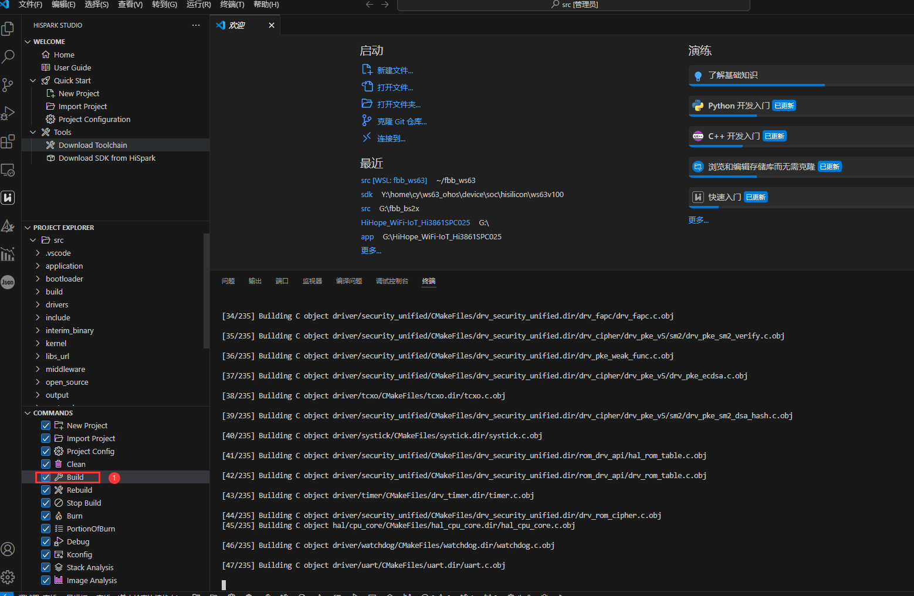

9.编译完成如下图所示。

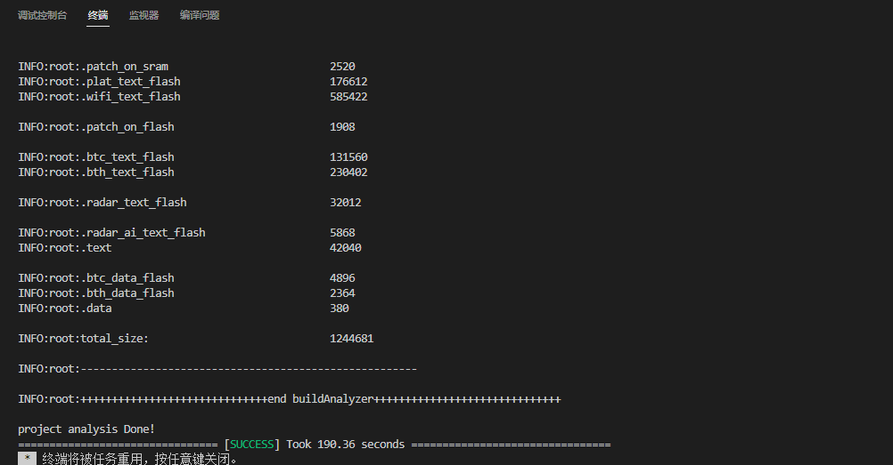

## 镜像烧录

1.硬件搭建：Typec线将板端与PC端连接

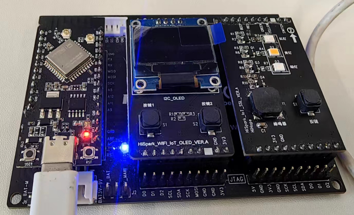

2.安装驱动“CH341SER驱动”（[CH341SER驱动下载地址](https://www.wch.cn/downloads/CH341SER_EXE.html)，**如果该链接失效或者无法下载，用户自行百度下载即可**），安装CH341SER驱动，安装前单板需要与PC端相连，点击安装即可，显示**驱动安装成功代表成功**，如果出现**驱动预安装成功代表安装失败**

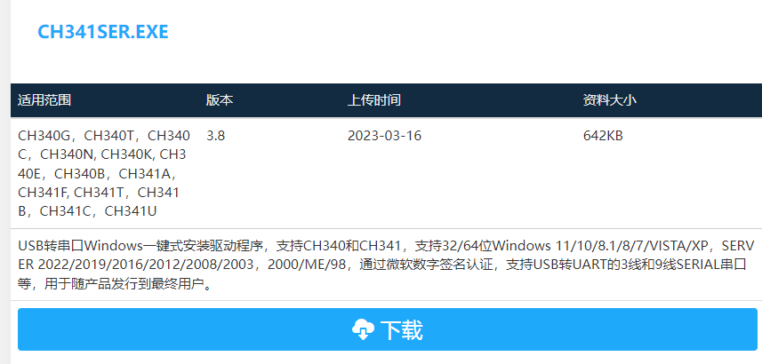

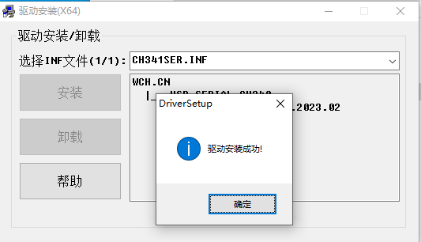

3.安装成功后，在HiSpark Studio工具中点击“工程配置”按钮，选择“程序加载”，传输方式选择“serial”，端口选择“comxxx”，com口在设备管理器中查看。

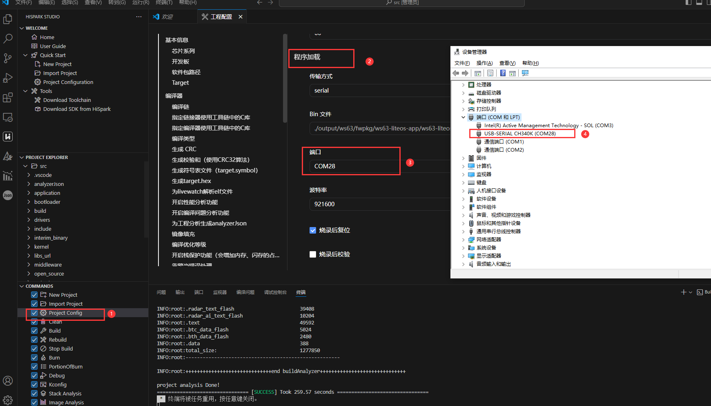

4.配置完成后，点击工具“程序加载”按钮烧录，出现“Connecting, please reset device...”字样时，复位开发板，等待烧录结束。

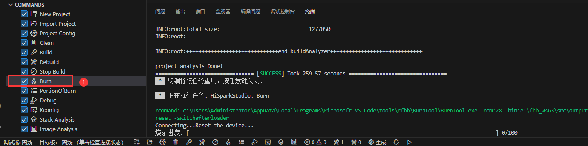

5.在HiSpark Studio底端选择“监视器”，选择端口（**开发板需要与电脑通过typec连接**），如果没有端口显示可以刷新一下，点击“开始监视”，复位开发板，出现“flashboot version”字样代表编译烧录成功

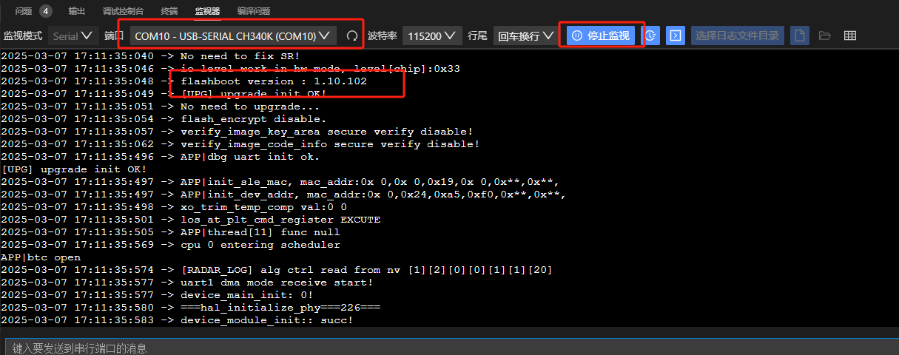
