 

 

**DyCloud_WF6301 DK** **使用手册**

# 目录

[产品概述.................................................................................................. 1](#_Toc16829)

[一、 鼎云物联WS63开发板简介................................................ 1](#_Toc11734)

[二、 硬件详情................................................................................ 1](#_Toc1609)

[第一章 开发环境搭建........................................................................... 4](#_Toc10535)

[一、 准备工作................................................................................ 4](#_Toc29850)

[二、 DevEco Device Tool软件安装............................................ 4](#_Toc3082)

[第二章 工程管理.................................................................................... 7](#_Toc22158)

[第三章 编译运行.................................................................................. 10](#_Toc2554)

[一、 SDK目录结构介绍............................................................ 10](#_Toc9854)

[二、 编译工程.............................................................................. 10](#_Toc7563)

[第四章 软件烧录.................................................................................. 13](#_Toc16329)

[第五章 串口控制台工具..................................................................... 15](#_Toc15188)

[第六章 软件开发.................................................................................. 17](#_Toc30864)

[一、 常用基础功能的API.......................................................... 17](#_Toc27954)

[1． Pinctl.............................................................................. 17](#_Toc5755)

[2． GPIO.............................................................................. 20](#_Toc8320)

[3． UART............................................................................. 24](#_Toc24193)

[4． SPI.................................................................................. 29](#_Toc1852)

[5． IIC................................................................................... 33](#_Toc16387)

[6． DMA.............................................................................. 35](#_Toc11060)

[7． ADC............................................................................... 38](#_Toc24002)

[8． PWM.............................................................................. 40](#_Toc2985)

[9． Timer.............................................................................. 44](#_Toc2928)

[10． WDT............................................................................ 46](#_Toc8467)

[11． Systick.......................................................................... 48](#_Toc19700)

[二、 常用的操作系统抽象层 (OSAL) API.............................. 51](#_Toc16355)

[1． 任务创建....................................................................... 51](#_Toc3220)

[2． 信号量............................................................................ 52](#_Toc23158)

[3． 互斥锁............................................................................ 53](#_Toc10144)

[4． 队列................................................................................ 54](#_Toc25504)

[5． 事件................................................................................ 55](#_Toc11609)

[三、 基础功能开发教学............................................................. 57](#_Toc24172)

[1． Pinctl.............................................................................. 57](#_Toc18984)

[2． GPIO.............................................................................. 60](#_Toc19721)

[3． UART............................................................................. 62](#_Toc26969)

[4． SPI.................................................................................. 66](#_Toc0)

[5． IIC................................................................................... 69](#_Toc10749)

[6． ADC............................................................................... 73](#_Toc4124)

[7． Timer.............................................................................. 75](#_Toc26536)

[8． PWM.............................................................................. 79](#_Toc24762)

[9． WDT............................................................................... 82](#_Toc24083)

[10． Systick......................................................................... 85](#_Toc13647)

[四、 开发板外设实验案例......................................................... 89](#_Toc26356)

[1． 按键中断实验............................................................... 89](#_Toc31848)

[2． 呼吸灯实验................................................................... 94](#_Toc2962)

[3． WS2812（RGB彩灯）实验...................................... 99](#_Toc17270)

[4． AT24C64（EEPROM芯片）读写实验.................. 104](#_Toc12241)

[5． 温湿度传感器实验..................................................... 109](#_Toc8733)

[6． SC7A20（姿态传感器）实验.................................. 114](#_Toc2767)

[7． LCD实验.................................................................... 120](#_Toc8422)

[五、 操作系统实验案例........................................................... 125](#_Toc334)

[1． 线程创建实验............................................................. 125](#_Toc32379)

[2． 信号量实验................................................................. 129](#_Toc22650)

[3． 互斥锁实验................................................................. 134](#_Toc4059)

[4． 队列实验..................................................................... 138](#_Toc11212)

[5． 事件实验..................................................................... 142](#_Toc6958)

[六、 无线通信实验案例........................................................... 147](#_Toc10009)

[1． 蓝牙服务端实验案例................................................ 147](#_Toc18967)

[2． WIFI_TCP实验案例................................................. 151](#_Toc19984)

 

 

# 产品概述

## 一、鼎云物联WS63开发板简介

DyCloud_WF6301_DK开发板是鼎云物联专为物联网学习者打造的高性价比国产化开发平台，主控采用内嵌4MB FLASH的WS63V100芯片，支持LiteOS及OpenHarmony系统，具备丰富接口、灵活扩展、大存储容量等核心优势，适用于物联网通信、嵌入式系统开发、国产芯片应用等学习场景，可满足高校教学、学生毕设、竞赛创新及项目实战需求。

开发板核心特点

l 全接口开放设计：提供UART、SPI、I2C、GPIO等十余种标准硬件接口，轻松连接传感器、显示屏等外设模块，加速原型验证。

l 国产化高集成方案：主控、电源管理及外围器件100%国产化，支持国产芯片生态，助力本土技术发展。

l 一键烧录与调试：集成自动下载电路，仅需USB线即可完成程序烧录，简化开发流程，降低学习门槛。

l 双FLASH存储配置：内置4MB+外扩16MB FLASH，支持大数据缓存与OTA升级，满足高性能应用开发需求。

学习与实战支持

配套完整教程资源，涵盖基础外设驱动、OpenHarmony系统移植、物联网通信协议等实验，并提供智能家居、工业控制等实战案例，帮助学习者快速进阶。开发板布局人性化，接口丝印清晰，排布符合开发习惯，显著提升实验效率。

无论是物联网入门学习、鸿蒙生态开发，还是国产芯片应用研究，DyCloud_WF6301_DK都能提供稳定可靠的硬件支持，助力开发者高效实现创意。

## 二、硬件详情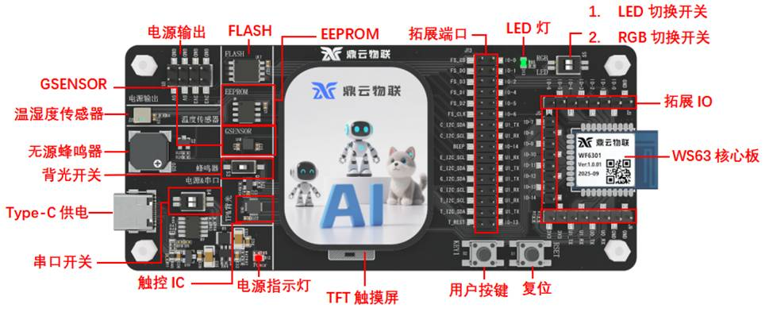

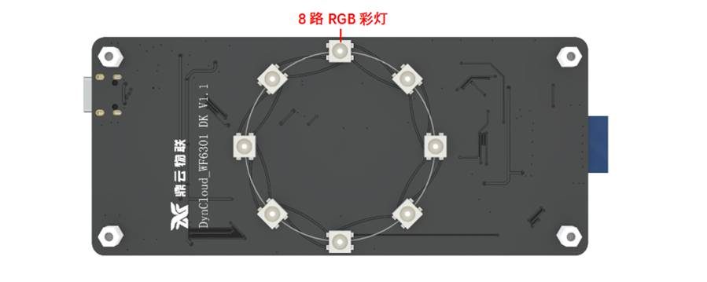

| 硬件资源         | 资源描述                                                     |
| ---------------- | ------------------------------------------------------------ |
| 主控模组         | WS63系列模组使用WS63星闪多模高性能 32bit 微处理器，最大工作频率240MHz； |
| 主控外设         | 1个SPI、1个QSPI、2个I2C、1个I2S、3个UART、19个GPIO、6路ADC、8路PWM（上述接口复用实现） |
| 电源输入         | Type-C供电接口(支持DC-5V)。                                  |
| 显示屏幕         | 2.01寸TFT 触摸屏，分辨率为240×296，支持多点触控。            |
| 外部FLASH        | 大存储128Mbit（16MB）空间，支持SPI，10万次擦写寿命           |
| EEPROM           | 2Kbit（256B），AT24C02芯片                                   |
| 三轴数字加速度计 | SC7A20，测量范围±2g/±4g/±8g/±16g可选，分辨率最低可达0.5mg/LSB |
| 数字温湿度传感器 | CHT20，温度精度±0.3℃，湿度精度±2% RH                         |
| 蜂鸣器           | 无源蜂鸣器                                                   |
| 指示灯           | 1个电源指示灯、1个状态指示灯，8路RGB彩灯。                   |
| 输入按钮         | 1个系统复位按键，1个用户自定义按键                           |
| 拓展IO           | 开发板使用2.54mm排针引出全部19个IO接口。                     |
| 程序下载         | 通过USB Type-C接口，板载USB转UART电路。                      |

 

开发板配件

l **无线通讯资源**：支持Wi-Fi 6、蓝牙5.2和SparkLink 1.0，提供高带宽、低延迟、稳定可靠的无线连接。

l **16MB SPI FLASH****：**集成128Mbit（16MB）的W25Q128 NOR FLASH存储器，支持SPI、Dual-SPI和Quad-SPI模式，适合存储配置文件、日志数据等，工作温度-40℃~85℃，可保存数据20年。

l **AT24C02 EEPROM**：提供2Kbit（256字节）存储，用于学习I2C协议。

l USB 转串口：通过Type-C USB连接CH340芯片实现USB转TTL串口功能，且为开发板供电。

l **无源蜂鸣器**：用于报警、闹铃或复杂的音乐播放功能。

l **温湿度传感器**：CHT20传感器，测量温度范围-40℃~+85℃，湿度范围0%~100% RH，提供高精度并支持节能模式。

l **三轴数字加速度计**：SC7A20传感器，支持±2g至±16g的加速度测量，分辨率高，抗冲击能力强。

l **屏幕**：2.01寸TFT触摸屏，分辨率240×296，支持多点触控，显示流畅，抗干扰强。

l **按键**：用于人机交互的普通输入按键。

l **RGB LED**：WS2812B RGB LED，支持1670万种颜色和动态效果，通过单线通信控制，支持动画和渐变等效果。

 

 

 

 

 

 

 

 

 

# 第一章 开发环境搭建

## 一、准备工作

平台要求：windows10系统及以上

软件要求：

Ø DevEco Device Tool安装包

Ø DevTools_CFBB工具包

Ø Visual Studio Code

DevEco Device Tool的安装时会自动检测Visual Studio Code是否安装。当检测到系统未安装VSCode时，可一键安装最低版本VSCode。如果自动安装VSCode过程中遇到故障，或用户需要自定义安装VSCode版本，建议优先完成VSCode的独立安装流程，待确认其正常运行后再执行DevEco Device Tool的安装操作。

 

## 二、DevEco Device Tool软件安装

本插件安装时需要管理员权限安装,安装前需要调整用户的权限。

步骤1 解压DevEco Device Tool压缩包，双击deveco-device-tool-all-in-one-local.exe 安装包程序，点击"下一步"进行安装。

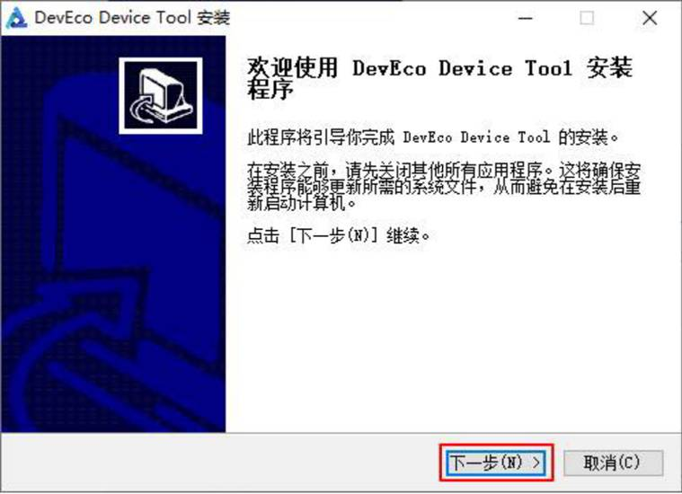

步骤2 在这一步用户可以点击"用户协议"和"隐私声明"查看其其具体内容。如果没有异议，可选择"我接受许可证协议中的条款",并点击"下一步"进进行安装。

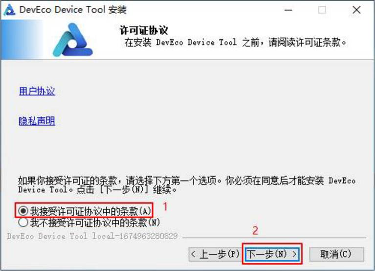

 

步骤3 设置DevEco Device Tool的安装路径。点击"浏览"安钮可以自主选择安装路径,但是请注意安装路径不能包含中文字符和特殊字符(例如:#,*?~^()[K)IS),如果安装路径包含中文字符和特殊字符,会导致安装失败。点击"下一步"

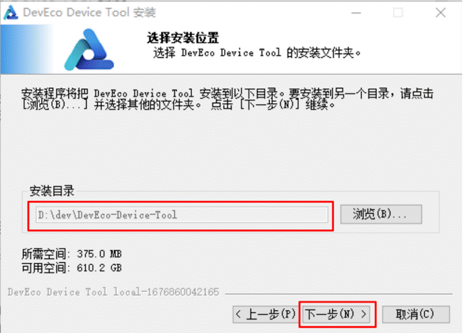

 

步骤4 DevEco Device Tool工具依赖python和Visual Studio Coode软件。此步骤主要是检测这两个软件是否已安装以及安装版本是否符合工具需求。如果没有安装python或Visual Studio Code软件,点击"安装"按钮,软件会自动进行下载和安装(点击"自(定义安装"按钮,软件会进行自动下载,需要用户进行手动安装)。

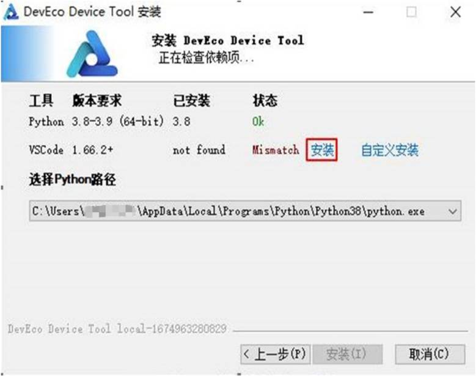

\1) Python和Visual Studio Code软件安装好之后,状态会变变成"ok",然后点击"安装"按钮。

\2) 等待程序的安装进度条执行到100%,会自动切换安装画面到下一步.

\3) 点击"完成",关闭DevEco Device Tool安装向导。

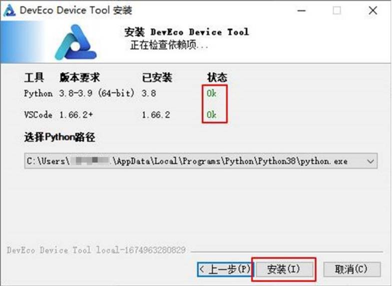

 

 

 

 

# 第二章 工程管理

本章节主要介绍在获取SDK后,如何使用DevEco Device Tool ]工具导入开发工程,以便于进行后续编译、烧录等操作(由于Windows系统限制,在解压工程包时应尽量缩短存储目标的路径长度,路径内不可带有空格)。

须知

SDK解压后可能在路径下已经存在.deveco文件夹,为预设的配置文件,若想修改SDK对应的芯片类型,则需要重新导入,应删除.deveco文件夹并按照下列步骤重新导入即可。如有配套json文件,应放置在build\config\target_cconfig\XXX(XXX为芯片名称)下,如下图所示。

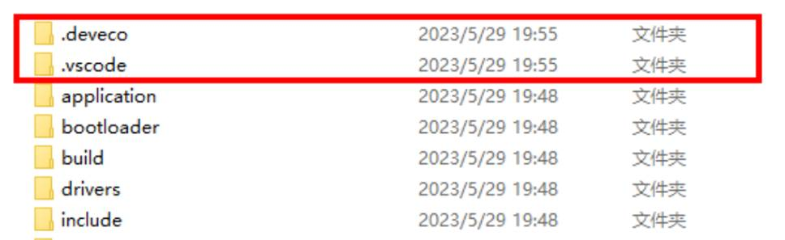

步骤1 打开DevEco Device Tool主页。打开VsCode时会自动弹出DevEco DeviceTool界面,若未弹出或关闭,可点击左侧侧边栏的工具按钮,再点击”home”弹出界面

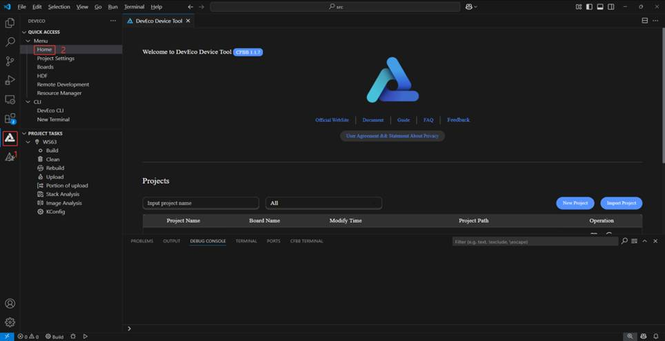

步骤2 在右侧页面中点击Import Project按钮。

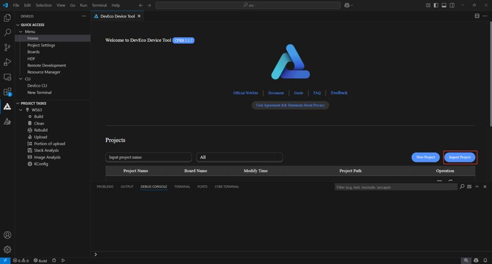

步骤3 在导入工程弹窗中选择解压出来的SDK工程路径,点击"Import"。

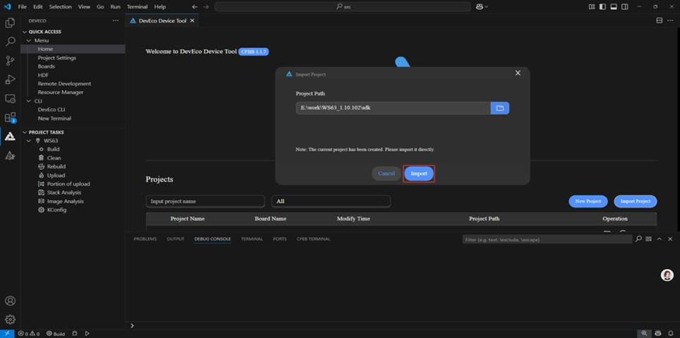

步骤4 根据需要选择SOC,开发板和框架。然后点击"Import"按钮。

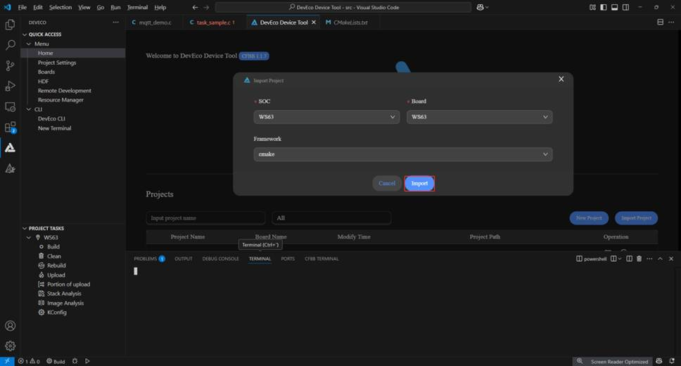

如果待导入的目录不是第一次导入,则导入时会显示导入失败并提示"当前工程已经创建过,请直接导入",此时直接点击"Import"按钮即可,点击出现"工程已打开,请选择其它工程",说明该工程已经在本工具中打开,点击取消即，进入步骤5。若想重新导入工程,可以手动删除在SDK工程路径下生成的.vscode和.deveco文件,再导入工程,即可实现重新导入。

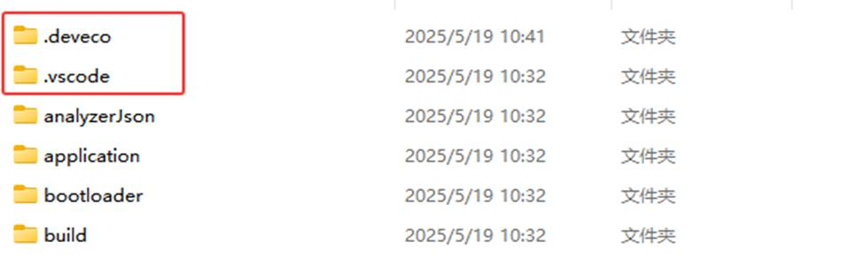

步骤5 工程导入成功后,若弹出是否信任此文件夹中的文件的文件的的作者,可选择信任此作者以启用所有功能。后续可在DevEco Device Tool工具主页直接打开已导入成功的工程,再点击左侧插件按钮跳转到工程界面。

 

# 第三章 编译运行

## 一、SDK目录结构介绍

| 目录            | 说明                                                         |
| --------------- | ------------------------------------------------------------ |
| application     | 应用层代码(其中包含demo程序为参考示例)。                     |
| bootloader      | boot(Flashboot/SSB)代码。                                    |
| build           | SDK构建所需的脚本、配置文件。                                |
| build.py        | 编译入口脚本。                                               |
| CMake Lists.txt | Cmake工程顶层"CMakeLists.txt"文件。                          |
| config.in       | Kconfig配置文件。                                            |
| include         | API头文件存放目录。                                          |
| interim_binary  | 库存放目录。                                                 |
| kernel          | 内核代码和OS接口适配层代码。                                 |
| middleware      | 中间件代码。                                                 |
| protocol        | WiFi、BT、Radar等组件代码。                                  |
| test            | testsuite代码。                                              |
| tools           | 包含编译工具链(包括linux和windows)、镜像打包脚本、NV制作工具和签名脚本等。 |
| output          | 编译时生成的目标文件与中间文件(包括库文件、打印log、生成的二进制文件等) |

 

## 二、编译工程

本小节主要介绍如何使用DevEco Device Tool工具编译工程。

步骤1 导入工程后,点击菜单栏中的Project Settings按钮,选择complier_bin_pate。

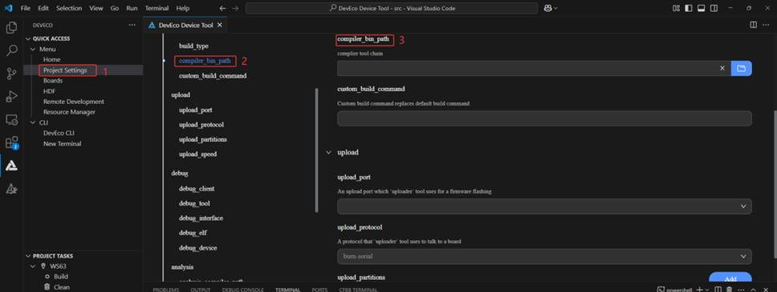

步骤2  点击文件夹按钮设置"compiler_bin_path"为DevTools_CFBB工具包(注意解压后的文件路径层级,选择到如下层级)，点击”OK”。

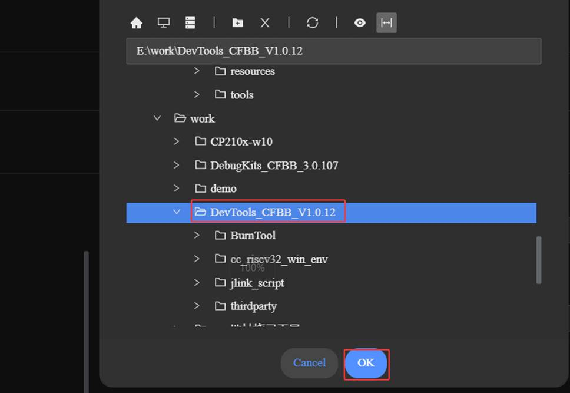

注意：compiler_bin_path目录路径中不能包含中文字符。

 

步骤3 点击PROJECTTASKS菜单中的"Build"按钮,进行编译工程。编译完成之后，工具会自动将编译结果中的bin文件进行打包，"SUCCESS"代表编译成功和打包成功。

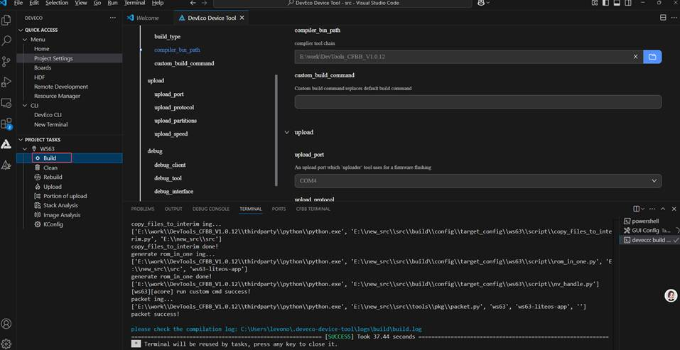

到这里就完成了SDK的编译。

 

 

# 第四章 软件烧录

步骤1 在Project Settings中选择upload_port，点击展开，可以看到USB连接开发板的端口，点击选择它。

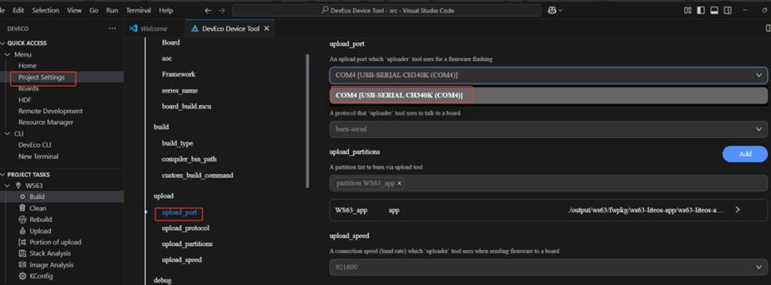

步骤2 依次点击"upload_partitions"按钮、">"图标,然后下滑页面,会看到选择文件按点击选择文件按钮选择需要烧录的文件。

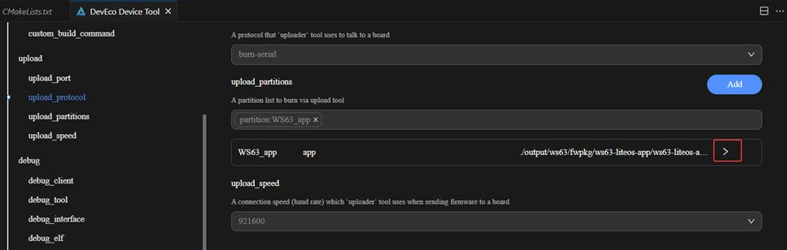

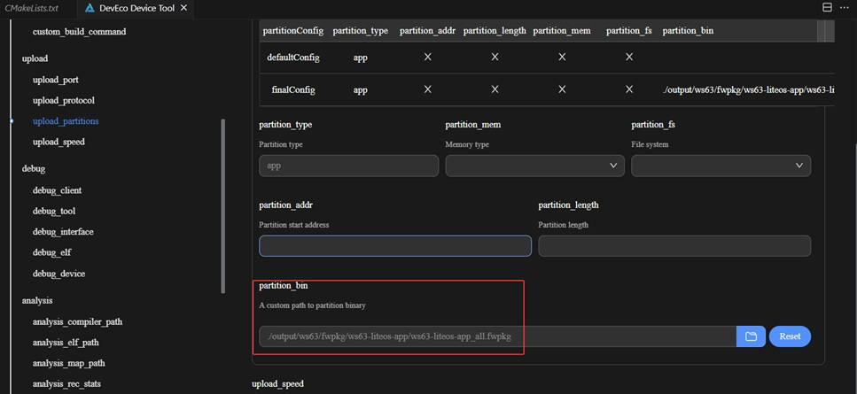

步骤3 点击 "upload_speed" 按钮设置烧录波特率，默认为 921600, 不支持 2M 烧录。（保持默认即可）

步骤4 点击Upload，等待出现”Connecting, please reset device...”字样时，然后按下开发板的reset按键进行烧录代码，如下图所示。等待至进度为100%，代码烧录成功。

 

# 第五章 串口控制台工具

本章节主要讲解 IDE中关于串口操作的工具Cfbb SerialCom(以下均用串口代替)。

主要功能包括:显示串口列表、连接串口、断开串口连接、接收串口消息、给串口发送消息、清空串口输出区、开启\关闭屏幕自动滚动等。

 

打开 vscode 终端，找到终端区域、切换到“CFBB_SERIALCOM”选项卡。可以看到以下界面：

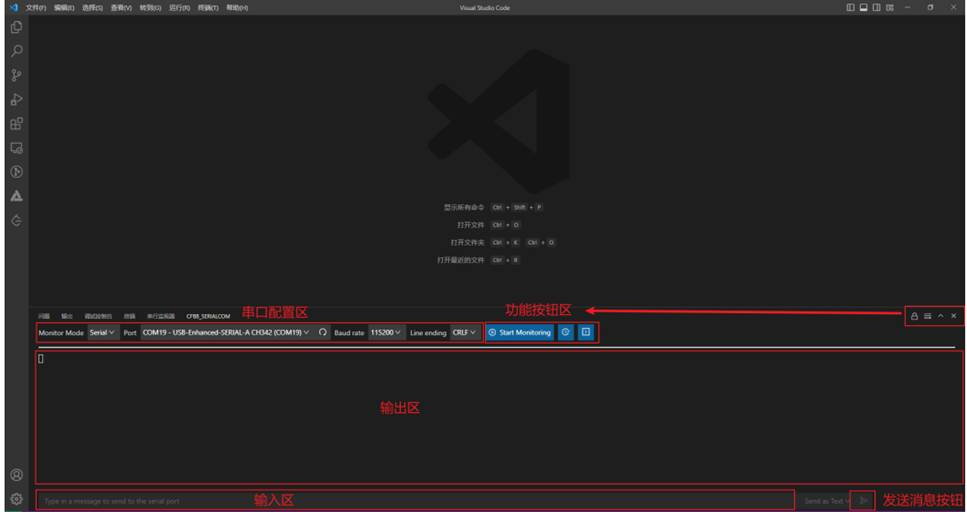

串口配置区 

Ø Port：显示当前电脑所连接的串口设备，点击 按钮可以刷新串口列表。 

Ø Baud rate：选择串口波特率，范围：300~250000。 

Ø Line ending：当给串口发送消息时，工具会根据此选项自动添加字符，CRLF 代表“\r\n”，CR 代表“\r”，LF 代表“\n”。

功能按钮区

Ø 点击Start Monitoring连接串口按钮。当连接串口后，按钮会变成Stopt Monitoring.再点击一次会断开连接。

Ø 时间戳按钮。开启时会在每行输出前加上时间戳显示，如果按钮处于关闭状 态则不显示时间戳。

Ø 输入区隐藏按钮。

Ø 清空输出区。

Ø 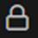开启/关闭屏幕自动滚动。

Ø 最大化面板。

输出区：查看打印信息。

输入区：发送信息。

发送消息按钮：点击按钮或者敲击回车发送输入区信息给串口。默认编码为 utf-8。

 

# 第六章 软件开发

## 一、常用基础功能的API

### 1．Pinctl

（1）uapi_pin_init()

| 定义 | void uapi_pin_init(void);              |
| ---- | -------------------------------------- |
| 功能 | 初始化Pinctrl                          |
| 注意 | 该函数应该在其他本模块函数被调用前执行 |
| 参数 | 无                                     |

（2）uapi_pin_deinit()

| 定义   | void uapi_pin_deinit(void); |
| ------ | --------------------------- |
| 功能   | 去初始化Pinctrl             |
| 参数   | 无                          |
| 返回值 | 无                          |

（3）uapi_pin_set_mode()

| 定义   | errcode_t uapi_pin_set_mode(pin_t pin, pin_mode_t mode); |
| ------ | -------------------------------------------------------- |
| 功能   | 设置引脚复用模式                                         |
| 参数   | pin:IO定义   mode:复用模式                               |
| 返回值 | ERRCODE_SUCC: 成功   其他:失败                           |

（4）uapi_pin_get_mode()

| 定义   | pin_mode_t uapi_pin_get_mode(pin_t pin); |
| ------ | ---------------------------------------- |
| 功能   | 获取引脚复用模式                         |
| 参数   | pin:IO定义                               |
| 返回值 | 复用模式                                 |

（5）uapi_pin_set_ds()

| 定义   | errcode_t uapi_pin_set_ds(pin_t pin, pin_drive_strength_t ds); |
| ------ | ------------------------------------------------------------ |
| 功能   | 设置引脚驱动能力                                             |
| 参数   | pin:IO定义   ds:驱动能力                                     |
| 返回值 | ERRCODE_SUCC:成功   其他:失败                                |

（6）uapi_pin_get_ds()

| 定义   | pin_drive_strength_t uapi_pin_get_ds(pin_t pin); |
| ------ | ------------------------------------------------ |
| 功能   | 获取引脚驱动能力                                 |
| 参数   | pin:IO定义                                       |
| 返回值 | 驱动能力（参考 pin_drive_strength_t）            |

（7）uapi_pin_set_pull()

| 定义   | errcode_t uapi_pin_set_pull(pin_t pin, pin_pull_t pull_type); |
| ------ | ------------------------------------------------------------ |
| 功能   | 设置引脚上下拉类型                                           |
| 参数   | pin: IO定义   pull_type: 上下拉类型                          |
| 返回值 | ERRCODE_SUCC: 成功   其他: 失败                              |

（8）uapi_pin_get_pull()

| 定义   | pin_pull_t uapi_pin_get_pull(pin_t pin); |
| ------ | ---------------------------------------- |
| 功能   | 获取引脚上下拉状态                       |
| 参数   | pin: IO定义                              |
| 返回值 | 上下拉状态                               |

（9）uapi_pin_set_ie()

| 定义   | errcode_t uapi_pin_set_ie(pin_t pin, pin_input_enable_t ie); |
| ------ | ------------------------------------------------------------ |
| 功能   | 设置引脚输入使能状态                                         |
| 参数   | pin: IO定义  Ie:输入使能状态                                 |
| 返回值 | 上下拉状态                                                   |

### 2．GPIO

（1）uapi_gpio_init()

| 定义 | void uapi_gpio_init(void); |
| ---- | -------------------------- |
| 功能 | 初始化GPIO模块             |
| 注意 | 应在其他本模块函数前调用   |
| 参数 | 无                         |

（2）uapi_gpio_deinit()

| 定义   | void uapi_gpio_deinit(void); |
| ------ | ---------------------------- |
| 功能   | 去初始化GPIO模块             |
| 参数   | 无                           |
| 返回值 | 无                           |

（3）uapi_gpio_set_dir()

| 定义   | errcode_t uapi_gpio_set_dir(pin_t pin, gpio_direction_t dir); |
| ------ | ------------------------------------------------------------ |
| 功能   | 设置GPIO输入/输出方向                                        |
| 参数   | pin: IO引脚定义   dir: 输入输出方向                          |
| 返回值 | ERRCODE_SUCC: 成功 其他: 失败                                |

（4）uapi_gpio_get_dir()

| 定义   | gpio_direction_t uapi_gpio_get_dir(pin_t pin); |
| ------ | ---------------------------------------------- |
| 功能   | 获取GPIO当前方向配置                           |
| 参数   | pin: IO引脚定义                                |
| 返回值 | GPIO当前方向                                   |

（5）uapi_gpio_set_val()

| 定义   | errcode_t uapi_gpio_set_val(pin_t pin, gpio_level_t level); |
| ------ | ----------------------------------------------------------- |
| 功能   | 设置GPIO输出电平                                            |
| 参数   | pin: IO引脚定义   level: 输出电平（高/低）                  |
| 返回值 | ERRCODE_SUCC: 成功  其他: 失败                              |

（6）uapi_gpio_get_output_val()

| 定义   | gpio_level_t uapi_gpio_get_output_val(pin_t pin); |
| ------ | ------------------------------------------------- |
| 功能   | 获取GPIO当前输出电平                              |
| 参数   | pin: IO引脚定义                                   |
| 返回值 | GPIO输出电平值（高/低）                           |

（7）uapi_gpio_get_val()

| 定义   | gpio_level_t uapi_gpio_get_val(pin_t pin); |
| ------ | ------------------------------------------ |
| 功能   | 读取GPIO输入电平                           |
| 参数   | pin: IO引脚定义                            |
| 返回值 | GPIO输入电平值（高/低）                    |

（8）uapi_gpio_toggle()

| 定义   | errcode_t  uapi_gpio_toggle(pin_t pin); |
| ------ | --------------------------------------- |
| 功能   | 翻转GPIO输出电平                        |
| 参数   | pin: IO引脚定义                         |
| 返回值 | ERRCODE_SUCC: 成功  其他: 失败          |

（9）uapi_gpio_set_isr_mode()

| 定义   | errcode_t uapi_gpio_set_isr_mode(pin_t  pin, uint32_t trigger); |
| ------ | ------------------------------------------------------------ |
| 功能   | 设置GPIO中断触发模式                                         |
| 参数   | pin: IO引脚定义   trigger: 中断类型：    - 1: 上升沿    - 2: 下降沿    - 3: 双边沿    - 4: 低电平    - 8: 高电平 |
| 返回值 | ERRCODE_SUCC: 成功  其他: 失败                               |

（10）uapi_gpio_register_isr_func()

| 定义   | errcode_t uapi_gpio_register_isr_func(pin_t  pin, uint32_t trigger, gpio_callback_t callback); |
| ------ | ------------------------------------------------------------ |
| 功能   | 注册GPIO中断回调函数                                         |
| 参数   | pin: IO引脚定义   trigger: 中断类型   callback: 中断回调函数指针 |
| 返回值 | ERRCODE_SUCC: 成功  其他: 失败                               |

（11）uapi_gpio_unregister_isr_func()

| 定义   | errcode_t uapi_gpio_unregister_isr_func(pin_t  pin); |
| ------ | ---------------------------------------------------- |
| 功能   | 注销GPIO中断回调                                     |
| 参数   | pin: IO引脚定义                                      |
| 返回值 | ERRCODE_SUCC: 成功  其他: 失败                       |

（12）uapi_gpio_enable_interrupt()

| 定义   | errcode_t  uapi_gpio_enable_interrupt(pin_t pin); |
| ------ | ------------------------------------------------- |
| 功能   | 使能指定GPIO中断                                  |
| 参数   | pin: IO引脚定义                                   |
| 返回值 | ERRCODE_SUCC: 成功  其他: 失败                    |

（13）uapi_gpio_disable_interrupt()

| 定义   | errcode_t  uapi_gpio_enable_interrupt(pin_t pin); |
| ------ | ------------------------------------------------- |
| 功能   | 使能指定GPIO中断                                  |
| 参数   | pin: IO引脚定义                                   |
| 返回值 | ERRCODE_SUCC: 成功 其他: 失败                     |

（14）uapi_gpio_clear_interrupt()

| 定义   | errcode_t  uapi_gpio_clear_interrupt(pin_t pin); |
| ------ | ------------------------------------------------ |
| 功能   | 清除指定GPIO中断标志                             |
| 参数   | pin: IO引脚定义                                  |
| 返回值 | ERRCODE_SUCC: 成功 其他: 失败                    |

### 3．UART

（1）uapi_uart_init()

| 定义   | errcode_t  uapi_uart_init(uart_bus_t bus, const uart_pin_config_t *pins, const  uart_attr_t *attr, const uart_extra_attr_t *extra_attr, uart_buffer_config_t  *uart_buffer_config); |
| ------ | ------------------------------------------------------------ |
| 功能   | 初始化指定串口                                               |
| 参数   | bus：串口号   pins：UART PIN 配置   attr：基础配置参数   extra_attr：高级配置参数   uart_buffer_config：接收缓冲区配置 |
| 返回值 | ERRCODE_SUCC：成功  其他：失败                               |

（2）uapi_uart_deinit()

| 定义   | errcode_t uapi_uart_deinit(uart_bus_t bus); |
| ------ | ------------------------------------------- |
| 功能   | 去初始化指定串口                            |
| 参数   | bus：串口号                                 |
| 返回值 | ERRCODE_SUCC：成功  其他：失败              |

（3）uapi_uart_set_attr()

| 定义   | errcode_t uapi_uart_set_attr(uart_bus_t bus, const uart_attr_t *attr); |
| ------ | ------------------------------------------------------------ |
| 功能   | 设置串口基础配置参数                                         |
| 参数   | bus：串口号   attr：基础配置参数                             |
| 返回值 | ERRCODE_SUCC：成功  其他：失败                               |

（4）uapi_uart_get_attr()

| 定义   | errcode_t uapi_uart_get_attr(uart_bus_t bus, const uart_attr_t *attr); |
| ------ | ------------------------------------------------------------ |
| 功能   | 获取串口基础配置参数                                         |
| 参数   | bus：串口号   attr：基础配置参数                             |
| 返回值 | ERRCODE_SUCC：成功  其他：失败                               |

（5）uapi_uart_write()

| 定义   | int32_t uapi_uart_write(uart_bus_t bus, const uint8_t *buffer, uint32_t  length, uint32_t timeout); |
| ------ | ------------------------------------------------------------ |
| 功能   | 轮询模式发送数据                                             |
| 参数   | bus：串口号   buffer：发送数据缓冲区   length：数据长度   timeout：超时时间 |
| 返回值 | 实际发送的数据长度                                           |

（6）uapi_uart_read()

| 定义   | int32_t uapi_uart_read(uart_bus_t bus, const uint8_t *buffer, uint32_t  length, uint32_t timeout); |
| ------ | ------------------------------------------------------------ |
| 功能   | 读取串口数据                                                 |
| 参数   | bus：串口号   buffer：接收数据缓冲区   length：数据长度   timeout：超时时间 |
| 返回值 | 实际接收的数据长度                                           |

（7）uapi_uart_get_attr()

| 定义   | errcode_t uapi_uart_get_attr(uart_bus_t bus, const uart_attr_t *attr); |
| ------ | ------------------------------------------------------------ |
| 功能   | 获取串口基础配置参数                                         |
| 参数   | bus：串口号   attr：基础配置参数                             |
| 返回值 | ERRCODE_SUCC：成功  其他：失败                               |

（8）uapi_uart_set_attr()

| 定义   | errcode_t uapi_uart_set_attr(uart_bus_t bus, const uart_attr_t *attr); |
| ------ | ------------------------------------------------------------ |
| 功能   | 设置串口基础配置参数                                         |
| 参数   | bus：串口号（参考 uart_bus_t）   attr：基础配置参数（参考 uart_attr_t） |
| 返回值 | ERRCODE_SUCC：成功  其他：失败                               |

（9）uapi_uart_has_pending_transmissions()

| 定义   | bool uapi_uart_has_pending_transmissions(uart_bus_t bus); |
| ------ | --------------------------------------------------------- |
| 功能   | 检查是否存在待处理传输                                    |
| 参数   | bus：串口号                                               |
| 返回值 | true：存在待处理传输 false：无待处理传输                  |

（10）uapi_uart_register_rx_callback()

| 定义   | errcode_t  uapi_uart_register_rx_callback(uart_bus_t bus, uart_rx_condition_t condition,  uint32_t size, uart_rx_callback_t callback); |
| ------ | ------------------------------------------------------------ |
| 功能   | 注册接收回调函数                                             |
| 参数   | bus：串口号  condition：回调触发条件  size：触发数据长度   callback：接收回调函数 |
| 返回值 | ERRCODE_SUCC：成功；  其他：失败                             |

（11）uapi_uart_unregister_rx_callback()

| 定义   | void uapi_uart_unregister_rx_callback(uart_bus_t bus); |
| ------ | ------------------------------------------------------ |
| 功能   | 注销接收回调函数                                       |
| 参数   | bus：串口号                                            |
| 返回值 | 无                                                     |

（12）uapi_uart_register_parity_error_callback()

| 定义   | errcode_t uapi_uart_register_parity_error_callback(uart_bus_t  bus, uart_error_callback_t callback); |
| ------ | ------------------------------------------------------------ |
| 功能   | 注册奇偶校验错误回调                                         |
| 参数   | bus：串口号   callback：错误回调函数                         |
| 返回值 | ERRCODE_SUCC：成功  其他：失败                               |

（13）uapi_uart_register_frame_error_callback()

| 定义   | errcode_t uapi_uart_register_frame_error_callback(uart_bus_t  bus, uart_error_callback_t callback); |
| ------ | ------------------------------------------------------------ |
| 功能   | 注册帧错误回调                                               |
| 参数   | bus：串口号   callback：错误回调函数                         |
| 返回值 | ERRCODE_SUCC：成功  其他：失败                               |

（14）uapi_uart_write_int()

| 定义   | errcode_t uapi_uart_write_int(uart_bus_t bus,  const uint8_t *buffer, uint32_t length, void *params, uart_tx_callback_t  finished_with_buffer_func); |
| ------ | ------------------------------------------------------------ |
| 功能   | 中断模式发送数据                                             |
| 参数   | bus：串口号   buffer：发送数据缓冲区   length：数据长度   params：回调参数   finished_with_buffer_func：发送完成回调函数 |
| 返回值 | ERRCODE_SUCC：成功 其他：失败                                |

（15）uapi_uart_write_by_dma()

| 定义   | int32_t uapi_uart_write_by_dma(uart_bus_t bus,  const void *buffer, uint32_t length, uart_write_dma_config_t *dma_cfg); |
| ------ | ------------------------------------------------------------ |
| 功能   | DMA 模式发送数据                                             |
| 参数   | bus：串口号   buffer：发送数据缓冲区   length：数据长度   dma_cfg：DMA 配置 |
| 返回值 | 实际发送的数据长度                                           |

（16）uapi_uart_flush_rx_data()

| 定义   | errcode_t uapi_uart_flush_rx_data(uart_bus_t  bus); |
| ------ | --------------------------------------------------- |
| 功能   | 刷新接收缓冲区数据                                  |
| 参数   | bus：串口号                                         |
| 返回值 | ERRCODE_SUCC：成功  其他：失败                      |

（17）uapi_uart_rx_fifo_is_empty()

| 定义   | bool uapi_uart_rx_fifo_is_empty(uart_bus_t bus); |
| ------ | ------------------------------------------------ |
| 功能   | 检查 RX FIFO 是否为空                            |
| 参数   | bus：串口号                                      |
| 返回值 | true：RX FIFO 为空   false：RX FIFO 非空         |

 

### 4．SPI

（1）uapi_spi_init()

| 定义   | errcode_t uapi_spi_init(spi_bus_t bus, spi_attr_t  *attr, spi_extra_attr_t *extra_attr); |
| ------ | ------------------------------------------------------------ |
| 功能   | 初始化 SPI 总线                                              |
| 参数   | bus：SPI 总线号   attr：基础配置参数   extra_attr：高级配置参数 |
| 返回值 | ERRCODE_SUCC：成功  其他：失败                               |

（2）uapi_spi_deinit()

| 定义   | errcode_t uapi_spi_deinit(spi_bus_t bus); |
| ------ | ----------------------------------------- |
| 功能   | 去初始化 SPI 总线                         |
| 参数   | bus：SPI 总线号                           |
| 返回值 | ERRCODE_SUCC：成功  其他：失败            |

（3）uapi_spi_set_tmod()

| 定义   | errcode_t uapi_spi_set_tmod(spi_bus_t bus,  hal_spi_trans_mode_t tmod, uint8_t data_frame_num); |
| ------ | ------------------------------------------------------------ |
| 功能   | 设置 SPI 传输模式                                            |
| 参数   | bus：SPI 总线号   tmod：传输模式   data_frame_num：RX 数据帧数量 |
| 返回值 | ERRCODE_SUCC：成功  其他：失败                               |

（4）uapi_spi_set_attr()

| 定义   | errcode_t uapi_spi_set_attr(spi_bus_t bus,  spi_attr_t *attr); |
| ------ | ------------------------------------------------------------ |
| 功能   | 设置 SPI 基础配置                                            |
| 参数   | bus：SPI 总线号   attr：基础配置参数                         |
| 返回值 | ERRCODE_SUCC：成功  其他：失败                               |

（5）uapi_spi_get_attr()

| 定义   | errcode_t uapi_spi_get_attr(spi_bus_t bus, spi_attr_t  *attr); |
| ------ | ------------------------------------------------------------ |
| 功能   | 获取 SPI 基础配置                                            |
| 参数   | bus：SPI 总线号   attr：基础配置参数（输出）                 |
| 返回值 | ERRCODE_SUCC：成功  其他：失败                               |

（6）uapi_spi_set_extra_attr()

| 定义   | errcode_t uapi_spi_set_extra_attr(spi_bus_t bus,  spi_extra_attr_t *extra_attr); |
| ------ | ------------------------------------------------------------ |
| 功能   | 设置 SPI 高级配置                                            |
| 参数   | bus：SPI 总线号   extra_attr：高级配置参数                   |
| 返回值 | ERRCODE_SUCC：成功  其他：失败                               |

（7）uapi_spi_get_extra_attr()

| 定义   | errcode_t uapi_spi_get_extra_attr(spi_bus_t bus,  spi_extra_attr_t *extra_attr); |
| ------ | ------------------------------------------------------------ |
| 功能   | 获取 SPI 高级配置                                            |
| 参数   | bus：SPI 总线号   extra_attr：高级配置参数（输出）           |
| 返回值 | ERRCODE_SUCC：成功  其他：失败                               |

（8）uapi_spi_select_slave()

| 定义   | errcode_t uapi_spi_select_slave(spi_bus_t bus,  spi_slave_t cs); |
| ------ | ------------------------------------------------------------ |
| 功能   | 主机模式下选择从机设备                                       |
| 参数   | bus：SPI 总线号   cs：从机设备                               |
| 返回值 | ERRCODE_SUCC：成功  其他：失败                               |

（9）uapi_spi_master_write()

| 定义   | errcode_t uapi_spi_master_write(spi_bus_t bus,  const spi_xfer_data_t *data, uint32_t timeout); |
| ------ | ------------------------------------------------------------ |
| 功能   | 主机模式发送数据（支持自动/手动切换传输模式）                |
| 参数   | bus：SPI 总线号   data：传输数据结构（参考 spi_xfer_data_t）   timeout：超时时间 |
| 返回值 | ERRCODE_SUCC：成功  其他：失败                               |

（10）uapi_spi_master_read()

| 定义   | errcode_t uapi_spi_master_read(spi_bus_t bus,  const spi_xfer_data_t *data, uint32极 timeoutext); |
| ------ | ------------------------------------------------------------ |
| 功能   | 主机模式接收数据（支持自动/手动切换传输模式）                |
| 参数   | bus：SPI 总线号   data：传输数据结构   timeout：超时时间     |
| 返回值 | ERRCODE_SUCC：成功  其他：失败                               |

（11）uapi_spi_master_writeread()

| 定义   | errcode_t uapi_spi_master_writeread(spi_bus_t  bus, const spi_xfer_data_t *data, uint32_t timeout); |
| ------ | ------------------------------------------------------------ |
| 功能   | 主机模式同时收发数据（支持自动/手动切换传输模式）            |
| 参数   | bus：SPI 总线号   data：传输数据结构   timeout：超时时间     |
| 返回值 | ERRCODE_SUCC：成功  其他：失败                               |

（12）uapi_spi_slave_read()

| 定义   | errcode_t uapi_spi_slave_read(spi_bus_t bus,  const spi_xfer_data_t *data, uint32_t timeout); |
| ------ | ------------------------------------------------------------ |
| 功能   | 从机模式接收数据（支持自动/手动切换传输模式）                |
| 参数   | bus：SPI 总线号   data：传输数据结构   timeout：超时时间     |
| 返回值 | ERRCODE_SUCC：成功  其他：失败                               |

（13）uapi_spi_slave_write()

| 定义   | errcode_t uapi_spi_slave_write(spi_bus_t bus,  const spi_xfer_data_t *data, uint32_t timeout); |
| ------ | ------------------------------------------------------------ |
| 功能   | 从机模式发送数据（支持自动/手动切换传输模式）                |
| 参数   | bus：SPI 总线号   data：传输数据结构   timeout：超时时间     |
| 返回值 | ERRCODE_SUCC：成功  其他：失败                               |

（14）uapi_spi_set_dma_mode()

| 定义   | errcode_t uapi_spi_set_dma_mode(spi_bus_t bus,  bool en, const spi_dma_config_t *dma_cfg); |
| ------ | ------------------------------------------------------------ |
| 功能   | 使能/去使能DMA模式下SPI传输。                                |
| 参数   | bus：SPI 总线号   en：是否使能DMA传输   dma_cfg：DMA配置结构体指针 |
| 返回值 | ERRCODE_SUCC：成功  其他：失败                               |

 

### 5．IIC

（1）uapi_i2c_master_init()

| 定义   | errcode_t uapi_i2c_master_init(i2c_bus_t bus,  uint32_t baudrate, uint8_t hscode); |
| ------ | ------------------------------------------------------------ |
| 功能   | 初始化 I2C 主机模式                                          |
| 参数   | bus：I2C 总线号（参考 i2c_bus_t）   baudrate：波特率（标准 ≤100KHz，快速 ≤400KHz，高速 ≤3.4MHz）   hscode：高速模式主机码（0-7） |
| 返回值 | ERRCODE_SUCC：成功  其他：失败                               |

（2）uapi_i2c_master_write()

| 定义   | errcode_t uapi_i2c_master_write(i2c_bus_t bus,  uint16_t dev_addr, i2c_data_t *data); |
| ------ | ------------------------------------------------------------ |
| 功能   | 主机模式发送数据（支持自动/手动切换传输模式）                |
| 参数   | bus：I2C 总线号   dev_addr：从机地址   data：传输数据结构    |
| 返回值 | ERRCODE_SUCC：成功  其他：失败                               |

（3）uapi_i2c_master_read()

| 定义   | errcode_t uapi_i2c_master_read(i2c_bus_t bus,  uint16_t dev_addr, i2c_data_t *data); |
| ------ | ------------------------------------------------------------ |
| 功能   | 主机模式接收数据（支持自动/手动切换传输模式）                |
| 参数   | bus：I2C 总线号   dev_addr：从机地址   data：传输数据结构    |
| 返回值 | ERRCODE_SUCC：成功  其他：失败                               |

（4）uapi_i2c_master_writeread()

| 定义   | errcode_t uapi_i2c_master_writeread(i2c_bus_t  bus, uint16_t dev_addr, i2c_data_t *data); |
| ------ | ------------------------------------------------------------ |
| 功能   | 主机模式同时收发数据（支持自动/手动切换传输模式）            |
| 参数   | bus：I2C 总线号   dev_addr：从机地址   data：传输数据结构    |
| 返回值 | ERRCODE_SUCC：成功  其他：失败                               |

（5）uapi_i2c_set_baudrate

| 定义   | errcode_t uapi_i2c_set_baudrate(i2c_bus_t bus,  uint32_t baudrate); |
| ------ | ------------------------------------------------------------ |
| 功能   | 设置波特率（主/从通用）                                      |
| 参数   | bus：I2C 总线号   baudrate：波特率                           |
| 返回值 | ERRCODE_SUCC：成功  其他：失败                               |

（6）uapi_i2c_deinit()

| 定义   | errcode_t uapi_i2c_deinit(i2c_bus_t bus); |
| ------ | ----------------------------------------- |
| 功能   | 去初始化 I2C（主/从通用）                 |
| 参数   | bus：I2C 总线号                           |
| 返回值 | ERRCODE_SUCC：成功  其他：失败            |

 

 

### 6．DMA

（1）uapi_dma_init()

| 定义   | errcode_t uapi_dma_init(void);  |
| ------ | ------------------------------- |
| 功能   | 初始化 DMA 模块                 |
| 参数   | 无                              |
| 返回值 | ERRCODE_SUCC：成功   其他：失败 |

（2）uapi_dma_deinit()

| 定义   | void uapi_dma_deinit(void); |
| ------ | --------------------------- |
| 功能   | 去初始化 DMA 模块           |
| 参数   | 无                          |
| 返回值 | 无                          |

（3）uapi_dma_open()

| 定义   | errcode_t uapi_dma_open(void); |
| ------ | ------------------------------ |
| 功能   | 开启 DMA 模块                  |
| 参数   | 无                             |
| 返回值 | ERRCODE_SUCC：成功  其他：失败 |

（4）uapi_dma_close()

| 定义   | void uapi_dma_close(void); |
| ------ | -------------------------- |
| 功能   | 关闭 DMA 模块              |
| 参数   | 无                         |
| 返回值 | 无                         |

（5）uapi_dma_start_transfer()

| 定义   | errcode_t uapi_dma_start_transfer(uint8_t  channel); |
| ------ | ---------------------------------------------------- |
| 功能   | 启动指定通道的 DMA 传输                              |
| 参数   | channel：DMA 通道号                                  |
| 返回值 | ERRCODE_SUCC：成功  其他：失败                       |

（6）uapi_dma_end_transfer()

| 定义   | errcode_t uapi_dma_end_transfer(uint8_t channel); |
| ------ | ------------------------------------------------- |
| 功能   | 停止指定通道的 DMA 传输                           |
| 参数   | channel：DMA 通道号                               |
| 返回值 | ERRCODE_SUCC：成功  其他：失败                    |

（7）uapi_dma_get_block_ts

| 定义   | uint32_t uapi_dma_get_block_ts(uint8_t channel); |
| ------ | ------------------------------------------------ |
| 功能   | 获取 DMA 传输的数据量                            |
| 参数   | channel：DMA 通道号                              |
| 返回值 | 已传输的数据量                                   |

（8）uapi_dma_transfer_memory_single()

| 定义   | errcode_t uapi_dma_transfer_memory_single(const  dma_ch_user_memory_config_t *user_cfg, dma_transfer_cb_t callback, uintptr_t  arg); |
| ------ | ------------------------------------------------------------ |
| 功能   | 内存到内存的单次传输                                         |
| 参数   | user_cfg：内存传输配置   callback：传输完成/错误回调   arg：回调函数私有参数 |
| 返回值 | ERRCODE_SUCC：成功  其他：失败                               |

（9）uapi_dma_enable_lli()

| 定义   | errcode_t uapi_dma_enable_lli(uint8_t channel,  dma_transfer_cb_t callback, uintptr_t arg); |
| ------ | ------------------------------------------------------------ |
| 功能   | 启用链表传输模式                                             |
| 参数   | channel：DMA 通道号   callback：传输完成/错误回调   arg：回调函数私有参数 |
| 返回值 | ERRCODE_SUCC：成功  其他：失败                               |

（10）uapi_dma_transfer_memory_lli()

| 定义   | errcode_t uapi_dma_transfer_memory_lli(uint8_t  channel, const dma_ch_user_memory_config_t *user_cfg, dma_transfer_cb_t  callback); |
| ------ | ------------------------------------------------------------ |
| 功能   | 内存到内存的链表传输                                         |
| 参数   | channel：DMA 通道号   user_cfg：内存传输配置   callback：传输完成/错误回调 |
| 返回值 | ERRCODE_SUCC：成功  其他：失败                               |

（11）uapi_dma_configure_peripheral_transfer_lli()

| 定义   | errcode_t uapi_dma_configure_peripheral_transfer_lli(uint8_t  channel, const dma_ch_user_peripheral_config_t *user_cfg, dma_transfer_cb_t  callback); |
| ------ | ------------------------------------------------------------ |
| 功能   | 内存↔外设的链表传输                                          |
| 参数   | channel：DMA 通道号   user_cfg：外设传输配置   callback：传输完成/错误回调 |
| 返回值 | ERRCODE_SUCC：成功  其他：失败                               |

**
**

### 7．ADC

（1）uapi_adc_init()

| 定义   | errcode_t uapi_adc_init(adc_clock_t clock); |
| ------ | ------------------------------------------- |
| 功能   | 初始化 ADC 模块，配置采样时钟               |
| 参数   | clock：ADC 采样时钟                         |
| 返回值 | ERRCODE_SUCC：成功  其他：失败              |

（2）uapi_adc_deinit()

| 定义   | errcode_t uapi_adc_deinit(void); |
| ------ | -------------------------------- |
| 功能   | 去初始化 ADC 模块                |
| 参数   | 无                               |
| 返回值 | ERRCODE_SUCC：成功  其他：失败   |

（3）uapi_adc_power_en()

| 定义   | void uapi_adc_power_en(afe_scan_mode_t afe_scan_mode, bool en); |
| ------ | ------------------------------------------------------------ |
| 功能   | 使能/禁用 ADC 电源并选择工作模式                             |
| 参数   | afe_scan_mode：ADC 工作模式（常规/高精度等） en：true=使能，false=禁用 |
| 返回值 | 无                                                           |

（4）uapi_adc_is_using()

| 定义   | bool uapi_adc_is_using(void); |
| ------ | ----------------------------- |
| 功能   | 检查 ADC 是否正在使用         |
| 参数   | 无                            |
| 返回值 | true：正在使用  false：未使用 |

（5）uapi_adc_open_channel()

| 定义   | errcode_t uapi_adc_open_channel(uint8_t channel); |
| ------ | ------------------------------------------------- |
| 功能   | 开启指定 ADC 通道                                 |
| 参数   | channel：ADC 通道号                               |
| 返回值 | ERRCODE_SUCC：成功  其他：失败                    |

（6）uapi_adc_close_channel()

| 定义   | errcode_t uapi_adc_close_channel(uint8_t channel); |
| ------ | -------------------------------------------------- |
| 功能   | 关闭指定 ADC 通道                                  |
| 参数   | channel：ADC 通道号                                |
| 返回值 | ERRCODE_SUCC：成功  其他：失败                     |

 

### 8．PWM

（1）uapi_pwm_init()

| 定义   | errcode_t uapi_pwm_init(void); |
| ------ | ------------------------------ |
| 功能   | 初始化 PWM 模块                |
| 参数   | 无                             |
| 返回值 | ERRCODE_SUCC：成功  其他：失败 |

（2）uapi_pwm_deinit()

| 定义   | void uapi_pwm_deinit(void); |
| ------ | --------------------------- |
| 功能   | 去初始化 PWM 模块           |
| 参数   | 无                          |
| 返回值 | 无                          |

（3）uapi_pwm_open()

| 定义   | errcode_t uapi_pwm_open(uint8_t channel, const pwm_config_t *cfg); |
| ------ | ------------------------------------------------------------ |
| 功能   | 打开 PWM 通道并配置参数                                      |
| 参数   | channel：PWM 通道号   cfg：PWM 配置参数                      |
| 返回值 | ERRCODE_SUCC：成功  其他：失败                               |

（4）uapi_pwm_close()

| 定义   | errcode_t uapi_pwm_close(uint8_t channel); |
| ------ | ------------------------------------------ |
| 功能   | 关闭 PWM 通道                              |
| 参数   | channel：PWM 通道号                        |
| 返回值 | ERRCODE_SUCC：成功  其他：失败             |

（5）uapi_pwm_start()

| 定义   | errcode_t uapi_pwm_start(uint8极 channel); |
| ------ | ------------------------------------------ |
| 功能   | 启动 PWM 输出                              |
| 参数   | channel：PWM 通道号                        |
| 返回值 | ERRCODE_SUCC：成功  其他：失败             |

（6）uapi_pwm_get_frequency()

| 定义   | uint32_t uapi_pwm_get_frequency(uint8_t channel); |
| ------ | ------------------------------------------------- |
| 功能   | 获取 PWM 工作频率                                 |
| 参数   | channel：PWM 通道号                               |
| 返回值 | PWM 工作频率（Hz）                                |

（7）uapi_pwm_stop()

| 定义   | errcode_t uapi_pwm_stop(uint8_t channel); |
| ------ | ----------------------------------------- |
| 功能   | 停止 PWM 输出                             |
| 参数   | channel：PWM 通道号                       |
| 返回值 | ERRCODE_SUCC：成功  其他：失败            |

（8）uapi_pwm_update_duty_ratio()

| 定义   | errcode_t uapi_pwm_update_duty_ratio(uint8_t channel, uint32_t low_time,  uint32_t high_time); |
| ------ | ------------------------------------------------------------ |
| 功能   | 更新 PWM 占空比                                              |
| 参数   | channel：PWM 通道号   low_time：低电平时钟周期数   high_time：高电平时钟周期数 |
| 返回值 | ERRCODE_SUCC：成功  其他：失败                               |

（9）uapi_pwm_register_interrupt()

| 定义   | errcode_t uapi_pwm_register_interrupt(uint8_t channel, pwm_callback_t  callback); |
| ------ | ------------------------------------------------------------ |
| 功能   | 注册 PWM 中断回调函数                                        |
| 参数   | channel：PWM 通道号   callback：中断回调函数                 |
| 返回值 | ERRCODE_SUCC：成功  其他：失败                               |

（10）uapi_pwm_unregister_interrupt()

| 定义   | errcode_t uapi_pwm_unregister_interrupt(uint8_t channel); |
| ------ | --------------------------------------------------------- |
| 功能   | 注销 PWM 中断回调函数                                     |
| 参数   | channel：PWM 通道号                                       |
| 返回值 | ERRCODE_SUCC：成功   其他：失败（参考 errcode_t）         |

（11）uapi_pwm_set_group()

| 定义   | errcode_t uapi_pwm_set_group(uint8_t group, const uint8_t *channel_set,  uint32_t channel_set_len); |
| ------ | ------------------------------------------------------------ |
| 功能   | 分组 PWM 通道                                                |
| 参数   | group：分组号（0~CONFIG_PWM_GROUP_NUM）   channel_set：通道集合   channel_set_len：通道数量 |
| 返回值 | ERRCODE_SUCC：成功   其他：失败（参考 errcode_t）            |

（12）uapi_pwm_clear_group()

| 定义   | errcode_t uapi_pwm_clear_group(uint8_t group);    |
| ------ | ------------------------------------------------- |
| 功能   | 清除 PWM 分组                                     |
| 参数   | group：分组号                                     |
| 返回值 | ERRCODE_SUCC：成功   其他：失败（参考 errcode_t） |

（13）uapi_pwm_start_group()

| 定义   | errcode_t uapi_pwm_start_group(uint8_t group); |
| ------ | ---------------------------------------------- |
| 功能   | 启动 PWM 分组输出                              |
| 参数   | group：分组号                                  |
| 返回值 | ERRCODE_SUCC：成功 其他：失败                  |

（14）uapi_pwm_stop_group()

| 定义   | errcode_t uapi_pwm_stop_group(uint8_t group); |
| ------ | --------------------------------------------- |
| 功能   | 停止 PWM 分组输出                             |
| 参数   | group：分组号                                 |
| 返回值 | ERRCODE_SUCC：成功 其他：失败                 |

 

### 9．Timer

（1）uapi_timer_init()

| 定义   | errcode_t uapi_timer_init(void); |
| ------ | -------------------------------- |
| 功能   | 初始化定时器模块                 |
| 参数   | 无                               |
| 返回值 | ERRCODE_SUCC：成功  其他：失败   |

（2）uapi_timer_deinit()

| 定义   | errcode_t uapi_timer_deinit(void); |
| ------ | ---------------------------------- |
| 功能   | 去初始化定时器模块                 |
| 参数   | 无                                 |
| 返回值 | ERRCODE_SUCC：成功  其他：失败     |

（3）uapi_timer_create()

| 定义   | errcode_t uapi_timer_create(timer_index_t index,  timer_handle_t *timer); |
| ------ | ------------------------------------------------------------ |
| 功能   | 创建定时器                                                   |
| 参数   | index：硬件定时器索引   timer：返回创建的定时器句柄          |
| 返回值 | ERRCODE_SUCC：成功  其他：失败                               |

（4）uapi_timer_delete()

| 定义   | errcode_t uapi_timer_delete(timer_handle_t timer); |
| ------ | -------------------------------------------------- |
| 功能   | 删除定时器                                         |
| 参数   | timer：要删除的定时器句柄                          |
| 返回值 | ERRCODE_SUCC：成功  其他：失败                     |

 

（5）uapi_timer_start()

| 定义   | errcode_t uapi_timer_start(timer_handle_t timer, uint32_t time_us,  timer_callback_t callback, uintptr_t data); |
| ------ | ------------------------------------------------------------ |
| 功能   | 启动定时器                                                   |
| 参数   | timer：定时器句柄   time_us：定时器超时时间   callback：定时器回调函数   data：传给回调函数的参数 |
| 返回值 | ERRCODE_SUCC：成功  其他：失败                               |

（6）uapi_timer_stop()

| 定义   | errcode_t uapi_timer_stop(timer_handle_t timer); |
| ------ | ------------------------------------------------ |
| 功能   | 停止定时器                                       |
| 参数   | timer：要停止的定时器句柄                        |
| 返回值 | ERRCODE_SUCC：成功  其他：失败                   |

 

### 10．WDT

（1） uapi_watchdog_init()

| 定义   | errcode_t uapi_watchdog_init(uint32_t timeout); |
| ------ | ----------------------------------------------- |
| 功能   | 初始化看门狗                                    |
| 参数   | timeout：看门狗超时时间（单位秒）               |
| 返回值 | ERRCODE_SUCC：成功  其他：失败                  |

（2）uapi_watchdog_deinit()

| 定义   | errcode_t uapi_watchdog_deinit(void); |
| ------ | ------------------------------------- |
| 功能   | 去初始化看门狗                        |
| 参数   | 无                                    |
| 返回值 | ERRCODE_SUCC：成功  其他：失败        |

（3）uapi_watchdog_enable()

| 定义   | errcode_t uapi_watchdog_enable(wdt_mode_t mode); |
| ------ | ------------------------------------------------ |
| 功能   | 使能看门狗                                       |
| 参数   | mode：看门狗模式                                 |
| 返回值 | ERRCODE_SUCC：成功  其他：失败                   |

（4）uapi_watchdog_disable()

| 定义   | errcode_t uapi_watchdog_disable(void); |
| ------ | -------------------------------------- |
| 功能   | 禁用看门狗                             |
| 参数   | 无                                     |
| 返回值 | ERRCODE_SUCC：成功  其他：失败         |

（5）uapi_watchdog_kick()

| 定义   | errcode_t uapi_watchdog_kick(void); |
| ------ | ----------------------------------- |
| 功能   | 喂狗（重置看门狗计数器）            |
| 参数   | 无                                  |
| 返回值 | ERRCODE_SUCC：成功  其他：失败      |

（6）uapi_watchdog_set_time()

| 定义   | errcode_t uapi_watchdog_set_time(uint32_t timeout); |
| ------ | --------------------------------------------------- |
| 功能   | 设置看门狗超时时间                                  |
| 参数   | timeout：新的超时时间（单位秒）                     |
| 返回值 | ERRCODE_SUCC：成功  其他：失败                      |

（7）uapi_watchdog_get_left_time()

| 定义   | errcode_t uapi_watchdog_get_left_time(uint32_t *timeout); |
| ------ | --------------------------------------------------------- |
| 功能   | 获取看门狗剩余时间                                        |
| 参数   | timeout：返回剩余时间（单位秒）                           |
| 返回值 | ERRCODE_SUCC：成功  其他：失败                            |

 

### 11．Systick

（1）uapi_systick_init()

| 定义   | void uapi_systick_init(void); |
| ------ | ----------------------------- |
| 功能   | 初始化 Systick 系统滴答定时器 |
| 参数   | 无                            |
| 返回值 | 无                            |

（2）uapi_systick_deinit()

| 定义   | void uapi_systick_deinit(void); |
| ------ | ------------------------------- |
| 功能   | 去初始化 Systick 系统滴答定时器 |
| 参数   | 无                              |
| 返回值 | 无                              |

（3）uapi_systick_count_clear()

| 定义   | errcode_t uapi_systick_count_clear(void); |
| ------ | ----------------------------------------- |
| 功能   | 清除 Systick 计数器                       |
| 参数   | 无                                        |
| 返回值 | ERRCODE_SUCC：成功  其他：失败            |

（4）uapi_systick_get_count()

| 定义   | uint64_t uapi_systick_get_count(void); |
| ------ | -------------------------------------- |
| 功能   | 获取 Systick 当前计数值                |
| 参数   | 无                                     |
| 返回值 | Systick 当前计数值                     |

（5）uapi_systick_get_s()

| 定义   | uint64_t uapi_systick_get_s(void); |
| ------ | ---------------------------------- |
| 功能   | 获取 Systick 当前秒数              |
| 参数   | 无                                 |
| 返回值 | Systick 当前秒数                   |

（6）uapi_systick_get_ms()

| 定义   | uint64_t uapi_systick_get_ms(void); |
| ------ | ----------------------------------- |
| 功能   | 获取 Systick 当前毫秒数             |
| 参数   | 无                                  |
| 返回值 | Systick 当前毫秒数                  |

（7）uapi_systick_get_us()

| 定义   | uint64_t uapi_systick_get_us(void); |
| ------ | ----------------------------------- |
| 功能   | 获取 Systick 当前微秒数             |
| 参数   | 无                                  |
| 返回值 | Systick 当前微秒数                  |

（8）uapi_systick_delay_count()

| 定义   | errcode_t uapi_systick_delay_count(uint64_t c_delay); |
| ------ | ----------------------------------------------------- |
| 功能   | 按计数值延时                                          |
| 参数   | c_delay：延时计数值                                   |
| 返回值 | ERRCODE_SUCC：成功  其他：失败                        |

（9）uapi_systick_delay_s()

| 定义   | errcode_t uapi_systick_delay_s(uint32_t s_delay); |
| ------ | ------------------------------------------------- |
| 功能   | 按秒数延时                                        |
| 参数   | s_delay：延时秒数                                 |
| 返回值 | ERRCODE_SUCC：成功  其他：失败                    |

（10）uapi_systick_delay_ms()

| 定义   | errcode_t uapi_systick_delay_ms(uint32_t m_delay); |
| ------ | -------------------------------------------------- |
| 功能   | 按毫秒数延时                                       |
| 参数   | m_delay：延时毫秒数                                |
| 返回值 | ERRCODE_SUCC：成功  其他：失败                     |

（11）uapi_systick_delay_us()

| 定义   | errcode_t uapi_systick_delay_us(uint32_t u_delay); |
| ------ | -------------------------------------------------- |
| 功能   | 按微秒数延时                                       |
| 参数   | u_delay：延时微秒数                                |
| 返回值 | ERRCODE_SUCC：成功  其他：失败                     |

 

## 二、常用的操作系统抽象层 (OSAL) API

### 1．任务创建

（1）osal_kthread_create()

| 定义   | osal_task  *osal_kthread_create(osal_kthread_handler handler, void *data, const char  *name, unsigned int stack_size); |
| ------ | ------------------------------------------------------------ |
| 功能   | 创建内核线程                                                 |
| 参数   | handler：线程要处理的函数  data：函数处理程序数据  name：显示的线程名称  stack_size：线程堆栈空间的大小 |
| 返回值 | ERRCODE_SUCC：成功 Other：失败                               |

（2）osal_kthread_set_priority()

| 定义   | int osal_kthread_set_priority(osal_task *task,  unsigned int priority); |
| ------ | ------------------------------------------------------------ |
| 功能   | 设置线程优先级                                               |
| 参数   | task：要赋予优先级的线程  priority：要设定的优先级           |
| 返回值 | OSAL_SUCCESS：成功 OSAL_FAILURE：失败                        |

（3）osal_kthread_lock()/osal_kthread_unlock()

| 定义   | void osal_kthread_lock(void);   void osal_kthread_unlock(void); |
| ------ | ------------------------------------------------------------ |
| 功能   | 禁止任务调度  解锁任务调度                                   |
| 参数   | void                                                         |
| 返回值 | 无                                                           |

 

（4）osal_msleep()

| 定义   | unsigned long osal_msleep(unsigned int msecs);           |
| ------ | -------------------------------------------------------- |
| 功能   | 毫秒级延迟                                               |
| 参数   | msecs：毫秒                                              |
| 返回值 | 当定时器到期时返回 0，否则将返回剩余时间（以毫秒为单位） |

（5）osal_printk()

| 定义   | void osal_printk(const char *fmt, ...); |
| ------ | --------------------------------------- |
| 功能   | 打印日志（类似printf）。                |
| 参数   |                                         |
| 返回值 | 无                                      |

 

### 2．信号量

（1）osal_sem_init()

| 定义   | int osal_sem_init(osal_semaphore *sem, int val); |
| ------ | ------------------------------------------------ |
| 功能   | 创建信号量                                       |
| 参数   | sem：信号量对象   val：可用信号量初始化数量      |
| 返回值 | OSAL_SUCCESS：成功 Other：OSAL_FAILURE           |

（2）osal_sem_binary_sem_init()

| 定义   | int osal_sem_binary_sem_init(osal_semaphore *sem,  int val); |
| ------ | ------------------------------------------------------------ |
| 功能   | 创建二进制信号量                                             |
| 参数   | sem：信号量对象  val：可用信号量初始化数量，范围[0, 1]       |
| 返回值 | OSAL_SUCCESS：成功 Other：OSAL_FAILURE                       |

（3）osal_sem_down_timeout()

| 定义   | int osal_sem_down_timeout(osal_semaphore *sem,  unsigned int timeout); |
| ------ | ------------------------------------------------------------ |
| 功能   | 阻塞获取指定信号量，单位：ms                                 |
| 参数   | sem：信号量对象  timeout：超时时间                           |
| 返回值 | OSAL_SUCCESS：成功 Other：OSAL_FAILURE                       |

（4）osal_sem_up()

| 定义   | void osal_sem_up(osal_semaphore *sem); |
| ------ | -------------------------------------- |
| 功能   | 释放指定信号量                         |
| 参数   | sem：信号量对象                        |
| 返回值 | OSAL_SUCCESS：成功 Other：OSAL_FAILURE |

 

### 3．互斥锁

（1）osal_mutex_init()

| 定义   | int osal_mutex_init(osal_mutex *mutex); |
| ------ | --------------------------------------- |
| 功能   | 初始化互斥锁                            |
| 参数   | mutex：互斥对象                         |
| 返回值 | OSAL_SUCCESS：成功 Other：OSAL_FAILURE  |

（2）osal_mutex_destroy()

| 定义   | void osal_mutex_destroy(osal_mutex *mutex); |
| ------ | ------------------------------------------- |
| 功能   | 删除指定的互斥锁                            |
| 参数   | mutex：互斥对象                             |
| 返回值 | void                                        |

（3） osal_mutex_lock_timeout()

| 定义   | int osal_mutex_lock_timeout(osal_mutex *mutex,  unsigned int timeout); |
| ------ | ------------------------------------------------------------ |
| 功能   | 阻塞获取互斥锁，单位：ms                                     |
| 参数   | mutex：互斥对象  timeout：超时时间                           |
| 返回值 | OSAL_SUCCESS：成功 Other：OSAL_FAILURE                       |

（4）osal_mutex_unlock()

| 定义   | void osal_mutex_unlock(osal_mutex *mutex); |
| ------ | ------------------------------------------ |
| 功能   | 释放指定互斥锁                             |
| 参数   | mutex：互斥对象                            |
| 返回值 | void                                       |

 

### 4．队列

（1） osal_msg_queue_creat()

| 定义   | int osal_msg_queue_create(const char *name,  unsigned short queue_len, unsigned long *queue_id, unsigned int  flags,unsigned short max_msgsize); |
| ------ | ------------------------------------------------------------ |
| 功能   | 创建消息队列                                                 |
| 参数   | name：消息队列名称   queue_len：队列长度。值范围为[1,0xffff]   queue_id：成功创建的队列控制结构的ID   flags：队列模式   max_msgsize：节点大小。值范围为[1,0xffff]，注意节点不宜过大也不宜过小。 |
| 返回值 | OSAL_SUCCESS：成功 Other：OSAL_FAILURE                       |

（2）osal_msg_queue_delete()

| 定义   | void osal_msg_queue_delete(unsigned long  queue_id); |
| ------ | ---------------------------------------------------- |
| 功能   | 删除消息队列                                         |
| 参数   | queue_id：成功创建的队列控制结构的ID                 |
| 返回值 | OSAL_SUCCESS：成功 Other：OSAL_FAILURE               |

（3）osal_msg_queue_write_copy()

| 定义   | int osal_msg_queue_write_copy(unsigned long  queue_id, void *buffer_addr, unsigned int buffer_size, unsigned int timeout); |
| ------ | ------------------------------------------------------------ |
| 功能   | 发送消息到队列尾部                                           |
| 参数   | queue_id：成功创建的队列控制结构的ID   buffer_addr：存储要写入的数据的起始地址   buffer_size：写入数据长度   timeout：超时时间 |
| 返回值 | OSAL_SUCCESS：成功 Other：OSAL_FAILURE                       |

（4）osal_msg_queue_read_copy()

| 定义   | int osal_msg_queue_read_copy(unsigned long queue_id,  void *buffer_addr, unsigned int *buffer_size,unsigned int timeout); |
| ------ | ------------------------------------------------------------ |
| 功能   | 阻塞接收信息，单位：ms                                       |
| 参数   | queue_id：成功创建的队列控制结构的ID   buffer_addr：存储要写入的数据的起始地址   buffer_size：写入数据长度   timeout：超时时间 |
| 返回值 | OSAL_SUCCESS：成功 Other：OSAL_FAILURE                       |

 

### 5．事件

（1）osal_event_init()

| 定义   | int osal_event_init(osal_event *event_obj); |
| ------ | ------------------------------------------- |
| 功能   | 初始化一个事件控制模块                      |
| 参数   | event_obj：事件                             |
| 返回值 | OSAL_SUCCESS：成功 Other：OSAL_FAILURE      |

（2）osal_event_read()

| 定义   | int osal_event_read(osal_event *event_obj,  unsigned int mask, unsigned int timeout_ms, unsigned int mode); |
| ------ | ------------------------------------------------------------ |
| 功能   | 阻塞读取指定事件类型，等待超时时间为相对时间，单位：ms       |
| 参数   | event_obj：事件   mask：事件掩码   timeout_ms：超时时间   mode：事件类型 |
| 返回值 | OSAL_SUCCESS：成功 Other：OSAL_FAILURE                       |

（3）osal_event_write()

| 定义   | int osal_event_write(osal_event *event_obj,  unsigned int mask); |
| ------ | ------------------------------------------------------------ |
| 功能   | 写指定的事件类型                                             |
| 参数   | event_obj：事件  mask：事件掩码                              |
| 返回值 | OSAL_SUCCESS：成功 Other：OSAL_FAILURE                       |

（4）osal_event_clear()

| 定义   | int osal_event_clear(osal_event *event_obj,  unsigned int mask); |
| ------ | ------------------------------------------------------------ |
| 功能   | 清除指定的事件类型                                           |
| 参数   | event_obj：事件  mask：事件掩码                              |
| 返回值 | OSAL_SUCCESS：成功 Other：OSAL_FAILURE                       |

（5）osal_event_destroy()

| 定义   | int osal_event_destroy(osal_event *event_obj); |
| ------ | ---------------------------------------------- |
| 功能   | 销毁指定的事件控制块                           |
| 参数   | void                                           |
| 返回值 | OSAL_SUCCESS：成功 Other：OSAL_FAILURE         |

 

## 三、基础功能开发教学

### 1．Pinctl

本小节以SDK的application\samples\peripheral路径下的Pinctl作为教学示例。

（1）基本概述

Pinctrl 控制器用于控制 IO 管脚的复用功能，可配置规格如下： 

l 支持配置 GPIO_00-GPIO_18 一组 IO 管脚。 

l 支持配置 IO 驱动能力、IO 功能复用以及设置 IO 上下拉状态等功能。

示例代码Pinctl在SDK的application\samples\peripheral路径中已经存在，可以通过DevEco Device Tool直接打开代码。

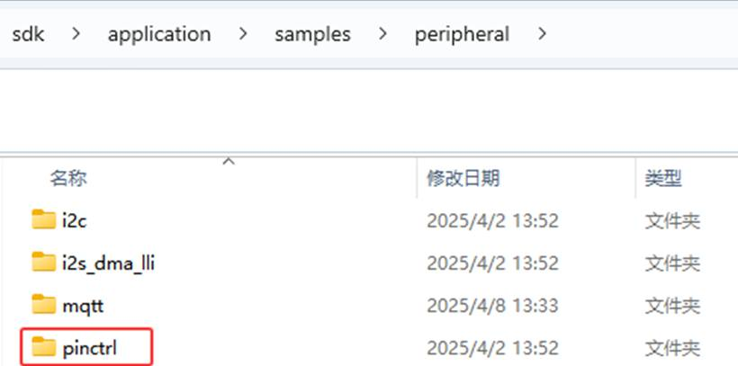

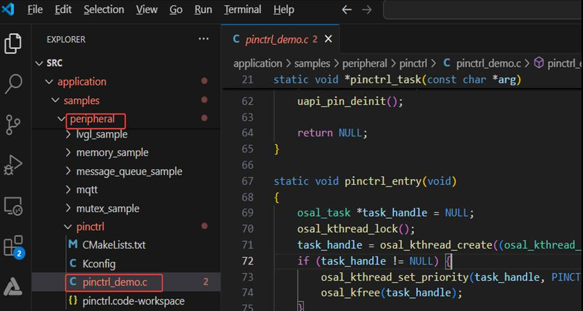

① 本示例中所使用API的介绍

| API                 | 功能                     |
| ------------------- | ------------------------ |
| uapi_pin_init()     | 初始化Pinctrl            |
| uapi_pin_deinit()   | 去初始化Pinctrl          |
| uapi_pin_set_mode() | 设置引脚复用模式         |
| uapi_pin_get_mode() | 获取引脚复用模式         |
| uapi_pin_set_ds()   | 设置引脚驱动能力         |
| uapi_pin_get_ds()   | 获取引脚驱动能力         |
| uapi_pin_set_pull() | 设置引脚上下拉状态       |
| uapi_pin_get_pull() | 获取指定引脚的上下拉状态 |

② 示例代码的软件流程

1）使用uapi_pin_init()启动Pinctrl模块。

2）任务创建与执行：在 pinctrl_entry() 中创建任务并启动，任务函数 pinctrl_task 执行引脚的配置操作。

3）配置引脚

a.    获取并设置引脚模式（uapi_pin_get_mode 和 uapi_pin_set_mode）。

b.    获取并设置引脚驱动强度（uapi_pin_get_ds 和 uapi_pin_set_ds）。

c.    获取并设置引脚上下拉状态（uapi_pin_get_pull 和 uapi_pin_set_pull）。

4）验证配置：每个配置步骤后，验证是否成功，并输出相应的信息。

5）调用uapi_pin_deinit()进行去初始化。

6）任务结束：释放任务资源并结束线程。

7）调用 app_run() 启动任务执行。

（2）编译运行

步骤1  点击PROJECT TASKS中的KConfig，具体选择径”Application/Enable the Sample of peripheral”，选择”Support PINCTL Sample”，点击Save，关闭弹窗。

 

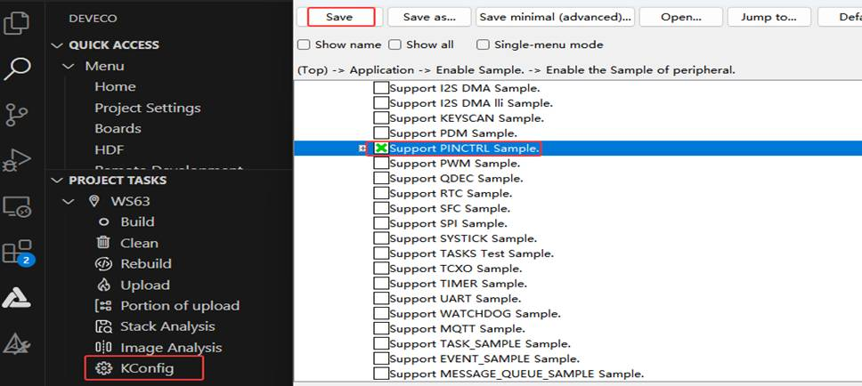

步骤2 点击”Build”或者”Rebuild”，编译完成如下图。

步骤3 点击Upload，等待出现”Connecting, please reset device...”字样时，然后按下开发板的reset按键进行烧录代码，如下图所示。

步骤4 代码烧录完成后，需要再按一次reset按键复位开发板才能代码运行起来。

 

 

 

### 2．GPIO

本小节以SDK的application\samples\peripheral路径下的blinky作为教学示例。

（1）基本概述

GPIO（General-purpose input/output）是通用输入输出的缩写，是一种通用的 I/O 接 口标准。可以配置为输入或输出模式，以便控制外部设备或与其他设备通信。可用于 连接各种设备，如 LED 灯、传感器、执行器等。 GPIO 规格如下： 

l 支持设置 GPIO 管脚方向、设置输出电平状态。 

l 支持外部电平中断以及外部边沿中断上报。  

l 支持每个 GPIO 独立中断。

示例代码blinky在SDK的application\samples\peripheral路径中已经存在，可以通过DevEco Device Tool直接打开代码。

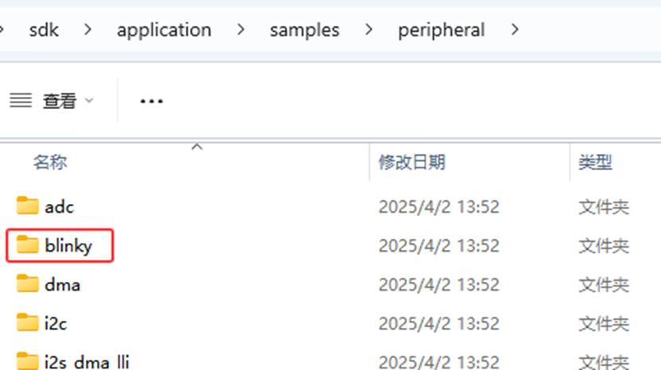

① 本示例中所使用API的介绍

| API                 | 功能                  |
| ------------------- | --------------------- |
| uapi_pin_set_mode() | 设置引脚复用模式      |
| uapi_gpio_set_dir() | 设置GPIO输入/输出方向 |
| uapi_gpio_set_val() | 设置引脚的电平状态    |
| uapi_gpio_toggle()  | 翻转GPIO输出电平      |

② 示例代码的软件流程

\2)    初始化阶段：

a.    调用 uapi_pin_set_mode() 设置引脚模式为 GPIO。

b.    调用 uapi_gpio_set_dir() 设置引脚为输出模式。

c.    调用 uapi_gpio_set_val() 设置引脚初始电平为低。

\3)    任务创建与执行：在 blinky_entry() 中创建一个任务 blinky_task，并设置任务优先级。在任务中进入循环，每 500 毫秒通过uapi_gpio_toggle()切换引脚电平并打印日志。

\4)    启动应用：调用 app_run() 启动应用并执行任务。

（2）编译运行

步骤1 点击PROJECT TASKS中的KConfig，具体选择径”Application/Enable the Sample of peripheral”，选择”Support BLINKY Sample”，点击Save，关闭弹窗。

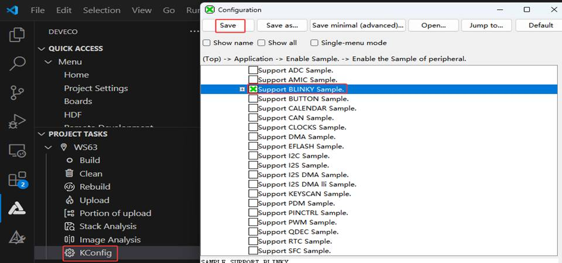

步骤2 点击”Build”或者”Rebuild”，编译完成如下图。

步骤3 点击Upload，等待出现”Connecting, please reset device...”字样时，然后按下开发板的reset按键进行烧录代码，如下图所示。

步骤4 代码烧录完成后，需要再按一次reset按键复位开发板才能代码运行起来。

步骤5  打开串口控制台工具Cfbb SerialCom可查看输出信息。

 

### 3．UART

本小节以SDK的application\samples\peripheral路径下的uart作为教学示例。

（1）基本概述

UART（Universal Asynchronous Receiver/Transmitter）是通用异步收发器的缩写，是一种串行、异步、全双工的通信协议，用于设备间的数据传输。UART 是最常用的设备间通信协议之一，正确配置后，UART 可以配合许多不同类型的涉及发送和接收串行数据的串行协议工作 。

WS63 芯片 MCU 侧提供了 3 个可配置的 UART 外设单元：UART0、UART1,UART2，UART 规格如下：

l 支持可编程数据位(5-8bit)、可编程停止位(1-2bit)、可编程校验位(奇/偶校验，无校验)。

l UART 支持无流控，RTS/CTS 流控模式

l 提供 64×8 的 TX，64×8 的 RX FIFO

l 支持接收 FIFO 中断、发送 FIFO 中断、接收超时中断、错误中断等中断屏蔽与响应。

l 支持 DMA 数据搬移方式。

示例代码uart在SDK的application\samples\peripheral路径中已经存在，可以通过DevEco Device Tool直接打开代码。

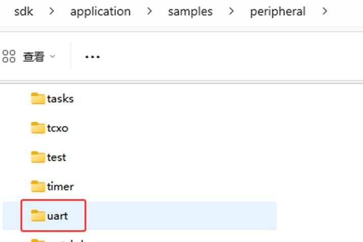

① 本示例中所使用API的介绍

| API                              | 功能                     |
| -------------------------------- | ------------------------ |
| uapi_pin_set_ie()                | 设置引脚输入使能状态     |
| uapi_pin_set_mode()              | 设置引脚复用模式         |
| uapi_uart_deinit()               | 去初始化 UART            |
| uapi_uart_register_rx_callback() | 注册UART接收回调函数     |
| uapi_uart_write_int()            | 在中断模式下写入UART数据 |
| uapi_uart_read_by_dma()          | 通过DMA模式读取UART数据  |
| uapi_uart_write_by_dma()         | 通过DMA模式写入UART数据  |
| uapi_watchdog_kick()             | 喂狗操作，防止看门狗超时 |

 

② 示例代码的软件流程

1）初始化引脚：配置UART的引脚模式，启用接收引脚的输入使能（如果支持）。

2）初始化UART：

a.    配置UART的基本属性，如波特率、数据位、停止位、奇偶校验。

b.    根据是否支持DMA，初始化DMA相关配置，并进行UART初始化。

3）注册回调函数（仅支持中断模式）：注册接收数据的回调函数，用于处理UART接收的中断事件。

4）创建UART任务：在 uart_entry() 中创建任务 uart_task，并设置任务优先级。

5）UART数据传输：在 uart_task 中，根据所选模式（中断模式、DMA模式或轮询模式）处理UART的接收与发送：

c.    中断模式：等待接收数据完成后，进行数据发送。

d.    DMA模式：通过DMA读取数据并发送。

e.    轮询模式：周期性读取和发送数据。

6）任务循环：处理UART数据的读取与发送，使用不同的模式进行数据传输。

7）启动应用：调用 app_run() 启动应用并执行 uart_entry()，开始UART数据传输任务。

 

（2）编译运行

步骤1 点击PROJECT TASKS中的KConfig，具体选择径”Application/Enable the Sample of peripheral”，选择”Support UART Sample”，点击Save，关闭弹窗。

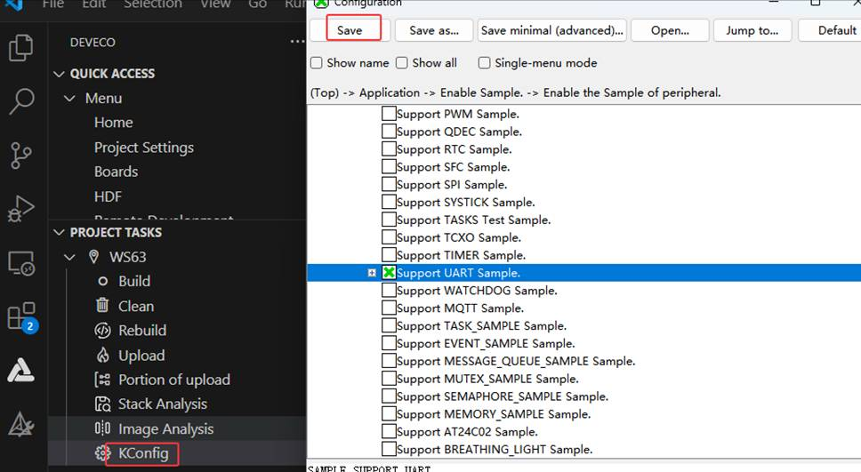

步骤2 点击”Build”或者”Rebuild”，编译完成如下图。

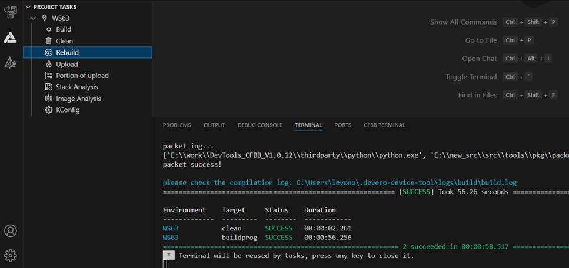

步骤3 点击Upload，等待出现”Connecting, please reset device...”字样时，然后按下开发板的reset按键进行烧录代码，如下图所示。

步骤4 代码烧录完成后，需要再按一次reset按键复位开发板才能代码运行起来。

步骤5  打开串口控制台工具Cfbb SerialCom可进行代码测试。

 

### 4．SPI

本小节以SDK的application\samples\peripheral路径下的SPI作为教学示例。

（1）基本概述

SPI（Serial Peripheral Interface）是一种高速、全双工、同步的通信总线。它可以使MCU 与各种外围设备以串行方式进行通信以交换信息。SPI 总线可直接与各个厂家生产的多种标准外围器件相连，包括 FLASH、RAM、网络控制器、LCD 显示驱动器、A/D 转换器和 MCU 等。标准 SPI 总线一般使用 4 条线：串行时钟线（SCLK）、主机输入/从机输出数据线 MISO、主机输出/从机输入数据线 MOSI 和低电平有效的从机选择线 NSS 。

WS63 提供 SPI0-1 共 2 组可配置的全双工标准 SPI 外设，SPI 规格如下：

l 支持 SPI 帧格式，分为以下三种：

Motorola 帧格式

   TI（Teaxs Instruments）帧格式

National Microwire 帧格式

l 每个 SPI 具有收发分开的位宽为 32bit×8 的 FIFO。

l 支持最大传输位宽为 32bit。

示例代码SPI在SDK的application\samples\peripheral路径中已经存在，可以通过DevEco Device Tool直接打开代码。

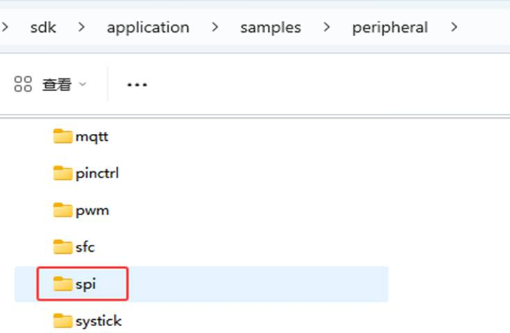

SPI目录下存在spi_master_demo.c（主机示例）和spi_slave_demo.c（从机示例）

① 本示例中所使用API的介绍

| API                     | 功能                                      |
| ----------------------- | ----------------------------------------- |
| uapi_pin_set_mode()     | 设置引脚复用模式。                        |
| uapi_spi_init()         | SPI初始化。                               |
| uapi_spi_set_dma_mode() | 使能/去使能DMA模式下SPI传输。             |
| uapi_spi_set_irq_mode() | 设置是否使用中断模式在主机模式下传输数据. |
| uapi_spi_master_write() | 主机模式发送数据。                        |
| uapi_spi_master_read()  | 主机模式接收数据。                        |
| uapi_dma_init()         | 初始化 DMA 模块。                         |
| uapi_dma_open()         | 开启 DMA 模块。                           |
| uapi_spi_slave_read()   | 从设备接收数据。                          |
| uapi_spi_slave_write()  | 从设备发送数据。                          |

② SPI主机模式示例代码的软件流程

1）调用uapi_pin_set_mode()初始化SPI引脚。

2）调用uapi_spi_init()配置SPI的传输参数，包括时钟、传输模式、数据帧格式等。如果启用了DMA或中断功能，则会相应地配置DMA和中断处理。

3）数据传输：调用uapi_spi_master_write()和uapi_spi_master_read()进行数据收发。如果启用了中断模式，回调函数将在中断触发时执行，处理数据的接收和发送。

4）数据输出：接收的数据会在任务中通过osal_printk()函数输出。如果没有启用中断模式，接收到的数据会直接在任务中打印。

5）循环执行：每500毫秒进行一次数据传输和数据输出。

③ SPI从机模式示例代码的软件流程

1）调用uapi_pin_set_mode()初始化SPI引脚。

2）调用uapi_spi_init()配置SPI从机的各项参数，包括时钟极性、时钟相位、帧格式等。如果启用了DMA或中断功能，则相应地配置DMA和中断处理。

3）数据传输：通过uapi_spi_slave_read()和uapi_spi_slave_write()进行数据收发。如果启用中断模式，注册中断回调函数。回调函数在数据接收和发送完成时触发，处理相应的操作。

4）数据通过osal_printk()打印出来，显示接收到的数据。

5）循环执行：每500毫秒进行一次数据传输和数据输出。

（2）编译运行

步骤1 点击PROJECT TASKS中的KConfig，具体选择径”Application/Enable the Sample of peripheral”，点击”Support SPI Sample”，展开选项，可以选择主机模式或者从机模式，点击Save，关闭弹窗。

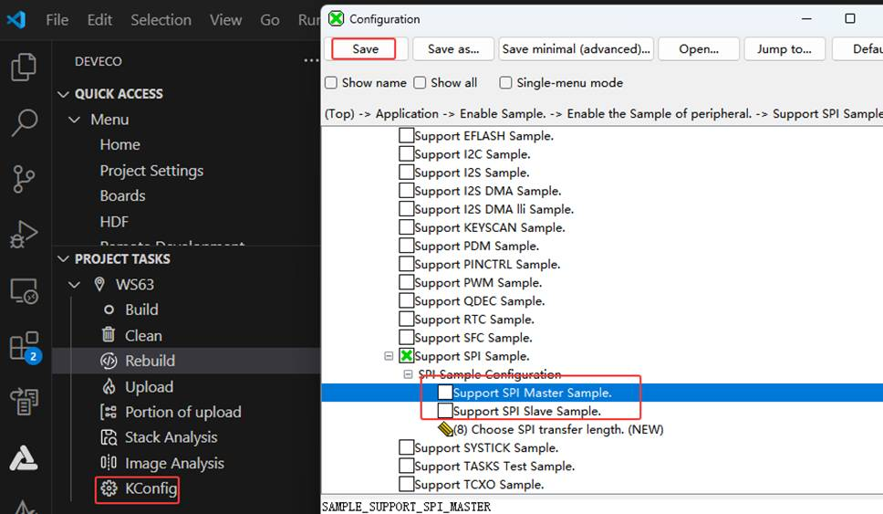

步骤2 点击”Build”或者”Rebuild”，编译完成如下图。

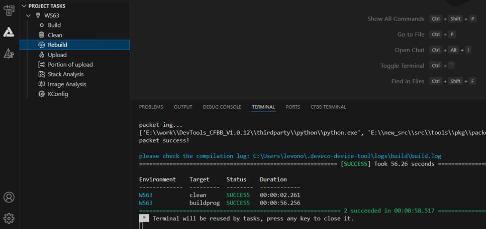

步骤3 点击Upload，等待出现”Connecting, please reset device...”字样时，然后按下开发板的reset按键进行烧录代码，如下图所示。

步骤4 代码烧录完成后，需要再按一次reset按键复位开发板才能代码运行起来。

步骤5  打开串口控制台工具Cfbb SerialCom可进行代码测试。

 

### 5．IIC

本小节以SDK的application\samples\peripheral路径下的IIC作为教学示例。

（1）基本概述

IIC（Inter-Integrated Circuit）也叫做 I2C，译作集成电路总线，是一种串行通信总线，使用主从架构，便于 MCU 与周边设备组件之间的通讯。I2C 总线包含两条线：SDA（Serial Data Line）和 SCL）Serial Clock Line），其中SDA 是数据线，SCL 是时钟线。I2C 总线上的每个设备都有一个唯一的地址，主机可以通过该地址与设备进行通信。WS63 提供了 I2C0～I2C1 共 2 组支持 Master 模式的 I2C 外设，I2C 规格如下：

l 支持标速、快速二种工作模式，在串行 8 位双向数据传输场景下，标准模式下可达 100kbit/s，快速模式下可达 400kbit/s。

l 支持位宽为 32bit×8 的 FIFO。

l 支持 7bit/10bit 寻址模式。

示例代码IIC在SDK的application\samples\peripheral路径中已经存在，可以通过DevEco Device Tool直接打开代码。

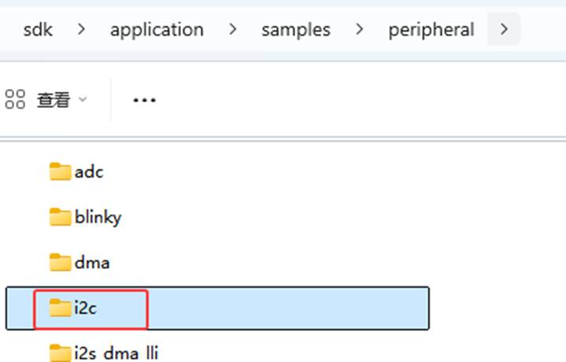

IIC目录下存在iic_master_demo.c（主机示例）和iic_slave_demo.c（从机示例）。

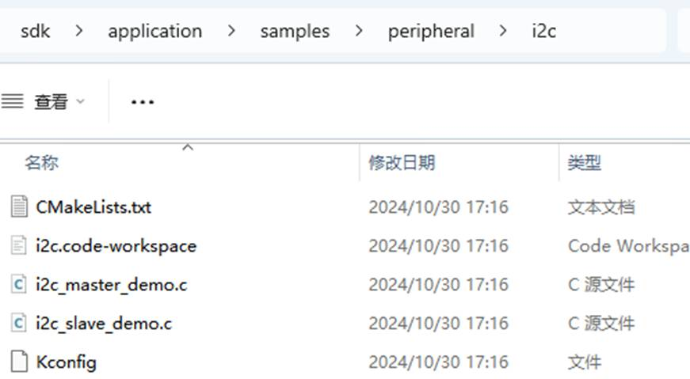

① 本示例中所使用API的介绍

| API                     | 功能                  |
| ----------------------- | --------------------- |
| uapi_i2c_master_init()  | 初始化 I2C 主设备模式 |
| uapi_pin_set_mode()     | 设置引脚复用模式      |
| uapi_i2c_master_write() | 主机发送数据          |
| uapi_i2c_master_read()  | 主机接收数据          |
| uapi_i2c_set_irq_mode() | 配置 I2C 中断模式     |
| uapi_dma_init()         | 初始化 DMA            |
| uapi_dma_open()         | 打开 DMA 通道         |
| uapi_i2c_slave_init()   | 初始化 I2C 从设备模式 |
| uapi_i2c_slave_read()   | 从设备接收数据        |
| uapi_i2c_slave_write()  | 从设备发送数据        |

② IIC主机模式示例代码的软件流程

1）调用uapi_pin_set_mode()初始化IIC的SCL和SDA引脚。

2）调用uapi_i2c_master_init()初始化IIC主机模式，配置IIC波特率和主机地址。

3）DMA和中断模式

a．如果启用了DMA，初始化DMA并为IIC配置DMA模式（uapi_dma_init()和uapi_dma_open()）。

b．如果启用了中断，配置IIC的中断模式并注册回调函数处理接收和发送事件。

4）数据传输：调用uapi_i2c_master_write()和uapi_i2c_master_read()进行数据收发。每次接收到数据后，通过osal_printk()打印接收到的数据。

5）循环执行：每隔500毫秒执行一次数据收发。

③ IIC从机模式示例代码的软件流程

1）调用uapi_pin_set_mode()初始化I2C的SCL和SDA引脚。

2）调用uapi_i2c_slave_init()初始化I2C从机模式，设置波特率和从机地址。

3）DMA和中断模式

a．如果启用了DMA，通过uapi_dma_init()和uapi_dma_open()初始化DMA并为I2C配置DMA模式，提升数据传输效率。

b．如果启用了中断，通过uapi_i2c_set_irq_mode()启用I2C的中断模式，并注册中断回调函数。

4）数据传输：调用uapi_i2c_slave_write()和uapi_i2c_slave_read()进行数据收发。每次接收到数据后，通过osal_printk()打印接收到的数据。

5）循环执行：每隔100毫秒进行一次数据收发。

（2）编译运行

步骤1 点击PROJECT TASKS中的KConfig，具体选择径”Application/Enable the Sample of peripheral”，点击”Support IIC Sample”，展开选项，可以选择主机模式或者从机模式，点击Save，关闭弹窗。

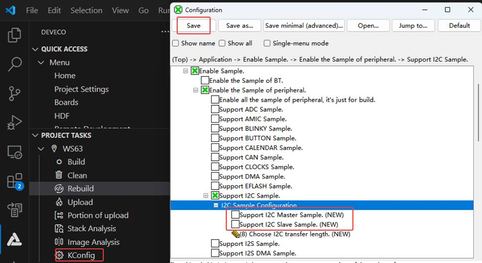

步骤2 点击”Build”或者”Rebuild”，编译完成如下图。

步骤3 点击Upload，等待出现”Connecting, please reset device...”字样时，然后按下开发板的reset按键进行烧录代码，如下图所示。

步骤4 代码烧录完成后，需要再按一次reset按键复位开发板才能代码运行起来。

步骤5  打开串口控制台工具Cfbb SerialCom可进行代码测试。

 

### 6．ADC

本小节以SDK的application\samples\peripheral路径下的ADC作为教学示例。

（1）基本概述

ADC（Analog-to-Digital Converter）模/数转换器，是指将连续变化的模拟信号转换为 离散的数位信号的器件。 

真实世界的模拟信号，例如温度、压力、声音或者图像等，需要转换成更容易储存、 处理和发送的数字信号，模/数转换器可以实现这个功能，可应用于电量检测、按键检测等。

示例代码ADC在SDK的application\samples\peripheral路径中已经存在，可以通过DevEco Device Tool直接打开代码。

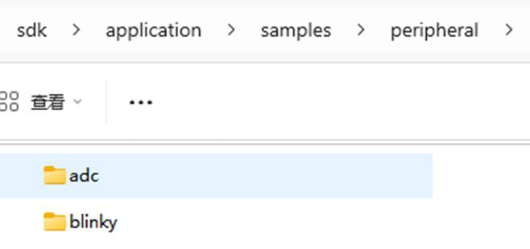

① 本示例中所使用API的介绍

| API               | 功能                                  |
| ----------------- | ------------------------------------- |
| uapi_adc_init()   | 初始化ADC                             |
| adc_port_read()   | 从指定ADC通道读取电压值，通过指针返回 |
| uapi_adc_deinit() | 去初始化ADC                           |

② 示例代码的软件流程

1）调用uapi_adc_init()初始化ADC模块，不使用特定时钟配置（传入宏ADC_CLOCK_NONE）。

2）获取配置的ADC通道号。

3）初始化电压保存变量和采样计数。

4）使用循环采样10次（CYCLES宏），每次：

a.    读取ADC电压值并存入voltage。

b.    打印电压值（单位mV）。

c.    休眠10秒（DELAY_10000MS）。

5）采样完毕，打印注释提示：如果电压值与实际测量值差别较大，请检查分压电阻配置是否正确。

6）调用uapi_adc_deinit()释放/关闭ADC模块

（2）编译运行

步骤1 点击PROJECT TASKS中的KConfig，具体选择径”Application/Enable the Sample of peripheral”，选择”Support ADC Sample”，点击Save，关闭弹窗。

步骤2 点击”Build”或者”Rebuild”，编译完成如下图。

步骤3 点击Upload，等待出现”Connecting, please reset device...”字样时，然后按下开发板的reset按键进行烧录代码，如下图所示。

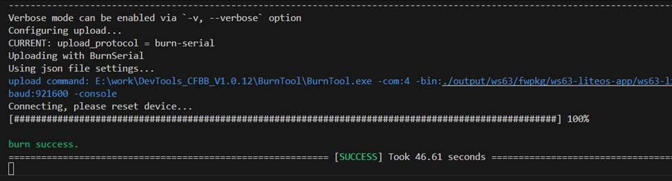

步骤4 代码烧录完成后，需要再按一次reset按键复位开发板才能代码运行起来。

步骤5  打开串口控制台工具Cfbb SerialCom可进行代码测试。

 

### 7．Timer

本小节以\vendor\DyCloud_WF6301_DK V1.0\demo中的time_sample为教示例。

（1）基本概述

Timer 是一种用来计时和产生定时事件的重要模块。它通常由一个计数器和一些相关的寄存器组成。定时器的核心功能是根据设定的时钟源和预设的计数值来进行计数，并在特定条件下产生中断或触发其他事件。

Timer 规格如下：

l 提供 3 个定时器（Timer0～2），其中 Timer0 用于支撑系统时钟，Timer1 和Timer2 提供给业务使用。

l Timer1 提供 6 个软件定时器，Timer2 提供 4 软件定时器。

l 每个定时器提供一个 32 位寄存器用于计数。

l 支持超时中断以及重装载值。

① 本示例中所使用API的介绍

| API                  | 功能                                                   |
| -------------------- | ------------------------------------------------------ |
| uapi_timer_init()    | 初始化定时器模块。                                     |
| uapi_timer_adapter() | 为定时器设备适配硬件中断。                             |
| uapi_timer_create()  | 创建一个定时器。                                       |
| uapi_timer_start()   | 启动定时器，设置定时器周期，并定义定时器超时回调函数。 |
| uapi_timer_delete()  | 删除定时器。                                           |

② 示例代码的软件流程

1）调用uapi_timer_init()来初始化定时器模块。

2）调用uapi_timer_adapter(SIMPLE_TIMER_DEVICE, TIMER_2_IRQN, SIMPLE_IRQ_PRIORITY)，将定时器设备与硬件中断适配，设置定时器的中断优先级。

3）创建定时器：通过uapi_timer_create(SIMPLE_TIMER_DEVICE, &g_timer_handle)来创建一个定时器。

4）启动定时器：使用uapi_timer_start(g_timer_handle, SIMPLE_DELAY_US, simple_timer_callback, 0)启动定时器，定时器周期被设置为1秒，同时，设置定时器超时后调用的回调函数，回调函数执行时将串口输出触发次数。

（2）编译运行

步骤1 在src\application\samples\peripheral文件夹，右键选择“ZeroScript-Sample”，选择”Create Sample Floder”，命名为”timer_sample”。

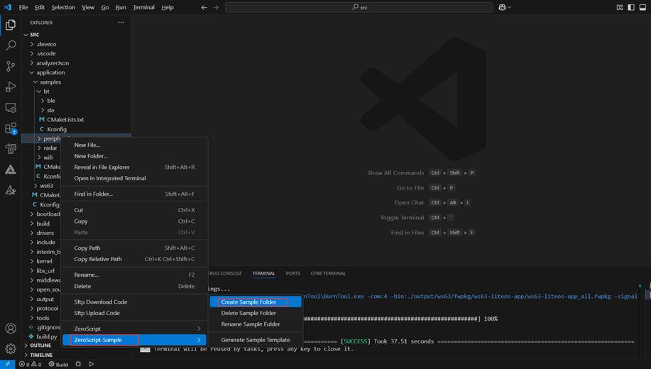

步骤2 将\vendor\DyCloud_WF6301_DK V1.0\demo\timer_sample文件夹中的内容复制到步骤1创建的”timer_sample”文件夹中。

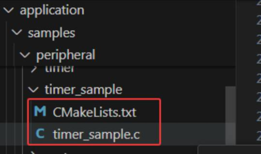

步骤3 确认peripheral文件目录下的CmakeLists是否生成了图中的内容。

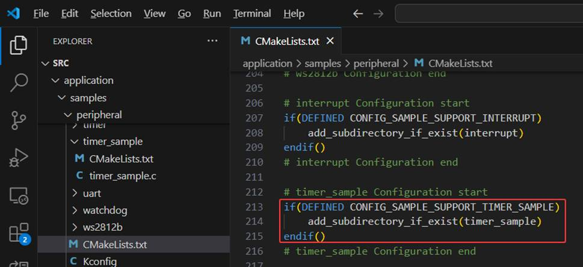

步骤4 确认peripheral文件目录下的Kconfig中是否生成了下图中框选的内容。

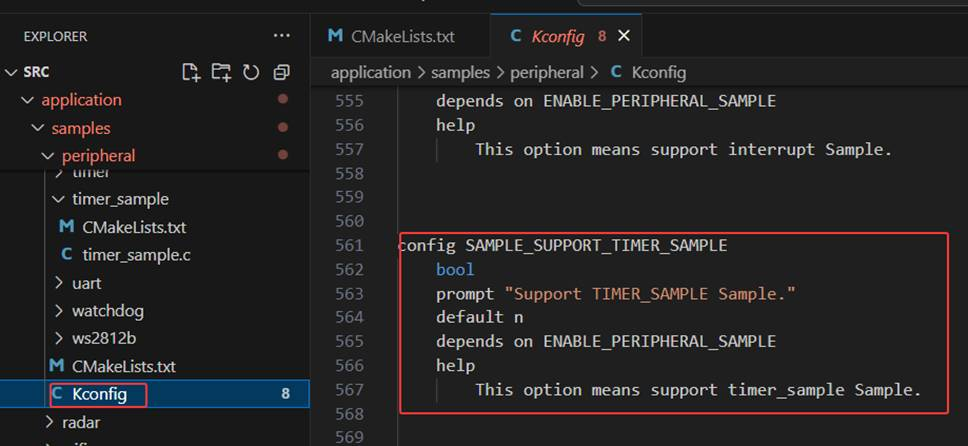

步骤6 点击PROJECT TASKS中的KConfig，具体选择路径”Application/Enable the Sample of peripheral”，选择”Support TIMER_SAMPLE Sample”，点击Save，关闭弹窗。

 

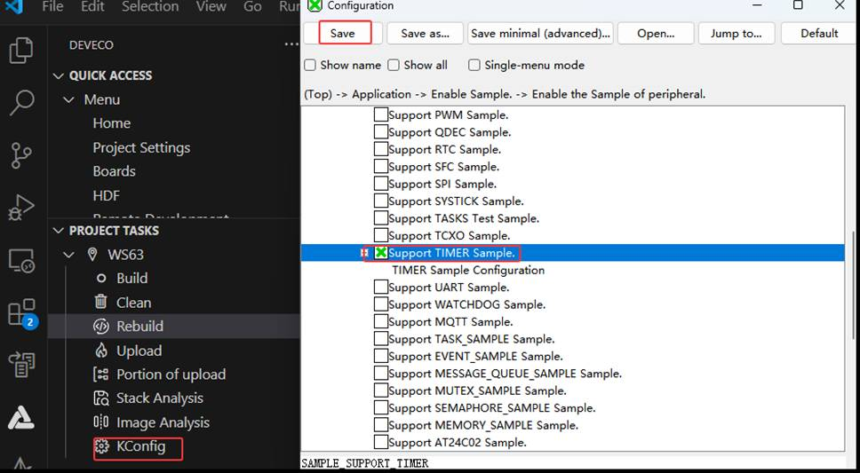

步骤7 点击”Build”或者”Rebuild”，编译完成如下图。

步骤8 点击Upload，等待出现”Connecting, please reset device...”字样时，然后按下开发板的reset按键进行烧录代码，如下图所示。

步骤9 代码烧录完成后，需要再按一次reset按键复位开发板才能代码运行起来。

### 8．PWM

本小节以SDK的application\samples\peripheral路径下的PWM作为教学示例。

（1）基本概述

PWM（Pulse Width Modulation）脉宽调制模块通过对一系列脉冲的宽度进行调制，等效出所需波形。即对模拟信号电平进行数字编码，通过调节频率、占空比的变化来调节信号的变化。

PWM 规格如下：

l 支持 8 路 PWM 输出，寄存器单独可配置。

l 支持 0 电平宽度和 1 电平宽度可调。

l 支持固定周期数发送模式。

l 支持发送完成中断，支持中断清除和中断查询。

示例代码PWM在SDK的application\samples\peripheral路径中已经存在，可以通过DevEco Device Tool直接打开代码。

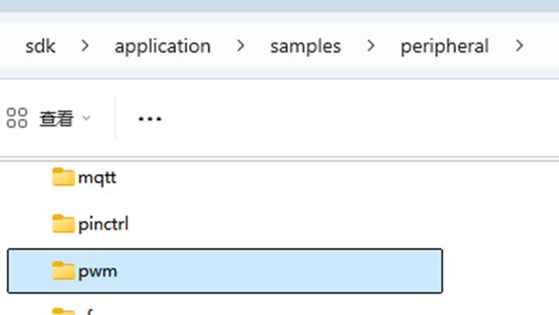

① 本示例中所使用API的介绍

| API                             | 功能                       |
| ------------------------------- | -------------------------- |
| uapi_pin_set_mode()             | 设置引脚的复用功能         |
| uapi_pwm_deinit()               | 去初始化PWM模块            |
| uapi_pwm_init()                 | 初始化PWM模块              |
| uapi_pwm_open()                 | 打开PWM通道，并配置PWM参数 |
| uapi_tcxo_delay_ms()            | 延迟指定毫秒数             |
| uapi_pwm_unregister_interrupt() | 取消注册PWM通道的中断处理  |
| uapi_pwm_register_interrupt()   | 为PWM通道注册中断回调函数  |
| uapi_pwm_set_group()            | 分组 PWM 通道              |
| uapi_pwm_start_group()          | 启动PWM通道组              |
| uapi_pwm_start()                | 启动PWM通道                |
| uapi_pwm_close()                | 关闭PWM通道                |

② 示例代码的软件流程

1）PWM 初始化与配置

a．先进行引脚模式设置（uapi_pin_set_mode()），然后初始化PWM模块（uapi_pwm_deinit()和uapi_pwm_init()）。

b．打开PWM通道并配置PWM参数（通过uapi_pwm_open()）。

2）PWM 启动与中断处理

a．取消已有中断并注册新的中断回调函数，确保PWM周期完成后能够触发回调函数。

b．启动PWM通道或通道组。

3）延时与PWM关闭：延时一段时间（uapi_tcxo_delay_ms()）后关闭PWM通道，释放相关资源。

4）程序结束：任务结束前，调用uapi_pwm_deinit()再次反初始化PWM模块，清理资源，确保系统正常退出。

（2）编译运行

步骤1 点击PROJECT TASKS中的KConfig，具体选择路径”Application/Enable the Sample of peripheral”，选择”Support ADC Sample”，点击Save，关闭弹窗。

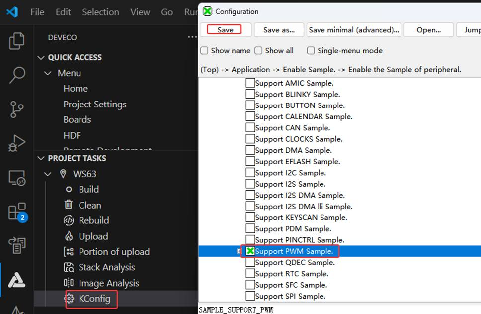

步骤2 点击”Build”或者”Rebuild”，编译完成如下图。

步骤3 点击Upload，等待出现”Connecting, please reset device...”字样时，然后按下开发板的reset按键进行烧录代码，如下图所示。

步骤4 代码烧录完成后，需要再按一次reset按键复位开发板才能代码运行起来。

 

### 9．WDT

本小节以SDK的application\samples\peripheral路径下的watchdog作为教学示例。

（1）基本概述

WDT（Watch Dog Timer）看门狗计时器，一般用于 CPU 运行异常时实现异常恢复，如果系统正常运行，会定期狗，以防止计时器超时。如果系统由于某种原因停止运行或无法正常喂狗，导致计时器在设定的超时时间内未被重置，此时看门狗会认为系统出现故障，触发相应的处理措施，如复位系统或执行特定的错误处理程序。

WDT 规格如下：

l 拥有一个 CPU 看门狗以及一个 PMU 看门狗，其中 PMU 看门狗不对用户开放使用。

l CPU 看门狗超时时间支持 2s～108s 可调。

l CPU 看门狗支持直接复位以及中断后复位两种工作模式。

示例代码watchdog在SDK的application\samples\peripheral路径中已经存在，可以通过DevEco Device Tool直接打开代码。

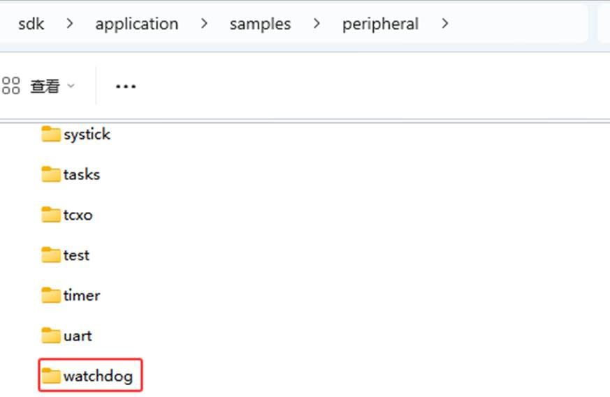

① 本示例中所使用API的介绍

| API                               | 功能                                   |
| --------------------------------- | -------------------------------------- |
| uapi_watchdog_init()              | 初始化看门狗模块                       |
| uapi_watchdog_enable()            | 启用看门狗模块并设置工作模式           |
| uapi_register_watchdog_callback() | 注册看门狗回调函数                     |
| uapi_watchdog_kick()              | 触发看门狗喂狗操作，防止看门狗超时重启 |
| uapi_watchdog_deinit()            | 去初始化看门狗模块                     |

② 示例代码的软件流程

1）看门狗初始化

a．首先初始化看门狗，设置超时时间为2秒。调uapi_watchdog_init()进行初始化。

b．启用看门狗，设置工作模式并注册回调函数watchdog_callback()。

2）看门狗操作，根据配置，代码有两种行为：

a．超时样例 (CONFIG_WDT_TIMEOUT_SAMPLE)：进入无限循环，不进行“喂狗”操作。

b．喂狗样例 (CONFIG_WDT_KICK_SAMPLE)：每500毫秒触发一次“喂狗”操作，防止看门狗超时重启。

3）资源清理

调用uapi_watchdog_deinit()反初始化看门狗模块，释放相关资源。

（2）编译运行

步骤1 点击PROJECT TASKS中的KConfig，具体选择路径”Application/Enable the Sample of peripheral”，选择”Support WATCHDOG Sample”，展开子选项，可以看到这里能选择配置刚才讲述的两种代码行为，选择自己需要的，点击Save，关闭弹窗。

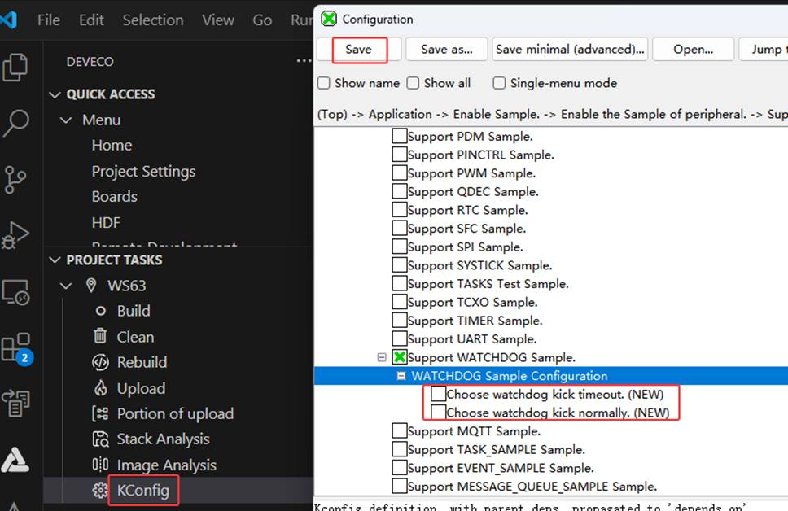

步骤2 点击”Build”或者”Rebuild”，编译完成如下图。

步骤3 点击Upload，等待出现”Connecting, please reset device...”字样时，然后按下开发板的reset按键进行烧录代码，如下图所示。

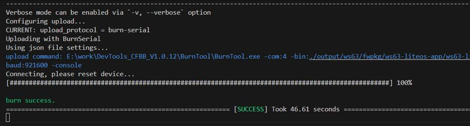

步骤4 代码烧录完成后，需要再按一次reset按键复位开发板才能代码运行起来。

 

### 10．Systick

本小节以SDK的application\samples\peripheral路径下的systick作为教学示例。

（1）基本概述

Systick 是单片机系统中的一种硬件设备或功能模块，用于提供精确的时间基准和定时功能。

 系统定时规格如下： 

l Systick 提供了一个 32 位和一个 16 的寄存器用于存放计数值，最高可计数到 2^48-1。 

l 可使用外部 32.768kHz 晶振或内部 32kHz 时钟作为时钟源。

示例代码systick在SDK的application\samples\peripheral路径中已经存在，可以通过DevEco Device Tool直接打开代码。

① 本示例中所使用API的介绍

| API                     | 功能                 |
| ----------------------- | -------------------- |
| uapi_systick_init()     | 初始化SYSTICK模块    |
| uapi_systick_get_s()    | 获取系统时间的秒数   |
| uapi_systick_get_ms()   | 获取系统时间的毫秒数 |
| uapi_systick_get_us()   | 获取系统时间的微秒数 |
| uapi_systick_delay_s()  | 延迟指定秒数         |
| uapi_systick_delay_ms() | 延迟指定毫秒数       |
| uapi_systick_delay_us() | 延迟指定微秒数       |

② 示例代码的软件流程

1）调用uapi_systick_init()初始化SYSTICK模块。

2）时间延迟与获取：在循环中，执行以下操作：

a．每500毫秒打印一次延迟信息，并执行一次延迟测试，验证SYSTICK模块的精度。

b．秒级延迟：通过uapi_systick_delay_s()延迟指定秒数，并通过uapi_systick_get_s()获取系统时间，计算时间差，验证秒级延迟。

c．毫秒级延迟：通过uapi_systick_delay_ms()延迟指定毫秒数，并通过uapi_systick_get_ms()获取系统时间，计算时间差，验证毫秒级延迟。

d．微秒级延迟：通过uapi_systick_delay_us()延迟指定微秒数，并通过uapi_systick_get_us()获取系统时间，计算时间差，验证微秒级延迟。

（2）编译运行

步骤1 点击PROJECT TASKS中的KConfig，具体选择路径”Application/Enable the Sample of peripheral”，选择”Support SYSTICK Sample”，点击Save，关闭弹窗。

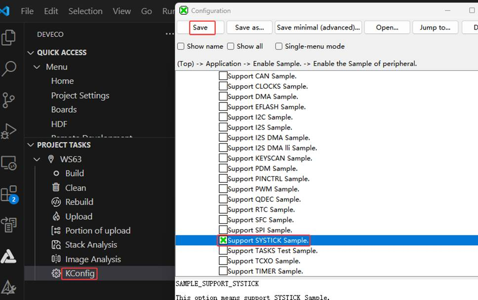

步骤2 点击”Build”或者”Rebuild”，编译完成如下图。

步骤3 点击Upload，等待出现”Connecting, please reset device...”字样时，然后按下开发板的reset按键进行烧录代码，如下图所示。

步骤4 代码烧录完成后，需要再按一次reset按键复位开发板才能代码运行起来。

步骤5  打开串口控制台工具Cfbb SerialCom可进行代码测试。

 

## 四、开发板外设实验案例

### 1．按键中断实验

（1）基本概述

① 实验内容

通过按键触发中断，在调试口输出按键中断成功的信息。

② 硬件要求

图中框选的按键为实验所用的按键。

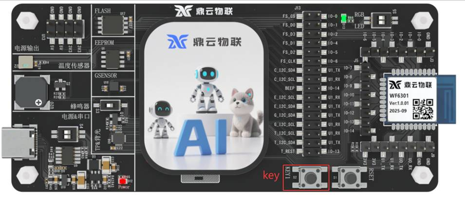

③ API介绍

| API                           | 功能                          |
| ----------------------------- | ----------------------------- |
| uapi_gpio_init()              | 初始化GPIO。                  |
| uapi_gpio_deinit()            | 去初始化GPIO。                |
| uapi_gpio_set_dir()           | 设置指定GPIO方向(输入/输出)。 |
| uapi_gpio_set_val()           | 设置指定GPIO电平状态。        |
| uapi_gpio_register_isr_func() | 注册指定GPIO中断。            |
| uapi_pin_set_mode()           | 设置指定引脚的工作模式。      |

 

（2）实现操作

步骤1 在src\application\samples\peripheral文件夹，右键选择”ZeroScript-Sample”，选择”Create Sample Floder”，命名为”button_interrupt”。

步骤2 将\vendor\DyCloud_WF6301_DK V1.0\demo\button_interrupt文件夹中的内容复制到步骤1创建的”button_interrupt”文件夹中。

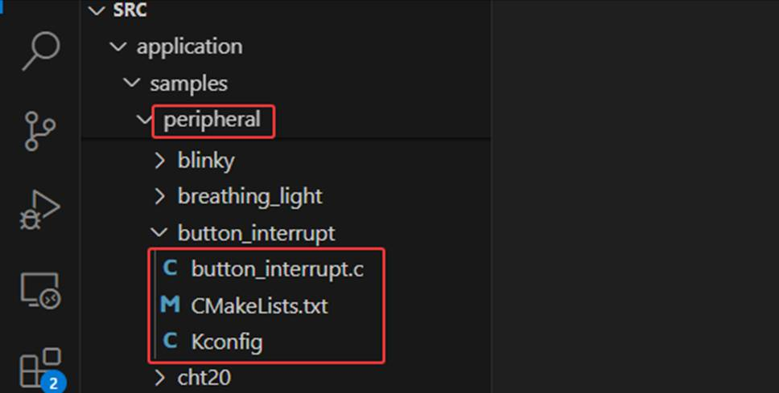

步骤3 确认peripheral文件目录下的CmakeLists是否生成了图中的内容。

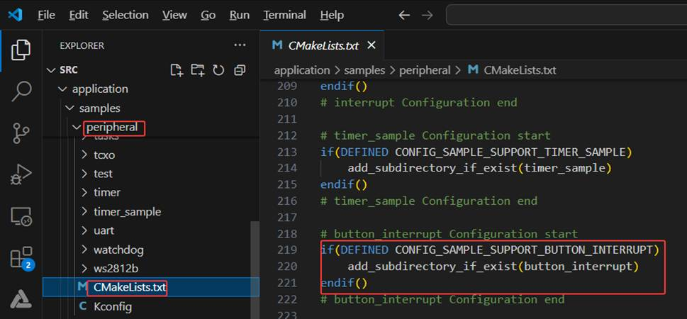

步骤4 确认peripheral文件目录下的Kconfig中是否生成了图中标记为1的内容，标记为2的部分需要手动添加。

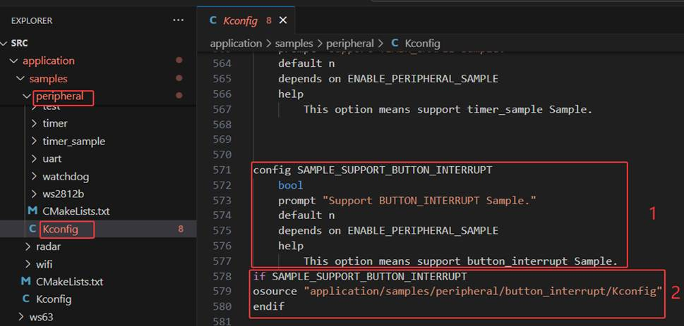

步骤5 如果在步骤1中创建文件时，命名不为”button_interrupt”，那么需要将复制到新建文件夹下的Kconfig文件中”depends on”后的”SAMPLE_SUPPORT_BUTTON_INTERRUPT”替换成peripheral文件目录下的Kconfig对应生成的”config SAMPLE_SUPPORT_XXX”的”SAMPLE_SUPPORT_XXX”。

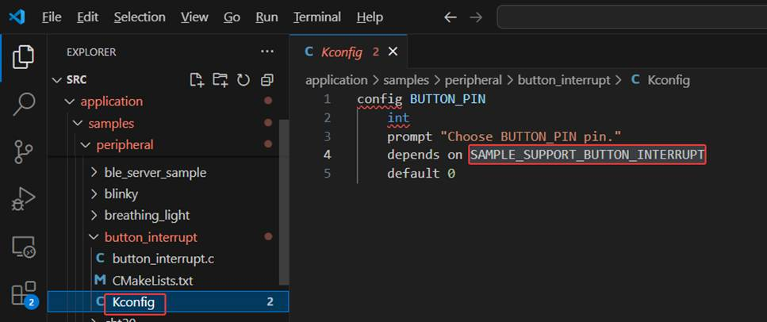

步骤6 点击PROJECT TASKS中的KConfig，具体选择路径“Application/Enable the Sample of peripheral”，选择”Support BUTTON_INTERRUPT Sample”，点击Save，关闭弹窗。如果在步骤1创建的文件夹命名不为”button_interrupt”,选择对应的选项即可。同时，只有按步骤5的方式修改后，这里的选择才能展开。

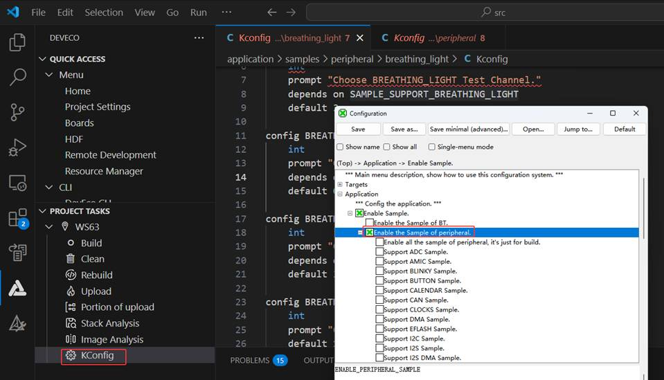

 

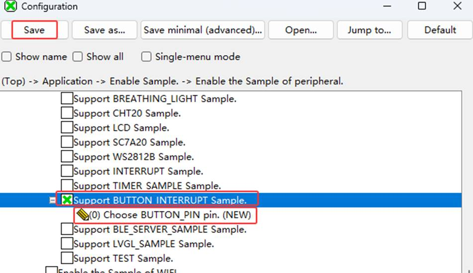

步骤7 点击”Build”或者”Rebuild”，编译完成如下图。

步骤8 点击Upload，等待出现”Connecting, please reset device...”字样时，然后按下开发板的reset按键进行烧录代码，如下图所示。

步骤9 代码烧录完成后，需要再按一次reset按键复位开发板才能代码运行起来。

 

### 2．呼吸灯实验

（1）基本概述

① 实验内容

通过PWM波实现LED灯的呼吸效果。

② 硬件要求

需要将下图所示开发板的LED的开关拨到on。

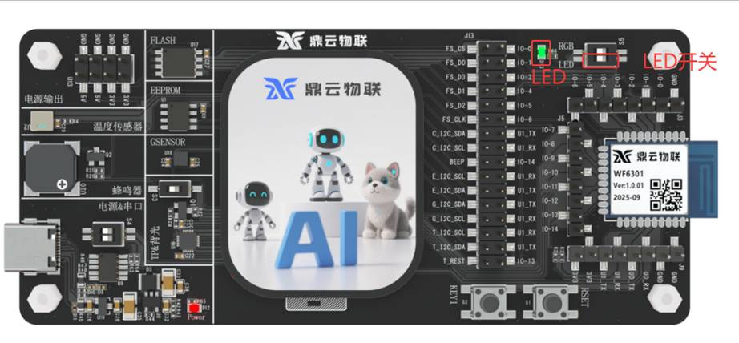

③ API介绍

| API                 | 功能                     |
| ------------------- | ------------------------ |
| uapi_pwm_init()     | 初始化PWM。              |
| uapi_pwm_deinit()   | 去初始化PWM。            |
| uapi_pwm_open()     | 打开PWM通道。            |
| uapi_pwm_close()    | 关闭PWM通道。            |
| uapi_pwm_start()    | 启动PWM信号输出          |
| uapi_pwm_stop()     | 停止PWM信号输出。        |
| uapi_pin_set_mode() | 设置指定引脚的工作模式。 |

 

（2）实现操作

步骤1 在src\application\samples\peripheral文件夹，右键选择“ZeroScript-Sample”，选择”Create Sample Floder”，命名为”breathing_light”。

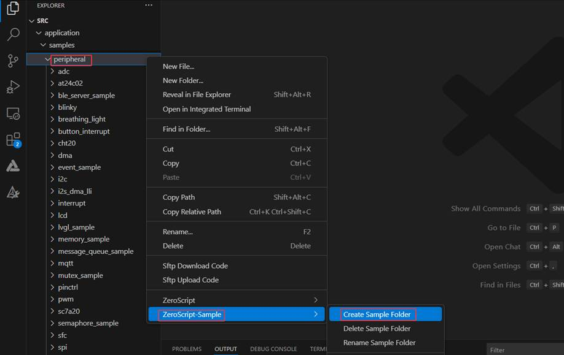

步骤2 将\vendor\DyCloud_WF6301_DK V1.0\demo\breathing_light文件夹中的内容复制到步骤1创建的”breathing_light“文件夹中。

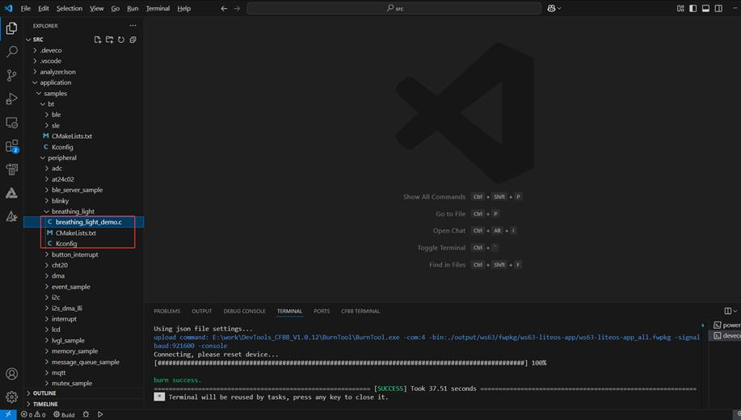

步骤3 确认peripheral文件目录下的CmakeLists是否生成了图中的内容。

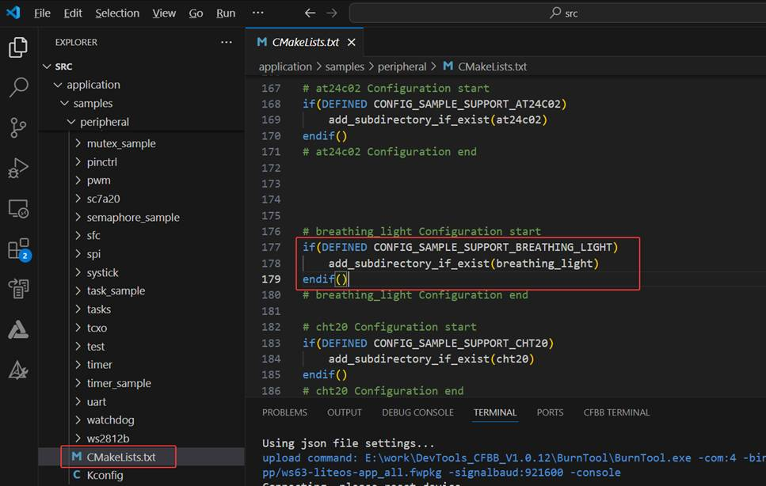

步骤4 确认peripheral文件目录下的Kconfig中是否生成了图中标记为1的内容，标记为2的部分需要手动添加。

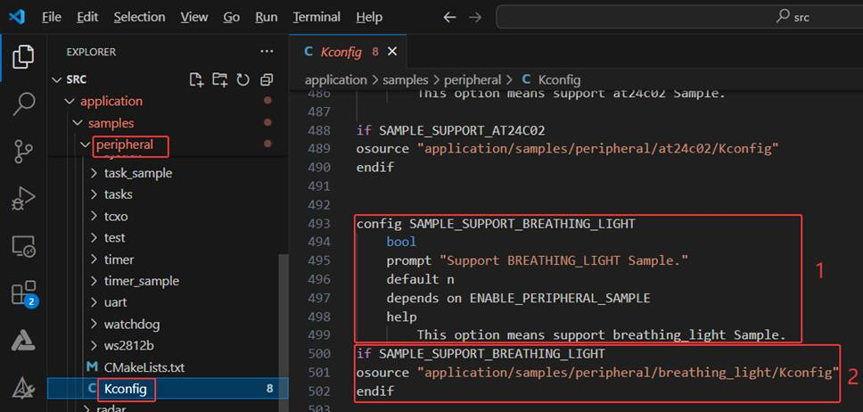

步骤5 如果在步骤1中创建文件时，命名不为”breathing_light”，那么需要将复制到新建文件夹下的Kconfig文件中所有”depends on”后的”SAMPLE_SUPPORT_BREATHING_LIGHT”替换成peripheral文件目录下的Kconfig对应生成的”config SAMPLE_SUPPORT_XXX”的”SAMPLE_SUPPORT_XXX”。

步骤6 点击PROJECT TASKS中的KConfig，具体选择路径“Application/Enable the Sample of peripheral”，选择”Support BREATHING_LIGHT Sample”，点击Save，关闭弹窗。如果在步骤1创建的文件夹命名不为”breathing_light”,选择对应的选项即可。同时，只有按步骤5的方式修改后，这里的选项才能展开。

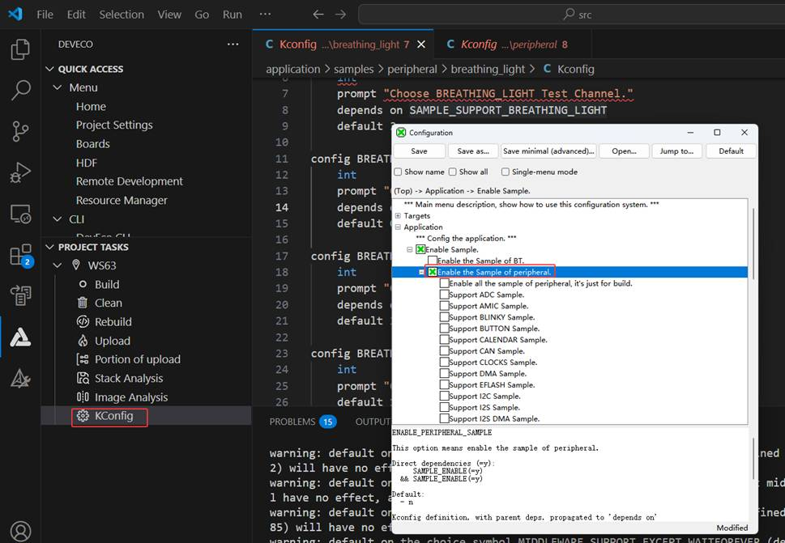

 

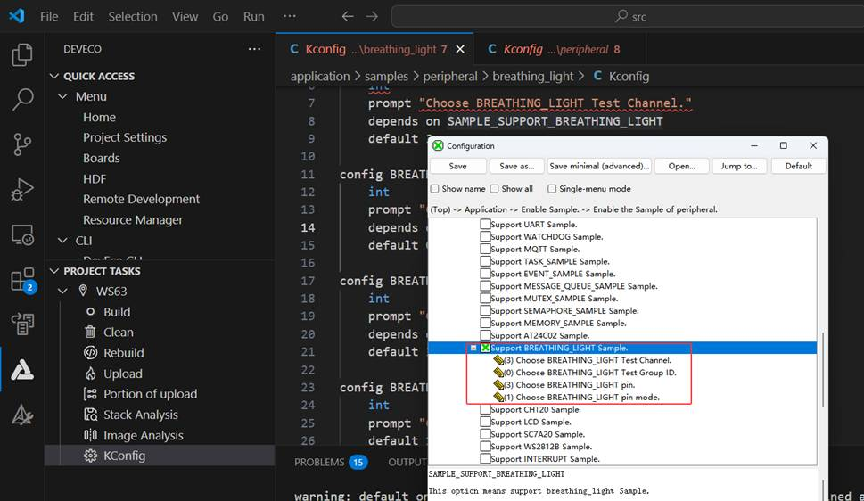

步骤7 点击”Build”或者”Rebuild”，编译完成如下图。

步骤8 点击Upload，等待出现”Connecting, please reset device...”字样时，然后按下开发板的reset按键进行烧录代码，如下图所示。

步骤9 代码烧录完成后，需要再按一次reset按键复位开发板才能代码运行起来。

### 3．WS2812（RGB彩灯）实验

（1）基本概述

① 实验内容

本实验通过PWM控制8个WS2812B LED灯的颜色变化，生成动态的彩虹灯效。

② 硬件要求

开发板的WS2812（RGB彩灯）在底层，同时，需要将下图框住的RGB开关拨到on。

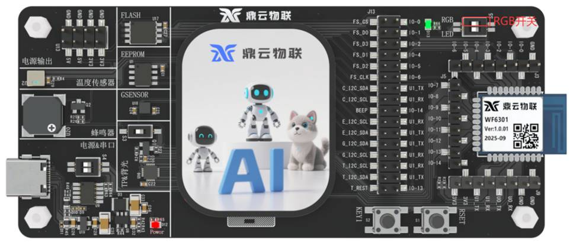

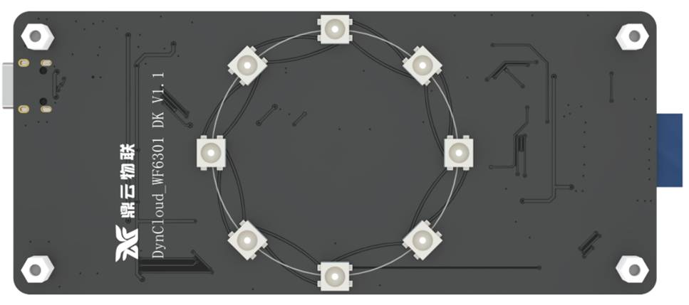

 

API介绍

| API                    | 功能                              |
| ---------------------- | --------------------------------- |
| uapi_pwm_init()        | 初始化 PWM 功能。                 |
| uapi_pwm_deinit()      | 去初始化PWM。                     |
| uapi_pwm_open()        | 打开PWM通道。                     |
| uapi_pwm_close()       | 关闭PWM通道。                     |
| uapi_pwm_start()       | 启动PWM信号输出                   |
| uapi_pwm_stop()        | 停止PWM信号输出。                 |
| uapi_pwm_start_group() | 启动指定分组的PWM。               |
| uapi_pwm_set_group()   | 设置 PWM 组，指定通道和通道数量。 |
| uapi_pin_set_mode()    | 设置指定引脚的工作模式。          |

 

（2）实现操作

步骤1 在src\application\samples\peripheral文件夹，右键选择“ZeroScript-Sample”，选择”Create Sample Floder”，命名为”ws2812b”。

步骤2 将\vendor\DyCloud_WF6301_DK V1.0\demo\ws2812b文件夹中的内容复制到步骤1创建的”ws2812b“文件夹中。

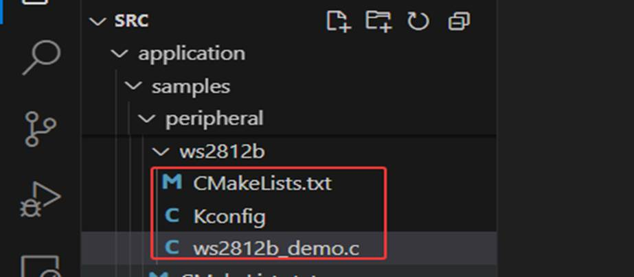

步骤3 确认peripheral文件目录下的CmakeLists是否生成了图中的内容。

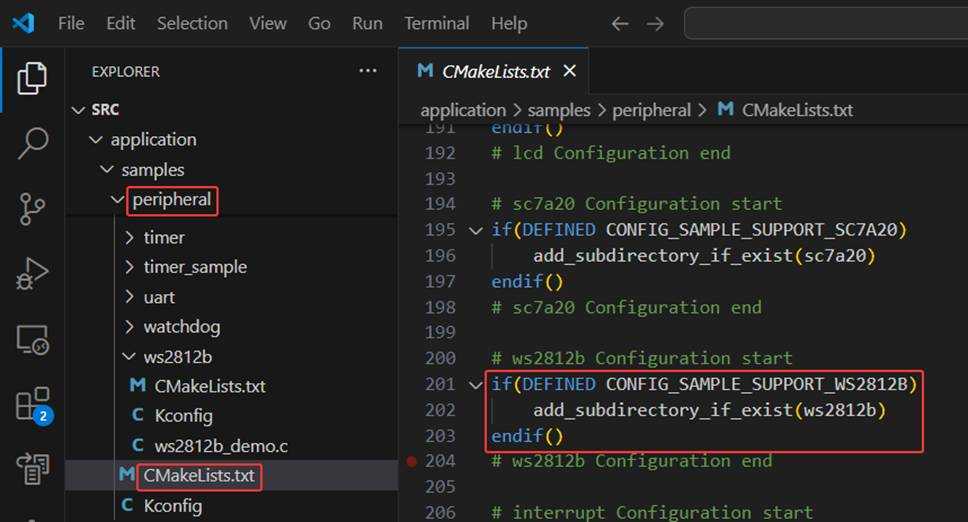

步骤4 确认peripheral文件目录下的Kconfig中是否生成了图中标记为1的内容，标记为2的部分需要手动添加。

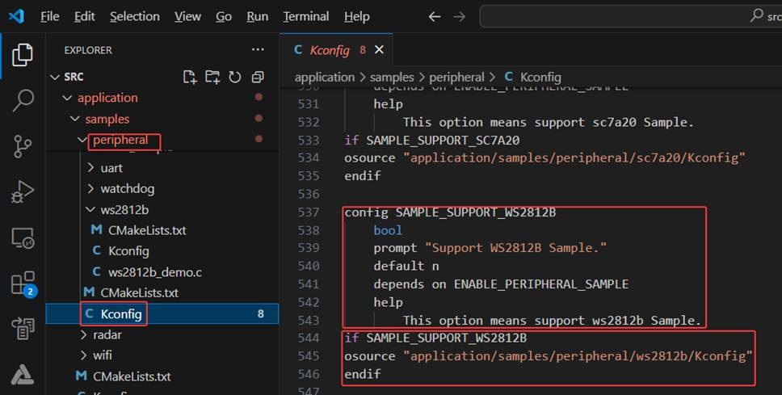

步骤5 如果在步骤1中创建文件时，命名不为”ws2812b”，那么需要将复制到新建文件夹下的Kconfig文件中所有”depends on”后的”SAMPLE_SUPPORT_WS2812B”（如下图所示）替换成peripheral文件目录下的Kconfig生成的”config SAMPLE_SUPPORT_XXX”中对应的”SAMPLE_SUPPORT_XXX”。

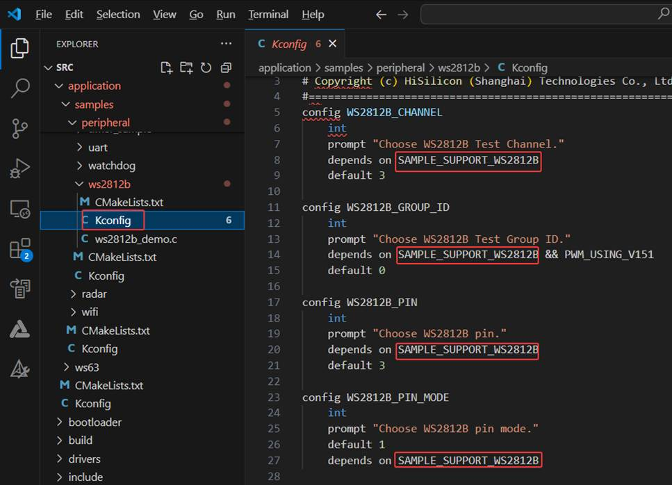

步骤6 点击PROJECT TASKS中的KConfig，具体选择路径”Application/Enable the Sample of peripheral”，选择”Support WS2812B Sample”，点击Save，关闭弹窗。如果在步骤1创建的文件夹命名不为”ws2812b”,选择对应的选项即可。同时，只有按步骤5的方式修改后，这里的选项才能展开。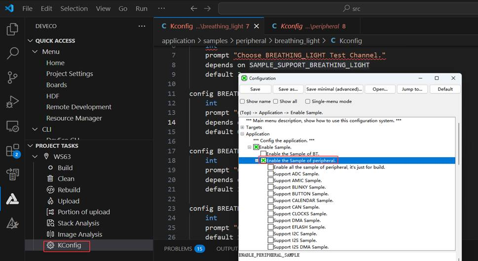

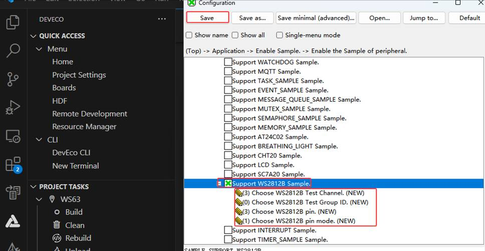

步骤7 点击”Build”或者”Rebuild”，编译完成如下图。

步骤8 点击Upload，等待出现”Connecting, please reset device...”字样时，然后按下开发板的reset按键进行烧录代码。如下图所示。

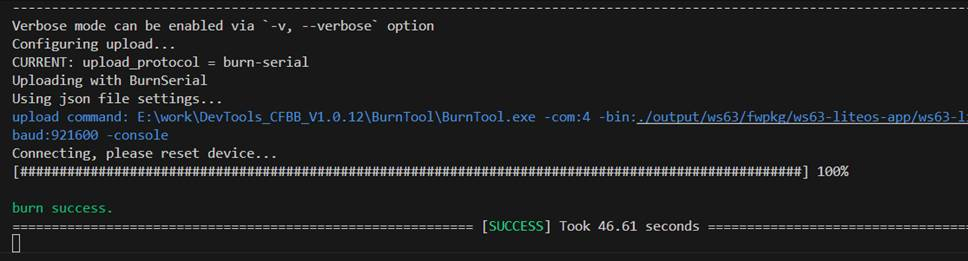

步骤9 代码烧录完成后，需要再按一次reset按键复位开发板才能代码运行起来。

 

### 4．AT24C64（EEPROM芯片）读写实验

（1）基本概述

① 实验内容

通过IIC协议与开发板上的EEPROM芯片AT24C64进行读写操作，调试串口输出信息到终端。

② 硬件要求

将图中框选的IIC引脚用跳线帽连接，使得AT24C640和WF6301完成硬件连接。

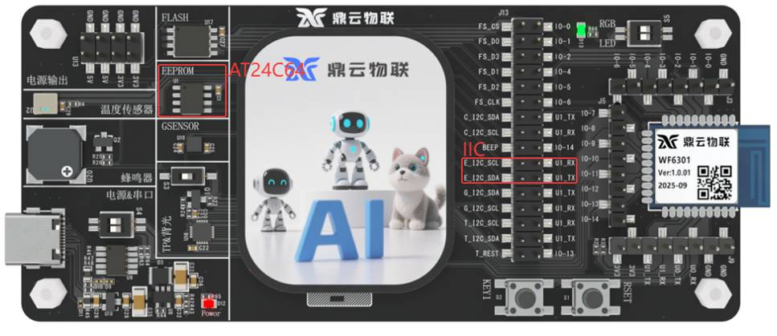

③ API介绍

| API                     | 功能                                                         |
| ----------------------- | ------------------------------------------------------------ |
| uapi_i2c_master_init()  | 初始化该 I2C 设备为主机，需要传入的参数有总线号、波特率、高速模式主机码 (WS63 不支持高速模式，传入0即可). |
| uapi_i2c_master_write() | 12C主机将数据发送到目标从机上,使用轮询模式。                 |
| uapi_i2c_master_read()  | 主机接收来自目标I2C从机的数据,使用轮询模式。                 |
| uapi_pin_set_mode()     | 设置指定引脚的工作模式。                                     |

 

（2）实现操作

步骤1 在src\application\samples\peripheral文件夹，右键选择“ZeroScript-Sample”，点击”Create Sample Floder”，命名为”at24c64”。

步骤2 将\vendor\DyCloud_WF6301_DK V1.0\demo\at24c64文件夹中的内容复制到步骤1创建的”at24c64“文件夹中。

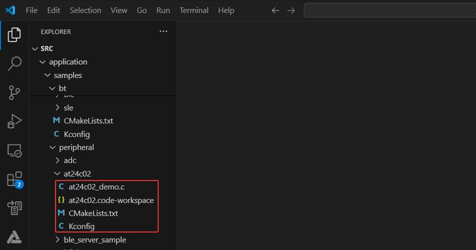

步骤3 确认peripheral文件目录下的CmakeLists是否生成了图中的内容。

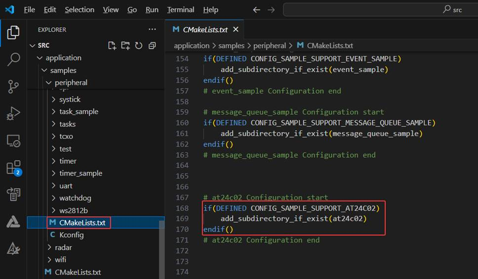

步骤4 确认peripheral文件目录下的Kconfig中是否生成了图中标记为1的内容，标记为2的部分需要手动添加。

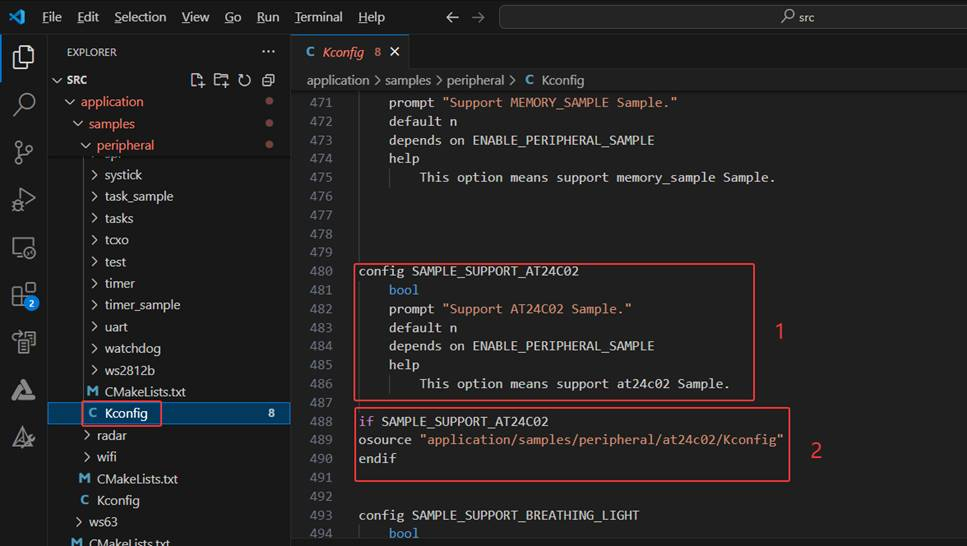

步骤5 如果在步骤1中创建文件时，命名不为”at24c64”，那么需要将复制到新建文件夹下的Kconfig文件中所有”depends on”的”SAMPLE_SUPPORT_AT24C64”替换成peripheral文件目录下的Kconfig生成的”config SAMPLE_SUPPORT_XXX”中对应的”SAMPLE_SUPPORT_XXX”。

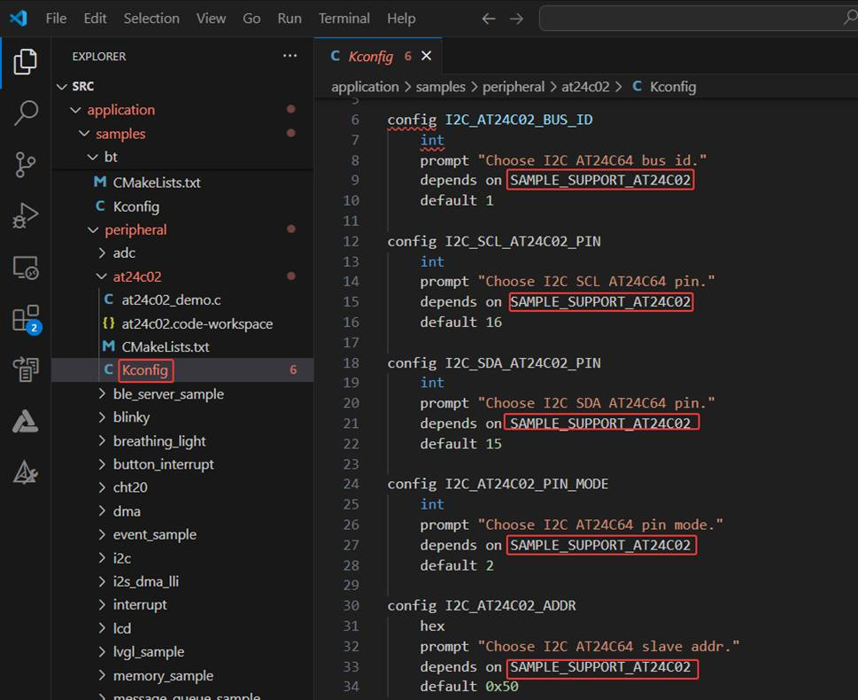

步骤6 点击PROJECT TASKS中的KConfig，具体选择路径“Application/Enable the Sample of peripheral”，选择”Support AT24C64 Sample”，点击Save，关闭弹窗。如果在步骤1创建的文件夹命名不为”at24c64”，选择对应的选项即可。同时，只有按步骤5的方式修改后，这里的选项才能展开。

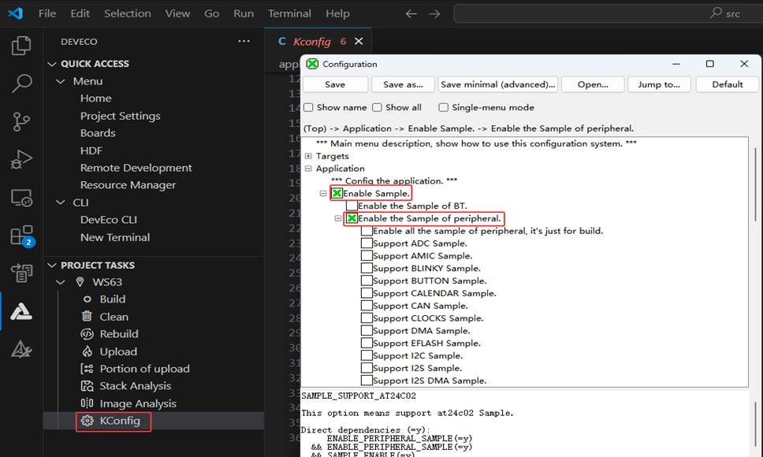

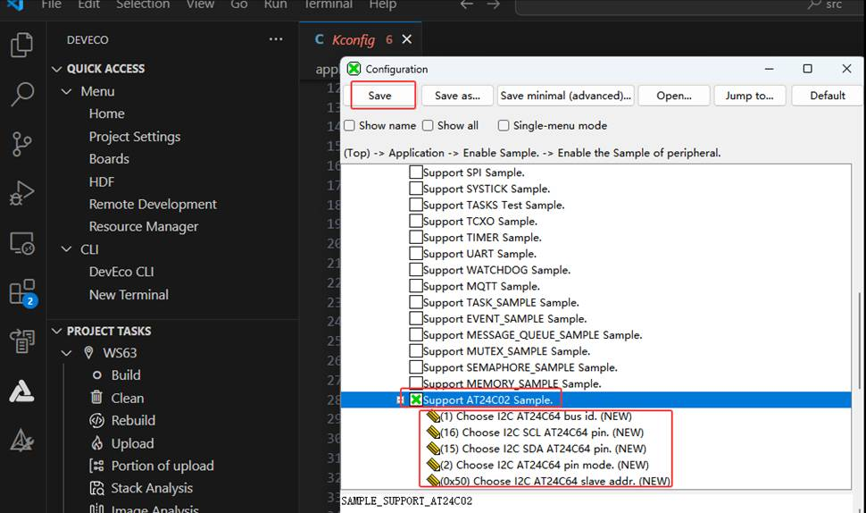

步骤7 点击”Build”或者”Rebuild”，编译完成如下图。

步骤8 点击Upload，等待出现”Connecting, please reset device...”字样时，然后按下开发板的reset按键进行烧录代码。如下图所示。

步骤9 代码烧录完成后，需要再按一次reset按键复位开发板才能代码运行起来。

 

### 5．温湿度传感器实验

（1）基本概述

① 实验内容

通过IIC协议与开发板上的cht20温湿度传感器进行通信，读取并处理数据，调试串口输出信息到终端。

② 硬件要求

将图中框选的IIC引脚用跳线帽连接，完成cht20和芯片的连接。

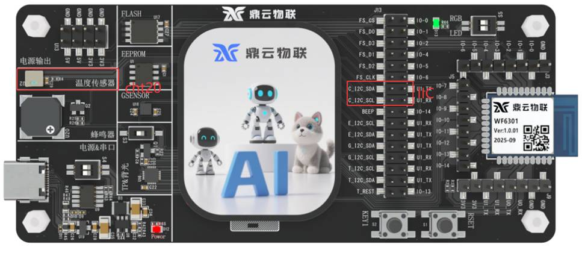

③ API介绍

| API                     | 功能                                                         |
| ----------------------- | ------------------------------------------------------------ |
| uapi_i2c_master_init()  | 初始化该 I2C 设备为主机，需要传入的参数有总线号、波特率、高速模式主机码 (WS63 不支持高速模式，传入0即可). |
| uapi_i2c_master_write() | 12C主机将数据发送到目标从机上,使用轮询模式。                 |
| uapi_i2c_master_read()  | 主机接收来自目标I2C从机的数据,使用轮询模式。                 |
| uapi_pin_set_mode()     | 设置指定引脚的工作模式                                       |

 

（2）实现操作

步骤1 在src\application\samples\peripheral文件夹，右键选择“ZeroScript-Sample”，选择”Create Sample Floder”，命名为”cht20”。

步骤2 将\vendor\DyCloud_WF6301_DK V1.0\demo\cht20文件夹中的内容复制到步骤1创建的”cht20“文件夹中。

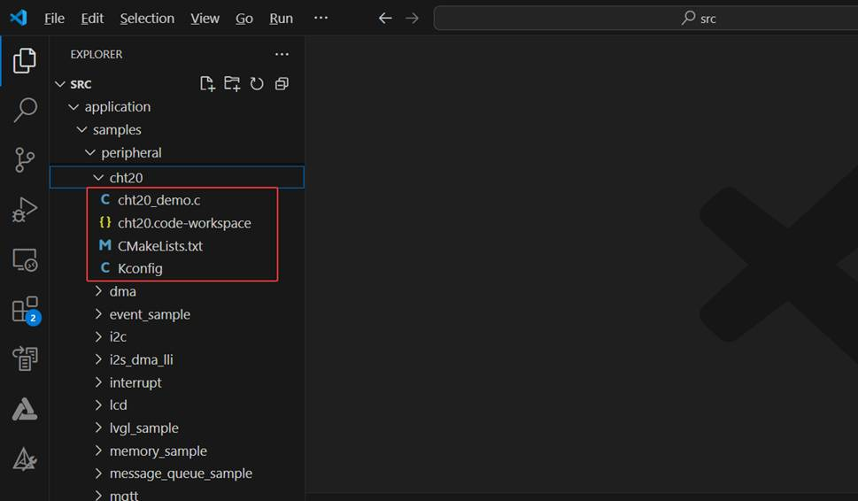

步骤3 确认peripheral文件目录下的CmakeLists是否生成了图中的内容。

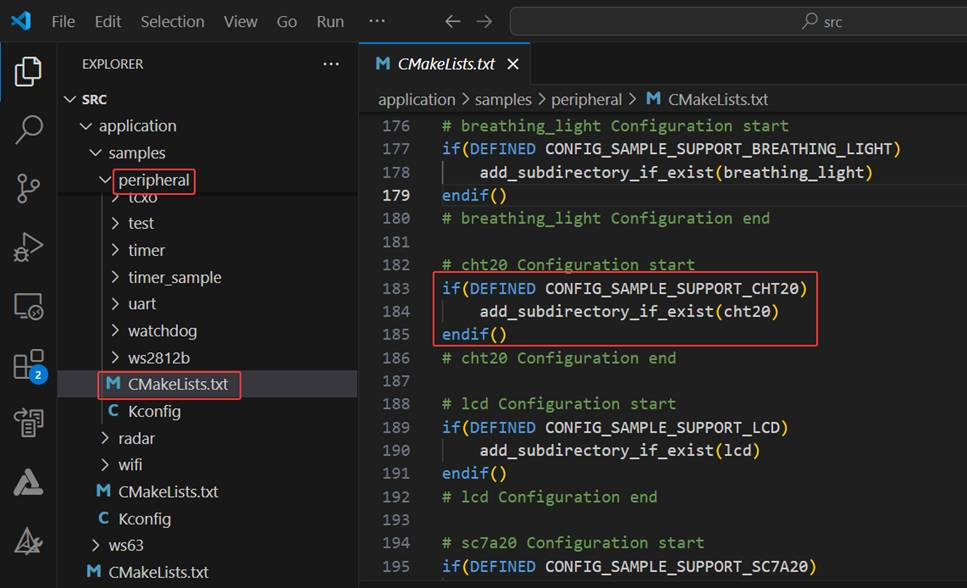

步骤4 确认peripheral文件目录下的Kconfig中是否生成了图中标记为1的内容，标记为2的部分需要手动添加。

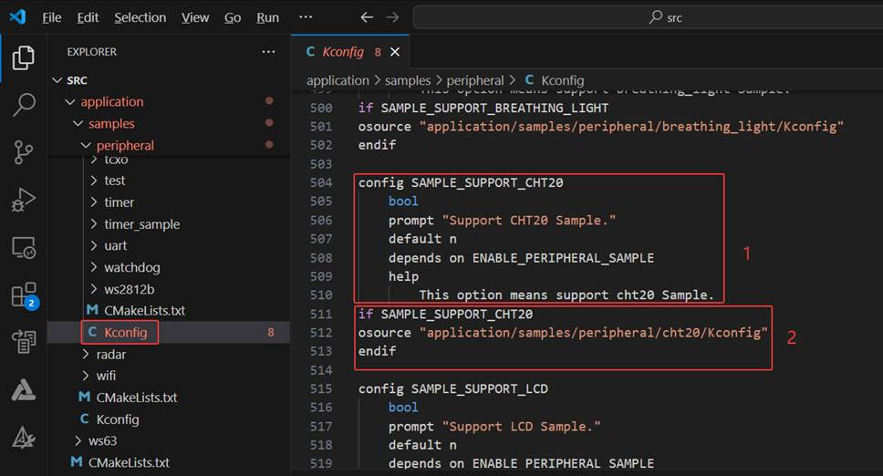

步骤5 如果在步骤1中创建文件时，命名不为”cht20”，那么需要将复制到新建文件夹下的Kconfig文件中所有”depends on”后的”SAMPLE_SUPPORT_CHT20”替换成peripheral文件目录下的Kconfig生成的”config SAMPLE_SUPPORT_XXX”中对应的”SAMPLE_SUPPORT_XXX”。

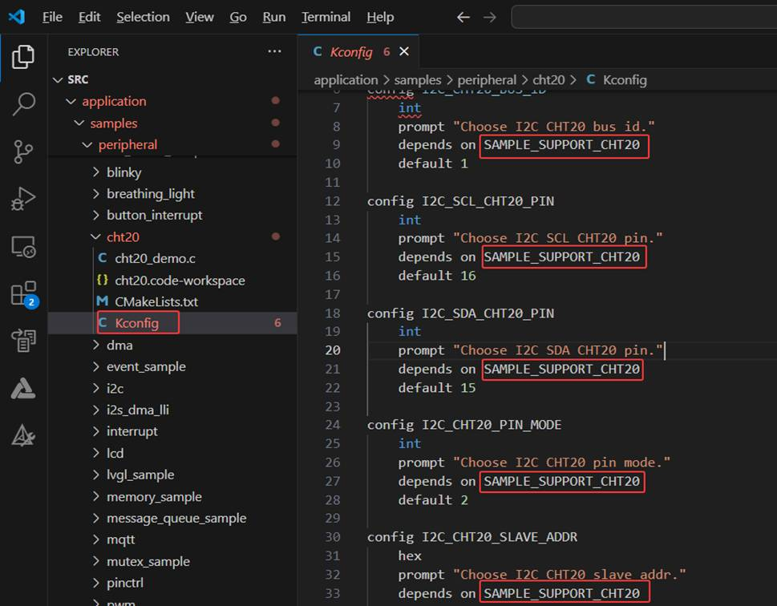

步骤6 点击PROJECT TASKS中的KConfig，具体选择路径“Application/Enable the Sample of peripheral”，选择”Support CHT20 Sample”，点击Save，关闭弹窗。如果在步骤1创建的文件夹命名不为”cht20”,选择对应的选项即可。同时，只有按步骤5的方式修改后，这里的选项才能展开。

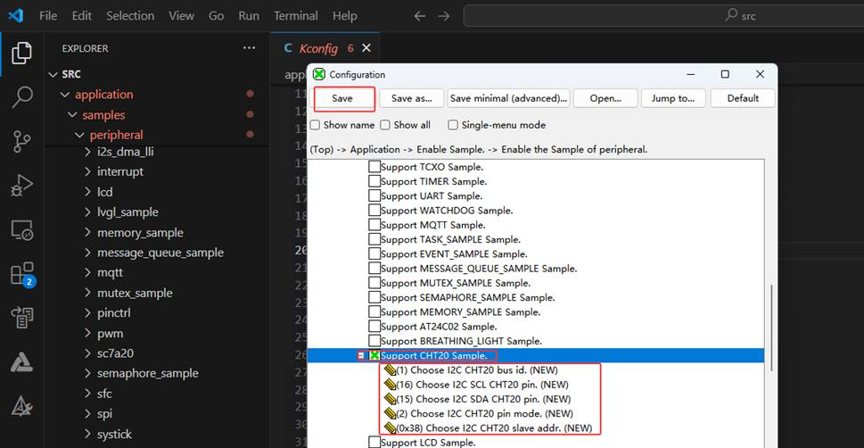

步骤7 点击”Build”或者”Rebuild”，编译完成如下图。

步骤8 点击Upload，等待出现”Connecting, please reset device...”字样时，然后按下开发板的reset按键进行烧录代码。如下图所示。

步骤9 代码烧录完成后，需要再按一次reset按键复位开发板才能代码运行起来。

 

### 6．SC7A20（姿态传感器）实验

（1）基本概述

① 实验内容

本实验通过IIC协议从开发板上的姿态传感器SC7A20获取姿态数据，调试串口输出信息到终端。

② 硬件要求

将下图中框选的IIC引脚用跳线帽连接。

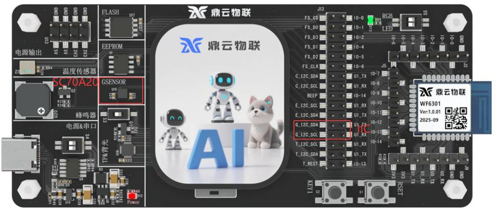

③ API介绍

| API                     | 功能                                                         |
| ----------------------- | ------------------------------------------------------------ |
| uapi_i2c_master_init()  | 初始化该 I2C 设备为主机，需要传入的参数有总线号、波特率、高速模式主机码 (WS63 不支持高速模式，传入0即可). |
| uapi_i2c_master_write() | 12C主机将数据发送到目标从机上,使用轮询模式。                 |
| uapi_i2c_master_read()  | 主机接收来自目标I2C从机的数据,使用轮询模式。                 |
| uapi_pin_set_mode()     | 设置指定引脚的工作模式                                       |

 

（2）实现操作

步骤1 在src\application\samples\peripheral文件夹，右键选择“ZeroScript-Sample”，选择”Create Sample Floder”，命名为”sc7a20”。

步骤2 将\vendor\DyCloud_WF6301_DK V1.0\demo\sc7a20文件夹中的内容复制到步骤1创建的”sc7a20“文件夹中。

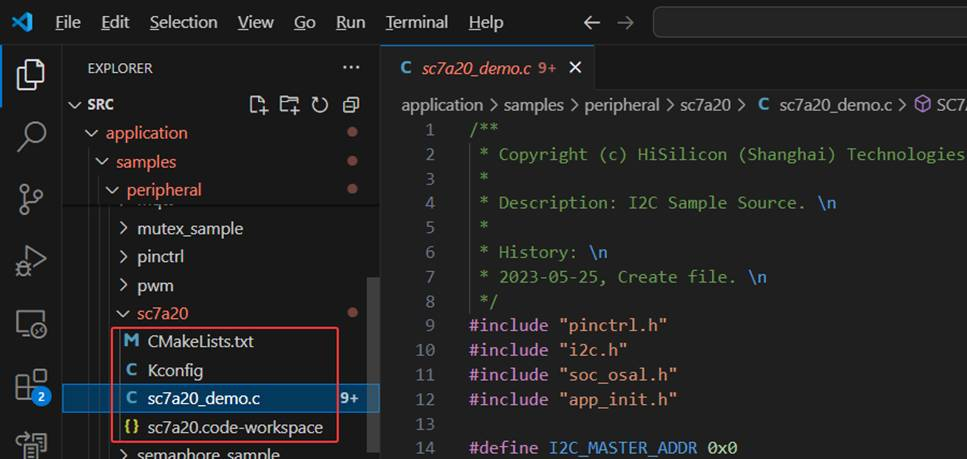

步骤3 确认peripheral文件目录下的CmakeLists是否生成了图中的内容。

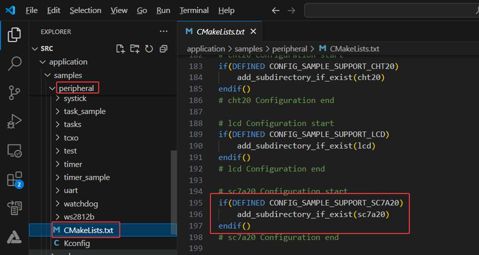

步骤4 确认peripheral文件目录下的Kconfig中是否生成了下图中标记为1的内容，标记为2的部分需要手动添加。

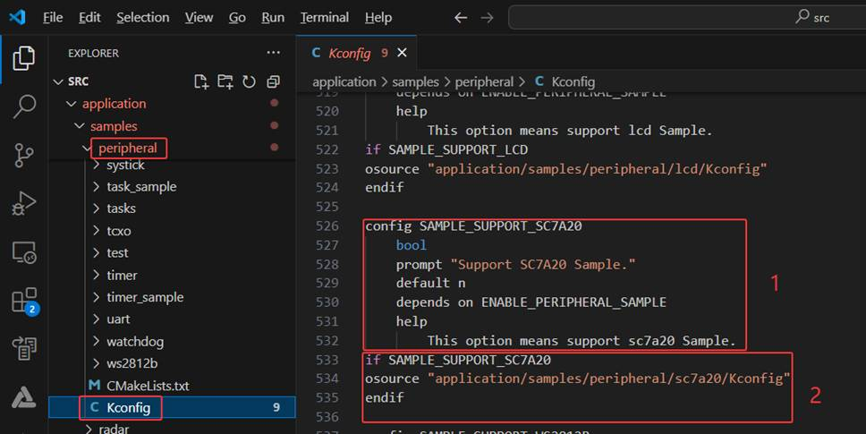

步骤5 如果在步骤1中创建文件时，命名不为”sc7a20”，那么需要将复制到新建文件夹下的Kconfig文件中所有”depends on”的”SAMPLE_SUPPORT_SC74A20”替换成peripheral文件目录下的Kconfig生成的”config SAMPLE_SUPPORT_XXX”中对应的”SAMPLE_SUPPORT_XXX”。

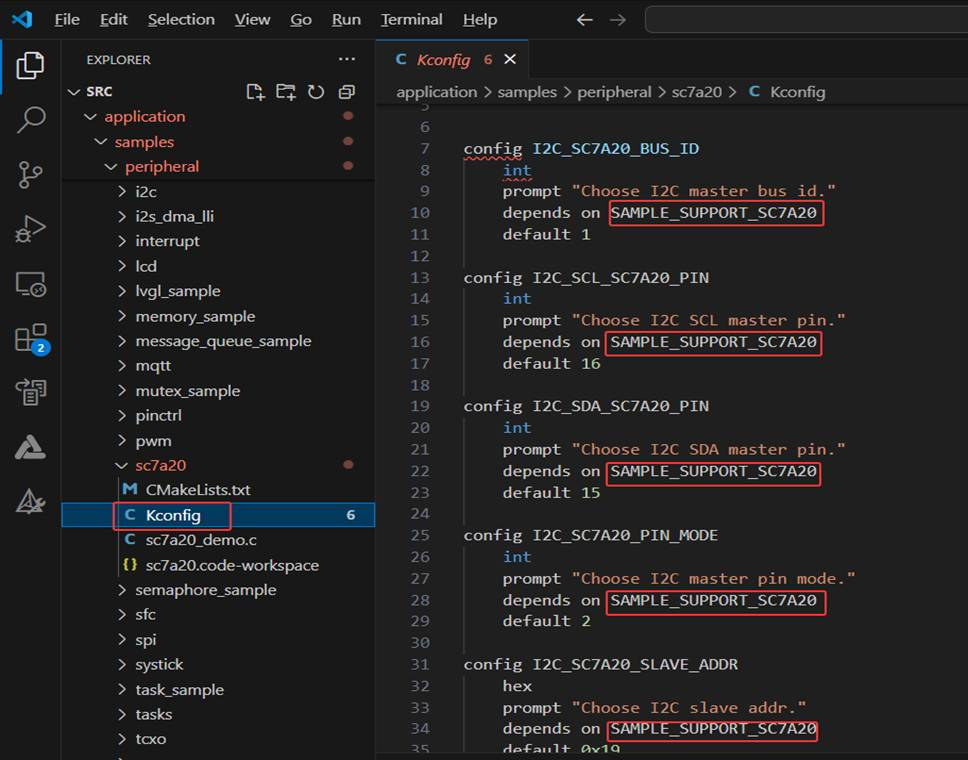

步骤6 点击PROJECT TASKS中的KConfig，具体选择路径“Application/Enable the Sample of peripheral”，选择”Support SC7A20 Sample”，点击Save，关闭弹窗。如果在步骤1创建的文件夹命名不为”sc7a20”，选择对应的选项即可。同时，只有按步骤5的方式修改后，这里的选项才能展开。

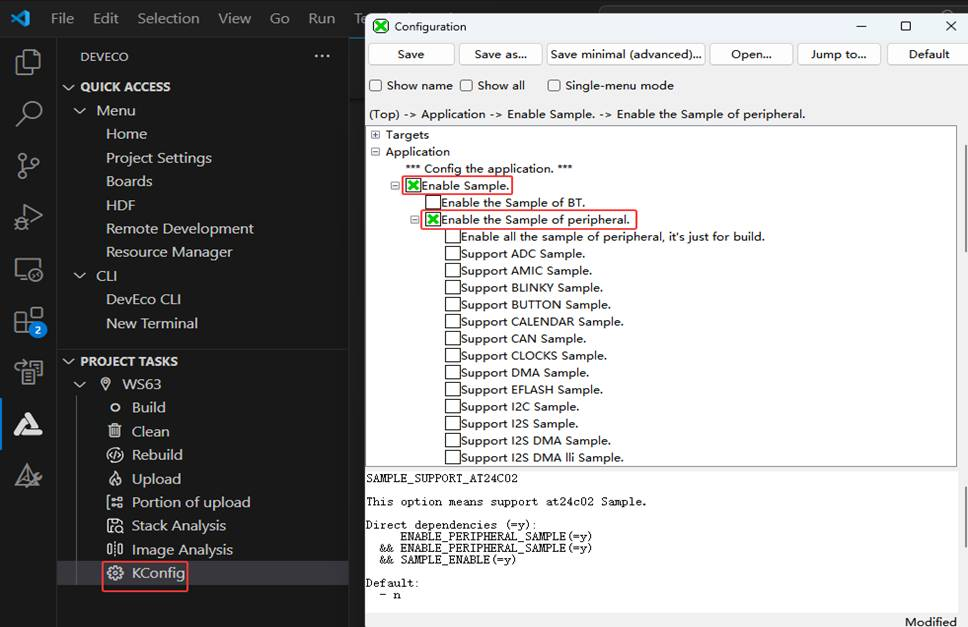

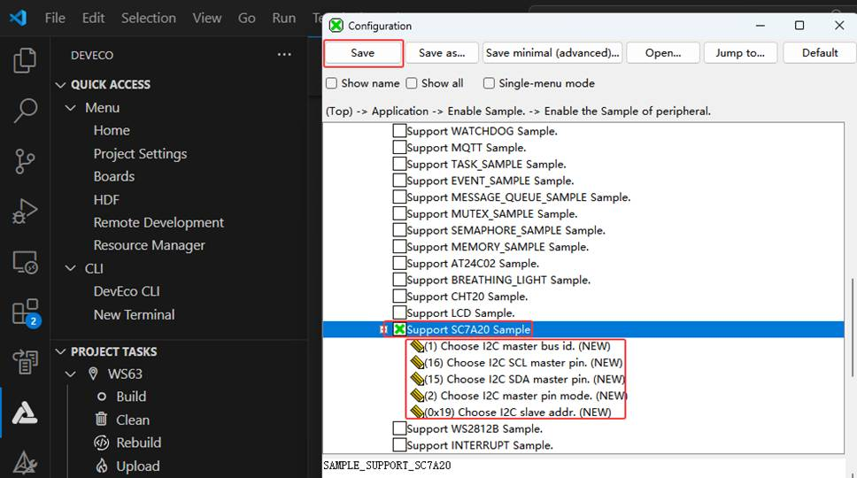

步骤7 点击”Build”或者”Rebuild”，编译完成如下图。

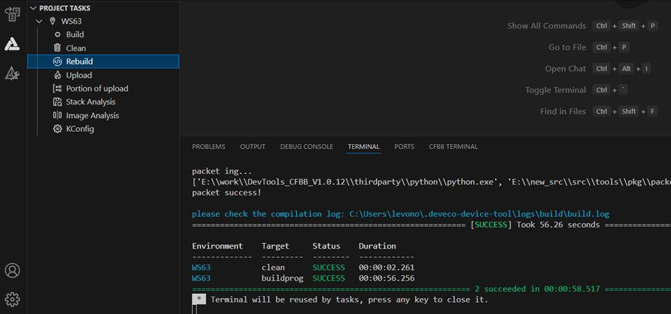

步骤8 点击Upload，等待出现”Connecting, please reset device...”字样时，然后按下开发板的reset按键进行烧录代码，如下图所示。

步骤9 代码烧录完成后，需要再按一次reset按键复位开发板才能代码运行起来。

 

### 7．LCD实验

（1）基本概述

① 实验内容

本实验通过SPI协议驱动开发板上的LCD显示图片。

② 硬件要求

LCD已经与WF6301的引脚连接，不需要额外进行连接。

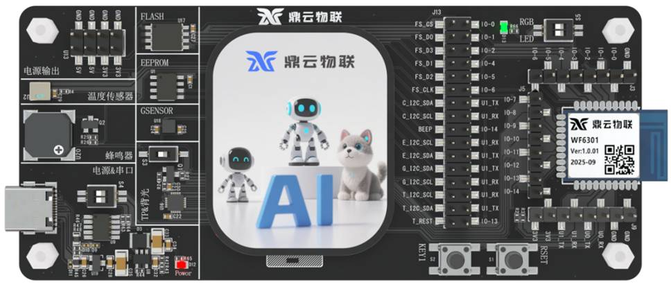

③ API介绍

| API                     | 功能                                                         |
| ----------------------- | ------------------------------------------------------------ |
| uapi_i2c_master_init()  | 初始化该 I2C 设备为主机，需要传入的参数有总线号、波特率、高速模式主机码 (WS63 不支持高速模式，传入0即可)。 |
| uapi_i2c_master_write() | 12C主机将数据发送到目标从机上，使用轮询模式。                |
| uapi_i2c_master_read()  | 主机接收来自目标I2C从机的数据，使用轮询模式。                |
| uapi_pin_set_mode()     | 设置指定引脚的工作模式。                                     |

 

（2）实现操作

步骤1 在src\application\samples\peripheral文件夹，右键选择“ZeroScript-Sample”，选择”Create Sample Floder”，命名为”lcd”。

步骤2 将\vendor\DyCloud_WF6301_DK V1.0\demo\lcd文件夹中的内容复制到步骤1创建的”lcd”文件夹中。

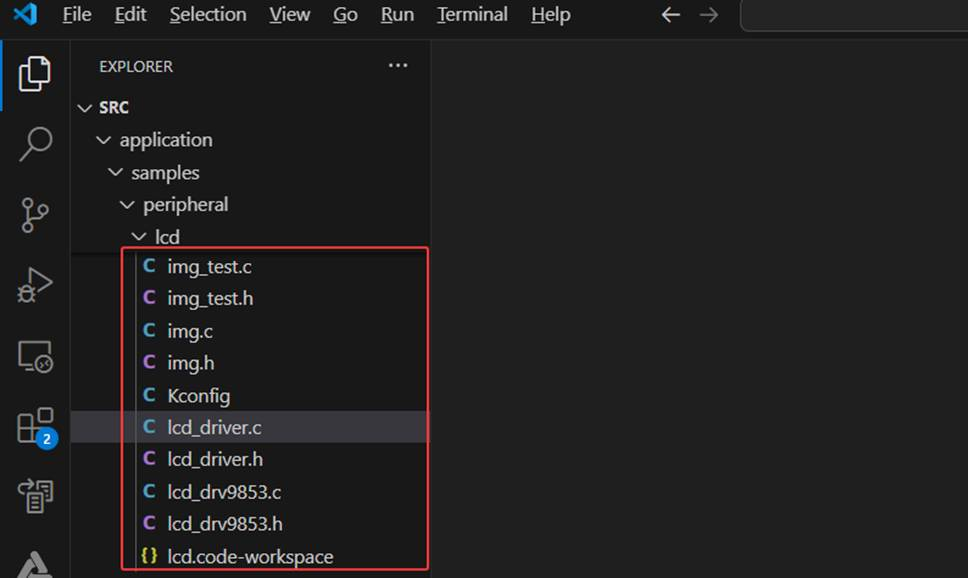

步骤3 确认peripheral文件目录下的CmakeLists是否生成了图中的内容。

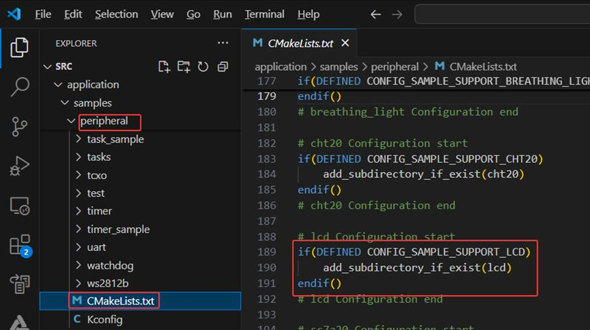

步骤4 确认peripheral文件目录下的Kconfig中是否生成了下图中标记为1的内容，标记为2的部分需要手动添加。

步骤5 如果在步骤1中创建文件时，命名不为”lcd”，那么需要将复制到新建文件夹下的Kconfig文件中所有”depends on”的”SAMPLE_SUPPORT_LCD ”替换成peripheral文件目录下的Kconfig生成的”config SAMPLE_SUPPORT_XXX”中对应的”SAMPLE_SUPPORT_XXX”。

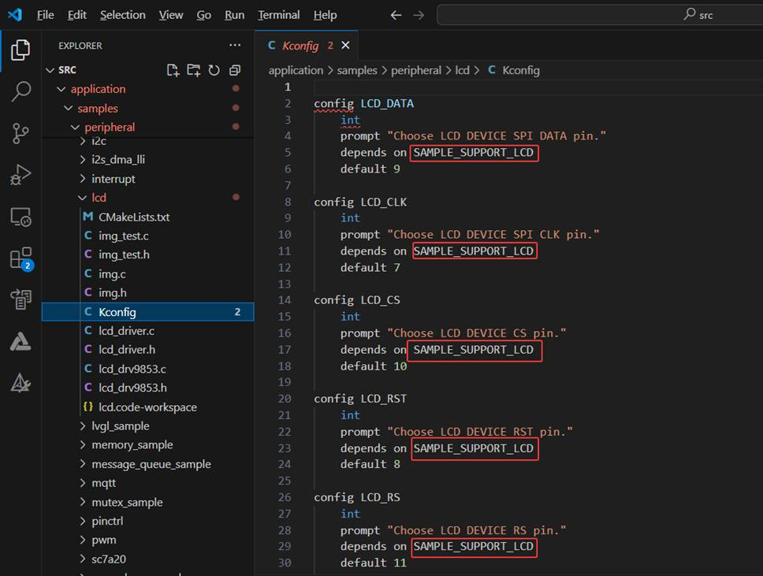

步骤6 点击PROJECT TASKS中的KConfig，具体选择路径“Application/Enable the Sample of peripheral”，选择”Support LCD Sample”，点击Save，关闭弹窗。如果在步骤1创建的文件夹命名不为”lcd”，选择对应的选项即可。同时，只有按步骤5的方式修改后，这里的选项才能展开。

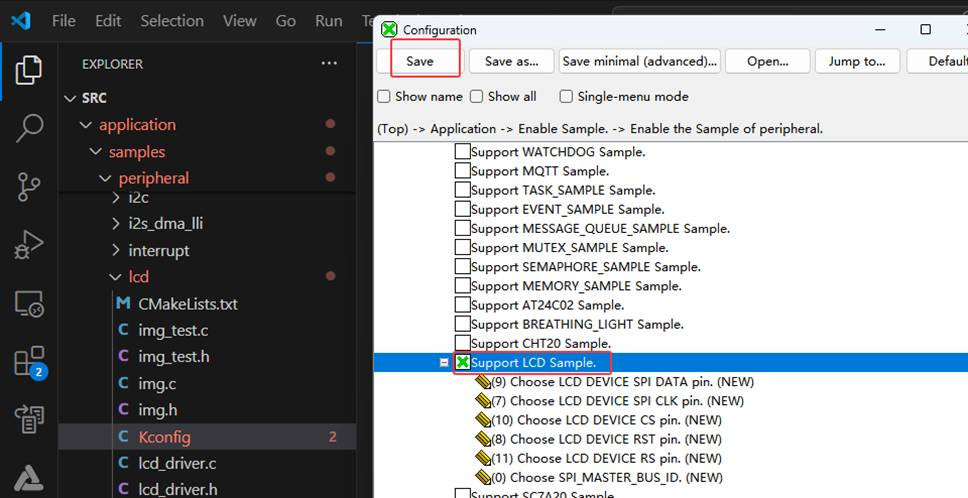

步骤7 点击”Build”或者”Rebuild”，编译完成如下图。

步骤8 点击Upload，等待出现”Connecting, please reset device...”字样时，然后按下开发板的reset按键进行烧录代码，如下图所示。

步骤9 代码烧录完成后，需要再按一次reset按键复位开发板才能代码运行起来。

 

## 五、操作系统实验案例

### 1．线程创建实验

（1）基本概述

① 实验内容

本次实验实现了两个优先级相同的任务（任务A和任务B）并行执行的示例。

② 技术背景

任务是竞争系统资源的最小运行单元。任务可以使用或等待CPU、使用内存空间等系统资源，并独立于其它任务运行。本系统任务模块可以给用户提供多个任务，实现任务间的切换，帮助用户管理业务程序流程。

本系统任务模块具有如下特性：

l 支持多任务。

l 一个任务表示一个线程。

l 抢占式调度机制，高优先级的任务可打断低优先级任务，低优先级任务必须在高优先级任务阻塞或结束后才能得到调度。

l 相同优先级任务支持时间片轮转调度方式。

l 共有32个优先级[0-31]，最高优先级为0，最低优先级为31。

③ API介绍

| API                        | 功能                 |
| -------------------------- | -------------------- |
| osal_sem_init()            | 创建信号量。         |
| osal_sem_binary_sem_init() | 创建二进制信号量。   |
| osal_sem_down_timeout()    | 阻塞获取指定信号量。 |
| osal_sem_up()              | 释放指定信号量。     |
| osal_kthread_destroy()     | 用于销毁创建的线程。 |

 

（2）实现操作

步骤1 在src\application\samples\peripheral文件夹，右键选择“ZeroScript-Sample”，选择”Create Sample Floder”，命名为”task_sample”。

步骤2 将\vendor\DyCloud_WF6301_DK V1.0\demo\task_sample文件夹中的内容复制到步骤1创建的”task_sample“文件夹中。

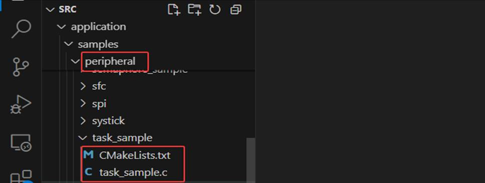

步骤3 确认peripheral文件目录下的CmakeLists是否生成了图中的内容。

步骤4 确认peripheral文件目录下的Kconfig中是否生成了下图中框选的内容。

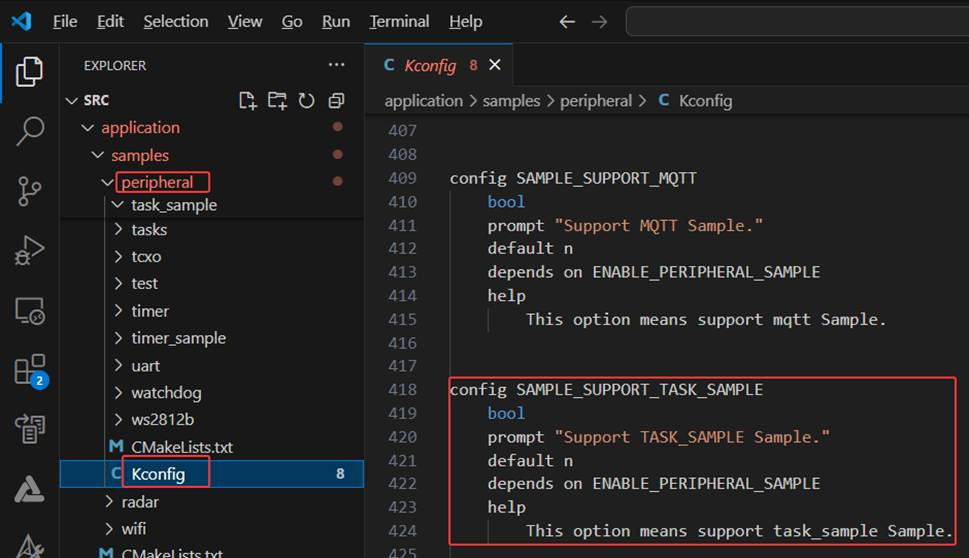

步骤6 点击PROJECT TASKS中的KConfig，具体选择路径“Application/Enable the Sample of peripheral”，选择”Support TASK_SAMPLE Sample”，点击Save，关闭弹窗。

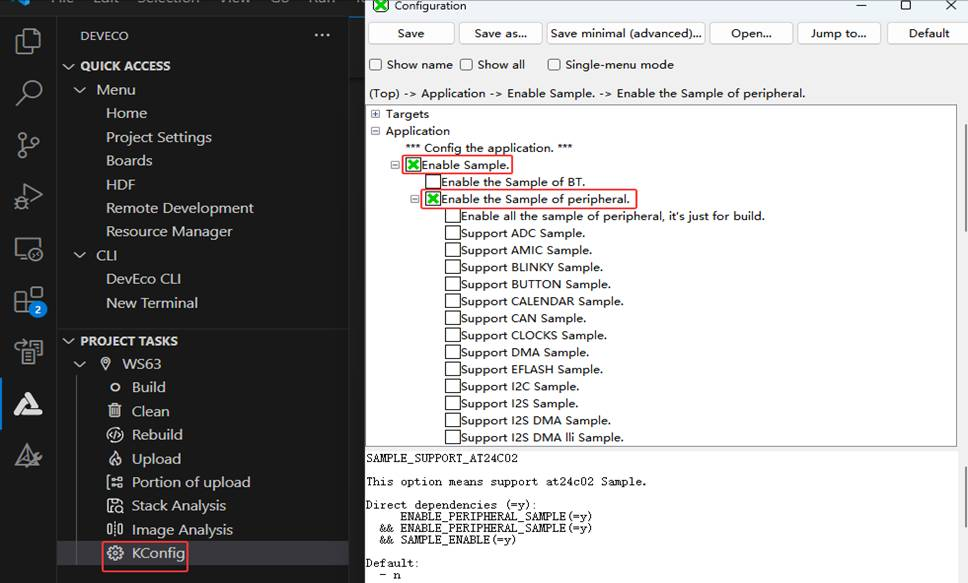

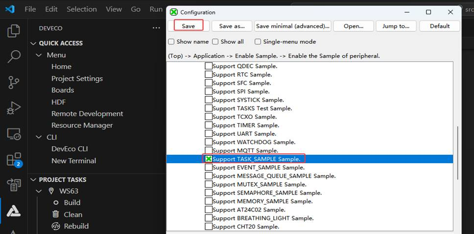

步骤7 点击”Build”或者”Rebuild”，编译完成如下图。

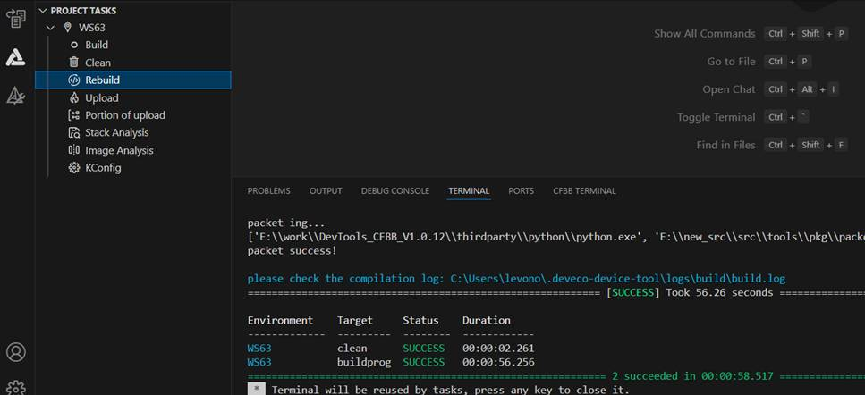

步骤8 点击Upload，等待出现”Connecting, please reset device...”字样时，然后按下开发板的reset按键进行烧录代码，如下图所示。

步骤9 代码烧录完成后，需要再按一次reset按键复位开发板才能代码运行起来。

 

### 2．信号量实验

（1）基本概述

① 实验内容

本实验利用信号量实现两个任务间的同步，其中一个任务阻塞等待信号量另一个任务延时后释放信号量，唤醒等待任务继续执行。

② 技术背景

信号量（Semaphore）是一种实现任务间通信的机制，可以实现任务间同步或共享资源的互斥访问。一个信号量的数据结构中，通常有一个计数值，用于对有效资源数的计数，表示剩下的可被使用的共享资源数，其值的含义分两种情况：

l 0，表示该信号量当前不可获取，因此可能存在正在等待该信号量的任务。

l 正值，表示该信号量当前可被获取。

③ API介绍

| API                        | 功能                 |
| -------------------------- | -------------------- |
| osal_sem_init()            | 创建信号量。         |
| osal_sem_binary_sem_init() | 创建二进制信号量。   |
| osal_sem_down_timeout()    | 阻塞获取指定信号量。 |
| osal_sem_up()              | 释放指定信号量。     |
| osal_kthread_destroy()     | 用于销毁创建的线程。 |

 

（2）实现操作

步骤1 在src\application\samples\peripheral文件夹，右键选择“ZeroScript-Sample”，选择”Create Sample Floder”，命名为”semaphore_sample”。

步骤2 将\vendor\DyCloud_WF6301_DK V1.0\demo\semaphore_sample文件夹中的内容复制到步骤1创建的”semaphore_sample”文件夹中。

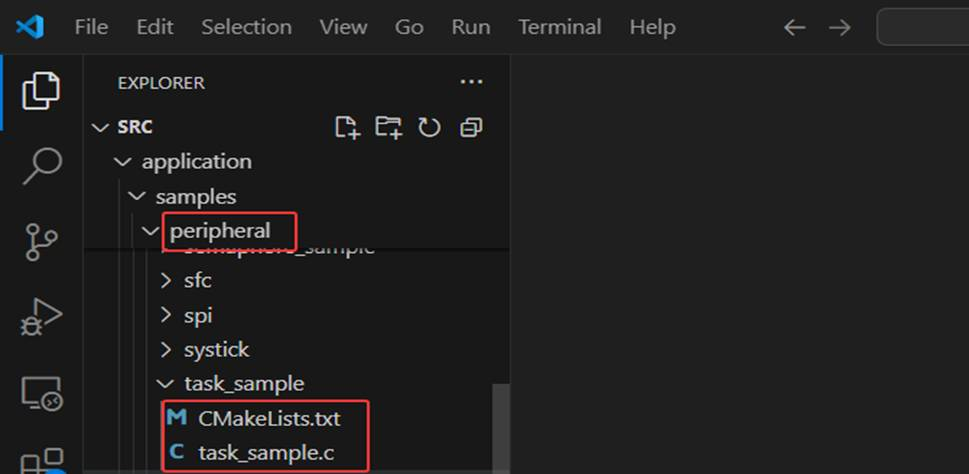

步骤3 确认peripheral文件目录下的CmakeLists是否生成了图中的内容。

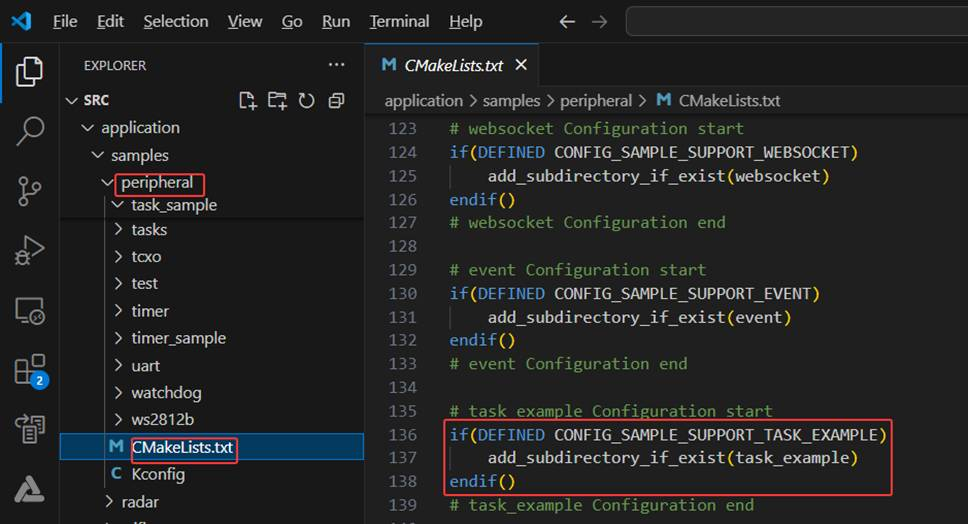

步骤4 确认peripheral文件目录下的Kconfig中是否生成了下图中框选的内容。

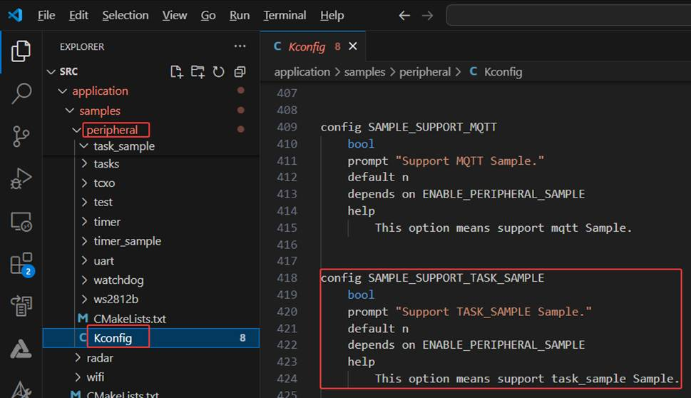

步骤6 点击PROJECT TASKS中的KConfig，具体选择路径”Application/Enable the Sample of peripheral”，选择”Support SEMAPHORE_SAMPLE Sample”，点击Save，关闭弹窗。

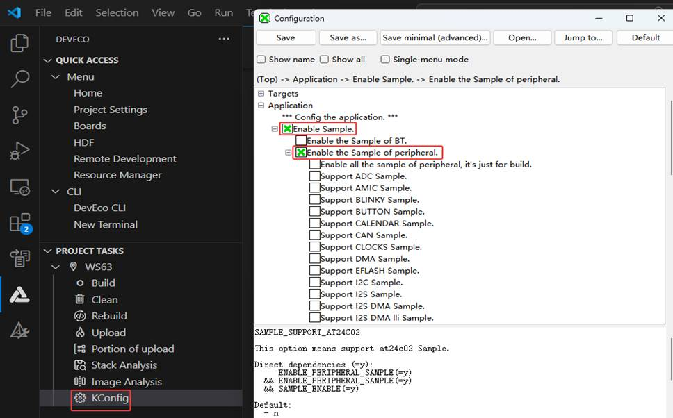

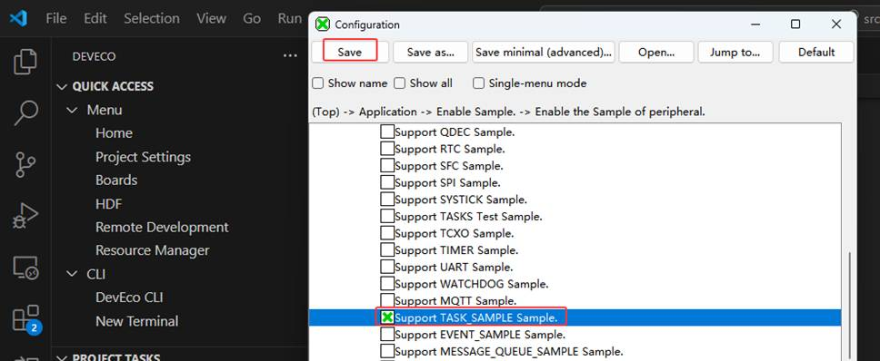

步骤7 点击”Build”或者”Rebuild”，编译完成如下图。

步骤8 点击Upload，等待出现”Connecting, please reset device...”字样时，然后按下开发板的reset按键进行烧录代码，如下图所示。

步骤9 代码烧录完成后，需要再按一次reset按键复位开发板才能代码运行起来。

 

 

### 3．互斥锁实验

（1）基本概述

① 实验内容

本实验通过创建三个不同优先级的任务（高、中、低优先级），分别对全局共享计数器进行累加操作。每个任务在访问和修改共享计数器时，先通过互斥锁加锁，确保临界区内的操作互斥执行，防止资源竞争和数据冲突。

② 技术背景

互斥锁又称互斥型信号量，是一种特殊的二值性信号量，用于实现对临界资源的独占式处理。另外，互斥锁可以解决信号量存在的优先级翻转问题。任意时刻互斥锁只有两种状态，开锁或闭锁。当任务持有时，这个任务获得该互斥锁的所有权，互斥锁处于闭锁状态。当该任务释放锁后，任务失去该互斥锁的所有权，互斥锁处于开锁状态。当一个任务持有互斥锁时，其他任务不能再对该互斥锁进行开锁或持有。

③ API介绍

| API                       | 功能                       |
| ------------------------- | -------------------------- |
| osal_mutex_init()         | 初始化互斥锁。             |
| osal_mutex_destroy()      | 删除指定的互斥锁。         |
| osal_mutex_lock_timeout() | 阻塞获取互斥锁，单位：ms。 |
| osal_event_unlock()       | 释放指定互斥锁。           |

 

（2）实现操作

步骤1 在src\application\samples\peripheral文件夹，右键选择“ZeroScript-Sample”，选择”Create Sample Floder”，命名为”semaphore_sample”。

步骤2 将\vendor\DyCloud_WF6301_DK V1.0\demo\mutex_sample文件夹中的内容复制到步骤1创建的”mutex_sample”文件夹中。

步骤3 确认peripheral文件目录下的CmakeLists是否生成了图中的内容。

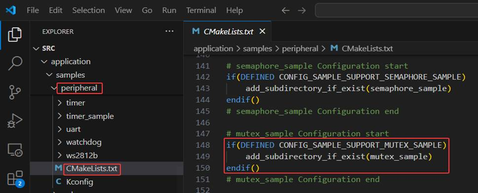

步骤4 确认peripheral文件目录下的Kconfig中是否生成了下图中框选的内容。

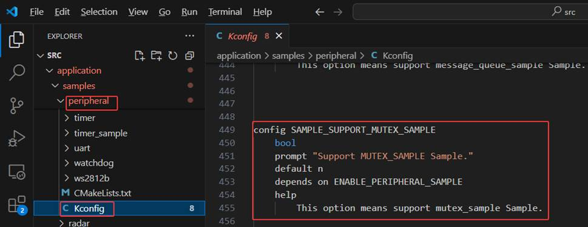

步骤6 点击PROJECT TASKS中的KConfig，具体选择路径”Application/Enable the Sample of peripheral”，选择”Support MUTEX_SAMPLE Sample”，点击Save，关闭弹窗。

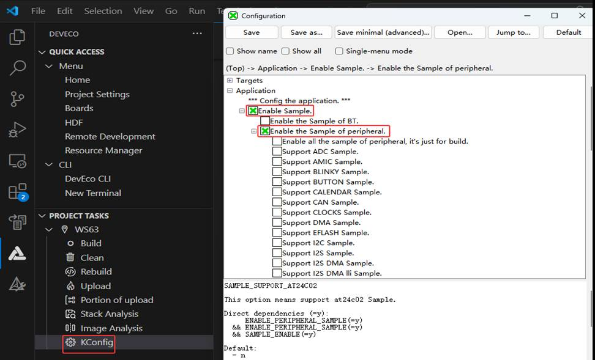

步骤7 点击”Build”或者”Rebuild”，编译完成如下图。

步骤8 点击Upload，等待出现”Connecting, please reset device...”字样时，然后按下开发板的reset按键进行烧录代码，如下图所示。

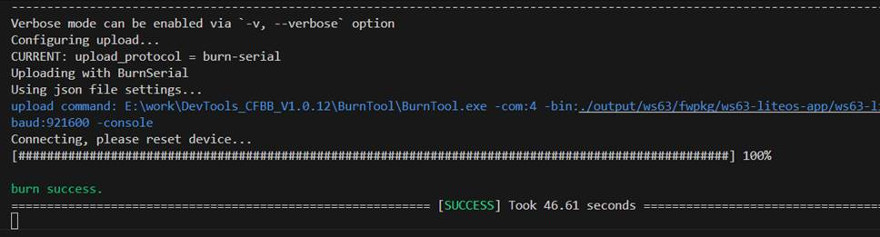

步骤9 代码烧录完成后，需要再按一次reset按键复位开发板才能代码运行起来。

 

### 4．队列实验

（1）基本概述

① 实验内容

本实验通过创建消息队列，实现了两个同优先级任务间的通信。发送任务将消息写入队列，接收任务从队列读取消息并打印，展示了消息队列在任务间异步传递数据和同步的作用。

② 技术背景

队列，也称消息队列，是任务间通信常用的数据结构。它接收来自任务或中断的不同长度的消息，并根据接口确定消息是否存入队列。任务可以从队列读取消息，当队列为空时，读取任务会挂起，直到有新消息入队并唤醒该任务。任务也可以向队列写入消息，当队列已满时，写入任务挂起，等待有空闲空间后被唤醒写入。若读写超时时间设为0，接口立即返回，不挂起任务，此为非阻塞模式。消息队列支持异步处理，允许消息缓冲和延迟处理。

③ API介绍

| API                         | 功能                     |
| --------------------------- | ------------------------ |
| osal_msg_queue_create()     | 创建消息队列。           |
| osal_msg_queue_read_copy()  | 阻塞接收信息，单位：ms。 |
| osal_msg_queue_write_copy() | 发送消息到队列尾部。     |
| osal_msg_queue_delete()     | 删除消息队列。           |

 

（2）实现操作

步骤1 在src\application\samples\peripheral文件夹，右键选择“ZeroScript-Sample”，选择”Create Sample Floder”，命名为”semaphore_sample”。

步骤2 将\vendor\DyCloud_WF6301_DK V1.0\demo\mutex_sample文件夹中的内容复制到步骤1创建的”mutex_sample”文件夹中。

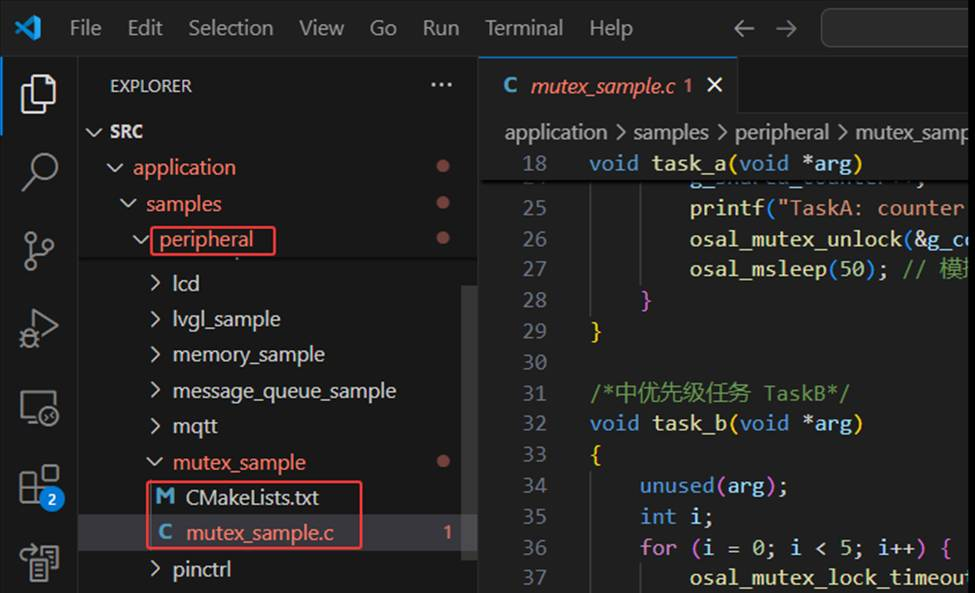

步骤3 确认peripheral文件目录下的CmakeLists是否生成了图中的内容。

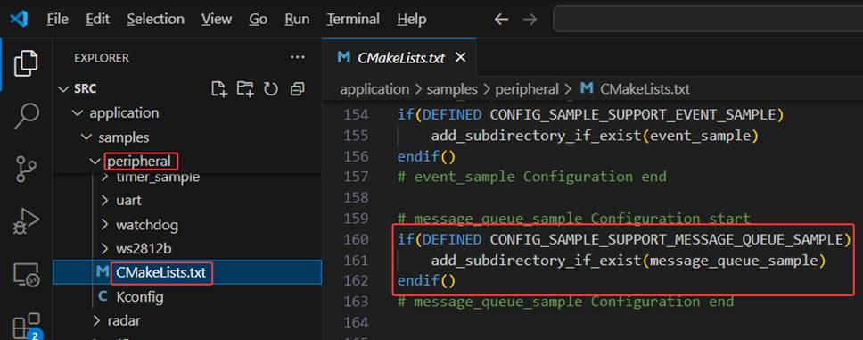

步骤4 确认peripheral文件目录下的Kconfig中是否生成了下图中框选的内容。

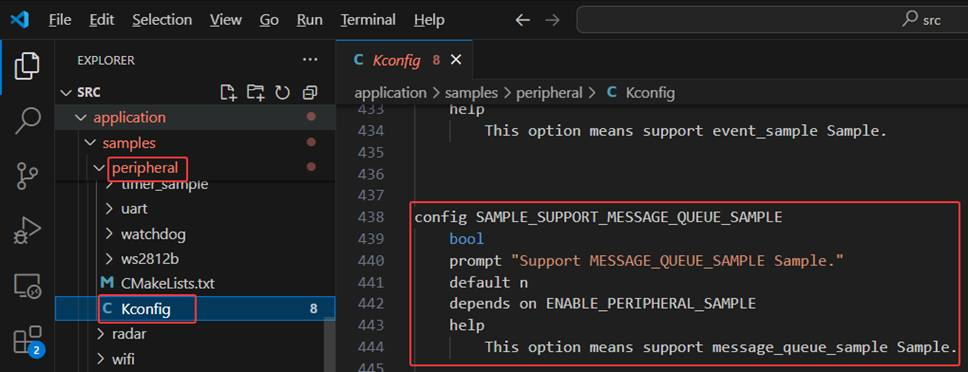

步骤6 点击PROJECT TASKS中的KConfig，具体选择路径”Application/Enable the Sample of peripheral”，选择”Support MESSAGE_QUEUE_SAMPLE Sample”，点击Save，关闭弹窗。

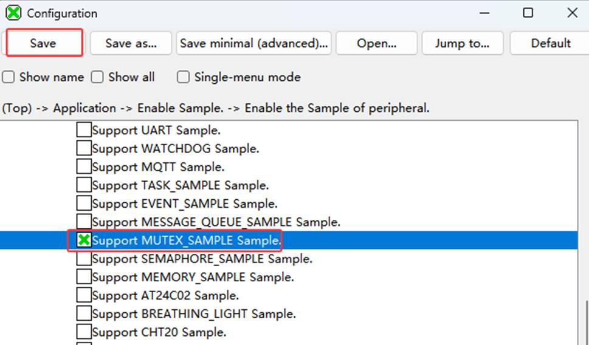

步骤7 点击”Build”或者”Rebuild”，编译完成如下图。

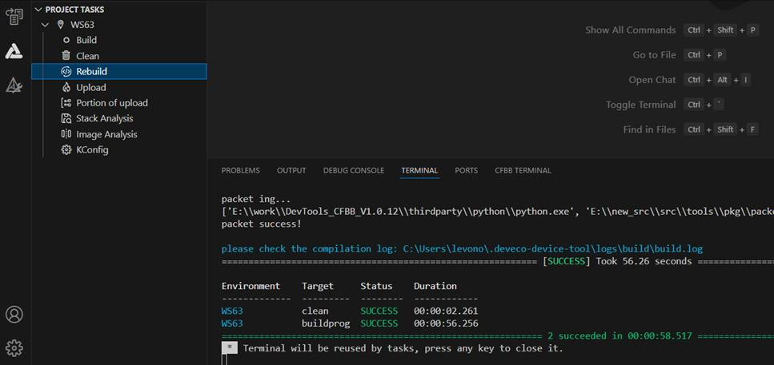

步骤8 点击Upload，等待出现”Connecting, please reset device...”字样时，然后按下开发板的reset按键进行烧录代码，如下图所示。

步骤9 代码烧录完成后，需要再按一次reset按键复位开发板才能代码运行起来。

 

### 5．事件实验

（1）基本概述

① 实验内容

本实验通过事件机制实现了生产者任务生成数据并发送事件通知，消费者任务等待事件发生后处理数据，实现了任务间的同步和通信。

② 技术背景

事件（Event）是一种任务间通信的机制，可用于任务间的同步。多任务环境下，任务之间往往需要同步操作，一个等待即是一个同步。事件可以提供一对多、多对多的同步操作。

l 一对多同步模型：一个任务等待多个事件的触发。可以是任意一个事件发生时唤醒任务处理事件，也可以是几个事件都发生后才唤醒任务处理事件。

l 多对多同步模型：多个任务等待多个事件的触发。

③ API介绍

| API                  | 功能                                                     |
| -------------------- | -------------------------------------------------------- |
| osal_event_init()    | 初始化一个事件控制模块。                                 |
| osal_event_read()    | 阻塞读取指定事件类型，等待超时时间为相对时间，单位：ms。 |
| osal_event_write()   | 写指定的事件类型。                                       |
| osal_event_clear()   | 清除指定的事件类型。                                     |
| osal_event_destroy() | 销毁指定的事件控制块。                                   |

 

（2）实现操作

步骤1 在src\application\samples\peripheral文件夹，右键选择“ZeroScript-Sample”，选择”Create Sample Floder”，命名为”event_sample”。

步骤2 将\vendor\DyCloud_WF6301_DK V1.0\demo\event_sample文件夹中的内容复制到步骤1创建的”event_sample”文件夹中。

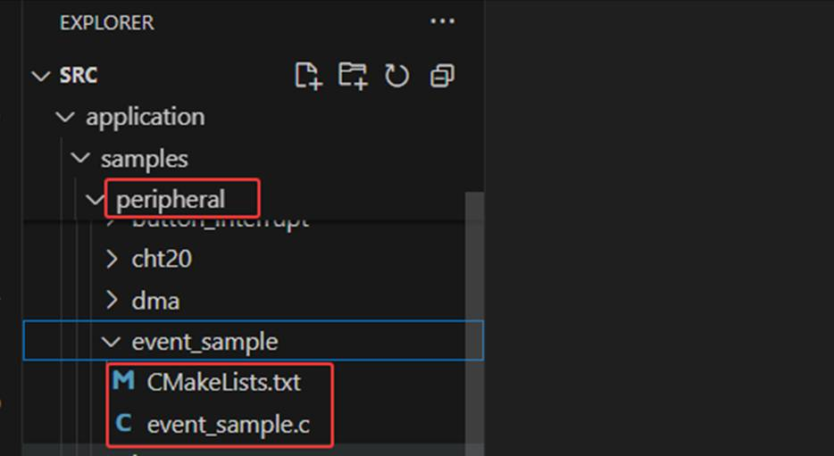

步骤3 确认peripheral文件目录下的CmakeLists是否生成了图中的内容。

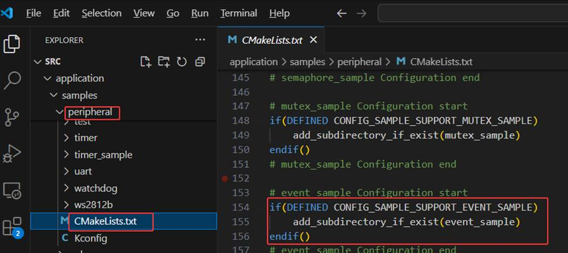

步骤4 确认peripheral文件目录下的Kconfig中是否生成了下图中框选的内容。

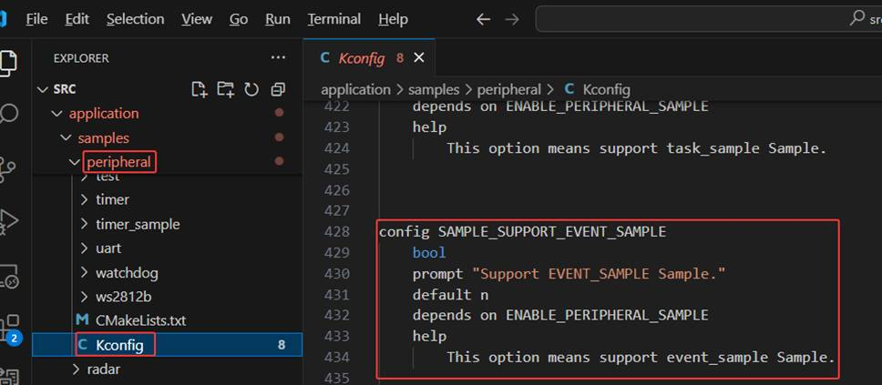

步骤6 点击PROJECT TASKS中的KConfig，具体选择路径”Application/Enable the Sample of peripheral”，选择”Support EVENT_SAMPLE Sample”，点击Save，关闭弹窗。

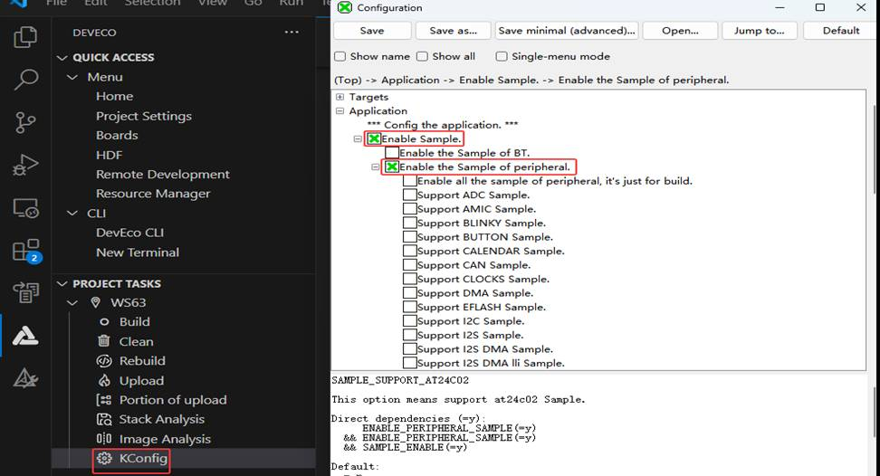

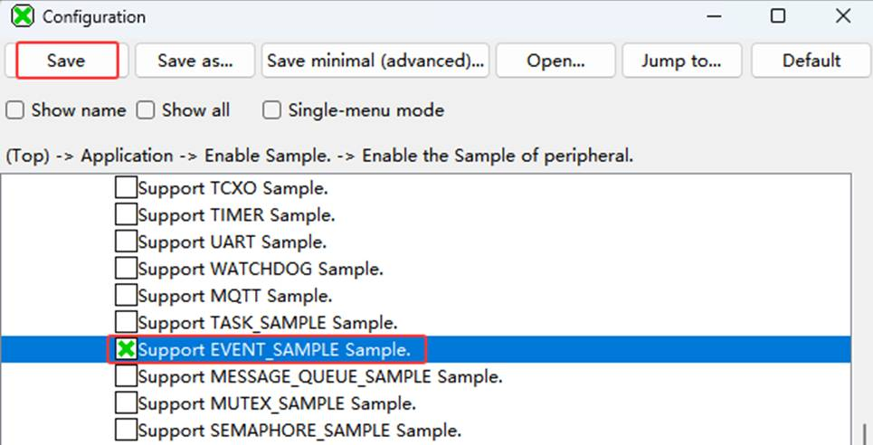

步骤7 点击”Build”或者”Rebuild”，编译完成如下图。

步骤8 点击Upload，等待出现”Connecting, please reset device...”字样时，然后按下开发板的reset按键进行烧录代码，如下图所示。

步骤9 代码烧录完成后，需要再按一次reset按键复位开发板才能代码运行起来。

 

## 六、无线通信实验案例

### 1．蓝牙服务端实验案例

（1）基本概述

① 实验内容

本次实验实现了一个蓝牙温度计服务端，支持温度数据的读写和通知功能。通过定时器周期性模拟温度变化，并在设备连接时通过BLE通知客户端，实现了一个完整的温度计服务端示例。

② API介绍

| 分类                            | API函数                      | 说明                   |
| ------------------------------- | ---------------------------- | ---------------------- |
| GATT服务                        | gatts_add_service()          | 添加GATT服务           |
| gatts_add_characteristic()      | 添加特征                     |                        |
| gatts_add_descriptor()          | 添加描述符                   |                        |
| gatts_start_service()           | 启动服务                     |                        |
| gatts_register_callbacks()      | 注册GATT回调                 |                        |
| gatts_register_server()         | 注册服务端                   |                        |
| GATT通知                        | gatts_notify_indicate()      | 通过句柄发送通知或指示 |
| gatts_notify_indicate_by_uuid() | 通过UUID发送通知或指示       |                        |
| GAP                             | gap_ble_register_callbacks() | 注册GAP回调函数        |
| gap_ble_start_adv()             | 启动蓝牙广播                 |                        |
| BLE模块                         | enable_ble()                 | 启用BLE模块            |
| ble_start_adv()                 | 开始广播                     |                        |
| 内存管理及复制                  | osal_vmalloc()               | 动态分配内存           |
| osal_vfree()                    | 释放动态分配内存             |                        |
| memcpy_s()                      | 安全内存复制                 |                        |
| 定时器相关                      | uapi_timer_init()            | 初始化定时器模块       |
| uapi_timer_adapter()            | 设置定时器适配器             |                        |
| uapi_timer_create()             | 创建定时器                   |                        |
| uapi_timer_start()              | 启动定时器                   |                        |
| uapi_timer_delete()             | 删除定时器                   |                        |

 

（2）实现操作

步骤1 在src\application\samples\peripheral文件夹，右键选择“ZeroScript-Sample”，选择”Create Sample Floder”，命名为”ble_server_sample”。

步骤2 将\vendor\DyCloud_WF6301_DK V1.0\demo\ble_server_sample文件夹中的内容复制到步骤1创建的”ble_server_sample”文件夹中。

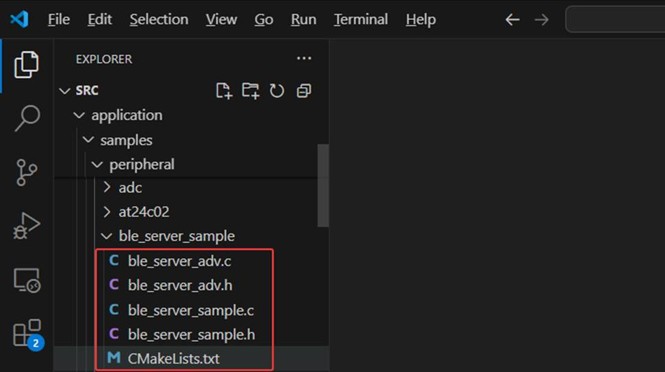

步骤3 确认peripheral文件目录下的CmakeLists是否生成了图中的内容。

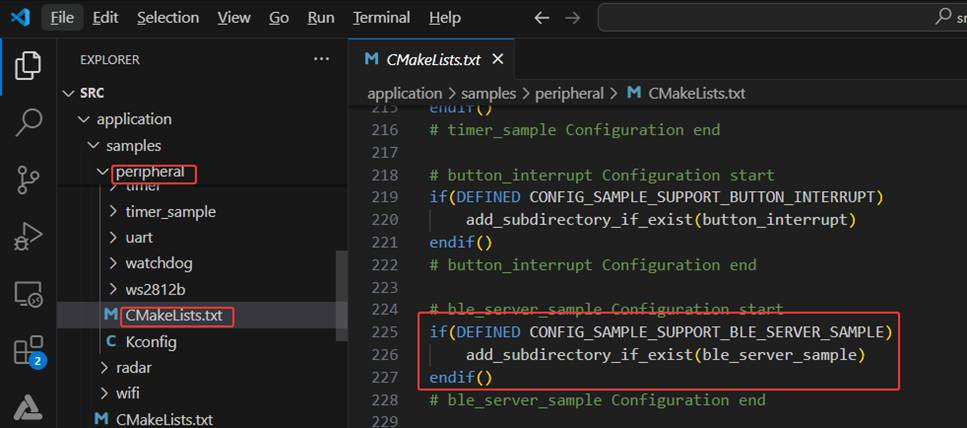

步骤4 确认peripheral文件目录下的Kconfig中是否生成了下图中框选的内容。

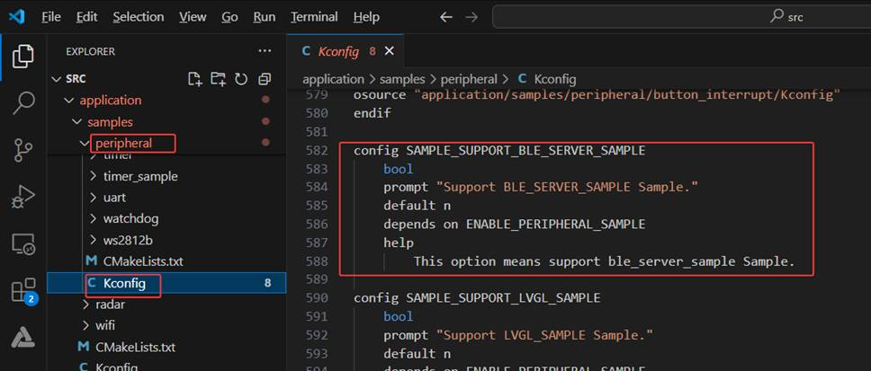

步骤6 点击PROJECT TASKS中的KConfig，具体选择路径”Application/Enable the Sample of peripheral”，选择”Support BLE_SERVER_SAMPLE Sample”，点击Save，关闭弹窗。

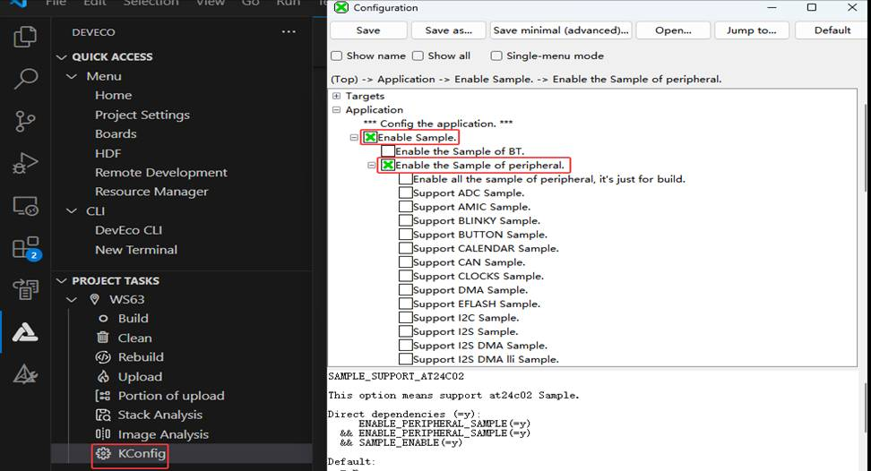

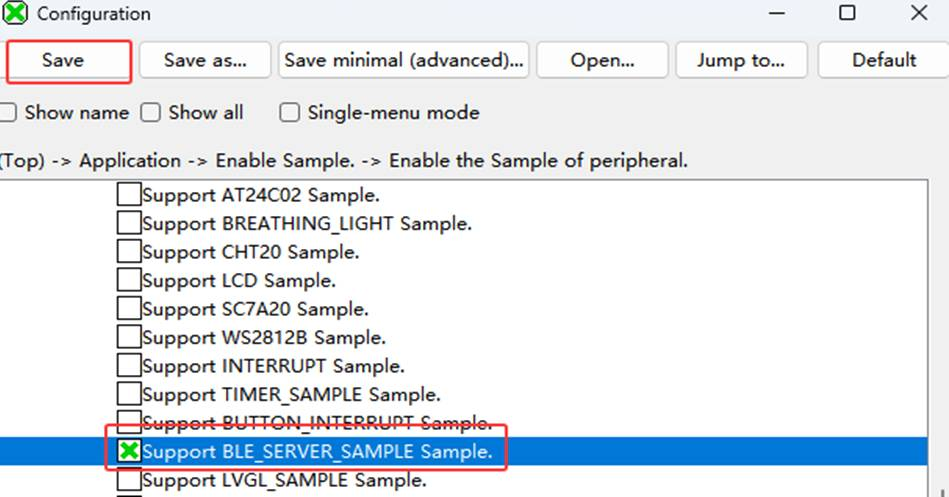

步骤7 点击”Build”或者”Rebuild”，编译完成如下图。

步骤8 点击Upload，等待出现”Connecting, please reset device...”字样时，然后按下开发板的reset按键进行烧录代码，如下图所示。

步骤9 代码烧录完成后，需要再按一次reset按键复位开发板才能代码运行起来。

 

### 2．WIFI_TCP实验案例

（1）基本概述

① 实验内容

本实验实现了一个WiFi_TCP客户端示例，完成指定WiFi热点的扫描与连接，获取IP后通过TCP套接字连接服务器，持续发送和接收数据，展示了WiFi连接与TCP通信的基本流程。

② API介绍

| 分类                            | API函数                    | 说明                       |
| ------------------------------- | -------------------------- | -------------------------- |
| WiFi功能                        | wifi_sta_enable()          | 启用WiFi STA（客户端）模式 |
| wifi_sta_scan()                 | 启动WiFi扫描               |                            |
| wifi_sta_get_scan_info()        | 获取扫描到的WiFi网络列表   |                            |
| wifi_sta_connect()              | 连接到指定的WiFi网络       |                            |
| wifi_sta_get_ap_info()          | 获取当前连接AP信息         |                            |
| wifi_register_event_cb()        | 注册WiFi事件回调函数       |                            |
| wifi_is_wifi_inited()           | 查询WiFi模块是否初始化完成 |                            |
| gatts_notify_indicate_by_uuid() | 通过UUID发送通知或指示     |                            |
| DHCP管理                        | netifapi_netif_find()      | 查找网络接口               |
| netifapi_dhcp_start()           | 启动DHCP客户端             |                            |
| netifapi_dhcp_is_bound()        | 查询DHCP是否绑定成功       |                            |
| 套接字                          | socket()                   | 创建套接字                 |
| connect()                       | 连接远程服务器             |                            |
| send()                          | 发送数据                   |                            |
| recv()                          | 接收数据                   |                            |
| lwip_close()                    | 关闭套接字                 |                            |

 

（2）实现操作

步骤1 在src\application\samples\wifi文件夹，右键选择“ZeroScript-Sample”，选择”Create Sample Floder”，命名为”wifi_tcp”。

步骤2 将\vendor\DyCloud_WF6301_DK V1.0\demo\wifi_tcp文件夹中的内容复制到步骤1创建的”wifi_tcp”文件夹中。

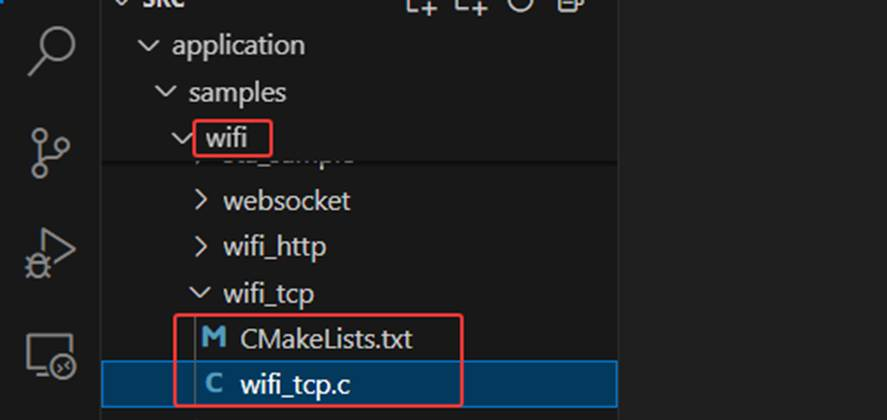

步骤3 确认peripheral文件目录下的CmakeLists是否生成了图中的内容。

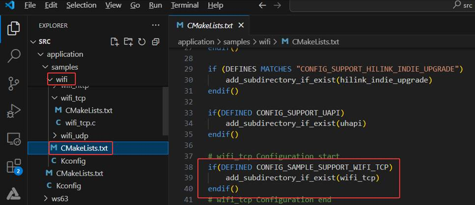

步骤4 确认peripheral文件目录下的Kconfig中是否生成了下图中框选的内容。

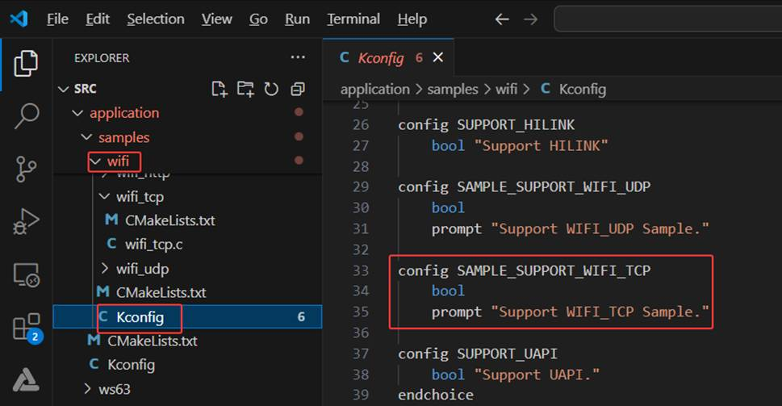

步骤6 点击PROJECT TASKS中的KConfig，具体选择路径”Application/Enable the Sample of WIFI”，选择”Support WIFI_TCP Sample”，点击Save，关闭弹窗。

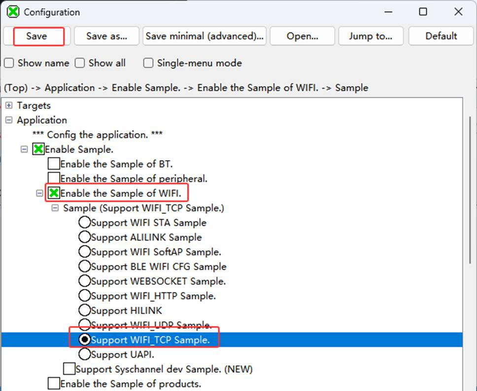

步骤7 点击”Build”或者”Rebuild”，编译完成如下图。

步骤8 点击Upload，等待出现”Connecting, please reset device...”字样时，然后按下开发板的reset按键进行烧录代码，如下图所示。

步骤9 代码烧录完成后，需要再按一次reset按键复位开发板才能代码运行起来。

 