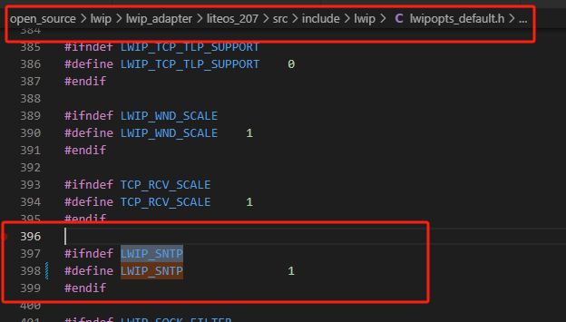
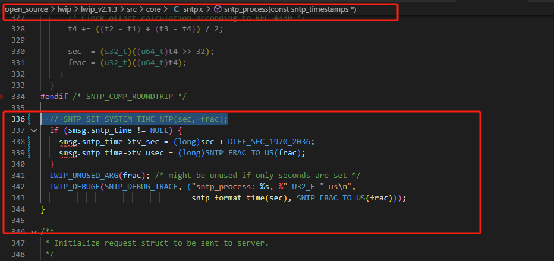
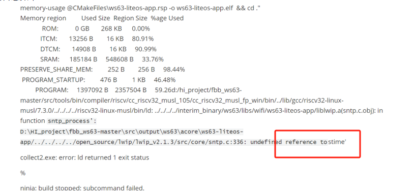
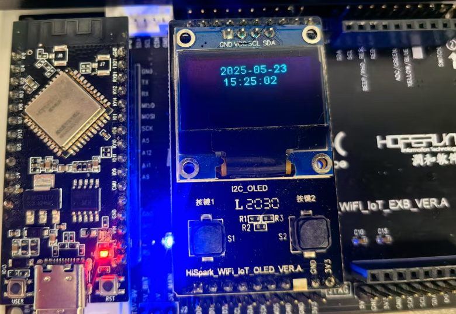

# SNTP

步骤一：如果需要使用SNTP服务器与本地时间同步

步骤二：将案例放到对应目录，修改wifi里面的ssid和密码

步骤三：由于sntp默认是关闭，需要打开宏，路径open_source\lwip\lwip_adapter\liteos_207\src\include\lwip\lwipopts_default.h，将LWIP_SNTP 0修改为LWIP_SNTP 1

步骤四：编译前修改open_source\lwip\lwip_v2.1.3\src\core\sntp.c文件如下地方

 // SNTP_SET_SYSTEM_TIME_NTP(sec, frac);

 `if (smsg.sntp_time != NULL) {`

  `smsg.sntp_time->tv_sec = (long)sec + DIFF_SEC_1970_2036;`

  `smsg.sntp_time->tv_usec = (long)SNTP_FRAC_TO_US(frac);`

 `}`

 `LWIP_UNUSED_ARG(frac); /* might be unused if only seconds are set */`

 `LWIP_DEBUGF(SNTP_DEBUG_TRACE, ("sntp_process: %s, %" U32_F " us\n",`

​                 `sntp_format_time(sec), SNTP_FRAC_TO_US(frac)));`

步骤五：如果不修改步骤四地方，会出现“undefined refernce to stime”

步骤六：编译完成，效果如下图

